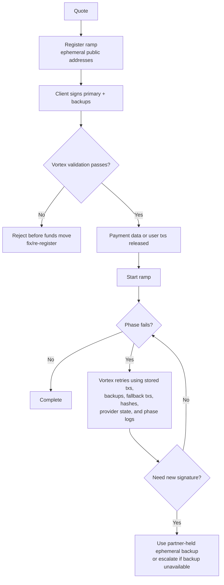

# v0.6.0 Recovery and Responsibility Model

This note is for API partners reviewing the v0.6.0 BRL/PIX ramp hardening before scaling production volume. It focuses on two questions:

1. What changed in v0.6.0 to prevent recurrence of presigned-transaction and backup-transaction failures?
2. Who owns each failure domain before the next incident happens?

Related release PRs:

- [pendulum-chain/vortex#1152](https://github.com/pendulum-chain/vortex/pull/1152)
- [pendulum-chain/vortex#1153](https://github.com/pendulum-chain/vortex/pull/1153)

## Bottom Line

For a normal Vortex-managed ramp, the recoverability condition is:

> The ephemeral key backups must exist, be intact, and be accessible until the ramp is complete and the recovery window has passed.

Vortex stores the server-generated unsigned transaction plan plus the accepted presigned primary, backup, and fallback transactions for the ramp. That lets Vortex continue or retry the ramp without asking the API client to manually re-sign during normal recovery.

The client-held ephemeral backup remains the final recovery dependency. If a recovery path needs a new signature that was not already accepted and stored by Vortex, Vortex cannot reconstruct the ephemeral key. If the partner loses the ephemeral backup, recovery may be limited to the already accepted presigned transactions, provider reconciliation, bridge refunds, or chain-specific cleanup paths.

## What Changed In v0.6.0

The practical change is that the system now refuses to let value move until the recovery transaction set has been validated.

Before v0.6.0, a bad or incomplete presigned transaction set could make it farther into the ramp lifecycle. That created a dangerous failure mode: user funds could enter the ramp while Vortex did not yet have a complete and content-validated transaction set to continue or recover the process.

In v0.6.0, the backend validates the presigned transaction set at two gates:

- `updateRamp`: every submitted transaction is validated before being merged into ramp state. Partial submissions are allowed, but only valid transactions are accepted.
- `startRamp`: the complete ephemeral-signed transaction set must be present and valid before the phase processor starts.

For BRL onramps, PIX payment details are released only after the presigned transaction checks pass. For BRL offramps, user-wallet transactions are not exposed until the ephemeral presigned set has passed validation. This prevents the user or partner from moving funds into a ramp whose recovery material is missing or malformed.

## Specific Hardening

| Area | v0.6.0 behavior | Why it prevents recurrence |
|---|---|---|
| Completeness gate | Every expected ephemeral-signed unsigned transaction must have a corresponding accepted presigned transaction before `startRamp`. | Vortex does not start execution unless it has the transaction material needed to continue the ramp. |
| Exact matching | Submitted transactions are matched to the server-issued unsigned plan by `phase`, `network`, `nonce`, and `signer`. Unknown or extra transactions are rejected. | A client cannot swap in a transaction for the same phase that moves funds somewhere else. |
| EVM content validation | Signed EVM transactions are decoded and checked for recovered signer, nonce, chain ID, `to`, calldata, value, gas limit, and fee caps. Contract-creation and chainless replayable transactions are rejected. | A signed transaction can no longer pass validation merely because the metadata looks right. The payload itself must match the Vortex-generated plan. |
| EIP-712 validation | Signed typed data is deep-compared against the server-issued typed data before signature recovery. | Permit fields such as token, spender, amount, deadline, owner, and verifying contract cannot be substituted. |
| Backup transactions | Each ephemeral-signed transaction must include exactly the expected backup set. For EVM backups, each backup is revalidated against the same unsigned payload with sequential nonces. For Substrate backups, the backup call must match the primary call. | Backups are not just stored as opaque extras. They are checked to ensure a retry cannot execute a different action. |
| User-wallet phases | SELL-side user-wallet phases are not accepted as presigned transactions. The client submits the on-chain tx hash, and Vortex verifies the receipt and calldata against the unsigned blueprint. | A partner cannot accidentally or maliciously attach a fake presigned transaction for a phase that must be performed by the user's wallet. |
| Payment-data gating | PIX QR / payment data is hidden until the presigned set is valid. | Users are not asked to pay before Vortex has a validated recovery path. |
| SDK pre-flight checks | The SDK performs BRL KYC, PIX key, and remaining-limit checks before registration where possible. | Avoidable failures are caught before the ramp is created or before funds move. |

## Recovery Model

The intended production behavior is:

- Vortex handles phase retries and normal recovery using the presigned material already stored in ramp state.
- The API client should not need to manually intervene for ordinary retries after a ramp has started.
- The API client must keep the ephemeral backup available so that exceptional recovery remains possible.
- If a ramp fails before funds move, the normal answer is to re-quote and register a fresh ramp.
- If funds have moved, the normal answer is to identify where they are and continue, recover, refund, or reconcile from that point.

## R$100 Validation Ramp

Before increasing volume, run one small BRL ramp end-to-end and deliberately inspect the recovery gates.

Recommended test:

1. Pin the integration to `@vortexfi/sdk` v0.6.0 or a direct API implementation with equivalent validation behavior.
2. Confirm ephemeral backups are written to the partner's secure store before payment or user-wallet signing continues.
3. Create a small BRL quote, for example around R$100.
4. Register the ramp and record `quoteId`, `rampId`, SDK/client version, environment, partner order ID, and an internal reference to the encrypted ephemeral backup. Do not expose the key material.
5. Confirm PIX payment details or user-wallet transactions are only returned after `updateRamp` accepts the presigned transaction set.
6. Complete the PIX payment or user-wallet transaction.
7. Confirm the ramp progresses to completion without additional partner signing.
8. Confirm webhooks and `GET /v1/ramp/{id}` agree on final status.
9. Confirm support can retrieve `GET /v1/ramp/{id}/errors` if the ramp stalls.

Recommended negative tests in sandbox or staging:

- Submit a presigned EVM transaction with the wrong recipient or calldata. Expected result: API rejects it.
- Remove backup transactions from an ephemeral-signed transaction. Expected result: API rejects it.
- Change a backup nonce sequence. Expected result: API rejects it.
- Submit a SELL user-wallet phase as a presigned transaction instead of a tx hash. Expected result: API rejects it.

Success criteria:

- No funds move before the presigned set is accepted.
- Vortex has primary and backup transaction material before `startRamp`.
- The partner can prove the ephemeral backup exists without exposing it.
- The ramp completes, or if it stalls, the current phase and recovery owner are clear.

## Responsibility Model

This is an operational ownership model, not a replacement for commercial/legal terms.

| Failure domain | Primary owner | What that owner is responsible for |
|---|---|---|
| SDK bug in v0.6.0+ | Vortex | Fixing SDK behavior, documenting affected versions, providing migration guidance, and supporting recovery for ramps that used the SDK as intended. |
| Client-side SDK misuse | API client | Pinning supported versions, not modifying signing behavior, not bypassing SDK safeguards, and testing the integration before scaling. |
| Direct API signing implementation | API client | Matching SDK behavior exactly: fresh ephemerals, secure backups, exact payload validation before signing, idempotency, and correct `updateRamp` / `startRamp` ordering. |
| Backend accepts invalid presigned data | Vortex | Validation correctness, rejection of malformed or substituted payloads, and not releasing payment/user-funding steps before validation passes. |
| Ephemeral key custody | API client | Generating per-ramp ephemerals, storing encrypted backups, retaining them through the recovery window, and making them accessible during incident response. |
| Stored presigned/fallback transaction execution | Vortex | Persisting accepted transaction material, retrying recoverable phases, using backup/fallback transactions when needed, and maintaining phase/error logs. |
| Squid/Axelar failure | Vortex as recovery operator; Squid/Axelar as external dependency | Monitoring bridge state, adding gas where required, waiting for arrival/refund, retrying recoverable errors, and coordinating external escalation. |
| Pendulum/Moonbeam/Base RPC or chain outage | Vortex as recovery operator; chain/RPC provider as external dependency | Holding the ramp in pending/retry state, avoiding double execution, switching/retrying infrastructure where available, and resuming when the chain recovers. |
| Network congestion | Shared | Vortex validates gas/fee minimums and retries phases. The client must not duplicate ramps or reuse stale quotes/signatures. Both sides communicate pending status to users. |
| PIX/Avenia provider issue | Vortex as recovery operator; Avenia/PIX as external dependency | Reconciling PIX payment, BRLA mint, Avenia subaccount balance, and payout ticket state. The client provides correct KYC/tax/PIX data and user communication. |
| Partner loses ephemeral backup | API client | This is the main unrecoverable client-side failure. Vortex can still use already accepted presigned material, but cannot recreate missing private keys. |
| Partner exposes `sk_*` or ephemeral secrets | API client | Immediate key rotation, incident disclosure, and containment. Vortex can revoke/rotate partner credentials but cannot undo exposed client-side key material. |

## Incident Rule Of Thumb

When a ramp is stuck:

- If validation rejected the ramp before funds moved, restart from a fresh quote.
- If funds moved and Vortex has accepted presigned/backups, Vortex owns operational recovery through the phase processor, bridge/provider checks, fallback transactions, and support workflow.
- If recovery requires ephemeral signing material not already stored by Vortex, the API client must provide access to its encrypted ephemeral backup.
- If the ephemeral backup is missing or corrupted, that risk sits with the API client.
- If Vortex accepted invalid transaction material or failed to use valid stored recovery material correctly, that sits with Vortex.

## Data To Keep For Every Ramp

The client should persist:

- `quoteId`
- `rampId`
- partner order ID
- user/session ID
- SDK/client version
- environment: sandbox or production
- webhook ID, if used
- user-submitted tx hashes, if any
- encrypted ephemeral-backup reference

Vortex should persist:

- server-issued unsigned transaction plan
- accepted presigned primary transactions
- accepted backup/fallback transactions
- provider references, payout ticket IDs, and transaction hashes
- phase history and error logs
- final transaction hash / explorer link where available

Never share in support channels:

- `sk_*` API keys
- ephemeral private keys
- user wallet private keys
- raw environment dumps
