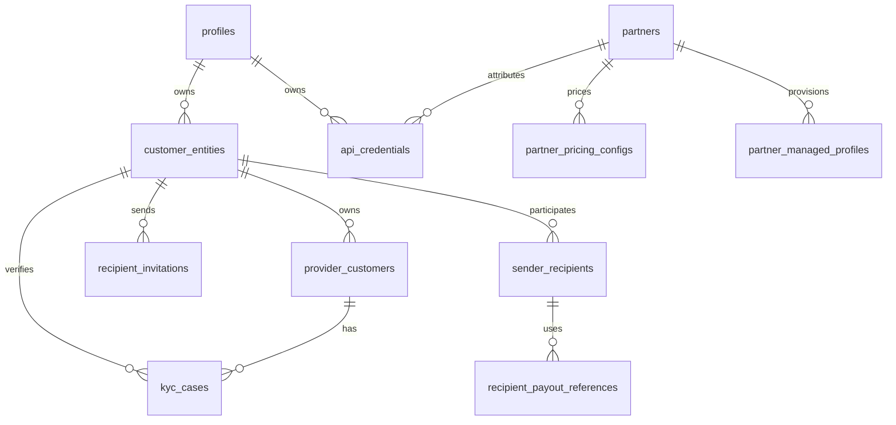

# Identity, Customer, and Partner Model

Status: current architecture. Last reconciled with migrations 038–063 and the API models
on 2026-08-07.

This document explains the implemented identity model across authentication, compliance
customers, provider accounts, partner pricing, and recipients. Security invariants remain
owned by [`docs/security-spec/`](security-spec/README.md).

## Design principles

- A login profile is not a legal or compliance identity.
- Every provider account and KYC/KYB case belongs to one customer entity.
- Partner identity is separate from per-direction and per-currency pricing.
- Ramp registration operates for an effective user; provider identity is resolved by the
  server and is never selected freely by request data.
- Reusable payout details stay with the provider. Vortex stores provider references and
  masked labels, not raw bank-account data.

## Core model

### Profiles and customer entities

`profiles` is the Supabase-linked login identity. Email OTP authentication yields a
Supabase user ID, which is also the profile ID used by the API.

`customer_entities` represents the legal/compliance customer. A profile may own an
individual and a business entity, while `profiles.active_customer_entity_id` records the
dashboard's selected sender identity. Selection is ownership-checked and currently
immutable after it is set. Compliance records may outlive a deleted profile because the
profile foreign key is nullable.

### Provider customers and verification cases

`provider_customers` is the durable account at Avenia, Alfredpay, Mykobo, or Monerium. It
belongs to exactly one customer entity and stores provider identifiers, corridor data,
customer type, normalized verification status, and only the provider-specific identity
fields required by runtime behavior.

`kyc_cases` records KYC/KYB attempts separately from the provider account. Both tables use
the normalized lifecycle `started`, `pending`, `in_review`, `approved`, or `rejected`,
while `status_external` preserves a provider's original value when one exists.

Legacy placement caveat: the migration 040 backfill attached pre-cutover provider rows to
the profile's 038-backfilled *individual* entity — including business-typed rows. The
row's `customer_type` is therefore authoritative for type-scoped lookups; the owning
entity's `type` is not. Typed provider lookups and ownership checks scope by profile, and
new alfredpay rows co-locate with a profile's existing rows of the same `customer_type`.

Avenia is the one current exception to the general preference against retaining raw tax
references: `provider_customers.tax_reference` remains a runtime join key for in-flight
ramp state. Its SHA-256 value backs lookup and uniqueness; masked display is derived at
read time rather than stored as a second copy.

### Partners, pricing, and API credentials

`partners` contains one commercial identity per unique partner name.
`partner_pricing_configs` contains the BUY/SELL pricing rows, optionally scoped to a fiat
currency; a currency-specific row takes precedence over the wildcard row.

`api_credentials` is the runtime authentication store: one row is one public/secret key
pair with a required subject `profile_id`, an optional attributing `partner_id`,
environment, expiry, and a revocation timestamp. The public value is stored plainly and
suits attribution; the secret is stored hashed and authenticates requests as the subject
profile. There is no partner-only credential: a partner-managed credential still acts
for exactly one profile, and ramp registration stays user-gated per
[`ADR 0001`](adr-0001-user-gated-ramp-registration.md). The legacy `api_keys` table is
removed by migration 061; startup fails closed if the table still exists.

`partner_managed_profiles` records that a partner provisioned a Supabase-backed profile
(normalized source and external subject ID) for provenance and idempotency; it is not an
authentication or pricing principal. Normative credential rules live in
[`security-spec/01-auth/api-keys.md`](security-spec/01-auth/api-keys.md).

### Recipients

`recipient_invitations` contains a token-bound invitation from a sender entity.
`sender_recipients` is the accepted sender-to-recipient relationship, scoped per rail.
`recipient_payout_references` contains the provider-side payout instrument ID, masked
label, and verification status.

The detailed redemption, token-retention, authorization, and payability rules are
normative in
[`security-spec/03-ramp-engine/recipient-transfers.md`](security-spec/03-ramp-engine/recipient-transfers.md).
Current product behavior and acknowledged gaps are in
[`product-dashboard.md`](product-dashboard.md).

## Authentication and ownership flow

1. `requirePartnerOrUserAuth()` accepts a valid secret API key or Supabase bearer token.
   Any presented bearer token — on this path or on the Supabase-only `requireAuth`/
   `optionalAuth` middleware — is first resolved by `resolveBearerPrincipal()`
   (`bearerPrincipal.ts`). This is the one place a request's principal can become someone
   other than the credential holder: a token prefixed `vtx_imp_` resolves against a live
   row in `admin_impersonation_sessions` and, if found, the principal returned is the
   **target** profile (its `userId` and `userEmail`), not the `vortex_admin` operator who
   holds the token. An ordinary Supabase token resolves unchanged. The operator's own
   identity is preserved separately on `req.impersonation` for audit; it does not
   participate in ownership resolution.
2. `getEffectiveUserId()` prefers `req.userId` and otherwise uses the user linked to
   the validated secret key. It is unmodified by impersonation — by the time it runs,
   `req.userId` already reflects step 1's substitution, so every step below scopes to the
   target profile exactly as it would for that profile's own session.
3. Ownership middleware scopes quotes, ramps, provider accounts, recipients, and history
   to that effective user and their customer entities.
4. At ramp registration, the server resolves the provider account for the effective user.
   Client-supplied provider identifiers are either ignored or accepted only when they
   match the server-derived identity.

Impersonation is a substitution at step 1, not a parallel authorization path — nothing from
step 2 onward changes. Its session lifecycle, controls, and audit trail are normative in
[`security-spec/01-auth/admin-impersonation.md`](security-spec/01-auth/admin-impersonation.md);
this document only reflects where the seam sits in principal resolution.

Quotes remain available before login where the public API permits rate discovery. An
authenticated user may claim an anonymous quote at registration; an already user-owned
quote cannot be claimed by another user.

## Implementation map

- Sequelize models: `apps/api/src/models/{user,customerEntity,providerCustomer,kycCase,partner,partnerPricingConfig,apiCredential,partnerManagedProfile,recipientInvitation,senderRecipient,recipientPayoutReference}.model.ts`
- Principal resolution: `apps/api/src/api/middlewares/{bearerPrincipal,dualAuth,effectiveUser,ownershipAuth}.ts`
- Impersonation session lifecycle: `apps/api/src/api/services/impersonation.service.ts`
- Provider ownership resolution: `apps/api/src/api/services/avenia-account.ts` and provider controllers/services
- Schema history: `apps/api/src/database/migrations/038-*` onward
- Migrations 060–061 production gates: [`operations-legacy-schema-cleanup.md`](operations-legacy-schema-cleanup.md)
- Security details: `docs/security-spec/01-auth/`, `03-ramp-engine/recipient-transfers.md`, and the provider specs under `05-integrations/`

Update this document only when the cross-module shape changes. Provider-specific flows,
security exceptions, and field-level audit checklists belong in the security spec.
