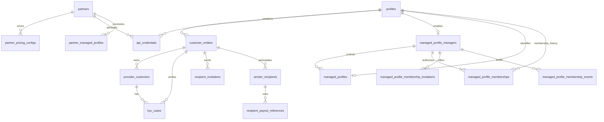

# Identity, Customer, and Partner Model

Status: current architectural contract, including the approved rewrite of unshipped
migration 069 under [ADR 0006](adr-0006-organization-wide-teams.md), on 2026-09-07.

This document explains the implemented identity model across authentication, compliance
customers, provider accounts, partner pricing, and recipients. Security invariants remain
owned by [`docs/security-spec/`](security-spec/README.md).

## Design principles

- A login profile is not a legal or compliance identity.
- Every provider account and KYC/KYB case belongs to one customer entity.
- Partner identity is separate from per-direction and per-currency pricing.
- Ramp registration operates for an effective user; provider identity is resolved by the
  server and is never selected freely by request data.
- Reusable payout details stay with the provider. Vortex stores provider references and
  masked labels, not raw bank-account data.

## Core model

### Profiles and customer entities

`profiles.kind` distinguishes Supabase-linked `authenticated` profiles from headless
`managed` profiles. Authenticated profiles have an email and use their Supabase user ID
as the profile ID. Managed profiles have no email or Supabase identity.

`customer_entities` represents the legal/compliance customer. A profile may own an
individual and a business entity, while `profiles.active_customer_entity_id` records the
dashboard's selected sender identity. Selection is ownership-checked and currently
immutable after it is set. Compliance records may outlive a deleted profile because the
profile foreign key is nullable.

### Provider customers and verification cases

`provider_customers` is the durable account at Avenia, Alfredpay, Mykobo, or Monerium. It
belongs to exactly one customer entity and stores provider identifiers, corridor data,
customer type, normalized verification status, and only the provider-specific identity
fields required by runtime behavior.

`kyc_cases` records KYC/KYB attempts separately from the provider account. Both tables use
the normalized lifecycle `started`, `pending`, `in_review`, `approved`, or `rejected`,
while `status_external` preserves a provider's original value when one exists.

Legacy placement caveat: the migration 040 backfill attached pre-cutover provider rows to
the profile's 038-backfilled _individual_ entity — including business-typed rows. The
row's `customer_type` is therefore authoritative for type-scoped lookups; the owning
entity's `type` is not. Typed provider lookups and ownership checks scope by profile, and
new alfredpay rows co-locate with a profile's existing rows of the same `customer_type`.

Avenia is the one current exception to the general preference against retaining raw tax
references: `provider_customers.tax_reference` remains a runtime join key for in-flight
ramp state. Its SHA-256 value backs lookup and uniqueness; masked display is derived at
read time rather than stored as a second copy.

### Partners, pricing, and API credentials

`partners` contains one commercial identity per unique partner name.
`partner_pricing_configs` contains the BUY/SELL pricing rows, optionally scoped to a fiat
currency; a currency-specific row takes precedence over the wildcard row.

`api_credentials` is the runtime authentication store: one row is one public/secret key
pair with a required subject `profile_id`, an optional attributing `partner_id`,
environment, expiry, and a revocation timestamp. The public value is stored plainly and
suits attribution; the secret is stored hashed and authenticates requests as the subject
profile. There is no partner-only credential: a partner-managed credential still acts
for exactly one profile, and ramp registration stays user-gated per
[`ADR 0001`](adr-0001-user-gated-ramp-registration.md). The legacy `api_keys` table is
removed by migration 061; startup fails closed if the table still exists.

`partner_managed_profiles` records that a partner provisioned a Supabase-backed profile
(normalized source and external subject ID) for provenance and idempotency; it is not an
authentication or pricing principal. Normative credential rules live in
[`security-spec/01-auth/api-keys.md`](security-spec/01-auth/api-keys.md).

Migration 063 adds the `managed_profile_managers` and `managed_profiles` schema for
headless delegated profiles. It records manager enablement, allowed corridors, nullable
`allowed_customer_types`, and the unique manager-to-child relationship and immutable
provider contact email. Null customer types add no restriction beyond the canonical
corridor capability matrix; a non-null value narrows access to its non-empty subset and
never expands that matrix. The contact email is not a login identity: `profiles.email`
remains null. Database constraints require
every managed profile to have exactly one relationship, keep normalized contact emails
unique within each manager, and prevent managed profiles from becoming managers. The
internal provisioning service atomically creates a managed profile, its active customer
entity, and the relationship, with idempotency scoped by manager and external subject ID.
Admin-only `PUT` and `GET` routes configure manager activation, allowed corridors, and
optional customer-type narrowing without deleting manager history. Active managers create,
list, read, and logically delete
their children through `/v1/managed-profiles`; Vortex administrators use
`/v1/admin/managed-profile-managers/:profileId/managed-profiles` for the same headless
provisioning with `creation_source = vortex`. Managers also issue, list, and revoke
child-owned credentials through nested lifecycle routes. Logical deletion retains the
profile and its financial/compliance records, permanently reserves the manager-scoped
external-subject and contact-email pairs, and revokes all child credentials. Delegated authorization
is active on quote, ramp, limits, ramp-info, onboarding-status, Avenia, and Alfredpay
routes, plus sender-side recipient list, invitation creation/archive, relationship mutation,
and eligibility. Invite preview and acceptance remain bearer-invitee operations and reject a
managed-child selector.

### Organization affiliation and inherited child access

Exactly one owning manager account/configuration defines exactly one organization. This
is the current **one-account-one-org approximation**, not a generic organization entity
model. Every person, including owners, invited managers, and read-only members, is limited
to one active organization affiliation. An owner, including one with a disabled manager
configuration, cannot join another organization. Personal user resources are not shared.

The unshipped per-child feature and its data are disposable. Migration 069 is rewritten
directly, without a forward migration or compatibility path. It retains the existing
membership/invitation/event table names and internal class filenames, replacing the
`managed_profile_id` property with `owner_profile_id`, a foreign key to
`managed_profile_managers.profile_id`. Membership roles remain `manager` and `read_only`.
The active unique constraint is global on `member_profile_id`; the ER's many memberships
represent retained history, not concurrent affiliations. Invitations are unique while
pending by `(owner_profile_id, email)`, and events are append-only in the same owner scope.

Backfill exactly one protected owner-manager self-membership per manager configuration,
including disabled owners and owners with no children. New configuration creation adds
this membership and its `member_added` event once; child provisioning adds no grants or
membership events. Config-created self-membership has `createdByProfileId: null` and its
event has `actorProfileId: null` for system attribution, with the owner as member subject;
`ADMIN_SECRET` does not identify the owner as an acting human. Owner membership cannot be removed or downgraded. Active owner
configuration is required for organization/team operations and delegated child access;
deactivation retains memberships and denies operations rather than releasing affiliation.

The immutable controlling manager remains the child owner and supplies corridor/customer-type
policy, pricing fallback, external identity namespace, and lifecycle authority. Memberships grant
other authenticated actors access without transferring ownership. List/detail return
`actor: { profileId, canProvisionManagedProfiles, hasMemberships }` plus each child's actor-specific
role, owner flag and controlling-owner policy. Provisioning capability reflects the actor's own
active manager configuration. `hasMemberships` means live organization membership with an
active owner configuration, even with zero children, independent of page/status/detail target.
Both the enabled owner and invited members retain this flag in an empty organization. Each
returned child still requires an active relationship and valid entity layout. Organization
roles apply to all present and future children of that owner, not a per-child assignment.
The default active list returns `200` with
an empty list even when both actor flags are false. Both `status=deleted` and `status=all` require
the actor's own active owner configuration and return only its owned children, excluding even active
invited children owned by others. Retained results still require valid membership/entity layout.

Detail bootstrap is an exactly matching `X-Managed-Profile-Id` on the child `GET`. Prior access
requires an actor membership for that immutable owner overlapping the child's lifetime:
`membership.createdAt <= (child.deletedAt ?? now)` and (`membership.revokedAt IS NULL` or
`membership.revokedAt > child.createdAt`) on the same row. Only this evidence permits
`MANAGED_PROFILE_MEMBERSHIP_INVALID` after membership, owner, child or entity eligibility is lost.
Children created after revocation or wholly within a membership gap remain masked `404` even
with historic org membership; even the owner cannot bootstrap a deleted child. Never-member callers
receive identical masked `404`s for existing and unknown children. Ordinary retained detail reads
require the active immutable owner, valid membership/entity layout and no selector; invited members
and ineligible retained reads receive masked `404`. Bearer and member-secret callers use the same
checks. A non-owner active member's deletion attempt returns `MANAGED_PROFILE_OWNER_REQUIRED`.

Manager members may perform supported delegated mutations and manage child credentials; read-only
members may use supported reads only. Browser bearers cannot perform `credential_manage` provider/
KYC/KYB mutations (`MANAGED_PROFILE_REQUIRES_API_CREDENTIAL`, the shipped spelling) or ramp mutations
(`MANAGED_PROFILE_RAMP_REQUIRES_API_CREDENTIAL`, no drain exception). Child credential and domestic
fiat-account mutations are `manage`, allowing manager-member bearers. Child-owned credentials remain
shared company principals independent of the human who created or possesses them.

Membership invitations are durable organization offers and expire after seven days; inviter
removal or downgrade does not invalidate a pending offer. The exact current verified Supabase
email must explicitly accept; OTP alone never grants membership. Accepting a second organization
returns `409 ORGANIZATION_MEMBERSHIP_CONFLICT`, including for disabled owners. Invitation,
membership, and event rows are not directly available through PostgREST. Team lives in the main
nonacting dashboard and works without children. `GET /v1/organization` returns the actor's live
organization or null; `/v1/organization/*` exposes its roster, invitations, and history.
Invitee preview/acceptance uses `/v1/organization-member-invitations/:invitationId`.
All organization, team, and invitee routes require a human Supabase bearer and reject any child
selector, API/public key, and impersonation. No old per-child team aliases remain.

All seven scoped Team operations require UUID query `expectedOwnerProfileId`, including item
PATCH/DELETE. It binds the displayed org, not authority or a multi-org selector: current org
remains server-derived with live service authorization. Missing/malformed input is
`400 MANAGED_PROFILE_INVALID_INPUT`; a different expected/current owner is
`409 ORGANIZATION_CONTEXT_CHANGED`. Discovery and invitee locator routes remain exempt.
This prevents a stale A dialog from issuing a B invitation after removal from A and acceptance
of B elsewhere; clients must refresh context and require a new decision, not replay the dialog.

Removal or downgrade affects delegated access to all children but does not revoke child-owned
shared credentials. No multi-organization management, organization kinds, owner transfer, or
organization switcher is supported. Any such capability requires explicitly revisiting the
architectural model through a later ADR, not reinterpreting membership.

Migration 063 rollback locks both managed tables and refuses to proceed while either a
child relationship or manager configuration exists, so manager policy cannot be silently
discarded by a down/up cycle.

The durable rationale and intentionally excluded capabilities are recorded in
[`ADR 0003`](adr-0003-managed-headless-profiles.md) and its partial supersession,
[`ADR 0005`](adr-0005-managed-profile-memberships.md), superseded in scope by
[`ADR 0006`](adr-0006-organization-wide-teams.md).

### Recipients

`recipient_invitations` contains a token-bound invitation from a sender entity.
`sender_recipients` is the accepted sender-to-recipient relationship, scoped per rail.
`recipient_payout_references` contains the provider-side payout instrument ID, masked
label, and verification status.

The detailed redemption, token-retention, authorization, and payability rules are
normative in
[`security-spec/03-ramp-engine/recipient-transfers.md`](security-spec/03-ramp-engine/recipient-transfers.md).
Current product behavior and acknowledged gaps are in
[`product-dashboard.md`](product-dashboard.md).

## Authentication and ownership flow

1. `requirePartnerOrUserAuth()` accepts a valid secret API key or Supabase bearer token.
   Any presented bearer token — on this path or on the Supabase-only `requireAuth`/
   `optionalAuth` middleware — is first resolved by `resolveBearerPrincipal()`
   (`bearerPrincipal.ts`). This is the one place a request's principal can become someone
   other than the credential holder: a token prefixed `vtx_imp_` resolves against a live
   row in `admin_impersonation_sessions` and, if found, the principal returned is the
   **target** profile (its `userId` and `userEmail`), not the `vortex_admin` operator who
   holds the token. An ordinary Supabase token resolves unchanged. The operator's own
   identity is preserved separately on `req.impersonation` for audit; it does not
   participate in ownership resolution.
2. On delegated routes, `X-Managed-Profile-Id` selects a child profile. The authorization
   middleware verifies the actor's active membership, the active immutable owner policy,
   direct relationship, managed child, active child customer entity, configured corridor,
   optional customer-type narrowing, and canonical corridor/type capability for mutations.
   `read_only` can use only read-classified routes; `manager` can use management routes.
   Delegated provider/KYC/KYB actions use `credential_manage`, and ramp register/update/start
   use `ramp`; both additionally require the member's secret credential. Selected-child
   bearer ramp requests are rejected before buffering their body.
3. `getEffectiveUserId()` uses the verified child subject when delegation is present;
   otherwise it uses the bearer principal or validated secret-key profile. For an
   impersonation token, `req.userId` already reflects step 1's target substitution.
4. Ownership middleware scopes quotes, ramps, provider accounts, recipients, and history
   to that effective user and their customer entities.
5. At ramp registration, the server resolves the provider account for the effective user.
   Client-supplied provider identifiers are either ignored or accepted only when they
   match the server-derived identity.

Impersonation is a substitution at step 1, not a parallel authorization path — nothing from
step 2 onward bypasses route authorization. Its session lifecycle, controls, and audit trail are normative in
[`security-spec/01-auth/admin-impersonation.md`](security-spec/01-auth/admin-impersonation.md);
this document only reflects where the seam sits in principal resolution.

The derived request context retains `actorProfileId`, `subjectProfileId`,
`controllingManagerProfileId`, `customerEntityId`, the manager-child relationship ID,
and, for delegated members, the exact membership ID and role.
It never overwrites `req.userId`, and a public API key cannot authenticate a manager.
Alfredpay customer creation uses the child's immutable provider contact email, never the
manager's login email. Email-bound Mykobo and Monerium routes remain unsupported. These legacy
routes ignore a managed selector and remain scoped to the authenticated manager, so managed clients
must not send that header to them.

Child-owned credentials authenticate directly as the child. Public and secret validation
derive the unique active manager relationship on every request; corridor-bound route
authorization applies the controlling manager's current corridor and customer-type policy
without expanding the canonical capability matrix. Each child has one
immutable relationship retained after logical deletion, so child-owned resources remain
attributable to their controlling manager without a duplicate operation-level
actor/subject record. Distinguishing direct child-credential requests from delegated
manager requests in durable operation records is not required by the current model.
Generic profile and admin partner credential creation reject managed subjects; only the
child-scoped credential route, authorized by an active `manager` membership, may issue one. A committed manager,
relationship, corridor, or customer-type policy change blocks subsequent authorization decisions but
does not cancel a request that was already authorized and remains in flight.

Quotes remain available before login where the public API permits rate discovery. An
authenticated user may claim an anonymous quote at registration; an already user-owned
quote cannot be claimed by another user.

## Implementation map

- Sequelize models: `apps/api/src/models/{user,customerEntity,providerCustomer,kycCase,partner,partnerPricingConfig,apiCredential,partnerManagedProfile,recipientInvitation,senderRecipient,recipientPayoutReference}.model.ts`
- Principal resolution: `apps/api/src/api/middlewares/{bearerPrincipal,dualAuth,effectiveUser,managedProfileAuth,ownershipAuth}.ts`
- Impersonation session lifecycle: `apps/api/src/api/services/impersonation.service.ts`
- Provider ownership resolution: `apps/api/src/api/services/avenia-account.ts` and provider controllers/services
- Schema history: `apps/api/src/database/migrations/038-*` onward
- Managed-profile schema: `apps/api/src/database/migrations/063-create-managed-profiles.ts`
- Managed-profile membership schema: `apps/api/src/database/migrations/069-create-managed-profile-memberships.ts`
- Managed membership lifecycle: `apps/api/src/api/services/managed-profile-membership.service.ts`
- Migrations 060-061 production gates: [`operations-legacy-schema-cleanup.md`](operations-legacy-schema-cleanup.md)
- Security details: `docs/security-spec/01-auth/`, `03-ramp-engine/recipient-transfers.md`, and the provider specs under `05-integrations/`

Update this document only when the cross-module shape changes. Provider-specific flows,
security exceptions, and field-level audit checklists belong in the security spec.
