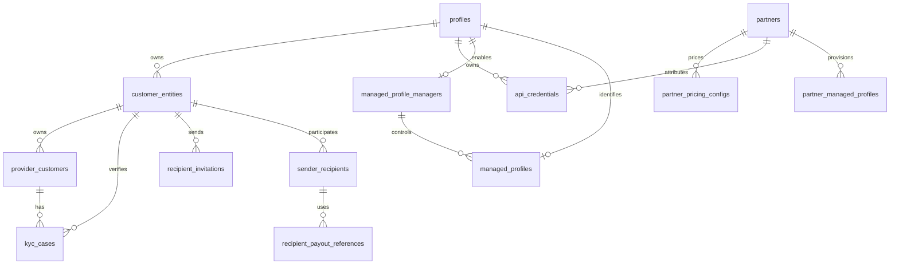

# Identity, Customer, and Partner Model

Status: current architecture. Last reconciled with migrations 038–061 and the API models
on 2026-08-06.

This document explains the implemented identity model across authentication, compliance
customers, provider accounts, partner pricing, and recipients. Security invariants remain
owned by [`docs/security-spec/`](security-spec/README.md).

## Design principles

- A login profile is not a legal or compliance identity.
- Every provider account and KYC/KYB case belongs to one customer entity.
- Partner identity is separate from per-direction and per-currency pricing.
- Ramp registration operates for an effective user; provider identity is resolved by the
  server and is never selected freely by request data.
- Reusable payout details stay with the provider. Vortex stores provider references and
  masked labels, not raw bank-account data.

## Core model

### Profiles and customer entities

`profiles.kind` distinguishes Supabase-linked `authenticated` profiles from headless
`managed` profiles. Authenticated profiles have an email and use their Supabase user ID
as the profile ID. Managed profiles have no email or Supabase identity.

`customer_entities` represents the legal/compliance customer. A profile may own an
individual and a business entity, while `profiles.active_customer_entity_id` records the
dashboard's selected sender identity. Selection is ownership-checked and currently
immutable after it is set. Compliance records may outlive a deleted profile because the
profile foreign key is nullable.

### Provider customers and verification cases

`provider_customers` is the durable account at Avenia, Alfredpay, Mykobo, or Monerium. It
belongs to exactly one customer entity and stores provider identifiers, corridor data,
customer type, normalized verification status, and only the provider-specific identity
fields required by runtime behavior.

`kyc_cases` records KYC/KYB attempts separately from the provider account. Both tables use
the normalized lifecycle `started`, `pending`, `in_review`, `approved`, or `rejected`,
while `status_external` preserves a provider's original value when one exists.

Legacy placement caveat: the migration 040 backfill attached pre-cutover provider rows to
the profile's 038-backfilled *individual* entity — including business-typed rows. The
row's `customer_type` is therefore authoritative for type-scoped lookups; the owning
entity's `type` is not. Typed provider lookups and ownership checks scope by profile, and
new alfredpay rows co-locate with a profile's existing rows of the same `customer_type`.

Avenia is the one current exception to the general preference against retaining raw tax
references: `provider_customers.tax_reference` remains a runtime join key for in-flight
ramp state. Its SHA-256 value backs lookup and uniqueness; masked display is derived at
read time rather than stored as a second copy.

### Partners, pricing, and API credentials

`partners` contains one commercial identity per unique partner name.
`partner_pricing_configs` contains the BUY/SELL pricing rows, optionally scoped to a fiat
currency; a currency-specific row takes precedence over the wildcard row.

`api_credentials` is the runtime authentication store: one row is one public/secret key
pair with a required subject `profile_id`, an optional attributing `partner_id`,
environment, expiry, and a revocation timestamp. The public value is stored plainly and
suits attribution; the secret is stored hashed and authenticates requests as the subject
profile. There is no partner-only credential: a partner-managed credential still acts
for exactly one profile, and ramp registration stays user-gated per
[`ADR 0001`](adr-0001-user-gated-ramp-registration.md). The legacy `api_keys` table is
removed by migration 061; startup fails closed if the table still exists.

`partner_managed_profiles` records that a partner provisioned a Supabase-backed profile
(normalized source and external subject ID) for provenance and idempotency; it is not an
authentication or pricing principal. Normative credential rules live in
[`security-spec/01-auth/api-keys.md`](security-spec/01-auth/api-keys.md).

The additive `managed_profile_managers` and `managed_profiles` schema is the foundation
for headless delegated profiles. It records manager enablement, allowed corridors, and
the unique manager-to-child relationship and immutable provider contact email. The contact
email is not a login identity: `profiles.email` remains null. Database constraints require
every managed profile to have exactly one relationship, keep normalized contact emails
unique within each manager, and prevent managed profiles from becoming managers. The
internal provisioning service atomically creates a managed profile, its active customer
entity, and the relationship, with idempotency scoped by manager and external subject ID.
Admin-only `PUT` and `GET` routes configure manager activation and allowed corridors
without deleting manager history. Active managers create, list, read, and logically delete
their children through `/v1/managed-profiles`; Vortex administrators use
`/v1/admin/managed-profile-managers/:profileId/managed-profiles` for the same headless
provisioning with `creation_source = vortex`. Managers also issue, list, and revoke
child-owned credentials through nested lifecycle routes. Logical deletion retains the
profile and its financial/compliance records, permanently reserves the manager-scoped
external-subject and contact-email pairs, and revokes all child credentials. Delegated authorization
is active on quote, ramp, limits, ramp-info, onboarding-status, Avenia, and Alfredpay
routes; recipient invitations remain unavailable to managed children.

### Recipients

`recipient_invitations` contains a token-bound invitation from a sender entity.
`sender_recipients` is the accepted sender-to-recipient relationship, scoped per rail.
`recipient_payout_references` contains the provider-side payout instrument ID, masked
label, and verification status.

The detailed redemption, token-retention, authorization, and payability rules are
normative in
[`security-spec/03-ramp-engine/recipient-transfers.md`](security-spec/03-ramp-engine/recipient-transfers.md).
Current product behavior and acknowledged gaps are in
[`product-dashboard.md`](product-dashboard.md).

## Authentication and ownership flow

1. Existing authentication accepts a valid secret API key or Supabase bearer token and
   establishes the actor profile.
2. On delegated routes, `X-Managed-Profile-Id` selects a child profile. The authorization
   middleware verifies the active manager, direct active relationship, managed child,
   active child customer entity, and the configured corridor for mutations.
3. `getEffectiveUserId()` uses the verified child subject when delegation is present;
   otherwise it preserves the existing Supabase/API-credential resolution.
4. Ownership middleware scopes quotes, ramps, provider accounts, recipients, and history
   to that effective user and their customer entities.
5. At ramp registration, the server resolves the provider account for the effective user.
   Client-supplied provider identifiers are either ignored or accepted only when they
   match the server-derived identity.

The derived request context retains `actorProfileId`, `subjectProfileId`,
`controllingManagerProfileId`, `customerEntityId`, and the manager-child relationship ID.
It never overwrites `req.userId`, and a public API key cannot authenticate a manager.
Alfredpay customer creation uses the child's immutable provider contact email, never the
manager's login email. Email-bound Mykobo and Monerium routes remain unsupported.

Child-owned credentials authenticate directly as the child. Public and secret validation
derive the unique active manager relationship on every request; corridor-bound route
authorization applies the controlling manager's current grants. Each child has one
immutable relationship retained after logical deletion, so child-owned resources remain
attributable to their controlling manager without a duplicate operation-level
actor/subject record. Distinguishing direct child-credential requests from delegated
manager requests in durable operation records is not required by the current model.
Generic profile and admin partner credential creation reject managed subjects; only the
controlling manager's child-credential route may issue one. A committed manager,
relationship, or corridor policy change blocks subsequent authorization decisions but
does not cancel a request that was already authorized and remains in flight.

Quotes remain available before login where the public API permits rate discovery. An
authenticated user may claim an anonymous quote at registration; an already user-owned
quote cannot be claimed by another user.

## Implementation map

- Sequelize models: `apps/api/src/models/{user,customerEntity,providerCustomer,kycCase,partner,partnerPricingConfig,apiCredential,partnerManagedProfile,recipientInvitation,senderRecipient,recipientPayoutReference}.model.ts`
- Principal resolution: `apps/api/src/api/middlewares/{dualAuth,effectiveUser,managedProfileAuth,ownershipAuth}.ts`
- Provider ownership resolution: `apps/api/src/api/services/avenia-account.ts` and provider controllers/services
- Schema history: `apps/api/src/database/migrations/038-*` onward
- Migrations 060-061 production gates: [`operations-legacy-schema-cleanup.md`](operations-legacy-schema-cleanup.md)
- Security details: `docs/security-spec/01-auth/`, `03-ramp-engine/recipient-transfers.md`, and the provider specs under `05-integrations/`

Update this document only when the cross-module shape changes. Provider-specific flows,
security exceptions, and field-level audit checklists belong in the security spec.
