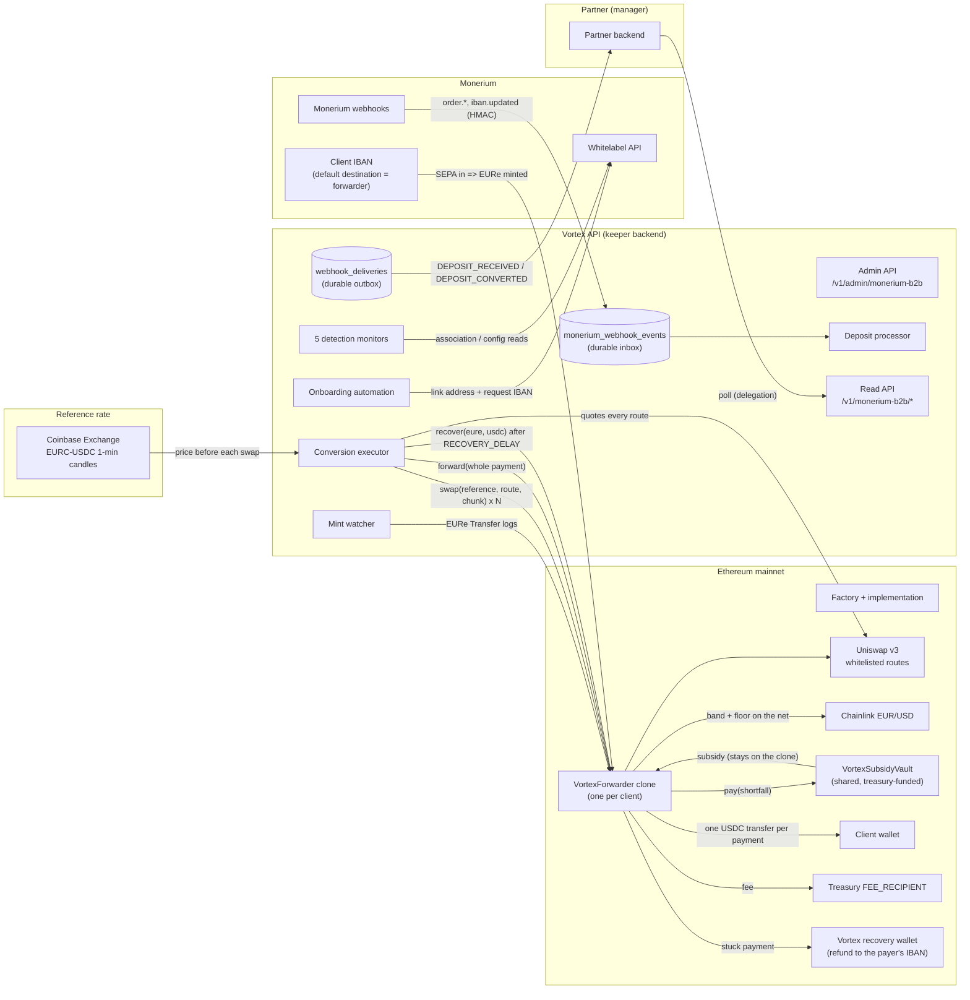
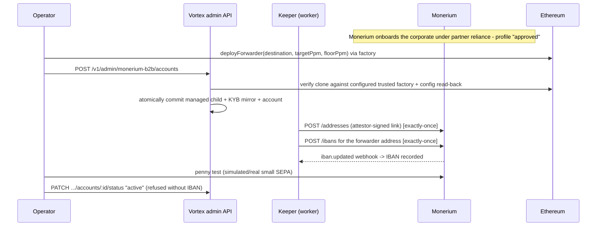
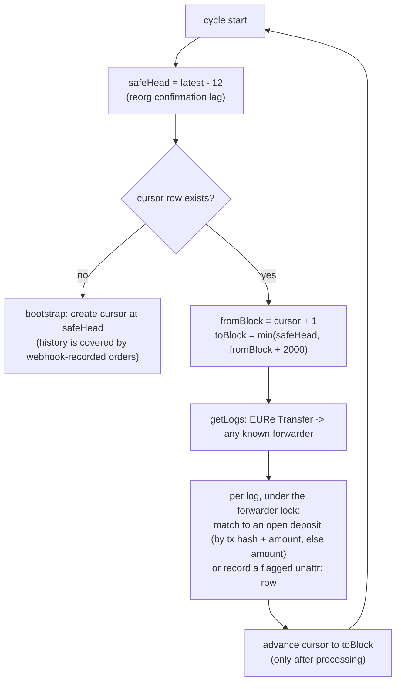
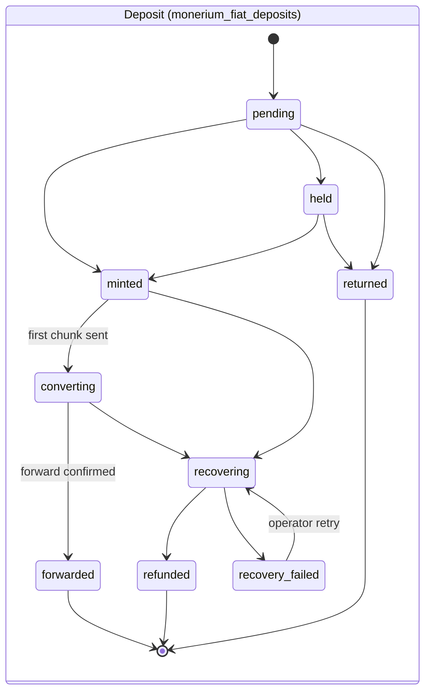
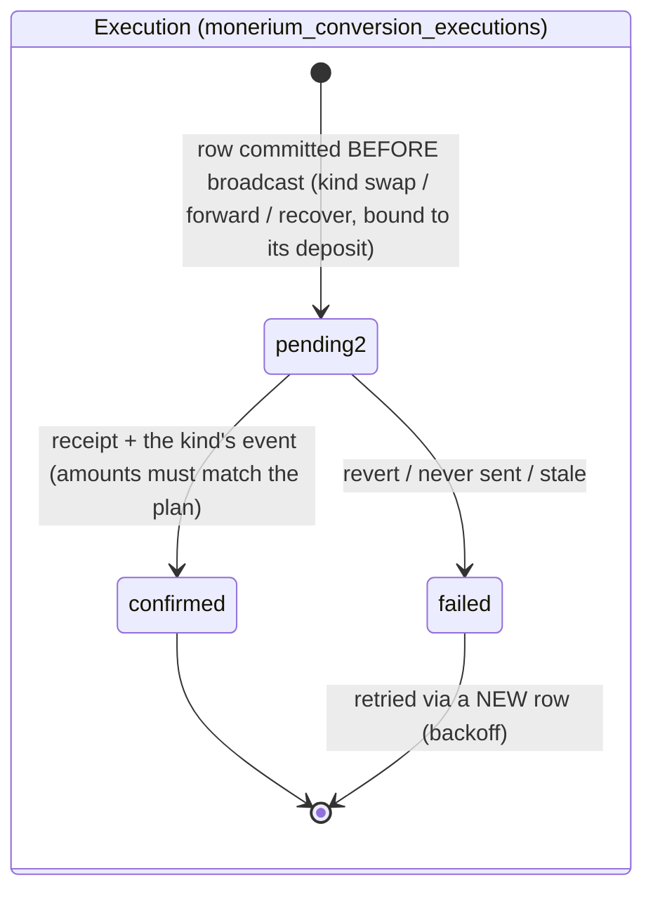
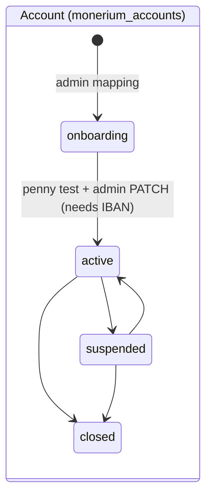
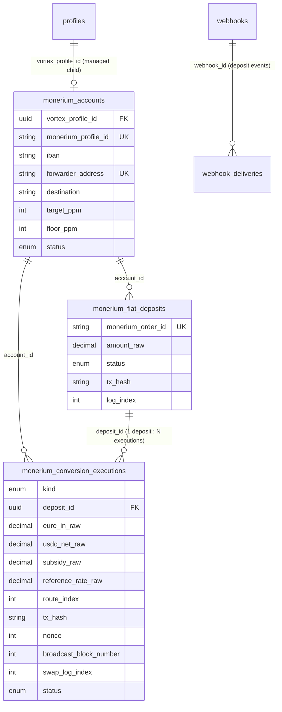

# Monerium B2B Onramp Architecture

Current end-to-end architecture of the quoteless EUR → USDC onramp for KYB'd corporate
clients. Normative security detail lives in
[`security-spec/05-integrations/monerium-b2b.md`](security-spec/05-integrations/monerium-b2b.md);
decisions, final parameters, and accepted risks in
[`adr-0005-monerium-b2b-onramp.md`](adr-0005-monerium-b2b-onramp.md);
launch gates in [`operations-monerium-b2b-rollout.md`](operations-monerium-b2b-rollout.md);
operator procedures in [`operations-monerium-b2b-runbook.md`](operations-monerium-b2b-runbook.md).

## The shape in one paragraph

Each corporate client is onboarded and KYB-approved by Monerium in Vortex's whitelabel
app (under the partner's KYC reliance) and owns a dedicated Monerium profile. Vortex
deploys one `VortexForwarder` contract clone per client, links it to that profile with an
attestor signature, and requests an IBAN **for the linked contract address** — the IBAN's
default mint destination *is* the forwarder. From then on the flow is passive on
Monerium's side: EUR received on the IBAN mints EURe to the forwarder, and Vortex's
keeper converts each bank payment in `swap(reference, route, amountIn)` chunks on the
contract — each swaps EURe to USDC over a whitelisted Uniswap v3 route and settles the
fill against the partner reference rate (surplus above the target is the fee, shortfall
below the floor is topped up from the subsidy vault, Chainlink bounds the net) — the USDC
accumulates on the forwarder, and one `forward(amount)` pushes the whole converted
payment to the client's fixed destination wallet, so the client sees one transfer per
pay-in. A payment that cannot be converted inside the promised window is moved to the
Vortex recovery wallet (`recover`, keeper-only, contract-gated by `RECOVERY_DELAY`) and
refunded to the payer's bank account — see "Chunking, forwarding and the refund path".
The flow is deliberately **not** a ramp: no quote, no `ramp_states` — the account is
permanent and repeatedly funded. Inside Vortex the client is a **managed child profile** under the
partner manager, which is what carries KYB records, API credentials, the read API, and
webhook tenancy.

The module is dark by default. Unless `MONERIUM_B2B_ENABLED=true`, its public/admin
routes, raw-body webhook parser, and keeper worker are not mounted; account-scoped
deposit webhook registration is rejected. Existing generic outbox deliveries continue
to drain. Enabling it is fail-fast and requires the complete credential/key/RPC set,
the trusted factory address, and `FLOW_VARIANT=mykobo`.

## System map



Trust boundaries worth holding onto: **Monerium controls where EURe mints** (the IBAN's
linked default address — which is why the association monitor exists); **the contract
controls where funds can go** (fixed `destination`, fee to the immutable treasury, and
the immutable Vortex recovery wallet, reachable only by the keeper and only once a batch
has been open for `RECOVERY_DELAY` — the keeper can trigger and, for a stuck payment,
recover, never redirect); **Vortex controls
timing, route choice and the reference within on-chain bounds** (a validated route set,
a Chainlink band, a fee cap, vault caps and a floor on the client's net), which can move
the price inside those bounds but never where funds go; and **accounting**.

## Onboarding sequence (per client)



Steps in prose:

1. **Monerium onboards the corporate** under the partner's reliance attestation; the
   profile arrives `approved`. (Vortex's KYB submission API is a deliberate 501 stub —
   registry T3.)
2. **Operator deploys the forwarder clone** with the client's `destination` (no setter:
   a wallet change means a new clone, runbook §5) and the initial fee policy
   (`targetPpm`, `floorPpm`); manifest generated and verified.
3. **Admin mapping** — one idempotent call provisions the managed child, mirrors the
   approved KYB into `provider_customers` + `kyc_cases`, verifies the clone against the
   configured trusted factory on chain, and creates the account row bound via
   `vortex_profile_id`. All local records commit in one database transaction.
4. **Keeper automation** links the forwarder (attestor signature) and requests the IBAN,
   each exactly-once through the profile-scoped `financial_operations` ledger; the
   `iban.updated` webhook records the IBAN.
5. **Penny test**, then activation via the admin status endpoint.

## Deposit-to-payout sequence

```mermaid
sequenceDiagram
    participant B as Client's bank
    participant M as Monerium
    participant F as Forwarder (chain)
    participant S as Subsidy vault (chain)
    participant V as Vortex keeper
    participant CB as Coinbase
    participant P as Partner

    B->>M: SEPA transfer to the IBAN
    M->>F: mint EURe (automatic, no API call)
    M-->>V: order.created / order.updated webhook -> inbox -> deposit row
    V->>F: (watcher) sees the Transfer log -> stamps chain identity
    V->>V: DEPOSIT_RECEIVED -> outbox -> partner webhook
    loop one chunk per keeper cycle (at most perSwapCap) until the deposit is converted
        V->>CB: last hour of 1-min candles -> 5-min VWAP (reference, recorded on the execution row)
        V->>V: quote every whitelisted route, project fee/subsidy, defer if the vault cannot cover
        V->>F: swap(reference, bestRoute, chunk)  [execution row bound to the deposit, committed first]
        F->>F: swap the chunk on the route; fee above target (to treasury), floor on the net; USDC stays here
        F->>S: pay(shortfall) when the fill is below the floor
        S->>F: subsidy USDC onto the clone
        V->>V: finalize from SwapExecuted (fee, subsidy, reference, route)
    end
    V->>F: forward(sum of the chunks' net)  [execution row committed first]
    F->>P: the whole payment's USDC to the client wallet in one transfer
    V->>V: finalize from Forwarded (amount must equal the plan) -> deposit forwarded
    Note over V: 32 blocks later
    V->>P: DEPOSIT_CONVERTED (chunks + forward tx) -> outbox -> partner webhook
```

Vortex learns about a deposit through two complementary channels, which converge on the
same per-forwarder advisory lock: the **webhooks** carry the provider order accounting
(amount, order id, compliance holds), while the **mint watcher** proves the on-chain
mint identity. Only a settled, chain-indexed mint makes an account a conversion
candidate. A live balance by itself is deliberately insufficient: this prevents a swap
from outrunning the watcher's reorg window and becoming impossible to attribute safely.

## How the mint watcher walks the chain

The watcher is a poll-based log scanner with a **persisted cursor** so no block range is
ever skipped or double-processed across restarts:



The mechanics that matter:

- The cursor row (`monerium_chain_cursors` — one row per watcher and chain) stores
  the **last fully processed block**. It advances only *after* every log in the range
  was handled, so a crash mid-range means the next cycle re-scans the same range — and
  re-scanning is harmless because each mint's identity `(chain_id, tx_hash, log_index)`
  is a unique index: already-recorded mints are skipped.
- The scan stops **12 blocks below the head**: that identity is not reorg-stable
  (a dropped transaction re-mines with a different block and log index), so only
  settled blocks are read. Conversion intentionally inherits this ~2.5-minute safety
  delay rather than acting on an unindexed live balance.
- Ranges are capped at 2,000 blocks per cycle, so after downtime the watcher catches up
  in bounded chunks instead of one unbounded `getLogs`.
- On first run there is no cursor: it bootstraps at the current settled head and scans
  only forward. Historic mints are outside the automatic path even when a webhook row
  exists; back-filling their chain fields is a manual operation. The rollout therefore
  requires zero EURe balances on mapped forwarders before first enablement.

## Lifecycles







Deposit statuses are **forward-only** (a delayed or replayed webhook can never regress a
row): the provider states first, then the keeper's settlement branch or the refund branch
(`recovering` is entered by the operator through the admin endpoint until the missed
window triggers it automatically; `refunded` and `recovery_failed` are set by whoever
completes the bank refund). Account statuses follow only the arrows above; `closed` is terminal and a repeated
write of the current status is idempotent. A nonce-less execution row is a five-minute
pre-send reservation; expiry uses a compare-and-set so its original owner can no longer
broadcast. Once the swap nonce is persisted, time alone never fails the execution.
Recovery scans bounded 2,000-block pages from the pre-broadcast block and adopts only
one transaction matching the keeper sender, nonce, forwarder target, the exact calldata
of its kind — `swap(reference, route, amountIn)`, `forward(amount)` or
`recover(eure, usdc)` — rebuilt from what was persisted before broadcast, and the kind's
emitted event; incomplete or ambiguous evidence stays pending for manual reconciliation. The account additionally carries a `dormant_since`
marker (guardian-paused after 60 days without a conversion; conversion stops, the
protective stranding marker still arms).

## Chunking, forwarding and the refund path

The keeper serves **one deposit at a time** per account, oldest chain-indexed mint first,
and sends at most one transaction per account per cycle:

- **A large deposit is chunked; the client still gets one transfer.** `swap` takes an
  explicit `amountIn`: at most `perSwapCap`, and never leaving a sub-minimum dust
  remainder when the last two chunks can share it (`planChunk`). A €120k deposit at a
  €25k cap becomes five swap executions a few minutes apart, each bound to the deposit;
  their USDC (fee already skimmed, subsidy already added) waits on the forwarder. Once
  the chunks' EURe sum to the deposit, one `forward(amount)` execution pushes the sum of
  their nets to the destination, and the deposit is `forwarded`. The cap is an
  availability/price-impact parameter, not a safety bound — the oracle floor is.
- **Deposits never share a swap.** Two deposits sitting on the forwarder convert one
  after the other; the second waits for the first's forward only if they compete for
  the same cycle. There is no pro-rata attribution any more: an execution belongs to
  exactly one deposit by construction. The partner receives one `DEPOSIT_CONVERTED`
  per deposit after the forward is deep enough, with `conversions[]` per chunk and
  `forwardTxHash`.
- **A remainder below `minSwapAmount`** (registry P6) cannot be swapped; it waits for
  the refund path rather than merging with the next deposit.
- **The refund path.** A deposit marked `recovering` — by an operator through the admin
  endpoint, or once automated by the missed window — is moved off the clone with
  `recover(eureRemaining, usdcConverted)`: keeper-only, explicit amounts, only to the
  immutable `RECOVERY_WALLET`, and only once the clone's `batchOpenedAt` marker is older
  than `RECOVERY_DELAY` (2 h). The marker opens when funds first arrive, is never
  re-timed by a chunk swap, and is re-timed for whatever remains after a forward or a
  recovery, so a younger payment sharing the clone gets its own clock. The keeper
  recovers before it converts anything else, and still does so on suspended or dormant
  accounts (`recover` ignores the guardian pause). Off the clone the refund is manual for
  now (runbook §2.7): the USDC is swapped back to EURe, a float wallet covers the
  slippage residue, and a Monerium redeem order from the recovery wallet's company
  profile returns the exact issue amount to the payer's IBAN; the operator then marks the
  deposit `refunded`.
- **Liveness without Vortex.** Past `TRIGGER_DELAY` (24 h) anyone may `swap` (Chainlink
  reference, no subsidy) and `forwardAll` the clone's USDC to the destination; payments
  may merge on that path, and the keeper reconciles what it did not send by hand.

## Fees, reference rate and subsidy

The partner agreement fixes the client's rate against a reference: the reference minus
12.5 bps whenever the market allows it, never worse than 15 bps below it. The contract
settles every fill into three bands against that reference (decisions:
[`adr-0005-monerium-b2b-onramp.md`](adr-0005-monerium-b2b-onramp.md), amendment).

- **Reference rate.** Before each swap the keeper computes a five-minute volume-weighted
  average of Coinbase Exchange EURC-USDC one-minute candles (`reference-rate.ts`: typical
  price `(low + high + close) / 3` weighted by volume; widened to an hour when the five
  minutes carry no volume, so a single thin weekend print never becomes the reference),
  stores price, window and time on the execution row, and passes the rate into
  `swap`. The contract rejects a reference outside
  `MAX_REFERENCE_DEVIATION_BPS` of Chainlink EUR/USD; a permissionless caller's value is
  ignored and Chainlink is the reference. No reference means the keeper defers.
- **Fee policy (`targetPpm`, `floorPpm`)**: per clone, in ppm below the reference,
  `target ≤ floor ≤ MAX_FEE_PPM`. A fill above `reference × (1 − target)` gives the
  surplus to `FEE_RECIPIENT` as fee, capped at `MAX_FEE_PPM`; a fill between floor and
  target is passed through untouched; a fill below `reference × (1 − floor)` is topped
  up to the floor. Raising either value is announced on chain and applies
  (permissionlessly) only after the 24 h `FEE_INCREASE_TIMELOCK`, so a client whose
  SEPA transfer is already in flight cannot be swapped under a silently worse policy;
  lowering is immediate (registry P11). Swaps always use the currently applied policy.
- **Subsidy vault (`VortexSubsidyVault`)**: one contract shared by every clone, funded
  from the treasury. It pays only when called by a factory-registered clone, to the
  clone itself (the subsidy is forwarded with the payment), within a guardian-settable
  per-swap cap (ppm of the swap's reference value) and a UTC-daily budget; it can be
  paused and withdraws only to the treasury. A vault that cannot cover the shortfall
  reverts the whole swap, and the clone reverts unless exactly the shortfall arrived on
  it — a swap is never partially subsidized, and the guardian cannot harm a swap by
  pointing the factory at a bad vault. The vault holds Vortex money only.
- **Floor on the net**: `SLIPPAGE_BPS` bounds fill − fee + subsidy against Chainlink,
  not the raw fill. The router minimum is zero and the forwarder's post-condition is the
  guard, so a subsidy can never paper over a depegged reference and the whole call,
  subsidy transfer included, reverts when the floor fails. Because the client's floor is
  15 bps under the reference and the oracle floor 60 bps under Chainlink, a reference
  more than ~45 bps below Chainlink fails the floor for every normal fill: that margin,
  not the 100 bps band, is the operating tolerance against a stale Chainlink round —
  sized so ordinary weekend drift defers (and, under the 2 h window, refunds) about
  nothing, while a genuine depeg still does.
- **Routes**: the factory holds a guardian-managed whitelist of packed Uniswap v3 paths,
  validated on chain to touch only EURe, EURC and USDC on the immutable router, with at
  most two hops on Uniswap's four fee tiers; entries are disabled, never removed, so
  indices stay stable. The keeper quotes every enabled route on the mainnet QuoterV2
  and passes the best index. A poor pick costs Vortex fee or subsidy, never the client.
- **Keeper deferral**: before reserving an execution row the keeper mirrors the
  settlement off-chain (`projectSwap`). It defers — nothing sent, no row, funds wait,
  stranding marker armed — when the reference is unavailable or out of band, no route
  quotes, the projected subsidy exceeds the cap, the remaining budget or the vault
  balance, or the projected net would breach the floor. After the 24 h trigger anyone
  may execute the swap anyway, priced against Chainlink and unsubsidized (accepted
  limitation, ADR).
- **Destination (`FEE_RECIPIENT`)**: an immutable baked into the **implementation**
  contract at deployment, shared by every clone of that implementation. Changing the
  treasury address means deploying a new implementation + factory and using it for new
  clones. There is no per-client fee destination and no setter.
- The database mirrors `target_ppm` / `floor_ppm` on the account row for accounting and
  drift detection only; the contract values are authoritative, and the config monitor
  reconciles guardian policy changes (warn + version bump) while alarming on anything
  unauthorized. Each execution row records the reference, the route, the fee and the
  subsidy; the client's net is `usdcOut − fee + subsidy` and flows into attribution
  unchanged, and the partner sees the same three pricing facts on every conversion.

## Monitoring (detection-only)

Five monitors run from the keeper worker (rate-limited to one pass per ~30 minutes),
read-only — no keys, no transactions:

1. **Association monitor (the S1 detective control).** Per active account it re-reads
   the Monerium-side state — `GET /addresses?profile=` and the IBAN list — and diffs it
   against the database record. **Any** divergence is an error-level alert: the
   forwarder no longer linked, an extra address linked to the profile, the IBAN moved
   or unrecorded. This is the control for the structural risk that Vortex-held
   whitelabel credentials can change associations at Monerium: those changes cannot be
   prevented client-side, only detected fast.
2. **Executable-depth monitor.** QuoterV2 quotes on every enabled route vs Chainlink;
   the best route's impact past the floor is an alert before clients feel it.
3. **Stranded-balance monitor.** Forwarders holding EURe or USDC whose batch marker has
   been open longer than `RECOVERY_DELAY` warn (the promised window was missed: forward
   or recover) and longer than `TRIGGER_DELAY` error (the permissionless path is live —
   a keeper-outage signal; funds are never at risk).
4. **Config reconciliation.** Re-reads per-clone config and bytecode: guardian-authorized
   fee-policy changes (timelocked) are reconciled into the DB with a version bump; a
   destination change (no setter exists), bytecode or registration drift is a
   should-be-impossible incident.
5. **Subsidy-vault monitor.** Balance, daily budget, spend and pause state of the shared
   vault: paused or empty is an error (every below-floor swap defers), less than a day
   of budget or an exhausted day is a refill warning.
6. **Reference-venue monitor.** Probes the Coinbase product the reference VWAP reads:
   a delisted or halted product keeps answering the candles endpoint with stale data
   and would make every keeper swap defer silently, so its status is an error line
   rather than an assumption.

## Data model — the Monerium B2B tables

All tables below belong exclusively to this flow (the legacy Monerium OAuth/KYC
integration owns no tables of its own — it writes only `provider_customers` /
`kyc_cases`). Migration numbers in parentheses.



| Table | Purpose |
|---|---|
| `monerium_accounts` (069, 071, 078, 080) | One row per client account: Monerium profile UUID, IBAN, forwarder and destination addresses, fee policy mirror (`target_ppm`, `floor_ppm`), lifecycle status, dormancy marker, and `vortex_profile_id` → the owning managed child profile |
| `monerium_fiat_deposits` (069, 070, 073, 076, 080) | One row per Monerium issue order (or flagged `unattr:` inflow): amount in 18-dp base units, forward-only status through settlement (`converting`, `forwarded`) or refund (`recovering`, `refunded`, `recovery_failed`), on-chain mint identity, and two webhook-emission markers |
| `monerium_conversion_executions` (069, 074, 075, 077, 079, 080) | One row per keeper transaction, bound to the deposit it serves (`deposit_id`) and typed by `kind`: a `swap` row is created before broadcast with the chunk, the reference (rate, source, averaging window, time) and route, then filled from `SwapExecuted` (USDC gross, fee, subsidy, net `usdcOut - fee + subsidy`); a `forward` row carries the amount pushed to the destination; a `recover` row the EURe and USDC moved to the recovery wallet. All carry tx hash, planned nonce and pre-broadcast block (crash recovery), receipt block and event log index, status |
| `monerium_webhook_events` (069) | Durable persist-before-200 inbox for Monerium deliveries, dedup by event id, 30-day retention after processing |
| `monerium_chain_cursors` (070) | Persisted block cursors for the mint watcher |
| `webhook_deliveries` (072) | Generic durable outbox for the deposit-event webhook family: one row per (webhook, event), claim-based dispatch with backoff, 30-day retention after settling |

Rows created in **existing** tables per client: a `profiles` row (`kind = managed`) with
its `managed_profiles` relationship under the partner manager, a business
`customer_entities` row, a `provider_customers` row (`monerium`/`eur`, the Monerium
profile UUID) with an approved `kyb` `kyc_cases` row, `financial_operations` rows for
the exactly-once link/IBAN calls, and — registered by the partner — a user-owned
`webhooks` row subscribed to the deposit events.

## Failure posture (pointers)

Webhook deliveries survive crashes (persist-before-200 inbox); a late provider webhook
reconciles the exact same-account unattributed mint into the provider order, including
when that order row already exists, without duplicating chain identity or executions;
provider onboarding calls are exactly-once (`financial_operations`) and their reads are
bound to the configured profile and chain; a broadcast whose hash was lost is recovered
from its persisted nonce/block plus an exact transaction-and-event match (the calldata
of its kind rebuilt from what was persisted) rather than re-sent; a swap the vault
could not cover, a reference that is unavailable or out of band, or a fill below the
floor is deferred by the keeper, never forced; all per-account writes serialize on one
advisory lock; a Vortex outage can never trap converted funds on chain (past the
trigger delay anyone may swap and forward permissionlessly); and a payment the promised
window was missed on leaves the clone only through the keeper's delay-gated recovery to
the immutable Vortex wallet, which the refund completes off chain. Full invariants and
threat model:
[`security-spec/05-integrations/monerium-b2b.md`](security-spec/05-integrations/monerium-b2b.md).
