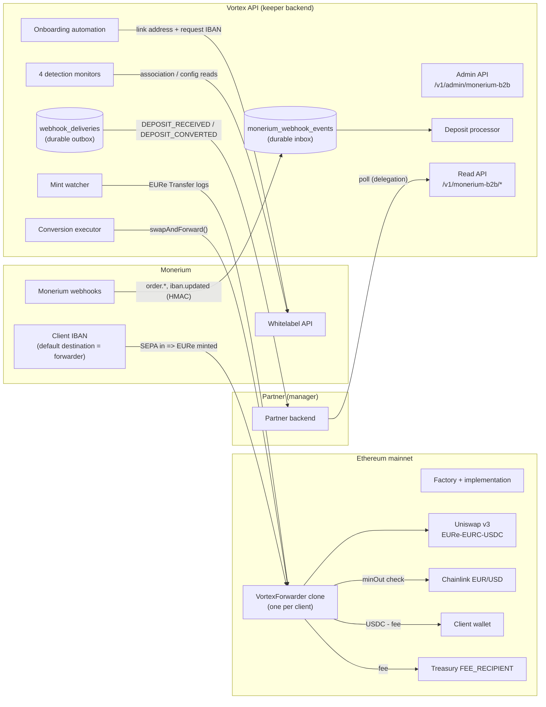
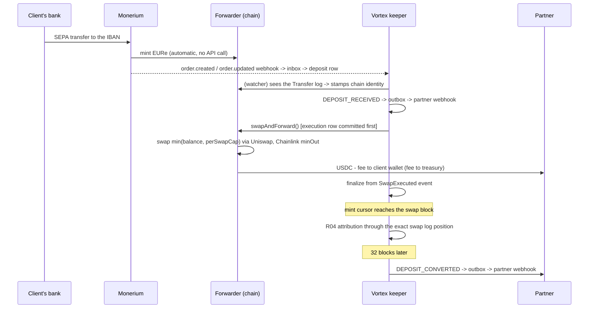
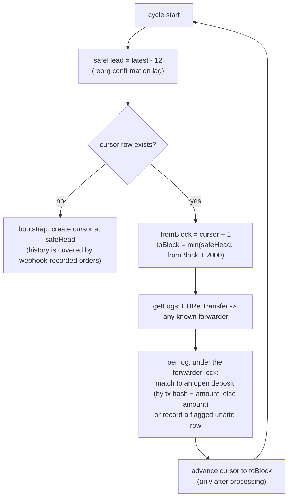
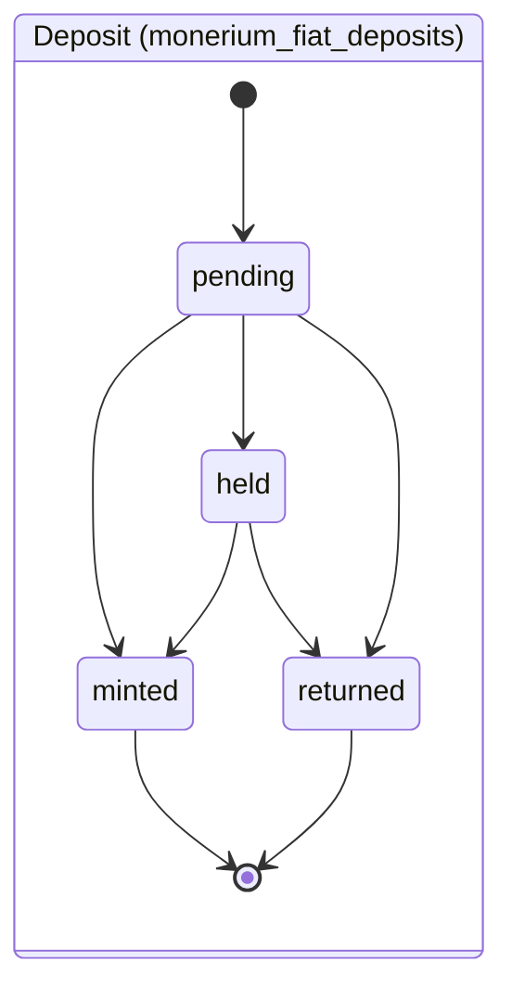
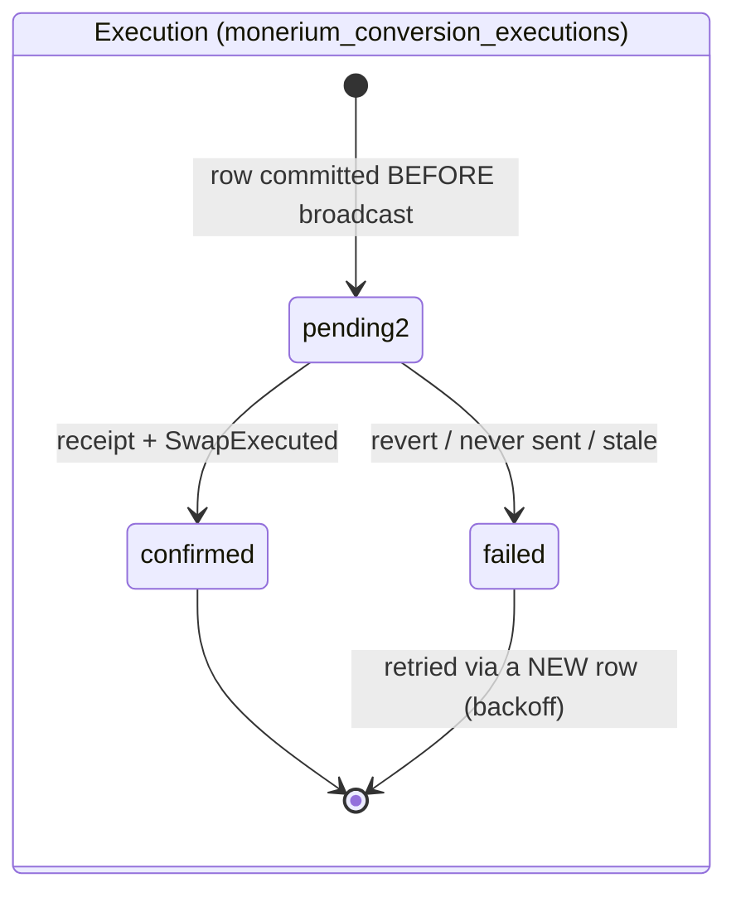
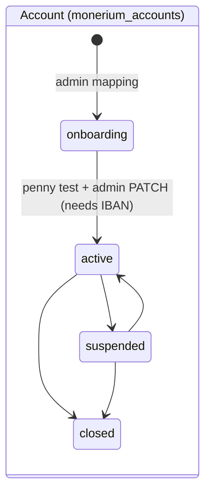
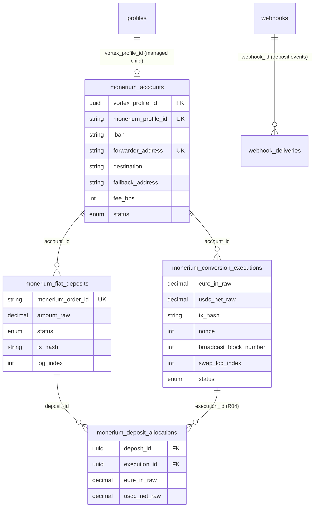

# Monerium B2B Onramp Architecture

Current end-to-end architecture of the quoteless EUR → USDC onramp for KYB'd corporate
clients. Normative security detail lives in
[`security-spec/05-integrations/monerium-b2b.md`](security-spec/05-integrations/monerium-b2b.md);
decisions, final parameters, and accepted risks in
[`adr-0005-monerium-b2b-onramp.md`](adr-0005-monerium-b2b-onramp.md);
launch gates in [`operations-monerium-b2b-rollout.md`](operations-monerium-b2b-rollout.md);
operator procedures in [`operations-monerium-b2b-runbook.md`](operations-monerium-b2b-runbook.md).

## The shape in one paragraph

Each corporate client is onboarded and KYB-approved by Monerium in Vortex's whitelabel
app (under the partner's KYC reliance) and owns a dedicated Monerium profile. Vortex
deploys one `VortexForwarder` contract clone per client, links it to that profile with an
attestor signature, and requests an IBAN **for the linked contract address** — the IBAN's
default mint destination *is* the forwarder. From then on the flow is passive on
Monerium's side: EUR received on the IBAN mints EURe to the forwarder, and Vortex's
keeper calls `swapAndForward()` on the contract, which swaps EURe → EURC → USDC on
Uniswap v3 (Chainlink-bounded minimum output) and transfers the USDC to the client's
fixed destination wallet, minus the configured fee to the treasury. The flow is
deliberately **not** a ramp: no quote, no `ramp_states` — the account is permanent and
repeatedly funded. Inside Vortex the client is a **managed child profile** under the
partner manager, which is what carries KYB records, API credentials, the read API, and
webhook tenancy.

The module is dark by default. Unless `MONERIUM_B2B_ENABLED=true`, its public/admin
routes, raw-body webhook parser, and keeper worker are not mounted; account-scoped
deposit webhook registration is rejected. Existing generic outbox deliveries continue
to drain. Enabling it is fail-fast and requires the complete credential/key/RPC set,
the trusted factory address, and `FLOW_VARIANT=mykobo`.

## System map

Trust boundaries worth holding onto: **Monerium controls where EURe mints** (the IBAN's
linked default address — which is why the association monitor exists); **the contract
controls where funds can go** (fixed `destination`, fee to the immutable treasury,
fallback sweep — the keeper can only ever trigger, never redirect); **Vortex controls
timing and accounting**, nothing more.

## Onboarding sequence (per client)

Steps in prose:

1. **Monerium onboards the corporate** under the partner's reliance attestation; the
   profile arrives `approved`. (Vortex's KYB submission API is a deliberate 501 stub —
   registry T3.)
2. **Operator deploys the forwarder clone** with the client's `destination`, mandatory
   self-custodied `fallbackAddress`, and initial `feeBps`; manifest generated and
   verified.
3. **Admin mapping** — one idempotent call provisions the managed child, mirrors the
   approved KYB into `provider_customers` + `kyc_cases`, verifies the clone against the
   configured trusted factory on chain, and creates the account row bound via
   `vortex_profile_id`. All local records commit in one database transaction.
4. **Keeper automation** links the forwarder (attestor signature) and requests the IBAN,
   each exactly-once through the profile-scoped `financial_operations` ledger; the
   `iban.updated` webhook records the IBAN.
5. **Penny test**, then activation via the admin status endpoint.

## Deposit-to-payout sequence

Vortex learns about a deposit through two complementary channels, which converge on the
same per-forwarder advisory lock: the **webhooks** carry the provider order accounting
(amount, order id, compliance holds), while the **mint watcher** proves the on-chain
mint identity. Only a settled, chain-indexed mint makes an account a conversion
candidate. A live balance by itself is deliberately insufficient: this prevents a swap
from outrunning the watcher's reorg window and becoming impossible to attribute safely.

## How the mint watcher walks the chain

The watcher is a poll-based log scanner with a **persisted cursor** so no block range is
ever skipped or double-processed across restarts:

The mechanics that matter:

- The cursor row (`monerium_chain_cursors` — one row per watcher and chain) stores
  the **last fully processed block**. It advances only *after* every log in the range
  was handled, so a crash mid-range means the next cycle re-scans the same range — and
  re-scanning is harmless because each mint's identity `(chain_id, tx_hash, log_index)`
  is a unique index: already-recorded mints are skipped.
- The scan stops **12 blocks below the head**: that identity is not reorg-stable
  (a dropped transaction re-mines with a different block and log index), so only
  settled blocks are read. Conversion intentionally inherits this ~2.5-minute safety
  delay rather than acting on an unindexed live balance.
- Ranges are capped at 2,000 blocks per cycle, so after downtime the watcher catches up
  in bounded chunks instead of one unbounded `getLogs`.
- On first run there is no cursor: it bootstraps at the current settled head and scans
  only forward. Historic mints are outside the automatic path even when a webhook row
  exists; back-filling their chain fields is a manual operation. The rollout therefore
  requires zero EURe balances on mapped forwarders before first enablement.

## Lifecycles

Deposit statuses are **forward-only** (a delayed or replayed webhook can never regress a
row). Account statuses follow only the arrows above; `closed` is terminal and a repeated
write of the current status is idempotent. A nonce-less execution row is a five-minute
pre-send reservation; expiry uses a compare-and-set so its original owner can no longer
broadcast. Once the swap nonce is persisted, time alone never fails the execution.
Recovery scans bounded 2,000-block pages from the pre-broadcast block and adopts only
one transaction matching the keeper sender, nonce, forwarder target, exact
`swapAndForward()` calldata, and emitted event; incomplete or ambiguous evidence stays
pending for manual reconciliation. The account additionally carries a `dormant_since`
marker (guardian-paused after 60 days without a conversion; conversion stops, the
protective stranding marker still arms).

## Batching and large deposits

Batching happens in both directions, automatically:

- **A large deposit is chunked.** One `swapAndForward()` call converts at most
  `perSwapCap`; the remainder stays on the forwarder and the keeper converts it on
  subsequent cycles (one execution row per chunk) until the balance is below
  `minSwapAmount`. A €120k deposit at a €25k cap becomes five executions a few minutes
  apart. The cap is an availability/price-impact parameter, not a safety bound — the
  oracle `minOut` is the safety bound.
- **Several small deposits merge.** The contract swaps the balance, not a deposit: two
  €5k deposits sitting on the forwarder convert in a single execution, and R04
  attribution splits the USDC back across both deposit rows pro-rata. A deposit that
  only partially fits under the cap is split into an allocation for this execution and
  an outstanding remainder for the next. Partners receive one `DEPOSIT_CONVERTED`
  event only after the whole deposit is allocated and every contributing execution is
  deep enough; its `conversions[]` lists each portion and `usdcNetRaw` is the aggregate
  of each swap's `usdcOut - fee`. It excludes unsolicited USDC that the contract sweeps
  to the same destination alongside a swap.

Allocation is intentionally deferred after the swap receipt. The mint watcher must
first advance through the execution block; the reconciler then includes deposits from
earlier blocks and only deposits whose `Transfer` log precedes `SwapExecuted` in the
same block. This exact boundary also captures a mint that lands between the executor's
balance read and its swap transaction without attributing a later mint to that swap.

In normal operation merging is rare: the keeper runs every minute, so deposits share an
execution only when they arrive within about a minute of each other or during downtime.
And batching only ever merges deposits of the **same client** — every client has their
own forwarder, so cross-client funds never mix.

## Fees

- **Rate (`feeBps`)**: per-client, set at clone initialization and adjustable by the
  guardian via `setFeeBps`, always capped by the implementation-immutable
  `MAX_FEE_BPS`. Increases are announced on-chain and apply (permissionlessly) only
  after the 24 h `FEE_INCREASE_TIMELOCK`, so a client whose SEPA transfer is already
  in flight cannot be swapped under a silently higher fee; decreases are immediate
  (registry P11). Swaps always use the currently applied fee — an announced increase
  never touches a swap inside its window.
- **Destination (`FEE_RECIPIENT`)**: an immutable baked into the **implementation**
  contract at deployment, shared by every clone of that implementation. Changing the
  treasury address means deploying a new implementation + factory and using it for new
  clones. There is no per-client fee destination and no setter.
- The database mirrors `fee_bps` on the account row for accounting and drift detection
  only; the contract value is authoritative, and the config monitor reconciles
  guardian fee changes (warn + version bump) while alarming on anything unauthorized.

## Monitoring (detection-only)

Four monitors run from the keeper worker (rate-limited to one pass per ~30 minutes),
read-only — no keys, no transactions:

1. **Association monitor (the S1 detective control).** Per active account it re-reads
   the Monerium-side state — `GET /addresses?profile=` and the IBAN list — and diffs it
   against the database record. **Any** divergence is an error-level alert: the
   forwarder no longer linked, an extra address linked to the profile, the IBAN moved
   or unrecorded. This is the control for the structural risk that Vortex-held
   whitelabel credentials can change associations at Monerium: those changes cannot be
   prevented client-side, only detected fast.
2. **Executable-depth monitor.** QuoterV2 quotes on the pinned swap path vs Chainlink;
   price impact past the slippage bound is an alert before clients feel it.
3. **Stranded-balance monitor.** Forwarders holding EURe with the stranding marker
   armed too long — a keeper-outage signal (past the trigger delay, the permissionless
   fallback is live; funds are never at risk, conversion is just late).
4. **Config reconciliation.** Re-reads per-clone config and bytecode: client-authorized
   changes (destination/fallback) and guardian-authorized changes (feeBps, timelocked)
   are reconciled into the DB with a version bump; bytecode or registration drift is a
   should-be-impossible incident.

## Data model — the Monerium B2B tables

All tables below belong exclusively to this flow (the legacy Monerium OAuth/KYC
integration owns no tables of its own — it writes only `provider_customers` /
`kyc_cases`). Migration numbers in parentheses.

| Table | Purpose |
|---|---|
| `monerium_accounts` (069, 071) | One row per client account: Monerium profile UUID, IBAN, forwarder/destination/fallback addresses, `fee_bps`, lifecycle status, dormancy marker, and `vortex_profile_id` → the owning managed child profile |
| `monerium_fiat_deposits` (069, 070, 073, 076) | One row per Monerium issue order (or flagged `unattr:` inflow): amount in 18-dp base units, forward-only status, on-chain mint identity, and two webhook-emission markers |
| `monerium_conversion_executions` (069, 074, 075, 077) | One row per `swapAndForward()`, created before broadcast: EURe in, USDC gross + fee from the event, conversion net (`usdcOut - fee`, excluding unrelated USDC swept by `forwarded`), tx hash, planned nonce and pre-broadcast block (crash recovery), receipt block and `SwapExecuted` log index (allocation boundary), status |
| `monerium_deposit_allocations` (076) | N:M accounting join: the EURe portion and attributed net USDC for each deposit/execution pair |
| `monerium_webhook_events` (069) | Durable persist-before-200 inbox for Monerium deliveries, dedup by event id, 30-day retention after processing |
| `monerium_chain_cursors` (070) | Persisted block cursors for the mint watcher |
| `webhook_deliveries` (072) | Generic durable outbox for the deposit-event webhook family: one row per (webhook, event), claim-based dispatch with backoff, 30-day retention after settling |

Rows created in **existing** tables per client: a `profiles` row (`kind = managed`) with
its `managed_profiles` relationship under the partner manager, a business
`customer_entities` row, a `provider_customers` row (`monerium`/`eur`, the Monerium
profile UUID) with an approved `kyb` `kyc_cases` row, `financial_operations` rows for
the exactly-once link/IBAN calls, and — registered by the partner — a user-owned
`webhooks` row subscribed to the deposit events.

## Failure posture (pointers)

Webhook deliveries survive crashes (persist-before-200 inbox); a late provider webhook
reconciles the exact same-account unattributed mint into the provider order, including
when that order row already exists, without duplicating chain identity or allocations;
provider onboarding calls are exactly-once (`financial_operations`) and their reads are
bound to the configured profile and chain; a broadcast whose hash was lost is recovered
from its persisted nonce/block plus an exact transaction-and-event match rather than
re-sent; all per-account writes serialize on one advisory lock; and the client always has two exits
that no operator failure can block — the fallback-address sweep and, past the trigger
delay, permissionless swap execution. Full invariants and threat model:
[`security-spec/05-integrations/monerium-b2b.md`](security-spec/05-integrations/monerium-b2b.md).
