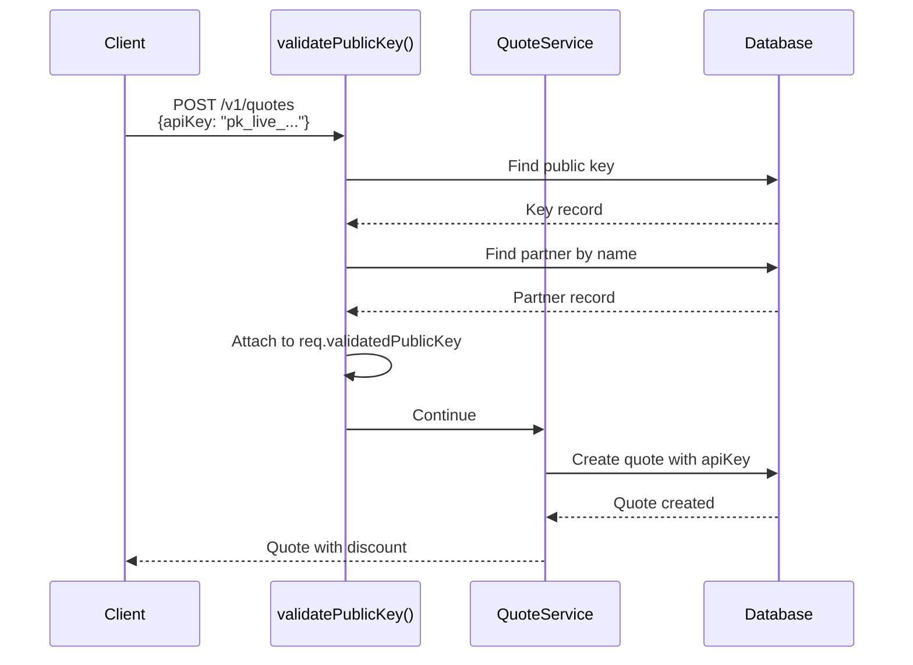
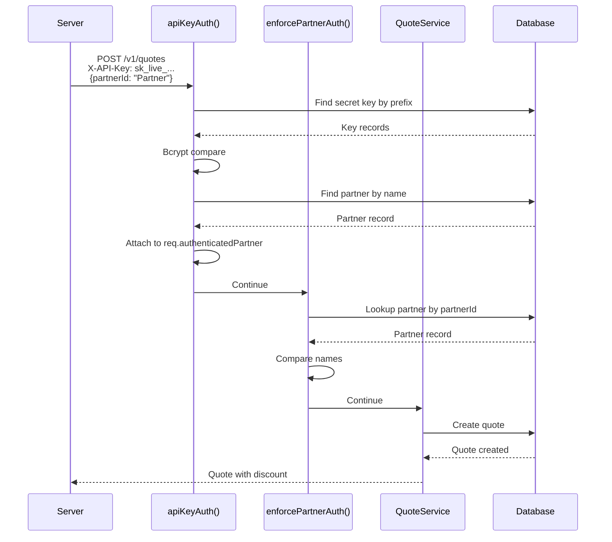
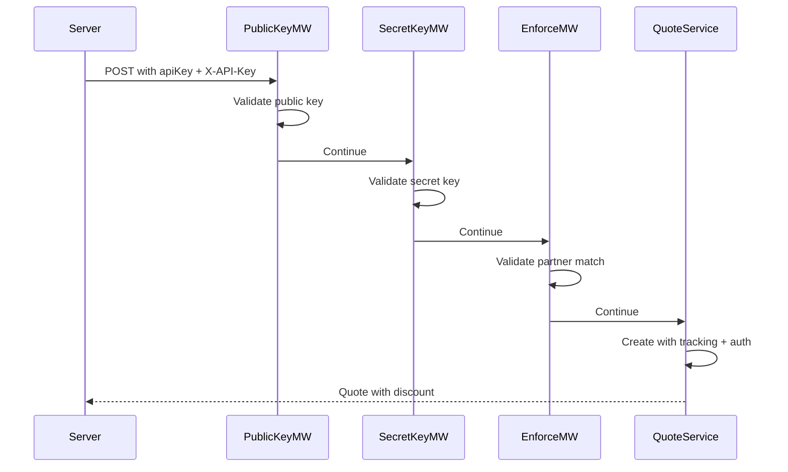

# API Key Authentication Architecture - Dual-Key System

**Version:** 2.0  
**Last Updated:** 2025-10-29  
**Status:** Implementation Complete

## Table of Contents
1. [Overview](#overview)
2. [Dual-Key Architecture](#dual-key-architecture)
3. [Database Schema](#database-schema)
4. [API Design](#api-design)
5. [Middleware Architecture](#middleware-architecture)
6. [Authentication Flows](#authentication-flows)
7. [Security Considerations](#security-considerations)
8. [Admin Interface](#admin-interface)
9. [Implementation Summary](#implementation-summary)
10. [Usage Examples](#usage-examples)

---

## Overview

Pendulum Pay uses a **dual-key authentication system** that balances security with flexibility:

- **Public Keys (pk_*)**: Safe for client-side use, tracking, and widgets
- **Secret Keys (sk_*)**: Server-only authentication for secure operations

### Problems Solved

1. **Security**: Prevents unauthorized use of partner discounts
2. **Tracking**: Enables quote attribution without exposing secrets
3. **Flexibility**: Supports both client-side and server-to-server integrations
4. **Widget Support**: Public keys can be embedded in iframes/JavaScript
5. **Analytics**: Track which integrations generate quotes

### Key Features

- ✅ Two-tier key system (public + secret)
- ✅ Partner name-based associations (works for BUY & SELL configs)
- ✅ Environment-aware (test vs live prefixes)
- ✅ Admin authentication with Bearer tokens
- ✅ Quote tracking with public keys
- ✅ Secure authentication with secret keys
- ✅ Backward compatible
- ✅ Industry standard pattern (like Stripe, PayPal)

---

## Dual-Key Architecture

### Key Types

#### Public Keys
- **Format**: `pk_live_[32_chars]` or `pk_test_[32_chars]`
- **Example**: `pk_live_xxx`
- **Storage**: Plaintext in `key_value` field
- **Security**: Can be safely exposed (no secret data)
- **Usage**: 
  - Request body or query parameters
  - Client-side JavaScript
  - Widget URLs
  - Public integrations
- **Validation**: Simple database lookup
- **Purpose**: Track quote origins, apply discounts

#### Secret Keys
- **Format**: `sk_live_[32_chars]` or `sk_test_[32_chars]`
- **Example**: `sk_live_xxx`
- **Storage**: Bcrypt hash in `key_hash` field
- **Security**: Must never be exposed
- **Usage**:
  - X-API-Key header only
  - Server-to-server communication
  - Backend integrations
- **Validation**: Bcrypt hash comparison
- **Purpose**: Authenticate partner identity, enforce security

### Environment Separation

**Production (SANDBOX_ENABLED=false):**
- Public: `pk_live_*`
- Secret: `sk_live_*`

**Sandbox (SANDBOX_ENABLED=true):**
- Public: `pk_test_*`
- Secret: `sk_test_*`

---

## Database Schema

### Table: `api_keys`

```sql
CREATE TABLE api_keys (
  id UUID PRIMARY KEY DEFAULT gen_random_uuid(),
  partner_name VARCHAR(100) NOT NULL,        -- Partner name (not ID)
  key_type ENUM('public', 'secret') NOT NULL DEFAULT 'secret',
  key_hash VARCHAR(255),                     -- Bcrypt hash (secret keys only)
  key_value VARCHAR(255),                    -- Plaintext (public keys only)
  key_prefix VARCHAR(16) NOT NULL,           -- First 10 chars for lookup
  name VARCHAR(100),                         -- Optional descriptive name
  last_used_at TIMESTAMP,                    -- Track usage
  expires_at TIMESTAMP,                      -- Optional expiration
  is_active BOOLEAN NOT NULL DEFAULT true,
  created_at TIMESTAMP NOT NULL DEFAULT NOW(),
  updated_at TIMESTAMP NOT NULL DEFAULT NOW(),
  
  CONSTRAINT unique_key_hash UNIQUE (key_hash),
  CONSTRAINT unique_key_value UNIQUE (key_value),
  INDEX idx_api_keys_partner_name (partner_name),
  INDEX idx_api_keys_key_type (key_type),
  INDEX idx_api_keys_key_prefix (key_prefix),
  INDEX idx_api_keys_key_value (key_value),
  INDEX idx_api_keys_active (is_active),
  INDEX idx_api_keys_active_prefix_type (is_active, key_prefix, key_type)
);
```

### Table: `quote_tickets` (Updated)

```sql
ALTER TABLE quote_tickets ADD COLUMN api_key VARCHAR(255);
CREATE INDEX idx_quote_tickets_api_key ON quote_tickets(api_key);
```

### Field Explanations

#### api_keys table:
- **`partner_name`**: Partner identifier (matches Partner.name field)
  - Allows one key to work for both BUY and SELL configurations
  - No foreign key constraint (manual lookup)

- **`key_type`**: Distinguishes public from secret keys
  - `'public'`: pk_* keys, stored in plaintext
  - `'secret'`: sk_* keys, bcrypt hashed

- **`key_hash`**: Bcrypt hash for secret keys
  - NULL for public keys
  - 10 salt rounds for security

- **`key_value`**: Plaintext for public keys
  - NULL for secret keys
  - Indexed for fast lookup

- **`key_prefix`**: First 10 characters
  - Used for quick database lookups
  - Safe to display/log

#### quote_tickets table:
- **`api_key`**: Stores the public key used
  - Enables tracking and analytics
  - Links quotes to partner integrations
  - Optional (nullable)

---

## API Design

### Authentication Methods

#### 1. Public Key (Client-Side Safe)
```http
POST /v1/quotes
Content-Type: application/json

{
  "apiKey": "pk_live_abc123...",
  "rampType": "SELL",
  ...
}
```

#### 2. Secret Key (Server-Only)
```http
POST /v1/quotes
X-API-Key: sk_live_xyz789...
Content-Type: application/json

{
  "partnerId": "PartnerName",
  ...
}
```

#### 3. Both Keys Together
```http
POST /v1/quotes
X-API-Key: sk_live_xyz789...
Content-Type: application/json

{
  "apiKey": "pk_live_abc123...",
  "partnerId": "PartnerName",
  ...
}
```

### Admin Endpoints

#### Create API Key Pair
```http
POST /v1/admin/partners/:partnerName/api-keys
Authorization: Bearer <ADMIN_SECRET>
Content-Type: application/json

{
  "name": "Production Keys",
  "expiresAt": "2025-12-31T23:59:59Z"  // optional
}

Response (201):
{
  "partnerName": "TestPartner",
  "partnerCount": 2,  // Number of partner records (BUY + SELL)
  "publicKey": {
    "id": "uuid-1",
    "key": "pk_live_abc123...",  // Full key (can show anytime)
    "keyPrefix": "pk_live_ab",
    "name": "Production Keys (Public)",
    "type": "public"
  },
  "secretKey": {
    "id": "uuid-2",
    "key": "sk_live_xyz789...",  // Shown ONLY ONCE!
    "keyPrefix": "sk_live_xy",
    "name": "Production Keys (Secret)",
    "type": "secret"
  },
  "expiresAt": "2025-12-31T23:59:59Z",
  "isActive": true,
  "createdAt": "2025-10-29T16:00:00Z"
}
```

#### List API Keys
```http
GET /v1/admin/partners/:partnerName/api-keys
Authorization: Bearer <ADMIN_SECRET>

Response (200):
{
  "partnerName": "TestPartner",
  "partnerCount": 2,
  "apiKeys": [
    {
      "id": "uuid-1",
      "type": "public",
      "key": "pk_live_abc123...",  // Full key shown
      "keyPrefix": "pk_live_ab",
      "name": "Production Keys (Public)",
      "lastUsedAt": "2025-10-29T16:00:00Z",
      "expiresAt": null,
      "isActive": true
    },
    {
      "id": "uuid-2",
      "type": "secret",
      "keyPrefix": "sk_live_xy",  // Only prefix shown
      "name": "Production Keys (Secret)",
      "lastUsedAt": "2025-10-29T16:05:00Z",
      "expiresAt": null,
      "isActive": true
    }
  ]
}
```

#### Revoke API Key
```http
DELETE /v1/admin/partners/:partnerName/api-keys/:keyId
Authorization: Bearer <ADMIN_SECRET>

Response (204 No Content)
```

### Error Responses

#### 400 Bad Request - Invalid Public Key Format
```json
{
  "error": {
    "code": "INVALID_API_KEY_FORMAT",
    "message": "Invalid API key format. Expected: pk_live_* or pk_test_*",
    "status": 400
  }
}
```

#### 401 Unauthorized - Invalid Public Key
```json
{
  "error": {
    "code": "INVALID_PUBLIC_KEY",
    "message": "The provided public API key is invalid, expired, or inactive",
    "status": 401
  }
}
```

#### 401 Unauthorized - Invalid Secret Key
```json
{
  "error": {
    "code": "INVALID_SECRET_KEY",
    "message": "X-API-Key header must contain a secret key (sk_live_* or sk_test_*)",
    "status": 401
  }
}
```

#### 403 Forbidden - Authentication Required
```json
{
  "error": {
    "code": "AUTHENTICATION_REQUIRED",
    "message": "Authentication is required when partnerId is specified",
    "status": 403
  }
}
```

#### 403 Forbidden - Partner Mismatch
```json
{
  "error": {
    "code": "PARTNER_MISMATCH",
    "message": "The authenticated partner name does not match the requested partner's name",
    "status": 403,
    "details": {
      "authenticatedPartnerName": "PartnerA",
      "requestedPartnerName": "PartnerB"
    }
  }
}
```

---

## Middleware Architecture

### Middleware Stack

```typescript
// Quote creation route
router.post("/",
  validateCreateQuoteInput,      // 1. Validate request structure
  validatePublicKey(),           // 2. Validate public key if provided (optional)
  apiKeyAuth({ required: false}),// 3. Validate secret key if provided (optional)
  enforcePartnerAuth(),          // 4. Enforce secret key if partnerId present
  createQuote                    // 5. Create quote
);
```

### Middleware Components

#### 1. validatePublicKey()
```typescript
// apps/api/src/api/middlewares/publicKeyAuth.ts

/**
 * Validates public API keys (pk_*) from body or query params
 * - Optional validation (continues if no key provided)
 * - Validates key exists and is active
 * - Attaches validated info to req.validatedPublicKey
 * - Used for tracking and discount application
 */
export function validatePublicKey();
```

**Extended Request:**
```typescript
interface Request {
  validatedPublicKey?: {
    apiKey: string;
    partnerName: string;
  };
}
```

#### 2. apiKeyAuth()
```typescript
// apps/api/src/api/middlewares/apiKeyAuth.ts

/**
 * Validates secret API keys (sk_*) from X-API-Key header
 * - Optional by default (required: false)
 * - Validates key format and hash
 * - Looks up partner by name
 * - Attaches authenticated info to req.authenticatedPartner
 * - Used for secure authentication
 */
export function apiKeyAuth(options?: {
  required?: boolean;
  validatePartnerMatch?: boolean;
});
```

**Extended Request:**
```typescript
interface Request {
  authenticatedPartner?: {
    id: string;
    name: string;
    discount: number;
  };
}
```

#### 3. enforcePartnerAuth()
```typescript
/**
 * Enforces secret key authentication when partnerId is present
 * - Checks if partnerId is provided in payload
 * - Requires req.authenticatedPartner to be set
 * - Validates partner names match (supports both UUID and name format)
 * - Returns 403 if validation fails
 */
export function enforcePartnerAuth();
```

### Helper Functions

```typescript
// apps/api/src/api/middlewares/apiKeyAuth.helpers.ts

// Key generation
generateApiKey(keyType: 'public' | 'secret', environment: 'live' | 'test'): string

// Validation
isValidApiKeyFormat(key: string): boolean
isValidSecretKeyFormat(key: string): boolean
getKeyType(key: string): 'public' | 'secret' | null
getKeyPrefix(key: string): string

// Public key validation
validatePublicApiKey(apiKey: string): Promise<string | null>

// Secret key validation
validateSecretApiKey(apiKey: string): Promise<AuthenticatedPartner | null>

// Hashing
hashApiKey(key: string): Promise<string>
```

---

## Authentication Flows

### Flow 1: Public Key Only (Client-Side)



**Use Case**: Widget embeds, client-side integrations

### Flow 2: Secret Key Only (Server-to-Server)



**Use Case**: Backend integrations, secure API calls

### Flow 3: Both Keys (Full Tracking + Auth)



**Use Case**: Full-featured partner integrations

---

## Security Considerations

### Public Key Security

**Design Principles:**
- **Expected to be public**: Can appear in logs, URLs, browser history
- **No authentication value**: Only validates existence
- **Tracking only**: Identifies which integration created the quote
- **Revocable**: Can be deactivated if abused

**Why It's Safe:**
- Partners trust their own public key (they created the integration)
- Discounts only apply if key is valid
- No sensitive operations without secret key
- Full audit trail via `quote_tickets.api_key`

**Attack Mitigation:**
- Rate limiting per public key
- Monitoring for unusual patterns
- Soft deletion preserves audit trail
- Expiration dates for time-limited access

### Secret Key Security

**Design Principles:**
- **Never expose**: Server-only, never in client code
- **Bcrypt protected**: 10 salt rounds, constant-time comparison
- **One-time display**: Shown only on creation
- **Prefix-based lookup**: Reduces bcrypt operations

**Storage:**
- ❌ Never store plaintext
- ✅ Only bcrypt hash stored
- ✅ Prefix for quick lookup
- ✅ Salt rounds: 10 (security/performance balance)

**Transmission:**
- ✅ HTTPS only (TLS 1.2+)
- ✅ Header only (never in URL/body)
- ✅ Never logged
- ✅ Server-to-server only

**Validation:**
- ✅ Constant-time bcrypt comparison
- ✅ Expiration checking
- ✅ Active status checking
- ✅ Partner name matching

### Admin Authentication

**Bearer Token Pattern:**
```http
Authorization: Bearer <ADMIN_SECRET>
```

**Implementation:**
- Environment variable: `ADMIN_SECRET`
- Constant-time comparison
- Protects all admin endpoints
- Separate from partner keys

**Security:**
- Generate: `openssl rand -base64 32`
- Store securely (secrets manager, env vars)
- Rotate periodically
- Different per environment

---

## Admin Interface

### Admin Authentication

All admin endpoints require Bearer token:
```http
Authorization: Bearer <ADMIN_SECRET>
```

Set via environment variable:
```bash
export ADMIN_SECRET="your-secure-random-secret"
```

### Partner Name-Based Management

Admin endpoints use partner **name** (not UUID):
```
/v1/admin/partners/:partnerName/api-keys
```

**Why names instead of IDs:**
- One key pair works for both BUY and SELL partner records
- More intuitive for admins
- Simpler URL structure

---

## Implementation Summary

### Completed Components

**Phase 1: Foundation**
- ✅ Database migrations (017, 018)
- ✅ ApiKey model with dual-key support
- ✅ QuoteTicket model with apiKey field
- ✅ Partner name-based associations
- ✅ bcrypt dependency

**Phase 2: Authentication Layer**
- ✅ Public key validation middleware
- ✅ Secret key authentication middleware
- ✅ Helper functions for both key types
- ✅ Type definitions and extensions

**Phase 3: Admin Interface**
- ✅ Admin authentication (Bearer token)
- ✅ Create key pair endpoint
- ✅ List keys endpoint
- ✅ Revoke key endpoint
- ✅ Partner name-based routing

**Phase 4: Quote Integration**
- ✅ Public key validation in quote creation
- ✅ Secret key enforcement for partnerId
- ✅ apiKey storage on quotes
- ✅ Partner discount application
- ✅ Updated shared types

### Files Created

1. `apps/api/src/database/migrations/017-create-api-keys-table.ts`
2. `apps/api/src/database/migrations/018-add-api-key-to-quote-tickets.ts`
3. `apps/api/src/models/apiKey.model.ts`
4. `apps/api/src/api/middlewares/apiKeyAuth.ts`
5. `apps/api/src/api/middlewares/apiKeyAuth.helpers.ts`
6. `apps/api/src/api/middlewares/publicKeyAuth.ts`
7. `apps/api/src/api/middlewares/adminAuth.ts`
8. `apps/api/src/api/controllers/admin/partnerApiKeys.controller.ts`
9. `apps/api/src/api/routes/v1/admin/partner-api-keys.route.ts`

### Files Modified

1. `apps/api/package.json` - Added bcrypt dependency
2. `apps/api/.env.example` - Documented ADMIN_SECRET and SANDBOX_ENABLED
3. `apps/api/src/config/vars.ts` - Added adminSecret config
4. `apps/api/src/models/index.ts` - Updated associations
5. `apps/api/src/models/quoteTicket.model.ts` - Added apiKey field
6. `apps/api/src/api/routes/v1/index.ts` - Registered admin routes
7. `apps/api/src/api/routes/v1/quote.route.ts` - Added middleware
8. `apps/api/src/api/controllers/quote.controller.ts` - Public key handling
9. `apps/api/src/api/services/quote/index.ts` - Partner name lookup
10. `apps/api/src/api/services/quote/engines/finalize/index.ts` - Store apiKey
11. `packages/shared/src/endpoints/quote.endpoints.ts` - Added apiKey field

---

## Usage Examples

### Scenario 1: Widget Integration (Public Key)

**Setup:**
```html
<script>
  const PUBLIC_KEY = 'pk_live_abc123...';  // Safe to expose
  
  async function createQuote() {
    const response = await fetch('https://api.pendulumpay.com/v1/quotes', {
      method: 'POST',
      headers: { 'Content-Type': 'application/json' },
      body: JSON.stringify({
        apiKey: PUBLIC_KEY,
        rampType: 'SELL',
        inputAmount: '100',
        ...
      })
    });
    
    return response.json();
  }
</script>
```

**Result:**
- ✅ Quote created and tracked to partner
- ✅ Partner discount applied
- ✅ Public key safely visible in browser
- ✅ Can be in iframe, widget URLs, etc.

### Scenario 2: Backend Integration (Secret Key)

**Setup:**
```javascript
const SECRET_KEY = process.env.SECRET_KEY;  // Never expose!

async function createQuote() {
  const response = await fetch('https://api.pendulumpay.com/v1/quotes', {
    method: 'POST',
    headers: {
      'Content-Type': 'application/json',
      'X-API-Key': SECRET_KEY
    },
    body: JSON.stringify({
      partnerId: 'MyPartner',
      rampType: 'SELL',
      ...
    })
  });
  
  return response.json();
}
```

**Result:**
- ✅ Authenticated via secret key
- ✅ Partner discount applied
- ✅ Secure server-to-server
- ✅ Secret never exposed

### Scenario 3: Full Integration (Both Keys)

**Setup:**
```javascript
const PUBLIC_KEY = 'pk_live_abc123...';     // Client-side
const SECRET_KEY = process.env.SECRET_KEY;   // Server-side

// Server endpoint
async function createQuote(req, res) {
  const response = await fetch('https://api.pendulumpay.com/v1/quotes', {
    method: 'POST',
    headers: {
      'Content-Type': 'application/json',
      'X-API-Key': SECRET_KEY
    },
    body: JSON.stringify({
      apiKey: PUBLIC_KEY,
      partnerId: 'MyPartner',
      ...req.body
    })
  });
  
  res.json(await response.json());
}
```

**Result:**
- ✅ Full tracking via public key
- ✅ Secure auth via secret key
- ✅ Complete audit trail
- ✅ Partner discount applied

---

## Future Enhancements

### Key Rotation
- Automatic rotation schedule
- Grace period for old keys
- Notification system

### Analytics Dashboard
- Usage per public key
- Success rates
- Geographic distribution
- Top endpoints

### Advanced Features
- IP whitelisting per key
- Rate limiting per key type
- Scoped permissions
- HMAC request signing

---

## Conclusion

The dual-key system provides:

1. **Security**: Secret keys protect high-value operations
2. **Flexibility**: Public keys enable client-side usage
3. **Tracking**: Full audit trail of quote origins
4. **Industry Standard**: Follows Stripe/PayPal patterns
5. **Scalability**: Supports diverse integration patterns

Partners can choose:
- Public key only (widgets, tracking)
- Secret key only (backend, security)
- Both together (full features)

The architecture balances security, usability, and business requirements.
