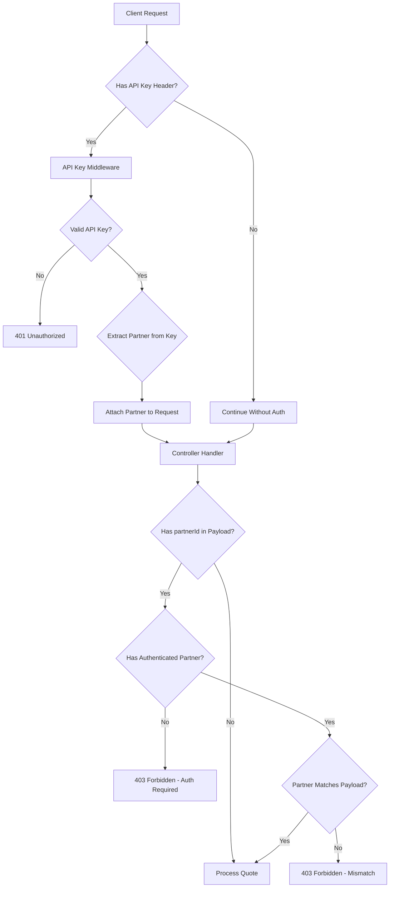

# API Key Authentication Architecture

**Version:** 1.0  
**Last Updated:** 2025-10-29  
**Status:** Design Document

## Table of Contents
1. [Overview](#overview)
2. [Objectives](#objectives)
3. [Current State Analysis](#current-state-analysis)
4. [Proposed Solution](#proposed-solution)
5. [Database Schema](#database-schema)
6. [API Design](#api-design)
7. [Middleware Architecture](#middleware-architecture)
8. [Authentication Flow](#authentication-flow)
9. [Security Considerations](#security-considerations)
10. [Migration Strategy](#migration-strategy)
11. [Implementation Phases](#implementation-phases)
12. [Future Enhancements](#future-enhancements)
13. [Open Questions](#open-questions)

---

## Overview

This document outlines the architecture for implementing API key authentication in Vortex. The authentication system will protect partner discounts and ensure that only authorized partners can claim fee discounts when creating quotes.

### Current Problem
- Partners can get discounted fees by including a `partnerId` in quote creation requests
- Currently, anyone can use any `partnerId` without authentication
- No mechanism to verify that the caller is actually the partner they claim to be
- Security risk: unauthorized use of partner discounts

### Solution Approach
Implement **Approach 1: Partner-Level API Keys** where:
- Each partner gets a unique API key
- API keys are used to authenticate requests
- System validates that the API key matches the `partnerId` in the request
- Backward compatibility maintained for non-partner requests

---

## Objectives

### Primary Goals
1. **Secure Partner Authentication**: Verify caller identity before applying partner discounts
2. **Backward Compatibility**: Existing endpoints continue to work without API keys
3. **Flexible Authorization**: Support optional API key authentication per endpoint
4. **Partner Validation**: Ensure API key matches the `partnerId` in request payload
5. **Security Best Practices**: Hash API keys, secure storage, audit logging

### Non-Goals (Initial Release)
- Request signing/HMAC (future enhancement)
- Rate limiting per API key (can be added later)
- API key rotation mechanisms (can be added later)
- Fine-grained permissions (all partners have same access level initially)

---

## Current State Analysis

### Existing Architecture

#### Partner Model
```typescript
// apps/api/src/models/partner.model.ts
interface PartnerAttributes {
  id: string;              // UUID
  name: string;            // Unique partner name
  displayName: string;
  logoUrl: string | null;
  markupType: "absolute" | "relative" | "none";
  markupValue: number;
  markupCurrency: RampCurrency;
  payoutAddress: string;
  rampType: RampDirection;
  vortexFeeType: "absolute" | "relative" | "none";
  vortexFeeValue: number;
  discount: number;        // Partner discount percentage
  isActive: boolean;
  createdAt: Date;
  updatedAt: Date;
}
```

#### Quote Creation Endpoint
- **Endpoint**: `POST /v1/quotes`
- **Current Behavior**: Accepts optional `partnerId` in request body
- **No Authentication**: Anyone can send any `partnerId`

#### Quote Request Structure
```typescript
// packages/shared/src/endpoints/quote.endpoints.ts
interface CreateQuoteRequest {
  rampType: RampDirection;
  from: DestinationType;
  to: DestinationType;
  inputAmount: string;
  inputCurrency: RampCurrency;
  outputCurrency: RampCurrency;
  partnerId?: string;        // Optional - currently unprotected
  paymentMethod?: PaymentMethod;
  countryCode?: string;
  network: Networks;
}
```

---

## Proposed Solution

### High-Level Design



### Key Design Decisions

#### 1. Optional Middleware Pattern
- API key authentication is **optional** by default
- Specific endpoints can enforce authentication via middleware flags
- Allows gradual rollout and backward compatibility

#### 2. Partner-Payload Validation
- When `partnerId` is in request payload, authentication becomes **required**
- System validates that authenticated partner matches payload `partnerId`
- Prevents partner discount abuse

#### 3. API Key Storage
- API keys hashed using bcrypt before storage
- Only hash stored in database
- Raw key shown once upon creation, never retrievable

#### 4. Request Enrichment
- Middleware attaches authenticated partner info to request object
- Controllers access partner via `req.authenticatedPartner`
- Clean separation of concerns

---

## Database Schema

### New Table: `api_keys`

```sql
CREATE TABLE api_keys (
  id UUID PRIMARY KEY DEFAULT gen_random_uuid(),
  partner_id UUID NOT NULL REFERENCES partners(id) ON DELETE CASCADE,
  key_hash VARCHAR(255) NOT NULL,
  key_prefix VARCHAR(16) NOT NULL,      -- First 8 chars for identification
  name VARCHAR(100),                     -- Optional descriptive name
  last_used_at TIMESTAMP,               -- Track usage
  expires_at TIMESTAMP,                 -- Optional expiration
  is_active BOOLEAN NOT NULL DEFAULT true,
  created_at TIMESTAMP NOT NULL DEFAULT NOW(),
  updated_at TIMESTAMP NOT NULL DEFAULT NOW(),
  
  CONSTRAINT unique_key_hash UNIQUE (key_hash),
  INDEX idx_api_keys_partner_id (partner_id),
  INDEX idx_api_keys_key_prefix (key_prefix),
  INDEX idx_api_keys_active (is_active)
);
```

### Schema Design Rationale

#### Key Format: `vrtx_live_[32_random_chars]` or `vrtx_test_[32_random_chars]`
- **Prefix**: Clearly identifies the key as belonging to Vortex
- **Environment**: Separates test/live keys for safety
- **Length**: 32 random characters provide ~191 bits of entropy
- **Example**: `vrtx_live_a7f3b2c9d1e4f5g6h7i8j9k0l1m2n3o4`

#### Field Explanations
- **`key_hash`**: Bcrypt hash of full API key (for verification)
- **`key_prefix`**: First 8 chars of key (for display/logging without exposing full key)
- **`name`**: Optional human-readable name (e.g., "Production API Key", "Mobile App Key")
- **`last_used_at`**: Automatic update on each successful auth (for monitoring)
- **`expires_at`**: Optional expiration timestamp (null = never expires)
- **`is_active`**: Soft delete/disable without removing the record

---

## API Design

### Authentication Header

```
X-API-Key: vrtx_live_a7f3b2c9d1e4f5g6h7i8j9k0l1m2n3o4
```

**Why `X-API-Key` instead of `Authorization`?**
- `Authorization` typically used for Bearer tokens (OAuth, JWT)
- `X-API-Key` clearly indicates API key authentication
- Prevents confusion with future OAuth implementation
- Common pattern in API key-based systems

### Error Responses

#### 401 Unauthorized - Invalid/Missing API Key
```json
{
  "error": {
    "code": "INVALID_API_KEY",
    "message": "The provided API key is invalid or has expired",
    "status": 401
  }
}
```

#### 403 Forbidden - Partner Mismatch
```json
{
  "error": {
    "code": "PARTNER_MISMATCH",
    "message": "The authenticated partner does not match the partnerId in the request",
    "status": 403,
    "details": {
      "authenticatedPartnerId": "uuid-of-auth-partner",
      "requestedPartnerId": "uuid-in-payload"
    }
  }
}
```

#### 403 Forbidden - Authentication Required
```json
{
  "error": {
    "code": "AUTHENTICATION_REQUIRED",
    "message": "Authentication is required when partnerId is specified",
    "status": 403
  }
}
```

### New Admin Endpoints

#### Create API Key (Admin Only)
```
POST /v1/admin/partners/:partnerId/api-keys
Authorization: Bearer <admin-token>

Request Body:
{
  "name": "Production API Key",
  "expiresAt": "2025-12-31T23:59:59Z"  // optional
}

Response (201 Created):
{
  "id": "uuid",
  "partnerId": "uuid",
  "apiKey": "vrtx_live_a7f3b2c9d1e4f5g6h7i8j9k0l1m2n3o4",  // Shown only once!
  "keyPrefix": "vrtx_liv",
  "name": "Production API Key",
  "expiresAt": "2025-12-31T23:59:59Z",
  "isActive": true,
  "createdAt": "2025-10-29T08:00:00Z"
}
```

#### List Partner API Keys (Admin Only)
```
GET /v1/admin/partners/:partnerId/api-keys

Response (200 OK):
{
  "apiKeys": [
    {
      "id": "uuid",
      "keyPrefix": "vrtx_liv",
      "name": "Production API Key",
      "lastUsedAt": "2025-10-29T08:00:00Z",
      "expiresAt": null,
      "isActive": true,
      "createdAt": "2025-10-28T10:00:00Z"
    }
  ]
}
```

#### Revoke API Key (Admin Only)
```
DELETE /v1/admin/partners/:partnerId/api-keys/:keyId

Response (204 No Content)
```

---

## Middleware Architecture

See full middleware implementation in the Migration Strategy section below.

**Key Components:**
- `apiKeyAuth()` - Main authentication middleware
- `enforcePartnerAuth()` - Validates partner match when partnerId present
- Helper functions for key generation, hashing, and validation

---

## Authentication Flow

See detailed sequence diagrams in the original document sections 8.1-8.4 covering:
- Request without partnerId (backward compatible)
- Request with partnerId but no API key (error)
- Valid API key with matching partnerId (success)
- Valid API key but partnerId mismatch (error)

---

## Security Considerations

### API Key Security Best Practices
- Hash API keys with bcrypt (10 salt rounds)
- Store only key hashes, never raw keys
- Use cryptographic randomness for generation
- Enforce HTTPS-only transmission
- Never log full API keys
- Implement rate limiting
- Audit all API key usage

See full security details in Migration Strategy section.

---

## Migration Strategy

### Complete Implementation Guide

Due to file size, the complete middleware implementation, database migration scripts, and admin endpoints are documented in the implementation phases below. Key files to create:

1. `apps/api/src/models/apiKey.model.ts` - ApiKey model
2. `apps/api/src/migrations/008-create-api-keys-table.ts` - Database migration  
3. `apps/api/src/api/middlewares/apiKeyAuth.ts` - Main middleware
4. `apps/api/src/api/middlewares/apiKeyAuth.helpers.ts` - Helper functions
5. `apps/api/src/api/controllers/admin/partnerApiKeys.controller.ts` - Admin endpoints
6. `apps/api/src/api/routes/v1/admin/partner-api-keys.route.ts` - Admin routes

---

## Implementation Phases

### Phase 1: Foundation (Week 1)
**Deliverables:**
- Database migration
- ApiKey model
- Model associations (Partner ↔ ApiKey)
- Basic unit tests

**Success Criteria:**
- Migration runs successfully
- Can create API keys programmatically
- Foreign key constraints work correctly

### Phase 2: Authentication Layer (Week 2)
**Deliverables:**
- API key middleware
- Helper functions (generate, hash, validate)
- TypeScript type definitions
- Comprehensive unit tests

**Success Criteria:**
- Middleware correctly authenticates valid keys
- Partner info attached to request
- All error cases handled
- 100% test coverage of middleware

### Phase 3: Admin Interface (Week 3)
**Deliverables:**
- Admin routes
- Admin controllers
- API key CRUD operations
- Admin API tests

**Success Criteria:**
- Admins can create/list/revoke keys
- Full key shown only on creation
- Usage tracking works
- Admin authorization enforced

### Phase 4: Quote Integration (Week 4)
**Deliverables:**
- Updated quote routes
- Middleware integration
- Updated shared types/DTOs
- Integration tests

**Success Criteria:**
- Quotes work without authentication (backward compatible)
- Partner quotes require matching API key
- Partner discounts applied correctly
- All error scenarios handled

### Phase 5: Production Readiness (Week 5)
**Deliverables:**
- Performance testing
- Security audit
- Partner documentation
- Monitoring/alerting setup
- Rollout plan

**Success Criteria:**
- Performance meets SLA (<200ms p95)
- Security review approved
- Documentation complete
- Monitoring in place
- Rollback plan documented

---

## Future Enhancements

### HMAC Request Signing (Q2 2026)

Provide enhanced security through request signing while maintaining backward compatibility.

```typescript
// Future HMAC implementation
interface HMACSignedRequest {
  headers: {
    'X-API-Key': string;
    'X-Signature': string;      // HMAC signature
    'X-Timestamp': string;      // Request timestamp
    'X-Nonce': string;          // Unique request ID
  };
}

// Signature generation
function generateSignature(
  apiKey: string,
  timestamp: string,
  nonce: string,
  method: string,
  path: string,
  body: string
): string {
  const payload = `${timestamp}.${nonce}.${method}.${path}.${body}`;
  return crypto.createHmac('sha256', apiKey).update(payload).digest('hex');
}
```

#### Migration Path
1. Add HMAC validation as optional (Phase 6a)
2. Encourage partners to upgrade (Phase 6b)
3. Make HMAC required for new partners (Phase 6c)
4. Deprecate simple API key auth (Phase 6d - 12 months notice)

### API Key Rotation
```typescript
interface ApiKeyRotationRequest {
  currentKeyId: string;
  gracePeriodDays: number;  // Both keys valid during rotation
}
```

### Fine-Grained Permissions
```typescript
interface ApiKeyPermissions {
  scopes: ('quotes:read' | 'quotes:create' | 'ramps:read' | 'ramps:create')[];
  ipWhitelist?: string[];
  rateLimit?: number;
}
```

### API Key Analytics Dashboard
```typescript
interface ApiKeyAnalytics {
  totalRequests: number;
  successRate: number;
  averageResponseTime: number;
  topEndpoints: { endpoint: string; count: number; }[]error Breakdown: { code: string; count: number; }[];
}
```

---

## Open Questions

### Business Questions
1. **API Key Lifecycle**: What is the default expiration policy?
   - **Recommendation**: No expiration by default, but encourage annual rotation

2. **Partner Onboarding**: Who can create API keys?
   - **Recommendation**: Admin-only via secure portal or API

3. **Revocation Policy**: Under what conditions should keys be auto-revoked?
   - **Recommendation**: Manual revocation only, with monitoring alerts

4. **Multiple Keys**: Should partners have multiple active keys?
   - **Recommendation**: Yes, for key rotation and different environments

### Technical Questions
1. **Rate Limiting**: Should rate limits be per API key or per partner?
   - **Recommendation**: Per partner (sum of all their keys)

2. **Audit Retention**: How long to keep API key usage logs?
   - **Recommendation**: 90 days for analytics, 1 year for audit

3. **Key Format**: Should test vs. live keys be enforced at environment level?
   - **Recommendation**: Yes, reject `vrtx_test_*` keys in production

4. **Monitoring**: What metrics should trigger alerts?
   - **Recommendation**: Failed auth rate >10%, unusual IP patterns, high request rate

---

## Appendix

### Error Handling Matrix

| Scenario | Status Code | Error Code | Action Required |
|----------|-------------|------------|------------------|
| No API key, no partnerId | 200 | - | Continue normally |
| No API key, with partnerId | 403 | AUTHENTICATION_REQUIRED | Add X-API-Key header |
| Invalid key format | 401 | INVALID_API_KEY_FORMAT | Check key format |
| Key not found in DB | 401 | INVALID_API_KEY | Verify key or contact support |
| Key expired | 401 | INVALID_API_KEY | Request new key |
| Key inactive | 401 | INVALID_API_KEY | Contact support |
| Partner inactive | 401 | INVALID_API_KEY | Contact support |
| Partner mismatch | 403 | PARTNER_MISMATCH | Use correct partnerId |
| Rate limit exceeded | 429 | RATE_LIMIT_EXCEEDED | Slow down requests |

