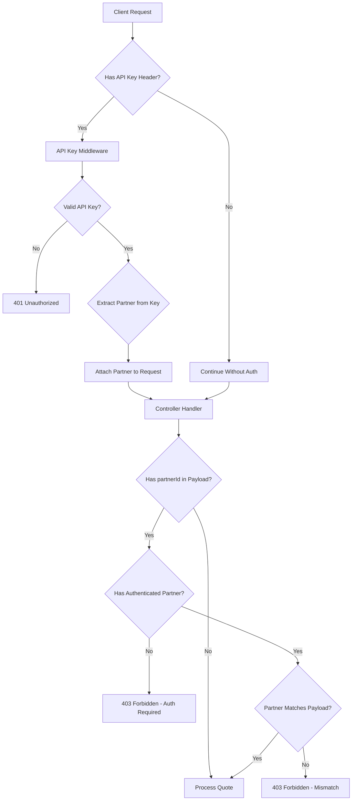
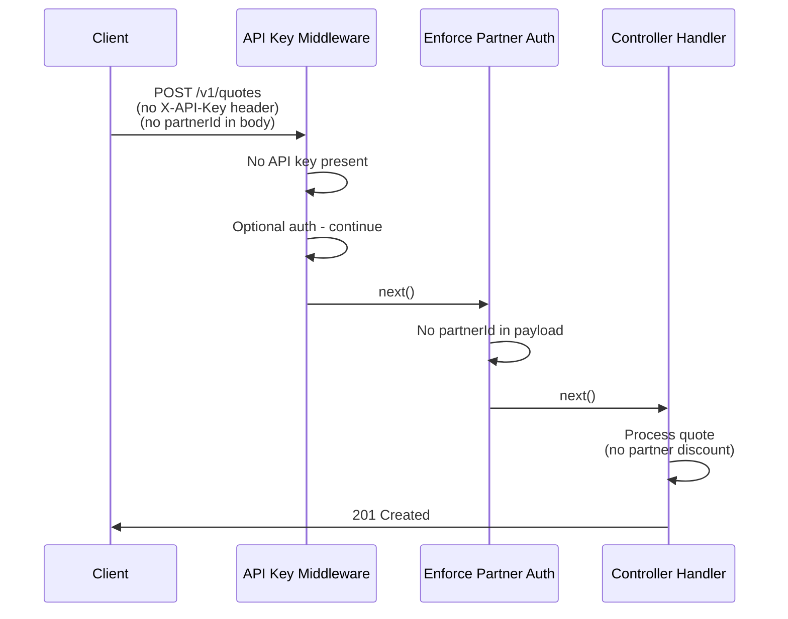
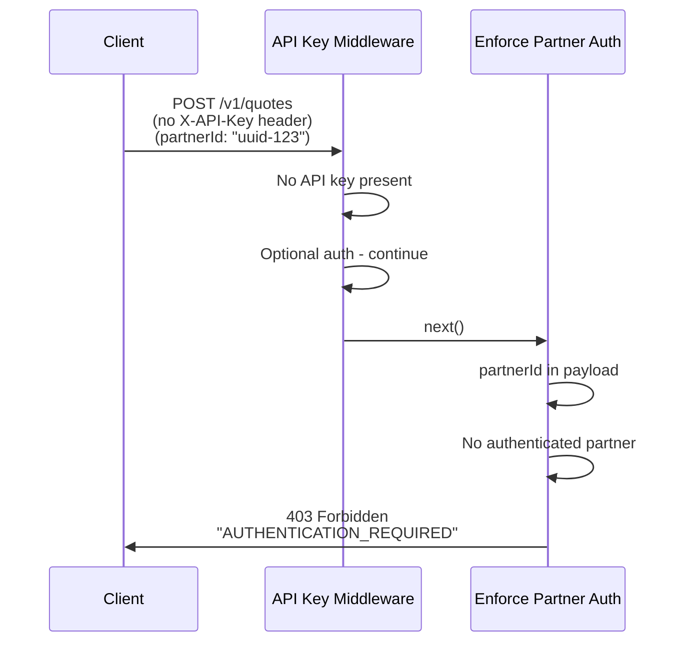
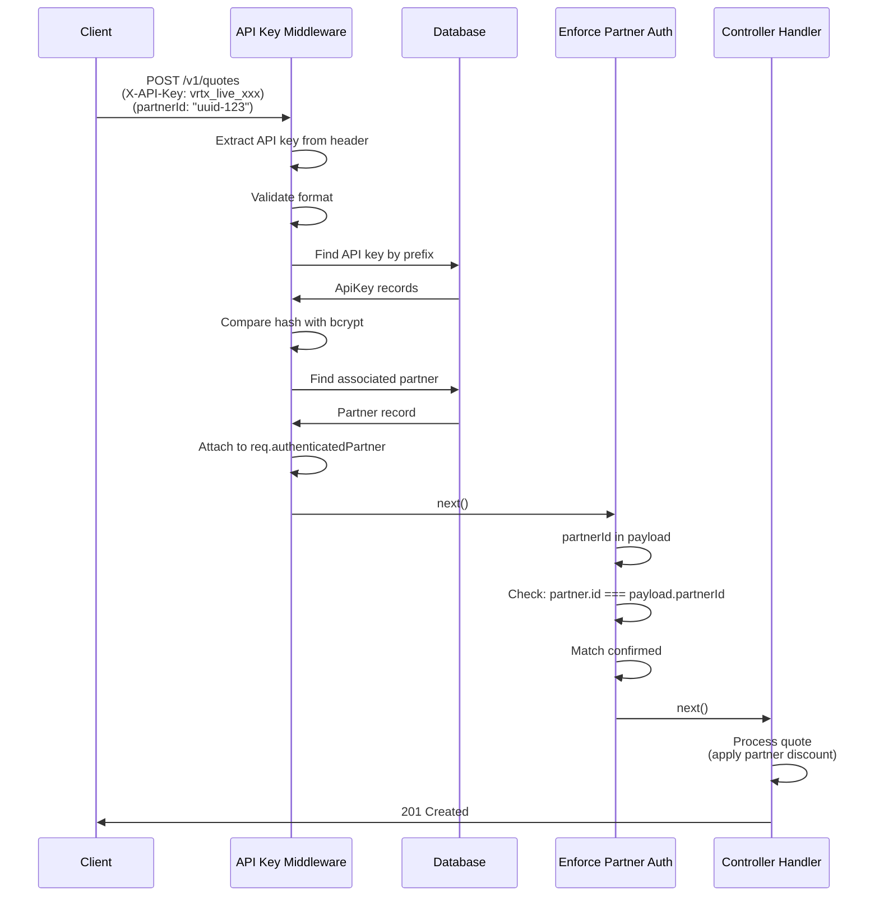
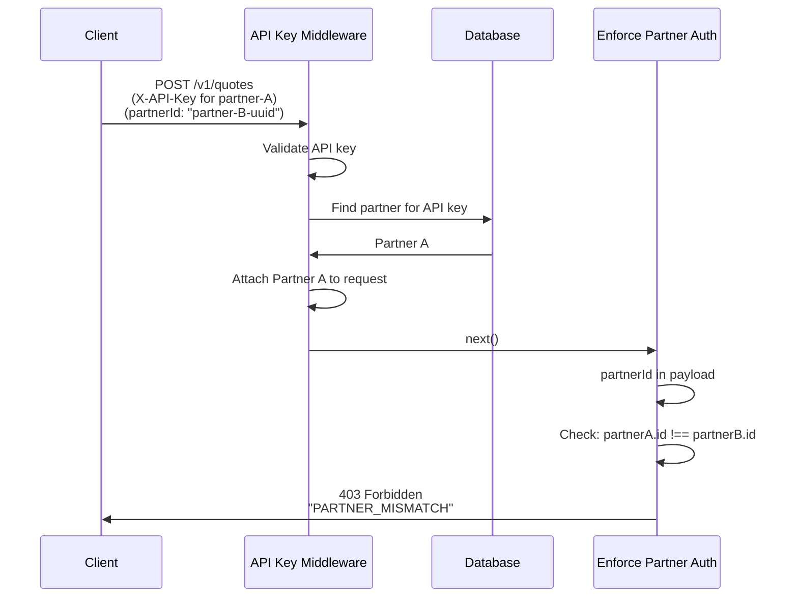

# API Key Authentication Architecture

**Version:** 1.0  
**Last Updated:** 2025-10-29  
**Status:** Design Document

## Table of Contents
1. [Overview](#overview)
2. [Objectives](#objectives)
3. [Current State Analysis](#current-state-analysis)
4. [Proposed Solution](#proposed-solution)
5. [Database Schema](#database-schema)
6. [API Design](#api-design)
7. [Middleware Architecture](#middleware-architecture)
8. [Authentication Flow](#authentication-flow)
9. [Security Considerations](#security-considerations)
10. [Migration Strategy](#migration-strategy)
11. [Implementation Phases](#implementation-phases)
12. [Future Enhancements](#future-enhancements)
13. [Open Questions](#open-questions)

---

## Overview

This document outlines the architecture for implementing API key authentication in Vortex. The authentication system will protect partner discounts and ensure that only authorized partners can claim fee discounts when creating quotes.

### Current Problem
- Partners can get discounted fees by including a `partnerId` in quote creation requests
- Currently, anyone can use any `partnerId` without authentication
- No mechanism to verify that the caller is actually the partner they claim to be
- Security risk: unauthorized use of partner discounts

### Solution Approach
Implement **Approach 1: Partner-Level API Keys** where:
- Each partner gets a unique API key
- API keys are used to authenticate requests
- System validates that the API key matches the `partnerId` in the request
- Backward compatibility maintained for non-partner requests

---

## Objectives

### Primary Goals
1. **Secure Partner Authentication**: Verify caller identity before applying partner discounts
2. **Backward Compatibility**: Existing endpoints continue to work without API keys
3. **Flexible Authorization**: Support optional API key authentication per endpoint
4. **Partner Validation**: Ensure API key matches the `partnerId` in request payload
5. **Security Best Practices**: Hash API keys, secure storage, audit logging

### Non-Goals (Initial Release)
- Request signing/HMAC (future enhancement)
- Rate limiting per API key (can be added later)
- API key rotation mechanisms (can be added later)
- Fine-grained permissions (all partners have same access level initially)

---

## Current State Analysis

### Existing Architecture

#### Partner Model
```typescript
// apps/api/src/models/partner.model.ts
interface PartnerAttributes {
  id: string;              // UUID
  name: string;            // Unique partner name
  displayName: string;
  logoUrl: string | null;
  markupType: "absolute" | "relative" | "none";
  markupValue: number;
  markupCurrency: RampCurrency;
  payoutAddress: string;
  rampType: RampDirection;
  vortexFeeType: "absolute" | "relative" | "none";
  vortexFeeValue: number;
  discount: number;        // Partner discount percentage
  isActive: boolean;
  createdAt: Date;
  updatedAt: Date;
}
```

#### Quote Creation Endpoint
- **Endpoint**: `POST /v1/quotes`
- **Current Behavior**: Accepts optional `partnerId` in request body
- **No Authentication**: Anyone can send any `partnerId`

#### Quote Request Structure
```typescript
// packages/shared/src/endpoints/quote.endpoints.ts
interface CreateQuoteRequest {
  rampType: RampDirection;
  from: DestinationType;
  to: DestinationType;
  inputAmount: string;
  inputCurrency: RampCurrency;
  outputCurrency: RampCurrency;
  partnerId?: string;        // Optional - currently unprotected
  paymentMethod?: PaymentMethod;
  countryCode?: string;
  network: Networks;
}
```

---

## Proposed Solution

### High-Level Design



### Key Design Decisions

#### 1. Optional Middleware Pattern
- API key authentication is **optional** by default
- Specific endpoints can enforce authentication via middleware flags
- Allows gradual rollout and backward compatibility

#### 2. Partner-Payload Validation
- When `partnerId` is in request payload, authentication becomes **required**
- System validates that authenticated partner matches payload `partnerId`
- Prevents partner discount abuse

#### 3. API Key Storage
- API keys hashed using bcrypt before storage
- Only hash stored in database
- Raw key shown once upon creation, never retrievable

#### 4. Request Enrichment
- Middleware attaches authenticated partner info to request object
- Controllers access partner via `req.authenticatedPartner`
- Clean separation of concerns

---

## Database Schema

### New Table: `api_keys`

```sql
CREATE TABLE api_keys (
  id UUID PRIMARY KEY DEFAULT gen_random_uuid(),
  partner_id UUID NOT NULL REFERENCES partners(id) ON DELETE CASCADE,
  key_hash VARCHAR(255) NOT NULL,
  key_prefix VARCHAR(16) NOT NULL,      -- First 8 chars for identification
  name VARCHAR(100),                     -- Optional descriptive name
  last_used_at TIMESTAMP,               -- Track usage
  expires_at TIMESTAMP,                 -- Optional expiration
  is_active BOOLEAN NOT NULL DEFAULT true,
  created_at TIMESTAMP NOT NULL DEFAULT NOW(),
  updated_at TIMESTAMP NOT NULL DEFAULT NOW(),
  
  CONSTRAINT unique_key_hash UNIQUE (key_hash),
  INDEX idx_api_keys_partner_id (partner_id),
  INDEX idx_api_keys_key_prefix (key_prefix),
  INDEX idx_api_keys_active (is_active)
);
```

### Schema Design Rationale

#### Key Format: `vrtx_live_[32_random_chars]` or `vrtx_test_[32_random_chars]`
- **Prefix**: Clearly identifies the key as belonging to Vortex
- **Environment**: Separates test/live keys for safety
- **Length**: 32 random characters provide ~191 bits of entropy
- **Example**: `vrtx_live_a7f3b2c9d1e4f5g6h7i8j9k0l1m2n3o4`

#### Field Explanations
- **`key_hash`**: Bcrypt hash of full API key (for verification)
- **`key_prefix`**: First 8 chars of key (for display/logging without exposing full key)
- **`name`**: Optional human-readable name (e.g., "Production API Key", "Mobile App Key")
- **`last_used_at`**: Automatic update on each successful auth (for monitoring)
- **`expires_at`**: Optional expiration timestamp (null = never expires)
- **`is_active`**: Soft delete/disable without removing the record

---

## API Design

### Authentication Header

```
X-API-Key: vrtx_live_a7f3b2c9d1e4f5g6h7i8j9k0l1m2n3o4
```

**Why `X-API-Key` instead of `Authorization`?**
- `Authorization` typically used for Bearer tokens (OAuth, JWT)
- `X-API-Key` clearly indicates API key authentication
- Prevents confusion with future OAuth implementation
- Common pattern in API key-based systems

### Error Responses

#### 401 Unauthorized - Invalid/Missing API Key
```json
{
  "error": {
    "code": "INVALID_API_KEY",
    "message": "The provided API key is invalid or has expired",
    "status": 401
  }
}
```

#### 403 Forbidden - Partner Mismatch
```json
{
  "error": {
    "code": "PARTNER_MISMATCH",
    "message": "The authenticated partner does not match the partnerId in the request",
    "status": 403,
    "details": {
      "authenticatedPartnerId": "uuid-of-auth-partner",
      "requestedPartnerId": "uuid-in-payload"
    }
  }
}
```

#### 403 Forbidden - Authentication Required
```json
{
  "error": {
    "code": "AUTHENTICATION_REQUIRED",
    "message": "Authentication is required when partnerId is specified",
    "status": 403
  }
}
```

### New Admin Endpoints

#### Create API Key (Admin Only)
```
POST /v1/admin/partners/:partnerId/api-keys
Authorization: Bearer <admin-token>

Request Body:
{
  "name": "Production API Key",
  "expiresAt": "2025-12-31T23:59:59Z"  // optional
}

Response (201 Created):
{
  "id": "uuid",
  "partnerId": "uuid",
  "apiKey": "vrtx_live_a7f3b2c9d1e4f5g6h7i8j9k0l1m2n3o4",  // Shown only once!
  "keyPrefix": "vrtx_liv",
  "name": "Production API Key",
  "expiresAt": "2025-12-31T23:59:59Z",
  "isActive": true,
  "createdAt": "2025-10-29T08:00:00Z"
}
```

#### List Partner API Keys (Admin Only)
```
GET /v1/admin/partners/:partnerId/api-keys

Response (200 OK):
{
  "apiKeys": [
    {
      "id": "uuid",
      "keyPrefix": "vrtx_liv",
      "name": "Production API Key",
      "lastUsedAt": "2025-10-29T08:00:00Z",
      "expiresAt": null,
      "isActive": true,
      "createdAt": "2025-10-28T10:00:00Z"
    }
  ]
}
```

#### Revoke API Key (Admin Only)
```
DELETE /v1/admin/partners/:partnerId/api-keys/:keyId

Response (204 No Content)
```

---

## Middleware Architecture

### Middleware Structure

```typescript
// apps/api/src/api/middlewares/apiKeyAuth.ts

interface AuthenticatedPartner {
  id: string;
  name: string;
  discount: number;
}

// Extend Express Request type
declare global {
  namespace Express {
    interface Request {
      authenticatedPartner?: AuthenticatedPartner;
    }
  }
}

interface ApiKeyAuthOptions {
  required?: boolean;           // If true, return 401 if no key provided
  validatePartnerMatch?: boolean; // If true, check partnerId in payload matches auth
}

/**
 * Middleware factory for API key authentication
 * 
 * @param options - Configuration options
 * @returns Express middleware
 */
export function apiKeyAuth(options: ApiKeyAuthOptions = {}) {
  return async (req: Request, res: Response, next: NextFunction) => {
    try {
      const apiKey = req.headers['x-api-key'] as string;

      // No API key provided
      if (!apiKey) {
        if (options.required) {
          return res.status(401).json({
            error: {
              code: 'API_KEY_REQUIRED',
              message: 'API key is required for this endpoint',
              status: 401
            }
          });
        }
        // Optional auth - continue without partner info
        return next();
      }

      // Validate API key format
      if (!isValidApiKeyFormat(apiKey)) {
        return res.status(401).json({
          error: {
            code: 'INVALID_API_KEY_FORMAT',
            message: 'Invalid API key format',
            status: 401
          }
        });
      }

      // Find and validate API key
      const partner = await validateApiKey(apiKey);
      
      if (!partner) {
        return res.status(401).json({
          error: {
            code: 'INVALID_API_KEY',
            message: 'The provided API key is invalid or has expired',
            status: 401
          }
        });
      }

      // Attach authenticated partner to request
      req.authenticatedPartner = partner;

      // If validatePartnerMatch enabled, check payload partnerId
      if (options.validatePartnerMatch && req.body?.partnerId) {
        if (req.body.partnerId !== partner.id) {
          return res.status(403).json({
            error: {
              code: 'PARTNER_MISMATCH',
              message: 'The authenticated partner does not match the partnerId in the request',
              status: 403,
              details: {
                authenticatedPartnerId: partner.id,
                requestedPartnerId: req.body.partnerId
              }
            }
          });
        }
      }

      next();
    } catch (error) {
      logger.error('API key authentication error:', error);
      next(error);
    }
  };
}

/**
 * Middleware to enforce partner authentication when partnerId is in payload
 */
export function enforcePartnerAuth() {
  return (req: Request, res: Response, next: NextFunction) => {
    // If partnerId is in the payload
    if (req.body?.partnerId) {
      // Partner must be authenticated
      if (!req.authenticatedPartner) {
        return res.status(403).json({
          error: {
            code: 'AUTHENTICATION_REQUIRED',
            message: 'Authentication is required when partnerId is specified',
            status: 403
          }
        });
      }

      // Authenticated partner must match payload partnerId
      if (req.authenticatedPartner.id !== req.body.partnerId) {
        return res.status(403).json({
          error: {
            code: 'PARTNER_MISMATCH',
            message: 'The authenticated partner does not match the partnerId in the request',
            status: 403,
            details: {
              authenticatedPartnerId: req.authenticatedPartner.id,
              requestedPartnerId: req.body.partnerId
            }
          }
        });
      }
    }

    next();
  };
}
```

### Helper Functions

```typescript
// apps/api/src/api/middlewares/apiKeyAuth.helpers.ts

import bcrypt from 'bcrypt';
import crypto from 'crypto';
import ApiKey from '../../models/apiKey.model';
import Partner from '../../models/partner.model';

/**
 * Validate API key format
 */
export function isValidApiKeyFormat(key: string): boolean {
  // Format: vrtx_(live|test)_[32 alphanumeric chars]
  return /^vrtx_(live|test)_[a-zA-Z0-9]{32}$/.test(key);
}

/**
 * Generate a new API key
 */
export function generateApiKey(environment: 'live' | 'test' = 'live'): string {
  const randomPart = crypto.randomBytes(24).toString('base64')
    .replace(/\+/g, '')
    .replace(/\//g, '')
    .replace(/=/g, '')
    .substring(0, 32);
  
  return `vrtx_${environment}_${randomPart}`;
}

/**
 * Hash an API key for storage
 */
export async function hashApiKey(key: string): Promise<string> {
  const saltRounds = 10;
  return bcrypt.hash(key, saltRounds);
}

/**
 * Get key prefix (first 8 characters) for display
 */
export function getKeyPrefix(key: string): string {
  return key.substring(0, 8);
}

/**
 * Validate API key and return associated partner
 */
export async function validateApiKey(
  apiKey: string
): Promise<AuthenticatedPartner | null> {
  try {
    // Extract prefix for quick lookup
    const prefix = getKeyPrefix(apiKey);

    // Find all active keys with this prefix
    const apiKeys = await ApiKey.findAll({
      where: {
        keyPrefix: prefix,
        isActive: true
      },
      include: [{
        model: Partner,
        as: 'partner',
        where: { isActive: true }
      }]
    });

    // Check each key's hash
    for (const keyRecord of apiKeys) {
      const isMatch = await bcrypt.compare(apiKey, keyRecord.keyHash);
      
      if (isMatch) {
        // Check expiration
        if (keyRecord.expiresAt && new Date() > keyRecord.expiresAt) {
          continue; // Key expired
        }

        // Update last used timestamp (async, don't wait)
        keyRecord.update({ lastUsedAt: new Date() }).catch(err => {
          logger.error('Failed to update lastUsedAt:', err);
        });

        // Return partner info
        return {
          id: keyRecord.partner.id,
          name: keyRecord.partner.name,
          discount: keyRecord.partner.discount
        };
      }
    }

    return null; // No matching key found
  } catch (error) {
    logger.error('Error validating API key:', error);
    return null;
  }
}
```

### Usage in Routes

```typescript
// apps/api/src/api/routes/v1/quote.route.ts

import { Router } from 'express';
import { createQuote, getQuote } from '../../controllers/quote.controller';
import { validateCreateQuoteInput } from '../../middlewares/validators';
import { apiKeyAuth, enforcePartnerAuth } from '../../middlewares/apiKeyAuth';

const router: Router = Router({ mergeParams: true });

/**
 * POST /v1/quotes
 * 
 * Authentication:
 * - API key is optional (backward compatible)
 * - If partnerId is provided in payload, API key becomes required
 * - API key must match the partnerId in payload
 */
router.route('/')
  .post(
    validateCreateQuoteInput,
    apiKeyAuth({ required: false }),  // Optional auth
    enforcePartnerAuth(),              // Enforce if partnerId present
    createQuote
  );

router.get('/:id', getQuote);

export default router;
```

---

## Authentication Flow

### Flow Diagrams

#### Case 1: Request Without partnerId (Backward Compatible)


#### Case 2: Request With partnerId But No API Key (Error)


#### Case 3: Valid API Key With Matching partnerId (Success)


#### Case 4: Valid API Key But partnerId Mismatch (Error)


### Validation Steps

1. **API Key Format Validation**
   - Check regex: `^vrtx_(live|test)_[a-zA-Z0-9]{32}$`
   - Fast fail for malformed keys

2. **Prefix Lookup**
   - Extract first 8 characters
   - Query database for matching prefixes
   - Reduces bcrypt comparisons

3. **Hash Comparison**
   - Use bcrypt.compare() for each candidate
   - Constant-time comparison (security)

4. **Expiration Check**
   - Verify `expiresAt` if set
   - Reject expired keys

5. **Partner Status Check**
   - Ensure partner is active
   - Ensure API key is active

6. **Payload Validation** (if applicable)
   - Compare authenticated partner ID with payload partnerId
   - Enforce exact match

---

## Security Considerations

### API Key Security

#### Storage
- **Never store raw API keys**: Only bcrypt hashes stored
- **Salt rounds**: Use 10 rounds (balance security/performance)
- **Key prefix**: Store first 8 chars for quick lookup and display
- **Database encryption**: Consider column-level encryption for key_hash

#### Generation
- **Cryptographic randomness**: Use `crypto.randomBytes()`, not `Math.random()`
- **Sufficient entropy**: 32 characters = ~191 bits of entropy
- **Environment separation**: Different prefixes for test vs. live keys
- **One-time display**: Show full key only on creation, never retrieve it

#### Transmission
- **HTTPS only**: Enforce TLS 1.2+ in production
- **No logging**: Never log full API keys (only prefixes)
- **No query params**: Keys in headers only, never in URL

### Attack Mitigation

#### Brute Force Protection
```typescript
// Implement rate limiting per IP
import rateLimit from 'express-rate-limit';

const apiKeyAuthLimiter = rateLimit({
  windowMs: 15 * 60 * 1000, // 15 minutes
  max: 100, // 100 requests per window
  message: 'Too many authentication attempts',
  standardHeaders: true,
  legacyHeaders: false,
  // Skip rate limiting for valid API keys
  skip: (req) => !!req.authenticatedPartner
});
```

#### Timing Attack Prevention
- Use `bcrypt.compare()` (constant-time comparison)
- Avoid early returns that leak information
- Consider adding artificial delay on failed auth

#### Database Query Optimization
```sql
-- Index on key_prefix for fast lookup
CREATE INDEX idx_api_keys_key_prefix ON api_keys(key_prefix);

-- Composite index for active key lookup
CREATE INDEX idx_api_keys_active_prefix 
ON api_keys(is_active, key_prefix) 
WHERE is_active = true;
```

### Audit Logging

```typescript
// Log all API key usage
interface ApiKeyAuditLog {
  timestamp: Date;
  apiKeyId: string;
  partnerId: string;
  endpoint: string;
  method: string;
  ipAddress: string;
  success: boolean;
  errorCode?: string;
}

// Implement in middleware
async function logApiKeyUsage(req: Request, success: boolean, errorCode?: string) {
  await AuditLog.create({
    timestamp: new Date(),
    apiKeyId: req.authenticatedPartner?.apiKeyId,
    partnerId: req.authenticatedPartner?.id,
    endpoint: req.path,
    method: req.method,
    ipAddress: req.ip,
    success,
    errorCode
  });
}
```

### Best Practices

1. **Principle of Least Privilege**: API keys only grant partner-specific access
2. **Short-lived Keys**: Encourage key rotation via expiration dates
3. **Revocation Support**: Soft delete instead of hard delete for audit trail
4. **Monitoring**: Alert on unusual patterns (many failed auths, high usage)
5. **Documentation**: Clear security guidelines for partners

---

## Migration Strategy

### Phase 1: Database Migration (Week 1)

#### Create ApiKey Model
```typescript
// apps/api/src/models/apiKey.model.ts
import { DataTypes, Model, Optional } from 'sequelize';
import sequelize from '../config/database';

export interface ApiKeyAttributes {
  id: string;
  partnerId: string;
  keyHash: string;
  keyPrefix: string;
  name: string | null;
  lastUsedAt: Date | null;
  expiresAt: Date | null;
  isActive: boolean;
  createdAt: Date;
  updatedAt: Date;
}

type ApiKeyCreationAttributes = Optional<
  ApiKeyAttributes, 
  'id' | 'name' | 'lastUsedAt' | 'expiresAt' | 'createdAt' | 'updatedAt'
>;

class ApiKey extends Model<ApiKeyAttributes, ApiKeyCreationAttributes> 
  implements ApiKeyAttributes {
  declare id: string;
  declare partnerId: string;
  declare keyHash: string;
  declare keyPrefix: string;
  declare name: string | null;
  declare lastUsedAt: Date | null;
  declare expiresAt: Date | null;
  declare isActive: boolean;
  declare createdAt: Date;
  declare updatedAt: Date;
}

ApiKey.init(
  {
    id: {
      type: DataTypes.UUID,
      defaultValue: DataTypes.UUIDV4,
      primaryKey: true
    },
    partnerId: {
      type: DataTypes.UUID,
      allowNull: false,
      field: 'partner_id',
      references: {
        model: 'partners',
        key: 'id'
      },
      onDelete: 'CASCADE'
    },
    keyHash: {
      type: DataTypes.STRING(255),
      allowNull: false,
      field: 'key_hash',
      unique: true
    },
    keyPrefix: {
      type: DataTypes.STRING(16),
      allowNull: false,
      field: 'key_prefix'
    },
    name: {
      type: DataTypes.STRING(100),
      allowNull: true
    },
    lastUsedAt: {
      type: DataTypes.DATE,
      allowNull: true,
      field: 'last_used_at'
    },
    expiresAt: {
      type: DataTypes.DATE,
      allowNull: true,
      field: 'expires_at'
    },
    isActive: {
      type: DataTypes.BOOLEAN,
      allowNull: false,
      defaultValue: true,
      field: 'is_active'
    },
    createdAt: {
      type: DataTypes.DATE,
      allowNull: false,
      defaultValue: DataTypes.NOW,
      field: 'created_at'
    },
    updatedAt: {
      type: DataTypes.DATE,
      allowNull: false,
      defaultValue: DataTypes.NOW,
      field: 'updated_at'
    }
  },
  {
    sequelize,
    tableName: 'api_keys',
    timestamps: true,
    indexes: [
      {
        fields: ['partner_id'],
        name: 'idx_api_keys_partner_id'
      },
      {
        fields: ['key_prefix'],
        name: 'idx_api_keys_key_prefix'
      },
      {
        fields: ['is_active'],
        name: 'idx_api_keys_active'
      },
      {
        fields: ['is_active', 'key_prefix'],
        name: 'idx_api_keys_active_prefix',
        where: { isActive: true }
      }
    ]
  }
);

export default ApiKey;
```
