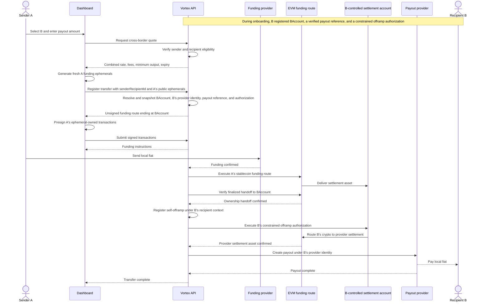
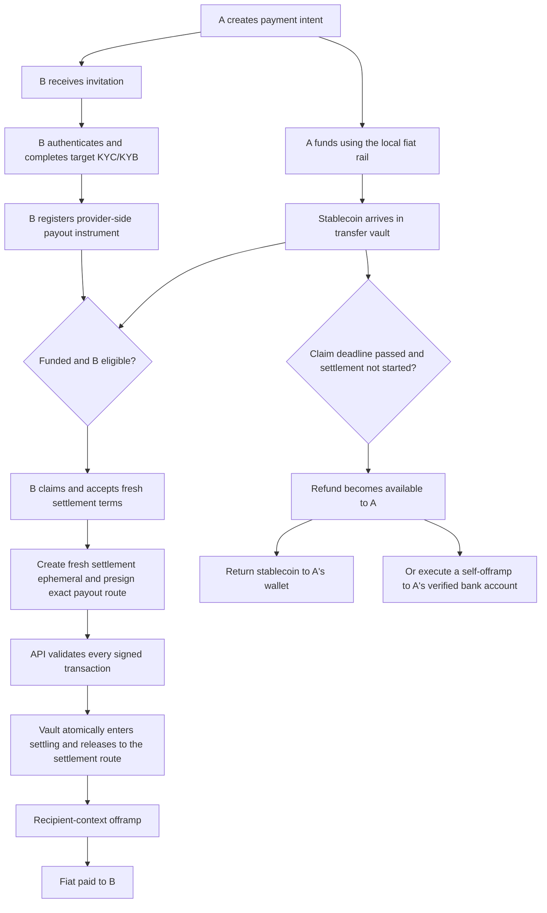
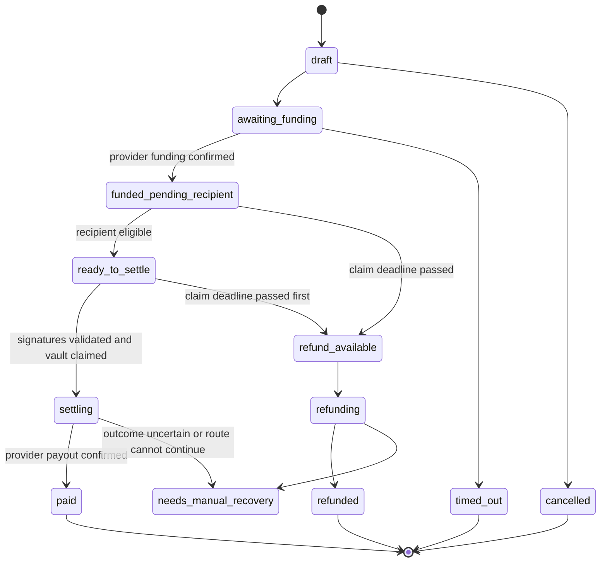

# Cross-Border Payments Flow

**Status:** Draft

**Last updated:** 2026-07-27

**Scope:** Fiat-funded and crypto-funded payments from an authenticated sender to a third-party recipient in another Vortex corridor.

## Summary

Cross-border payments should be modeled as a first-class `CrossBorderTransfer` or
`PaymentIntent`, not exposed as a client-side sequence of one BUY ramp followed by one SELL
ramp.

The recommended delivery strategy has two stages:

1. **Immediate settlement for an already-payable, pre-authorized recipient.** The funding leg
   executes under A's identity and ends with an on-chain handoff to a settlement account
   controlled by B. The payout leg is then a self-offramp under B's identity, authorized either
   by a constrained recipient smart-account/session permission established during onboarding or
   by B signing live. A's client signs only A's funding ephemerals; it never controls B's
   settlement assets.
2. **Delayed claim for a recipient who is not yet onboarded.** The funding leg settles into a
   policy-controlled transfer vault. After the recipient completes KYC/KYB and registers a
   payout instrument, Vortex creates a fresh settlement quote and a fresh settlement ephemeral.
   If the claim deadline passes before settlement starts, the sender may begin a refund.

The delayed flow must not use an ordinary client-held ephemeral account as a multi-day escrow.
Current ephemerals are designed for one short-lived, fully specified ramp. Keeping one funded for
days creates key-retention, quote-expiry, transaction-staleness, and recovery problems.

## Goals

- Let a KYB-approved company fund a transfer in its local corridor.
- Let an individual or company recipient onboard under its own identity in the payout corridor.
- Let the sender create a transfer before the recipient has completed onboarding.
- Keep recipient payout details provider-side; the sender sees only masked references.
- Make the on-chain ownership transition from A's funding route to B's settlement account
  explicit and auditable.
- Guarantee that only one of settlement or refund can consume the funded value.
- Preserve Vortex's existing client-side ephemeral-key security model wherever the complete route
  is known at registration time.
- Present one transfer, one quote, and one status history to the sender even when Vortex executes
  several internal settlement legs.
- Make provider and on-chain recovery explicit instead of treating every failed payout as safely
  refundable.

## Non-goals

- Making KYC/KYB or fiat settlement trustless. A smart contract cannot independently verify a
  provider's compliance decision or whether fiat reached a bank account.
- Guaranteeing a multi-day foreign-exchange rate without pricing or hedging the exposure.
- Storing raw PIX keys, IBANs, CLABEs, routing numbers, or account numbers in Vortex.
- Replacing the existing self-onramp and self-offramp API in the first release.
- Re-enabling EUR while recipient onboarding and payout settlement use incompatible provider
  identities.

## Current architecture and gaps

Vortex already has most of the recipient identity model:

- `recipient_invitations` creates a shareable onboarding link.
- `sender_recipients` binds a sender entity to a recipient entity for a payout rail.
- `provider_customers` and `kyc_cases` hold recipient onboarding status.
- `recipient_payout_references` is intended to hold a thin provider-side payout pointer.
- `getTransferEligibility` checks invitation acceptance, relationship state, provider approval,
  recipient type/country, and a verified payout reference.

The remaining gaps are structural:

1. **No production path creates a verified recipient payout reference.**
2. **Ramp registration has one effective user.** Provider identity is derived from that user:
   current Mykobo and Alfredpay offramps therefore resolve the sender's payout identity. BRL can
   mechanically pay a third-party PIX destination, but that is a transitional shortcut, not the
   intended ownership model. A proper cross-border payout must be registered under B after the
   assets reach an account controlled by B.
3. **Eligibility is not a registration boundary.** It is currently an advisory endpoint.
4. **A ramp is one fiat side and one crypto side.** `RampDirection` is `BUY | SELL`; a
   fiat-to-fiat payment has two fiat sides.
5. **Only one nonterminal ramp is allowed per user.** A cross-border transfer cannot safely depend
   on a client coordinating two unrelated concurrent ramps.
6. **Registration is short-lived.** Quotes expire, and a registered ramp must start within the
   existing start window. Ephemeral transactions are generated for a specific quote, route,
   signer, nonce, recipient, and amount.
7. **Ephemeral private keys are client-side.** This is a core security property and should not be
   weakened implicitly to accommodate delayed claims.
8. **EUR is disabled at registration.** Dashboard onboarding currently uses Monerium while the
   dormant settlement route resolves Mykobo identity.

See:

- [`../security-spec/03-ramp-engine/recipient-transfers.md`](../security-spec/03-ramp-engine/recipient-transfers.md)
- [`../security-spec/02-signing-keys/ephemeral-accounts.md`](../security-spec/02-signing-keys/ephemeral-accounts.md)
- [`../security-spec/03-ramp-engine/transaction-validation.md`](../security-spec/03-ramp-engine/transaction-validation.md)
- [`../dashboard-app-spec.md`](../dashboard-app-spec.md)

## Design principles

### Two principals are mandatory

Every third-party payment has two independently authenticated compliance principals:

- **Sender principal:** owns the transfer, supplies funds, and must be approved for the funding
  corridor.
- **Recipient principal:** receives the payout and must be approved for the payout corridor.

The sender supplies only a `senderRecipientId`. The API derives and snapshots the recipient
entity, provider customer, and verified payout reference. Client input must never select a
recipient provider customer, tax ID, PIX key, or fiat account directly when recipient context is
present.

### Recipient eligibility is enforced atomically

At transfer registration or settlement preparation, Vortex must:

1. lock or otherwise serialize the transfer;
2. verify the authenticated sender owns the relationship;
3. verify the relationship is active and accepted;
4. run corridor-specific eligibility;
5. resolve the recipient provider identity and verified payout reference;
6. snapshot those identifiers on the transfer;
7. bind all generated transactions and provider operations to that snapshot.

The payout route must not be able to change through an `additionalData` update after registration.

### On-chain ownership follows the principals

A's funding ephemeral may swap and bridge the onramp output, but its terminal transfer must send
the settlement asset to an account controlled by B. That account may be:

- B's connected wallet;
- a fresh ephemeral generated and presigned by B; or
- a B-owned smart account with a narrowly scoped Vortex settlement permission.

An address generated by A's dashboard or controlled by Vortex does not become B's account merely
because the database labels B as the recipient.

After finality of the handoff to B:

- B is the on-chain settlement principal;
- the payout leg is registered under B's Vortex/provider identity;
- Vortex preserves A as the source-of-funds principal on the aggregate transfer;
- A can no longer cancel or reclaim the handed-off amount; and
- every transaction that spends from B's account must carry B's live signature or a previously
  granted, policy-constrained authorization.

### The sender sees one transfer

The public object should be a `CrossBorderTransfer`, even if the implementation uses child ramp
state or reuses existing phase handlers. Internal BUY/SELL details should not require client
coordination.

### Provider confirmation is authoritative

- A sender's "payment submitted" action is not proof that fiat arrived.
- A recipient's "claim" action is not proof that payout succeeded.
- On-chain token arrival, provider order state, and provider payout state remain authoritative.

## Flow A: already-payable, pre-authorized recipient

This is the recommended first production flow.

### Preconditions

- Sender A is authenticated and KYB/KYC-approved for the funding corridor.
- Recipient B accepted the invitation.
- The sender-recipient relationship is active for the selected rail.
- Recipient B is KYC/KYB-approved for the payout provider, country, and customer type.
- Recipient B has a verified provider-side payout reference.
- Recipient B has registered a B-controlled settlement account.
- For unattended one-stop settlement, B has granted that account a valid, constrained
  authorization to execute Vortex offramps only to B's verified payout reference. Without this
  authorization, B must sign the payout leg live.

### Sequence



### Signing model

Flow A has two separate signing domains:

1. **A's funding domain.** Because A funds with fiat, no connected wallet is required. A's
   dashboard generates fresh funding ephemerals and presigns the BUY-route transactions, including
   the terminal transfer to B's registered settlement account.
2. **B's settlement domain.** B controls the account that receives the crypto. The subsequent
   SELL route must be authorized by B. For one-stop unattended settlement, B establishes a smart
   account or session permission during recipient onboarding. The permission must allow only
   Vortex-approved offramp adapters, B's verified payout reference, bounded amounts, deadlines,
   and replay-protected operations. The alternative is for B to sign the SELL transactions live
   for each payment.

Vortex must never receive or retain B's private key. A reusable authorization is not a generic
token allowance and must not permit Vortex or A to redirect B's assets to another wallet or bank
account.

The on-chain handoff transaction hash is the ownership boundary. It must be stored on the
`CrossBorderTransfer` before the payout leg starts. After that transaction finalizes, A's refund
or cancellation path is closed for the delivered amount.

The API must extend ephemeral freshness checks to every chain on which A's funding route signs.
The source and policy of B's settlement account need their own validation; they must not be
treated as a fresh A-controlled ephemeral. On EVM networks, A may use the same funding-ephemeral
address across chains, but each chain has an independent nonce sequence.

### Corridor selection

**BRL remains a reasonable first payout corridor**, funded from a live Alfredpay corridor:

```text
Sender fiat
  -> Alfredpay onramp under Sender A
  -> Polygon settlement token
  -> Squid route to Base USDC
  -> B-controlled settlement account on Base
  -> B-authorized self-offramp: Base USDC/BRLA swap
  -> Avenia payout under B's provider identity
  -> Recipient B's verified PIX destination
```

The reason to consider BRL first is that the active Base/BRLA/PIX payout route already exists, not
that Avenia accepts a third-party PIX destination. In the intended flow, the PIX payout is not
third-party: B owns both the crypto source account and the verified PIX destination. Vortex must
resolve B's Avenia provider customer, subaccount, tax identity, and PIX reference from B's
recipient context.

Before choosing the corridor, confirm that Avenia accepts deposits from B's registered settlement
account into B's provider subaccount and permits Vortex to initiate the payout under B's
authorization. The current A-authenticated plus third-party-PIX path may help during migration,
but it must not be the target authorization model.

Alfredpay recipient payouts similarly require confirmation that Vortex can create an order under
B's provider customer against B's provider-owned fiat account. EUR should remain out of scope
until the Monerium/Mykobo identity mismatch is resolved.

## Flow B: delayed recipient claim

This flow lets A fund before B finishes onboarding.

### High-level flow



### Why the vault is required

An ordinary ephemeral account is not a safe multi-day holding account:

- its private key exists only in the client or SDK environment;
- browser storage is exposed to same-origin XSS and may be lost;
- the settlement quote and payout provider order may not exist yet;
- exact destination, amount, calldata, nonces, and gas cannot be presigned reliably before B is
  eligible;
- the sender may not return to the same browser;
- a server-held copy would silently change Vortex's custody and key-management model.

The funding onramp should therefore finish with a dedicated `fundTransferVault` phase instead of
`destinationTransfer`.

### Claim sequence

1. B authenticates and presents the transfer/invitation token.
2. The API verifies that B is the accepted recipient.
3. The API refreshes compliance status and payout-reference status.
4. The API creates a fresh settlement quote. The original multi-day estimate is not reused.
5. B's browser generates a fresh settlement ephemeral. No connected wallet is required.
6. The API generates the exact settlement and payout transactions.
7. B's browser presigns the ephemeral-owned transactions.
8. The API validates the complete signed transaction set.
9. The database transfer and on-chain vault atomically move from `funded` to `settling`.
10. The vault releases only the authorized amount to the settlement route.
11. The phase processor completes the payout using B's provider identity.

The vault must not release funds before step 8. If B closes the browser after submitting the
signatures, the server can continue broadcasting the already-validated transactions without
holding B's ephemeral private key.

### Refund sequence

A refund is available only when:

- `claimBy` has passed;
- settlement has not started;
- no provider payout order with an uncertain outcome exists;
- the vault still controls the expected funds.

The sender may choose one of two refund modes at intent creation:

- **On-chain refund:** return the stablecoin to a sender-owned wallet.
- **Fiat refund:** execute a new self-offramp under A's own verified provider identity and payout
  instrument.

A smart-contract call cannot return funds directly to a bank account. Once the original fiat has
been converted into an on-chain asset, a bank refund is a new provider payout with a fresh quote,
fees, status, and recovery path.

## Transfer state machine

Suggested public states:



`settling` is a point of no automatic return. If funds have left the vault or a provider order may
still pay, the system must reconcile the route instead of refunding optimistically.

## Economic model for delayed claims

A quote cannot remain economically fixed for several KYC days unless Vortex accepts or hedges the
market exposure. The transfer must choose one of these policies:

### Fixed sender input

- A funds a fixed amount.
- The stablecoin principal is known after the onramp.
- B's payout is re-quoted at claim.
- A pre-authorizes `minimumPayoutAmount`, `maxSettlementFee`, and optionally
  `maxSlippageBps`.
- If the fresh quote is outside policy, A may approve new terms or refund.

This is the recommended MVP.

### Fixed recipient output

- A escrows the target payout plus a bounded buffer.
- The intent defines a maximum total cost.
- If settlement exceeds the authorized cost, A must top up or refund.

### Guaranteed recipient output

- Vortex guarantees the payout and hedges the exposure.
- The guarantee and hedge costs are included in the quote.

This is a treasury/risk-management product, not an MVP assumption.

All monetary values remain decimal strings or raw integer token amounts. They must never pass
through JavaScript `Number`.

## Smart-contract requirements

The delayed-claim vault should be a separate contract. The existing `TokenRelayer` is designed for
immediate permit-based execution against an immutable destination contract; it is not an escrow
or claim/refund state machine.

The vault should enforce:

1. one immutable transfer ID per deposit;
2. allowlisted tokens and supported chains;
3. exact deposited principal;
4. immutable claim deadline;
5. immutable refund beneficiary and refund mode commitment;
6. mutually exclusive `beginSettlement` and `beginRefund`;
7. settlement amount bounded by the recorded principal;
8. settlement only through allowlisted route adapters;
9. replay protection and per-transfer nonces;
10. no generic arbitrary-call executor;
11. global and per-transfer value limits;
12. pause and emergency-recovery controls;
13. owner/admin controls behind a multisig and preferably a timelock;
14. events for funding, settlement start, refund start, and terminal disposition.

The contract cannot verify:

- KYC/KYB approval;
- sanctions or transaction-monitoring results;
- provider-customer ownership;
- payout-instrument ownership;
- fiat payout finality.

Vortex therefore remains a trusted compliance attestor and fiat-settlement orchestrator. The
contract's job is narrower: protect principal, prevent double disposition, restrict execution,
and make custody transitions observable.

## Alternative designs

| Design                                             | Advantages                                                     | Main drawbacks                                                  | Recommendation                               |
| :------------------------------------------------- | :------------------------------------------------------------- | :-------------------------------------------------------------- | :------------------------------------------- |
| Invite first, fund after B is approved             | Lowest custody and signing complexity                          | A cannot finalize the payment immediately                       | Ship before delayed escrow                   |
| Immediate first-class route for pre-authorized B   | Best near-term one-stop experience; explicit ownership handoff | B must be payable and pre-authorize the self-offramp            | Recommended first transfer flow              |
| Smart-contract transfer vault                      | Enforceable claim/refund exclusivity                           | Contract audit, compliance attestation, and recovery complexity | Recommended delayed-flow target              |
| Client-held funded ephemeral                       | Small backend change; non-custodial                            | Browser key loss/XSS; A must return; stale route                | Do not use for production delayed claims     |
| HSM/MPC-controlled transfer wallet                 | Unattended execution and easy re-quoting                       | Vortex becomes a stronger custodian; key and regulatory burden  | Consider only as an explicit custody product |
| Provider-native pending beneficiary transfer       | Provider may offer native reversal and compliance custody      | Corridor-specific and provider-dependent                        | Investigate opportunistically                |
| Pre-funded company treasury                        | Excellent repeat-payment UX                                    | Requires custody, balance accounting, and treasury controls     | Later business product                       |
| Vortex-funded payout followed by sender collection | Fastest recipient experience                                   | Credit, fraud, liquidity, and collections risk                  | Not an MVP                                   |

## Proposed data model

The exact schema should follow the repository's migration and security-spec conventions, but the
aggregate needs at least:

```text
cross_border_transfers
  id
  sender_customer_entity_id
  sender_recipient_id
  recipient_customer_entity_id
  recipient_payout_reference_id

  funding_country
  funding_rail
  funding_currency
  funding_amount

  payout_country
  payout_rail
  payout_currency
  estimated_payout_amount
  minimum_payout_amount
  max_settlement_fee

  settlement_network
  settlement_token
  recipient_settlement_account_id
  recipient_settlement_authorization_id
  ownership_handoff_tx_hash
  funded_amount_raw
  vault_transfer_id

  quote_policy
  claim_by
  status
  failure_code

  funding_ramp_id
  settlement_ramp_id
  refund_ramp_id

  recipient_snapshot
  settlement_account_snapshot
  created_at
  updated_at
```

Provider and recipient snapshots must contain identifiers and status metadata only, not raw bank
PII. The settlement-account snapshot contains the public address, chain, account type, and
authorization-policy identifier only; it never contains a private key or unrestricted signing
credential.

The schema should also record append-only transition history and idempotency keys for provider
orders, vault actions, and refund actions.

## Proposed API surface

Names are illustrative:

```text
POST /v1/transfers/quotes
  Price a combined funding and payout route.

POST /v1/transfers
  Create a transfer or delayed payment intent.

GET /v1/transfers/:id
  Read the sender-visible aggregate status.

POST /v1/transfers/:id/register
  Register the immediate route or funding leg with fresh public ephemerals.

POST /v1/transfers/:id/update
  Submit validated presigned transactions or user-wallet hashes.

POST /v1/transfers/:id/start
  Begin provider-confirmed funding processing.

POST /v1/transfers/:id/claim
  Recipient-authenticated claim and fresh settlement preparation.

POST /v1/transfers/:id/settlement/update
  Submit the fresh settlement ephemeral's signed transactions.

POST /v1/transfers/:id/refund
  Sender-authenticated refund request after eligibility checks.
```

All mutating endpoints need idempotency keys. Ownership failures should remain uniform so foreign
transfer IDs do not become an existence oracle.

## Failure and recovery rules

| Failure point                                    | Funds location         | Safe action                                                               |
| :----------------------------------------------- | :--------------------- | :------------------------------------------------------------------------ |
| Before provider funding                          | Sender's bank          | Cancel or let instructions expire                                         |
| Provider debit uncertain                         | Provider               | Reconcile provider status; do not create a second funding request blindly |
| A's funding route before handoff                 | A's route ephemeral    | Recover or retry A's route; B does not own the funds yet                  |
| Handoff to B finalized, self-offramp not started | B's settlement account | Retry B's authorized self-offramp; A can no longer refund or redirect     |
| Funded in vault, recipient pending               | Vault                  | Wait until `claimBy`; then allow refund                                   |
| Settlement signatures invalid                    | Vault                  | Reject and regenerate; funds remain refundable                            |
| Vault release not submitted                      | Vault                  | Retry idempotently                                                        |
| Vault release submitted, chain outcome uncertain | Chain/vault            | Reconcile transaction before retry or refund                              |
| Settlement asset in ephemeral                    | Settlement ephemeral   | Recover/retry using validated presigned transactions                      |
| Provider deposit sent, payout order not created  | Provider/ephemeral     | Reconcile balances and provider idempotency state                         |
| Payout order created, status uncertain           | Provider               | `needs_manual_recovery`; never auto-refund                                |
| Payout confirmed                                 | Recipient's bank       | Terminal `paid`                                                           |
| Refund asset released, fiat refund uncertain     | Refund provider        | Reconcile; never start a second refund blindly                            |

Every side effect must have an idempotency or re-execution guard. The transfer aggregate must not
depend solely on the current ramp processor's non-atomic multi-instance lock.

## Delivery plan

### Phase 0: make recipients payable

- Implement widget receive mode for provider-side payout-instrument creation.
- Create verified `recipient_payout_references` without storing raw payout PII.
- Let B register a B-controlled settlement account.
- Define the constrained smart-account/session authorization required for unattended self-offramps,
  with live B signing as the fallback.
- Add sender-side invitation revocation.
- Reconcile recipient list status with the authoritative eligibility endpoint.

### Phase 1: recipient-context self-offramp

- Extend registration with `senderRecipientId`.
- Resolve B's provider identity, payout reference, settlement account, and authorization
  server-side.
- Enforce eligibility atomically.
- Require the crypto source to be B's registered settlement account.
- Register and execute the SELL route under B's identity, with B's live or delegated
  authorization.
- Remove free-form recipient payout fields in recipient context.
- Verify provider-specific self-payout semantics for Avenia and Alfredpay.

This phase proves the most important authorization boundary before fiat-funded composition.

### Phase 2: immediate fiat-to-fiat

- Add the `CrossBorderTransfer` aggregate and combined quote.
- Build an end-to-end route for already-payable recipients.
- Reuse client-generated ephemerals and existing transaction validation for A's funding leg.
- End A's route at B's registered settlement account and record the finalized ownership handoff.
- Execute the payout leg from B's account using the Phase 1 self-offramp authorization.
- Expose one transfer status and webhook stream.
- Launch an Alfredpay funding corridor to a BRL recipient corridor first.

### Phase 3: invite first, fund later

- Let A create an unfunded payment intent while B onboards.
- Notify A when B becomes payable.
- Execute the Phase 2 route using a fresh quote.

This provides most of the intended product value without multi-day custody.

### Phase 4: funded delayed claim

- Implement and audit the transfer vault.
- Add `claimBy`, fresh settlement quoting, claim-time ephemeral signing, and on-chain refund.
- Add fiat refund through A's verified self-offramp path.
- Add operational reconciliation and manual-recovery tooling.

### Phase 5: additional corridors

- Add Alfredpay recipient payouts once recipient-owned order creation is confirmed.
- Reconcile Monerium onboarding with EUR settlement identity before enabling EUR.
- Add provider-native pending-transfer paths where they materially reduce custody.

## Open product and compliance decisions

1. Is the delayed transfer fixed-input, fixed-output, or guaranteed-output?
2. When does beneficial ownership of the stablecoin move from A to B: invite acceptance, claim,
   vault release, provider deposit, or fiat payout?
3. May A cancel before `claimBy`, or is the recipient protected by an irrevocable claim window?
4. What happens if A blocks B after funding but before claim?
5. Which compliance checks must be refreshed at claim and immediately before payout?
6. Must a recipient approval be sender-specific, or is corridor approval reusable across all
   sender relationships?
7. What is the refund destination for a sender without a wallet?
8. Who pays return-routing, provider, and FX costs on refund?
9. Which provider-side operations are idempotent, and which require Vortex-generated idempotency
   keys?
10. Is Vortex willing to operate a custody vault, or must the vault be structured and operated by
    a licensed provider?
11. What manual-review SLA applies once funds have left the vault but fiat payout is uncertain?
12. What value limits, velocity limits, and treasury reserves apply to each corridor?
13. Does B use live per-transfer signatures, a reusable smart-account session permission, or both?
    What exact calls, amounts, payout references, deadlines, and revocation rules does that
    permission allow?

## Security-spec impact

Before implementation, update or add normative security specifications for:

- cross-border transfer authorization and second-principal binding;
- recipient settlement-account ownership and constrained delegated signing;
- the finalized on-chain ownership handoff from A's funding route to B;
- transfer-vault custody, settlement, refund, and admin controls;
- combined quote lifecycle and claim-time re-quoting;
- payout-reference creation and provider ownership validation;
- transfer-level state-machine locking and idempotency;
- delayed-transfer cleanup and manual recovery;
- webhook ownership and event semantics for transfer aggregates;
- compliance-status refresh requirements at claim and payout.

The existing recipient-transfer section marked "PRESSING, TO BE DEFINED" should become
authoritative only after these invariants, state transitions, and corridor-specific payout
bindings are implemented and tested.
