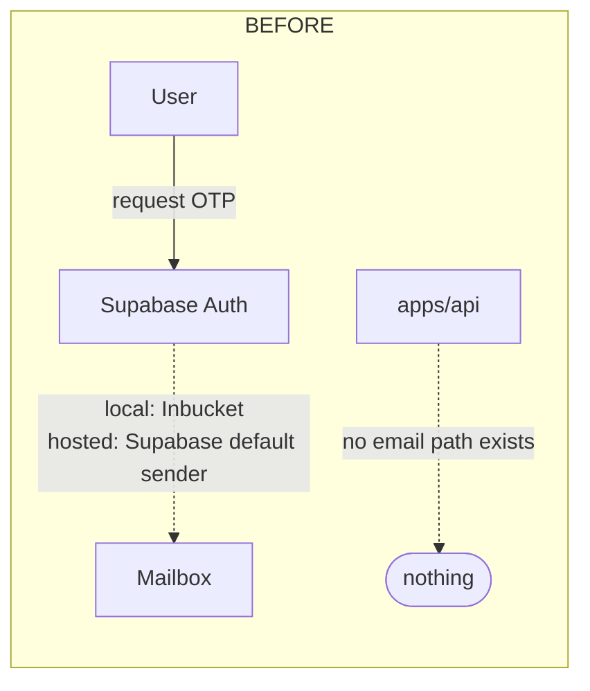
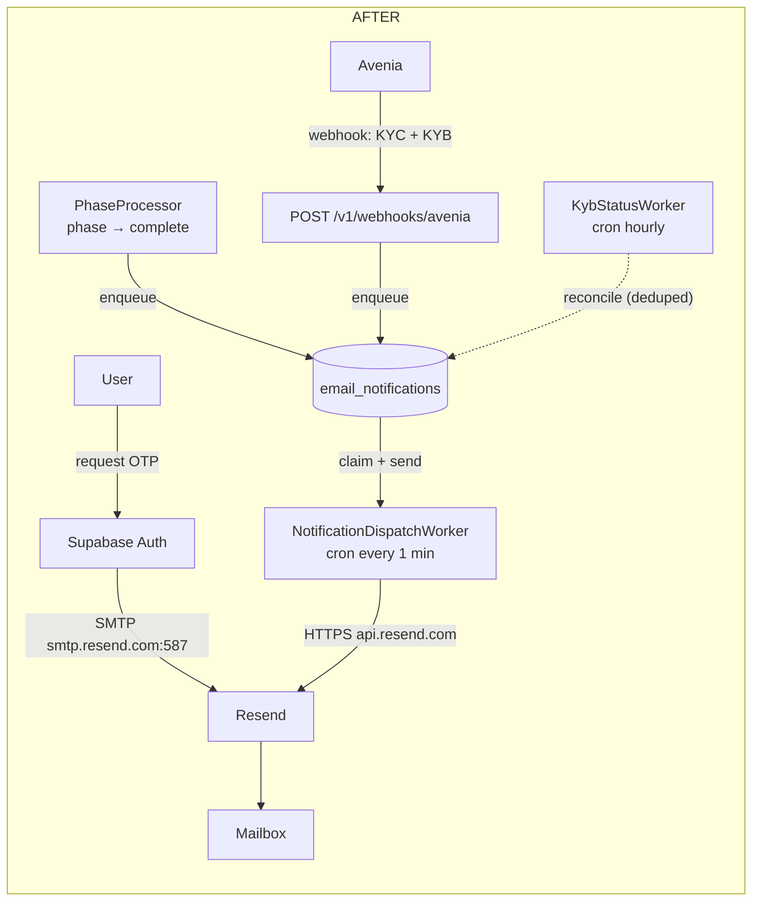
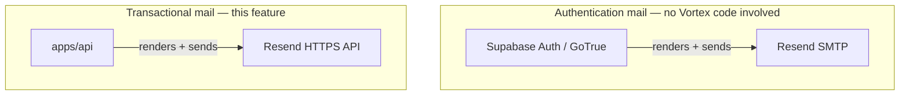
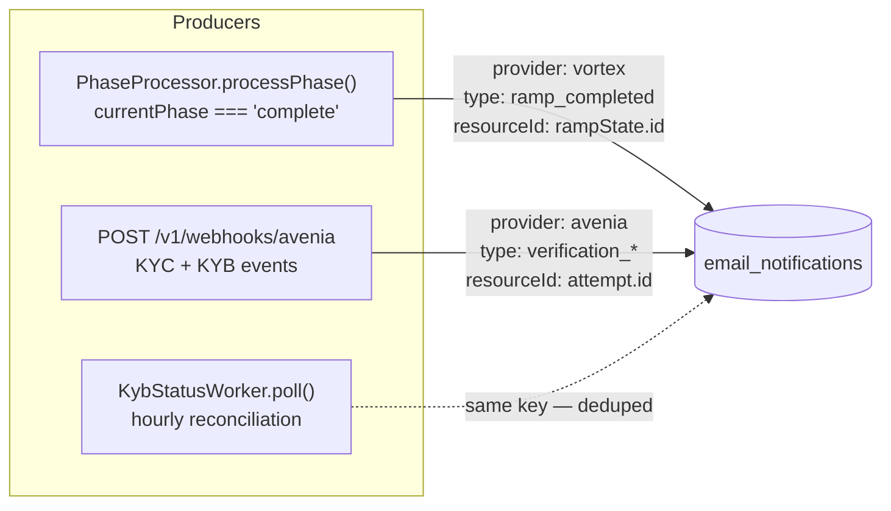
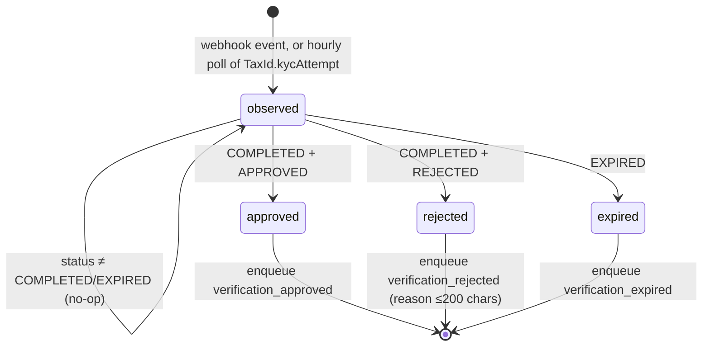
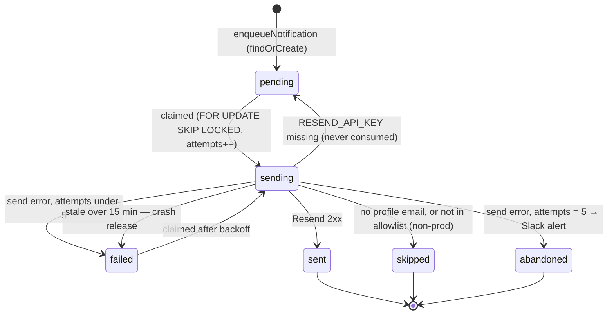
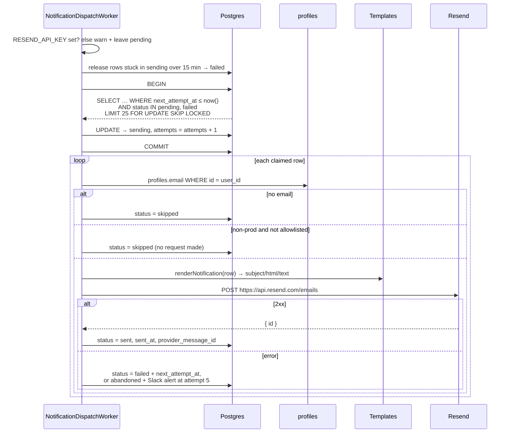
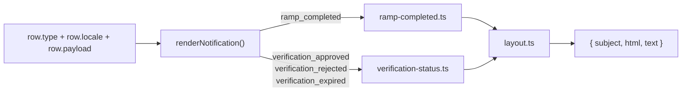

# Email Notifications — Architecture

How outbound email works in Vortex after the `feat/email-notifications` branch, and how
it differs from what was there before.

Security-facing detail (invariants, threat model, audit checklist) lives in
[`docs/security-spec/05-integrations/resend.md`](../security-spec/05-integrations/resend.md).
This page is the shape of the system.

---

## 1. Before vs. after, in one picture

**Before** — there was no transactional email at all. Auth mail was the only mail, and it
came out of Supabase's built-in Inbucket capture in local dev with no production SMTP
configured. Nothing in `apps/api` ever sent an email.



- Ramp completion: user found out by watching the widget. Close the tab, no signal.
- KYC/KYB outcome (Avenia, hours-to-days): user had to come back and re-check. No webhook
  consumer, no polling, no notification — `TaxId.kycAttempt` was declared on the model but
  never written, and nothing in the codebase listened to Avenia at all.
- Main's in-app notification centre (migration 043, `notifications` table) existed with a
  comment marking where email dispatch *would* hook in. Nothing was wired.

**After** — two independent classes of mail, both through Resend, sharing only the
sending domain.



| | Before | After |
|---|---|---|
| Auth mail transport | Supabase default / Inbucket | Resend SMTP relay, `vortexfinance.co` |
| Transactional mail | none | Resend HTTPS API from `apps/api` |
| Durability | n/a | every email is a DB row before any send |
| Retries | n/a | 5 attempts, backoff 1/5/15/60/180 min |
| Dedupe | n/a | unique `(provider, type, resource_id)` |
| KYC/KYB outcome visibility | user re-checks manually | Avenia webhook, emailed on settle; hourly poll as fallback |
| Inbound Avenia events | not consumed | RSA-PSS verified receiver, raw-body mounted |
| Non-prod safety | n/a | recipient allowlist gate |

---

## 2. The two mail classes

They are genuinely separate systems that happen to share one vendor and one domain.



- **Auth mail** is configured *outside the repo*. `supabase/config.toml` only governs the
  local stack; staging and production must be set in the Supabase Dashboard
  (Project Settings → Authentication → SMTP). Nothing in CI pushes that file.
- **Transactional mail** is the rest of this document.

Shared-domain consequence: a reputation incident in either class affects both. Accepted
deliberately, in exchange for a recognisable sender.

---

## 3. Producers — what enqueues, and when

Three producers, all fire-and-forget into the same table. None of them ever sends.



P2 and P3 deliberately overlap. They enqueue through the same
`enqueueVerificationNotification()` on the same `(provider, type, attempt.id)` key, so the
poll racing or repeating a webhook is a no-op rather than a second email.

**Ramp completion** — `enqueueRampCompletedEmail()` in
`apps/api/src/api/services/email/ramp-completion.ts`, called from the terminal `complete`
branch of `apps/api/src/api/services/phases/phase-processor.ts`.

The hook belongs on the phase processor because that is the *only* place a ramp actually
reaches `complete` — it is the "single source of authority for phase transitions" and writes
`currentPhase` straight onto the model. `RampService.logPhaseTransition()` (and the
`notifyStatusChangeIfNeeded()` it wraps) has no call sites, so anything hung off it never
runs. The producer lives in the email module rather than on `RampService` because
`ramp.service.ts` imports `phase-processor`, so the reverse import would be a cycle.

Only ramps with a non-null `rampState.userId` produce mail — that field is populated solely
from `req.userId`, which only the Supabase auth middleware sets, so partner-API ramps are
excluded by construction. A partner-driven ramp has no Vortex-side recipient: the address on
`additionalData.email` belongs to the *partner's* customer, not to us.

The payload carries both legs of the trade, already resolved to the user's perspective. On a
buy the user pays fiat and receives the token; on a sell it is reversed, so which side of the
quote each leg reads from swaps with `rampState.type`:

| Payload field | `BUY` (onramp) | `SELL` (offramp) |
| --- | --- | --- |
| `fiatAmount` / `fiatCurrency` | `quote.inputAmount` / `inputCurrency` | `quote.outputAmount` / `outputCurrency` |
| `tokenAmount` / `tokenSymbol` | `quote.outputAmount` / `outputCurrency` | `quote.inputAmount` / `inputCurrency` |

Plus `network`, `rampId`, `rampType` and `completedAt`. Enqueue is fire-and-forget: a failure
is logged but never fails a ramp that already succeeded.

**Verification (KYC + KYB), primary path** —
`apps/api/src/api/controllers/avenia-webhook.controller.ts`

Avenia pushes attempt updates to `POST /v1/webhooks/avenia`. Both verification kinds are
handled here.

Three things make this endpoint unusual and are worth understanding before touching it:

1. **It is authenticated by signature, not by API key or session.** Avenia signs the raw
   body with RSA-PSS / SHA-256; we verify against their published key from
   `GET /v2/public-key`. The key is cached for an hour and refetched once on a miss,
   because Avenia's guide states it rotates and must never be pinned.
2. **It is mounted ahead of the global JSON body parser** in `config/express.ts`, using
   `bodyParser.raw`. The signature covers the exact bytes sent; parsing and re-serialising
   the JSON does not reproduce them byte for byte, so a normally-mounted route could never
   verify.
3. **Which kind of verification an event describes is read from our own database**, not
   from the payload — `TaxId.accountType` for the event's `subAccountId`. So this keeps
   working regardless of how Avenia labels company events.

Everything after signature verification answers `200`: a ticket event, an unknown
subaccount, a partner-owned subaccount, or a still-in-progress attempt are all deliberate
no-ops, and Avenia must not retry them. Only an unverified or malformed body is rejected.

**Verification, reconciliation path** — `apps/api/src/api/workers/kyb-status.worker.ts`

Runs hourly. It exists because **Avenia documents no KYB subscription**: their subscription
list is `TICKET`, `KYC`, `LIMIT-UPDATE`, `*`. Company attempts are *expected* to arrive
under the wildcard because Avenia fetches both kinds from the same `/v2/kyc/attempts`
resource — but that is an inference, not a documented guarantee, and if it is wrong the
failure is silent (no KYB emails, no error). The poll is what makes being wrong survivable.

It selects `TaxId` rows that are `COMPANY` + `Requested` + have a `kycAttempt` + have a
`userId` + were requested within 60 days, then calls `getKybAttemptStatus(kycAttempt)` for
each one. It polls **one known attempt id**, not a list: `GET /v2/kyc/attempts` has no
documented ordering, so picking from it would guess at which attempt a notification
describes — and that attempt id *is* the dedupe key.



Both paths share `enqueueVerificationNotification()` in
`apps/api/src/api/services/avenia/verification-notifications.ts`, which owns the
terminal-state mapping above. That shared key is also the **replay defence**: Avenia's
signature carries no timestamp or nonce, so a captured event can be re-posted freely — it
just collapses to an existing row.

> **Deployment note:** the webhook must be registered once per environment with
> `bun register:avenia-webhook` (reads `AVENIA_WEBHOOK_URL`, subscribes with `*`). Until
> it is, no verification email is sent by the primary path.

> **Deployment note:** the poller's `kycAttempt IS NOT NULL` filter means KYB attempts
> started before this deploys are never observed by reconciliation. In dev all 15 `COMPANY`
> tax_ids have `kyc_attempt = NULL`. Either accept that those never notify, or backfill.

---

## 4. The queue — `email_notifications`

The table *is* the design. It is simultaneously the queue, the retry ledger, the audit
trail, and the idempotency key.

Migration `055-create-email-notifications-table.ts`, model
`apps/api/src/models/emailNotification.model.ts`.

| Column | Purpose |
|---|---|
| `provider` / `type` / `resource_id` | unique together — the idempotency key. All three `NOT NULL` because Postgres treats NULLs as distinct and would let duplicates through |
| `user_id` | FK → `profiles`, CASCADE. The *only* source of a recipient |
| `locale` | resolved at enqueue from Supabase `user_metadata.locale` |
| `payload` | JSONB snapshot of the facts at enqueue time |
| `status` | see the lifecycle below |
| `attempts` | incremented **at claim time**, not after success |
| `next_attempt_at` | backoff schedule; also the dispatch ordering key |
| `sent_at`, `provider_message_id` | proof of delivery |
| `last_error` | truncated to 2000 chars, never contains the API key |

Indexes: unique `uniq_email_notifications_provider_type_resource`, plus
`idx_email_notifications_dispatch` and `idx_email_notifications_user_id`.

> **Name collision:** this is `email_notifications`, *not* `notifications`. Migration 043 on
> `main` already owns `notifications` for the in-app notification centre. See §7.

### Status lifecycle



---

## 5. The dispatcher — one send path

`NotificationDispatchWorker`, cron `* * * * *`. It is the **only** code that calls Resend.



Three properties worth naming, because each one is load-bearing:

1. **`FOR UPDATE SKIP LOCKED`.** Both flow-variant backends run against one database. Without
   the claim, both dispatch the same row and the user gets the email twice. This is the single
   most important line in the feature.
2. **Recipient resolved at send time**, never snapshotted and never caller-supplied. It comes
   from `profiles.email` via `user_id`. No request payload can influence where mail goes.
3. **`attempts` increments at claim, not after success.** A process that dies mid-send still
   burns an attempt, so a crash loop terminates at the cap instead of spinning forever.

---

## 6. Rendering



- Dispatch is on **type only**, not provider — so a future Alfredpay row renders through
  the same three verification templates with no changes.
- Locales: `en-US`, `pt-BR`. `toEmailLocale` falls back to `en-US` for anything else, which
  today silently catches MXN/COP users — see the Alfredpay follow-up.
- Templates import nothing from the database layer, which is what makes
  `bun preview:emails` able to render them standalone.
- Every interpolated value is HTML-escaped; Avenia's `resultMessage` is additionally capped
  at 200 chars and only included on rejection.

---

## 7. Relationship to the in-app notification centre

`main` has a separate, older feature also called notifications:

| | In-app notifications (`main`) | Email notifications (this branch) |
|---|---|---|
| Table | `notifications` (migration 043) | `email_notifications` (migration 055) |
| Model | `models/notification.model.ts` | `models/emailNotification.model.ts` |
| Service | `api/services/notifications/` | `api/services/email/` |
| Preferences | `notification_preferences.email_enabled` | **not consulted** |
| Surface | API routes, read by the client | no route; write-only, worker-read |

`main`'s service carries a comment marking where email dispatch was meant to hook in, gated
on the profile's `email_enabled` preference.

> **Known gap, accepted deliberately for now:** this feature does not read
> `notification_preferences.email_enabled`. A user who has opted out of email still receives
> ramp-completion and KYB mail. The tables were renamed apart so the two can coexist; wiring
> the opt-out (or merging into `main`'s hook point) is deferred work, not a resolved question.

---

## 8. Configuration

| Variable | Effect |
|---|---|
| `RESEND_API_KEY` | Missing → the worker warns and leaves rows `pending`. Never marks them sent/failed/abandoned, so the backlog flushes when the key arrives |
| `EMAIL_FROM_ADDRESS` | Defaults to `Vortex Finance <support@vortexfinance.co>` |
| `EMAIL_REPLY_TO_ADDRESS` | Optional |
| `EMAIL_RECIPIENT_ALLOWLIST` | Comma-separated. Enforced whenever `DEPLOYMENT_ENV !== "production"`. **Empty = nothing is ever sent outside production** |
| `AVENIA_WEBHOOK_URL` | Public https URL of this backend's `/v1/webhooks/avenia`. Read only by `bun register:avenia-webhook`; the receiver itself needs no config |

Domain requirements on `vortexfinance.co`: Resend DKIM CNAMEs, exactly **one** SPF record
(Resend merged into any existing sender — two records fail SPF outright), and a published
DMARC policy.

Auth-mail SMTP is *not* configured by this repo outside local dev. Set it in the Supabase
Dashboard per hosted project.

---

## 9. File map

```
apps/api/src/
├── api/
│   ├── services/avenia/
│   │   ├── verification-notifications.ts  terminal-state mapping, shared enqueue
│   │   ├── webhook-signature.ts           RSA-PSS verify + cached Avenia public key
│   │   └── webhook-signature.test.ts
│   ├── services/email/
│   │   ├── index.ts                    barrel
│   │   ├── notification.service.ts     enqueue, claim, deliver, retry, stale-release
│   │   ├── ramp-completion.ts          ramp-completion producer (payload from quote)
│   │   ├── resend.transport.ts         the only HTTP call to Resend
│   │   ├── types.ts                    locales + payload shapes
│   │   └── templates/
│   │       ├── index.ts                type → template dispatch
│   │       ├── layout.ts               shared HTML shell
│   │       ├── ramp-completed.ts
│   │       └── verification-status.ts  approved / rejected / expired
│   ├── workers/
│   │   ├── notification-dispatch.worker.ts   cron 1m — the only sender
│   │   └── kyb-status.worker.ts              cron 1h — reconciliation behind the webhook
│   ├── routes/v1/avenia-webhook.route.ts     POST /v1/webhooks/avenia
│   ├── controllers/avenia-webhook.controller.ts  primary KYC + KYB producer
│   ├── services/phases/phase-processor.ts    fires the ramp-completion producer
│   └── controllers/brla.controller.ts        persists attemptId → TaxId.kycAttempt
├── models/emailNotification.model.ts
├── database/migrations/055-create-email-notifications-table.ts
├── config/express.ts                         raw-body mount, ahead of the JSON parser
├── config/vars.ts                            config.integrations.{resend,avenia}
├── scripts/preview-emails.ts                 bun preview:emails
└── scripts/register-avenia-webhook.ts        bun register:avenia-webhook
```

## 10. Open follow-ups

- **Confirm whether Avenia delivers KYB events at all.** Their docs list no KYB
  subscription; we subscribe with `*` and infer company attempts will arrive because both
  kinds share `/v2/kyc/attempts`. Run one company attempt to a terminal state in sandbox and
  check for the `Avenia COMPANY verification webhook` log line. If it appears, delete
  `KybStatusWorker` — the reconciliation poll exists only to cover this unknown. If it does
  not, the poll is load-bearing and must stay.
- Alfredpay (MXN/COP) verification mail — nothing writes `provider = 'alfredpay'` yet, and
  there is no `es-*` locale. See [`docs/features/alfredpay-kyc-notification-gap.md`](../features/alfredpay-kyc-notification-gap.md).
- Gate sending on `notification_preferences.email_enabled` (§7).
- Decide whether to backfill `TaxId.kycAttempt` for in-flight KYB attempts (§3). The
  attemptId is only persisted from `initiateKybLevel1` onward, so COMPANY `tax_ids` rows
  created before that change have a null `kyc_attempt`, are filtered out by the worker, and
  will never be emailed.
- No `Hi <Name>,` greeting. [#1144](https://github.com/pendulum-chain/vortex/issues/1144)
  asks for one, but the `User` model holds only `id` and `email` — there is no name to
  interpolate. Sourcing it (Supabase `user_metadata`, or the KYC/KYB submission data) is a
  separate change.
- Avenia's `resultMessage` is surfaced verbatim as the `Reason` row, so a pt-BR reader can
  receive untranslated vendor copy (§6).
