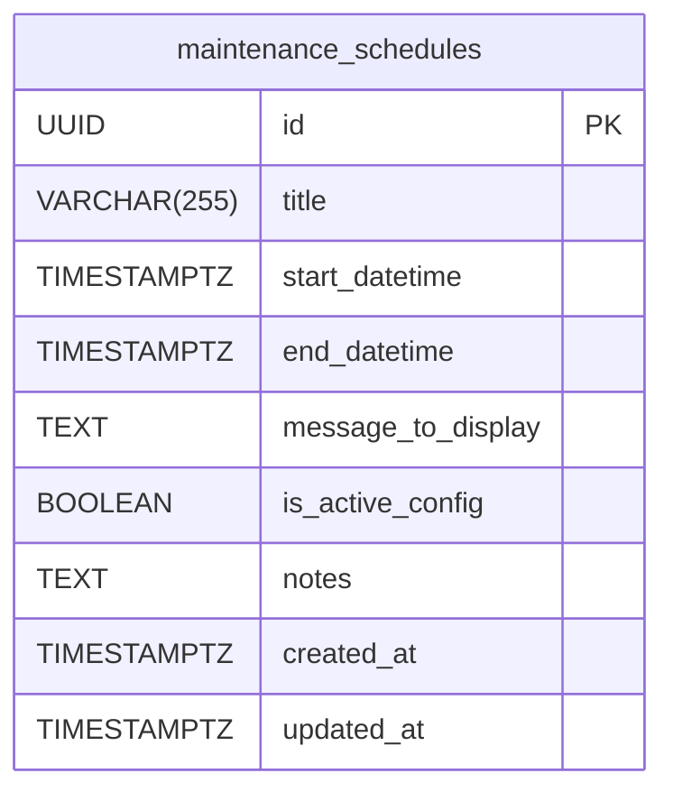

# Plan: 'Under Maintenance' Feature Design

This document outlines the database schema and API endpoint design for the 'under maintenance' feature in the Pendulum Pay project.

## 1. Database Schema

A new table named `maintenance_schedules` will be created to store maintenance window configurations.

**Table: `maintenance_schedules`**

| Column Name         | Data Type           | Constraints & Description                                   |
| :------------------ | :------------------ | :---------------------------------------------------------- |
| `id`                | `UUID`              | Primary Key, auto-generated (e.g., using `uuid-ossp`)       |
| `title`             | `VARCHAR(255)`      | A short title for the maintenance window (e.g., "Database Upgrade Q2") |
| `start_datetime`    | `TIMESTAMPTZ`       | Not Null. The date and time when maintenance begins (UTC).  |
| `end_datetime`      | `TIMESTAMPTZ`       | Not Null. The date and time when maintenance is scheduled to end (UTC). |
| `message_to_display`| `TEXT`              | Not Null. The message that will be shown to users.          |
| `is_active_config`  | `BOOLEAN`           | Not Null, Default: `false`. If `true`, this schedule is considered for activation. Allows pre-configuring schedules. |
| `notes`             | `TEXT`              | Optional. Internal notes for administrators.                |
| `created_at`        | `TIMESTAMPTZ`       | Not Null, Default: `CURRENT_TIMESTAMP`.                     |
| `updated_at`        | `TIMESTAMPTZ`       | Not Null, Default: `CURRENT_TIMESTAMP`.                     |

**Indexes:**
*   An index on `(is_active_config, start_datetime, end_datetime)` would be beneficial for quickly querying active maintenance windows.
*   An index on `is_active_config` alone might also be useful.

**SQL-like Definition (PostgreSQL):**
```sql
CREATE EXTENSION IF NOT EXISTS "uuid-ossp";

CREATE TABLE maintenance_schedules (
    id UUID PRIMARY KEY DEFAULT uuid_generate_v4(),
    title VARCHAR(255) NOT NULL,
    start_datetime TIMESTAMPTZ NOT NULL,
    end_datetime TIMESTAMPTZ NOT NULL,
    message_to_display TEXT NOT NULL,
    is_active_config BOOLEAN NOT NULL DEFAULT false,
    notes TEXT,
    created_at TIMESTAMPTZ NOT NULL DEFAULT CURRENT_TIMESTAMP,
    updated_at TIMESTAMPTZ NOT NULL DEFAULT CURRENT_TIMESTAMP
);

CREATE INDEX idx_maintenance_schedules_active_period 
ON maintenance_schedules (is_active_config, start_datetime, end_datetime);

-- Optional: Trigger to update updated_at timestamp
CREATE OR REPLACE FUNCTION update_updated_at_column()
RETURNS TRIGGER AS $$
BEGIN
    NEW.updated_at = NOW();
    RETURN NEW;
END;
$$ language 'plpgsql';

CREATE TRIGGER update_maintenance_schedules_updated_at
BEFORE UPDATE ON maintenance_schedules
FOR EACH ROW
EXECUTE FUNCTION update_updated_at_column();
```

**Mermaid Diagram:**


## 2. API Endpoint(s)

One primary endpoint will be defined for the frontend to query the current maintenance status.

**Endpoint: Get Maintenance Status**

*   **HTTP Method:** `GET`
*   **URL:** `/api/v1/maintenance/status`
*   **Request Parameters:** None
*   **Authentication:** This endpoint should likely be public or require minimal authentication, as it needs to be accessible even when the main application parts are "down."

*   **Success Response (HTTP 200 OK):**

    *   **If maintenance is active:**
        ```json
        {
          "is_maintenance_active": true,
          "maintenance_details": {
            "title": "Scheduled System Update",
            "start_datetime": "2025-07-15T10:00:00Z",
            "end_datetime": "2025-07-15T12:00:00Z",
            "message": "Pendulum Pay is currently undergoing scheduled maintenance. We expect to be back online by 12:00 PM UTC. Thank you for your patience.",
            "estimated_time_remaining_seconds": 3600 
          }
        }
        ```

    *   **If maintenance is NOT active:**
        ```json
        {
          "is_maintenance_active": false,
          "maintenance_details": null
        }
        ```

*   **Error Responses:**
    *   `500 Internal Server Error`: If there's an issue querying the database.

**Backend Logic for `/api/v1/maintenance/status`:**
1.  Query the `maintenance_schedules` table.
2.  Filter for records where `is_active_config` is `true`.
3.  From the filtered records, find any schedule where the current server time (UTC) is `>= start_datetime` AND `< end_datetime`.
4.  If multiple such schedules exist, the system could prioritize one (e.g., the one with the earliest `end_datetime` or latest `created_at`). For simplicity, returning the first one found is acceptable.
5.  If an active maintenance schedule is found:
    *   Set `is_maintenance_active` to `true`.
    *   Populate `maintenance_details` with data from the found schedule.
    *   Optionally, calculate `estimated_time_remaining_seconds` based on `end_datetime` and current time.
6.  If no active maintenance schedule is found:
    *   Set `is_maintenance_active` to `false`.
    *   Set `maintenance_details` to `null`.
7.  Return the JSON response.
