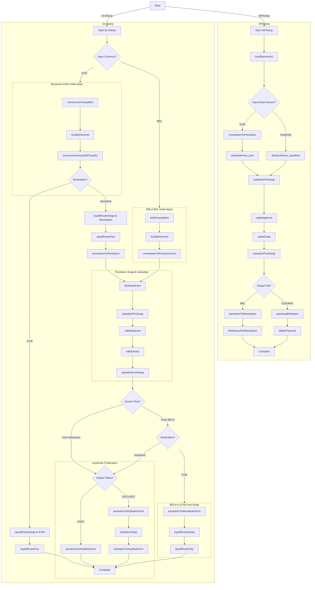

# Ramp Journey and Fee Application

This document outlines the step-by-step process (journey) for both on-ramp (fiat-to-crypto) and off-ramp (crypto-to-fiat) transactions within the system, detailing when and how fees are applied.

## Fee Calculation and Application (Target State Post-Refactor)

Fees are a crucial part of the ramp process. The following describes the intended fee structure after the ongoing refactoring is complete:

1.  **Calculation Point:** All fees are calculated and factored in during the **quote generation phase** (`api/src/api/services/ramp/quote.service.ts`). The final output amount shown to the user in the quote reflects the total fee impact.
2.  **Fee Source:** Fee parameters and logic are sourced entirely from the **database**, specifically the `FeeConfiguration` and `Partner` tables. Token configuration files in the `shared` module will no longer be used for fee definitions.
3.  **Fee Components:** The total fee is composed of several parts, calculated initially in USD:
    *   **`network` Fee:** Aims to cover the estimated on-chain transaction costs (e.g., gas, XCM, Stellar fees) required for the entire ramp process. The exact calculation logic is determined within `calculateGrossOutputAndNetworkFee`.
    *   **`vortex` Fee:** The platform fee, defined by the `vortex_foundation` record in the `Partner` table (can be absolute or relative).
    *   **`anchor` Fee:** The fee charged by the specific fiat anchor service involved (e.g., BRLA, Stellar EURC anchor). This is sourced from the `FeeConfiguration` table based on `feeType: 'anchor_base'` and an identifier matching the anchor (e.g., `moonbeam_brla`). Can be absolute, relative, or a combination.
    *   **`partnerMarkup` Fee:** An optional additional fee applied by an external partner integrating with the ramp service, defined in their specific `Partner` table record (can be absolute or relative).
4.  **Application Logic & Charging:**
    *   The individual fee components (`network`, `vortex`, `anchor`, `partnerMarkup`) are calculated during the quote phase.
    *   The **`anchor` fee** is charged by the respective anchor service (BRLA or Stellar) in the native fiat currency (e.g., BRL, EURC) during the phase where interaction with the anchor occurs. The system must account for this deduction when initiating transfers to/from the anchor.
        *   On-Ramp BRL: Charged by BRLA during `brlaOnrampMint`.
        *   Off-Ramp BRL: Charged by BRLA during `brlaPayoutOnMoonbeam`.
        *   Off-Ramp Stellar (EURC, ARS, etc.): Charged by the Stellar anchor during `stellarPayment`.
    *   The **`vortex`**, **`network`**, and **`partnerMarkup` fees** are handled separately. They are effectively set aside from the main flow and distributed to their respective destination accounts during a dedicated `distributeFees` phase.
        *   On-Ramp: `distributeFees` occurs *after* the swap but *before* post-swap subsidization.
        *   Off-Ramp: `distributeFees` occurs *before* the pre-swap subsidization.
    *   The **final net amount** delivered to the user (crypto for on-ramp, fiat for off-ramp) is the `grossOutputAmount` (post-swap amount) minus the total impact of all fee components.
5.  **Fee Display:** The fee breakdown (`FeeStructure`) shown to the user in the quote response is presented in the relevant **fiat currency** for the transaction (e.g., BRL, EUR, ARS), converted from the initial USD calculations.

## Ramp Journeys

The ramp process is managed by a state machine, transitioning through various phases handled by dedicated services.

**Common Initial Steps:**

1.  **Quote Request:** User requests a quote (`quote.service.ts`). Fees are calculated and applied as described above.
2.  **Register Ramp:** User accepts the quote. The system validates the quote, prepares necessary unsigned transactions based on the fee-adjusted amounts, and creates a `RampState` record (`ramp.service.ts`). The initial phase is set to `initial`.
3.  **Start Ramp:** User signs transactions client-side and submits them. The system validates signatures, updates the `RampState`, and triggers the `phaseProcessor` (`ramp.service.ts`).
4.  **Phase: `initial` (`initial-phase-handler.ts`):** Checks for signed transactions (off-ramp). If Stellar is involved, submits the pre-signed `stellarCreateAccount` transaction. The next phase depends on the journey: it transitions to `brlaOnrampMint` for the BRL on-ramp, and `fundEphemeral` for others.
5.  **Phase: `fundEphemeral` (`fund-ephemeral-handler.ts`):** Checks and funds the required Pendulum and/or Moonbeam ephemeral accounts with small amounts of native tokens (PEN, GLMR) to cover transaction fees for subsequent steps. Transitions based on ramp type and source/destination.

---

### On-Ramp Journey: Monerium (EUR)

This journey handles on-ramping from EUR using Monerium. It follows one of two main paths depending on the final destination of the assets (an EVM-compatible chain or AssetHub).

*   **Starts After:** `initial`
*   **Next Phase:** `moneriumOnrampMint`

6.  **Phase: `moneriumOnrampMint` (`monerium-onramp-mint-handler.ts`):** Mints Monerium EUR tokens and transitions to `fundEphemeral`.
7.  **Phase: `fundEphemeral` (`fund-ephemeral-handler.ts`):** Funds the ephemeral account with native tokens (e.g., GLMR) and transitions to `moneriumOnrampSelfTransfer`.
8.  **Phase: `moneriumOnrampSelfTransfer` (`monerium-onramp-self-transfer-handler.ts`):** Transfers the minted EUR tokens to the ephemeral account and transitions to `squidRouterSwap`.
9.  **Phase: `squidRouterSwap` (`squid-router-swap-handler.ts`):** Swaps the EUR tokens for the desired destination asset.
    *   If the destination is **EVM**, the swap is performed directly for the final asset on the target EVM chain.
    *   If the destination is **AssetHub**, the swap is performed for an intermediate asset on Moonbeam.
    *   Transitions to `squidRouterPay`.
10. **Phase: `squidRouterPay` (`squid-router-pay-phase-handler.ts`):** Pays the gas for the Squid Router transaction and waits for its completion.
    *   If the destination is **EVM**, transitions to `complete`.
    *   If the destination is **AssetHub**, transitions to `moonbeamToPendulum`.

**AssetHub-Specific Sub-flow:**

11. **Phase: `moonbeamToPendulum` (`moonbeam-to-pendulum-handler.ts`):** Transfers the intermediate asset from Moonbeam to Pendulum via XCM. Transitions to `distributeFees`.
12. **Phase: `distributeFees` (New Handler):** Distributes Vortex, Network, and Partner fees. Transitions to `subsidizePreSwap`.
13. **Phase: `subsidizePreSwap` (`subsidize-pre-swap-handler.ts`):** Tops up the asset balance if needed before the next swap. Transitions to `nablaApprove`.
14. **Phase: `nablaApprove` (`nabla-approve-handler.ts`):** Approves the Nabla swap and transitions to `nablaSwap`.
15. **Phase: `nablaSwap` (`nabla-swap-handler.ts`):** Swaps the intermediate asset for the final destination asset on Pendulum. Transitions to `subsidizePostSwap`.
16. **Phase: `subsidizePostSwap` (`subsidize-post-swap-handler.ts`):** Tops up the final asset balance if needed.
    *   If the final asset is **USDC**, transitions to `pendulumToAssethub`.
    *   If the final asset is **DOT** or **USDT**, transitions to `pendulumToHydration`.
17. **Phase: `pendulumToAssethub` (`pendulum-to-assethub-handler.ts`):** Transfers USDC from Pendulum to AssetHub. Transitions to `complete`.
18. **Phase: `pendulumToHydration` (`pendulum-to-hydration-handler.ts`):** Transfers the asset to Hydration for a final swap. Transitions to `hydrationSwap`.
19. **Phase: `hydrationSwap` (`hydration-swap-handler.ts`):** Swaps the asset on Hydration (e.g., to DOT or USDT). Transitions to `hydrationToAssethub`.
20. **Phase: `hydrationToAssethub` (`hydration-to-assethub-handler.ts`):** Transfers the final asset from Hydration to AssetHub. Transitions to `complete`.
21. **Phase: `complete` (`complete-phase-handler.ts`):** Terminal state.

### On-Ramp Journey: BRLA (BRL)

This journey handles on-ramping from BRL using the BRLA token. It involves a series of swaps and transfers across Moonbeam, Pendulum, and potentially Hydration, depending on the final destination asset.

*   **Starts After:** `initial`
*   **Next Phase:** `brlaOnrampMint`

6.  **Phase: `brlaOnrampMint` (`brla-onramp-mint-handler.ts`):** Teleports BRLA tokens to Moonbeam and transitions to `moonbeamToPendulumXcm`.
7.  **Phase: `moonbeamToPendulumXcm` (`moonbeam-to-pendulum-xcm-handler.ts`):** Transfers the BRLA tokens from Moonbeam to Pendulum via XCM. Transitions to `distributeFees`.
8.  **Phase: `distributeFees` (New Handler):** Distributes Vortex, Network, and Partner fees. Transitions to `subsidizePreSwap`.
9.  **Phase: `subsidizePreSwap` (`subsidize-pre-swap-handler.ts`):** Tops up the asset balance if needed before the swap. Transitions to `nablaApprove`.
10. **Phase: `nablaApprove` (`nabla-approve-handler.ts`):** Approves the Nabla swap and transitions to `nablaSwap`.
11. **Phase: `nablaSwap` (`nabla-swap-handler.ts`):** Swaps the BRLA tokens for an intermediate or final asset on Pendulum. Transitions to `subsidizePostSwap`.
12. **Phase: `subsidizePostSwap` (`subsidize-post-swap-handler.ts`):** Tops up the resulting asset balance if needed.
    *   If the destination is **EVM**, transitions to `pendulumToMoonbeamXcm`.
    *   If the destination is **AssetHub** and the output is **USDC**, transitions to `pendulumToAssethub`.
    *   If the destination is **AssetHub** and the output is **DOT** or **USDT**, transitions to `pendulumToHydration`.

**EVM-Specific Sub-flow:**

13. **Phase: `pendulumToMoonbeamXcm` (`pendulum-to-moonbeam-xcm-handler.ts`):** Transfers the swapped asset from Pendulum back to Moonbeam. Transitions to `squidRouterSwap`.
14. **Phase: `squidRouterSwap` (`squid-router-swap-handler.ts`):** Performs a final swap on Moonbeam to get the target asset. Transitions to `squidRouterPay`.
15. **Phase: `squidRouterPay` (`squid-router-pay-phase-handler.ts`):** Pays the gas for the Squid Router transaction. Transitions to `complete`.

**AssetHub-Specific Sub-flow:**

13. **Phase: `pendulumToAssethub` (`pendulum-to-assethub-handler.ts`):** Transfers USDC from Pendulum to AssetHub. Transitions to `complete`.
14. **Phase: `pendulumToHydration` (`pendulum-to-hydration-handler.ts`):** Transfers the asset to Hydration for a final swap. Transitions to `hydrationSwap`.
15. **Phase: `hydrationSwap` (`hydration-swap-handler.ts`):** Swaps the asset on Hydration (e.g., to DOT or USDT). Transitions to `hydrationToAssethub`.
16. **Phase: `hydrationToAssethub` (`hydration-to-assethub-handler.ts`):** Transfers the final asset from Hydration to AssetHub. Transitions to `complete`.
17. **Phase: `complete` (`complete-phase-handler.ts`):** Terminal state.

---

### Off-Ramp Journey (Crypto -> Fiat BRL)

*   **Starts After:** `fundEphemeral`
*   **Next Phase:** `moonbeamToPendulum` (if starting on EVM) or `distributeFees` (if starting on AssetHub). Assuming EVM start for this example.

6.  **Phase: `moonbeamToPendulum` (`moonbeam-to-pendulum-handler.ts`):** (Handles transfer if starting asset is on Moonbeam/EVM) Submits XCM to move the input crypto asset to the Pendulum ephemeral address. Transitions to `distributeFees`.
7.  **Phase: `distributeFees` (New Handler):**
    *   Calculates the amounts for Vortex, Network, and Partner fees based on the quote.
    *   Transfers these fee amounts (likely in the input crypto asset or stablecoin from the ephemeral or a funding account) to the respective destination accounts.
    *   Transitions to `subsidizePreSwap`.
8.  **Phase: `subsidizePreSwap` (`subsidize-pre-swap-handler.ts`):**
    *   Checks the input crypto asset balance on the Pendulum ephemeral address (after fees were distributed).
    *   Tops up if necessary to ensure the correct amount remains for the swap.
    *   Transitions to `nablaApprove`.
9.  **Phase: `nablaApprove` (`nabla-approve-handler.ts`):**
    *   Submits pre-signed approval for Nabla swap.
    *   Transitions to `nablaSwap`.
10. **Phase: `nablaSwap` (`nabla-swap-handler.ts`):**
    *   Gets live quote, checks slippage.
    *   Submits pre-signed swap (e.g., USDC -> BRLA wrapper) on Pendulum.
    *   Transitions to `subsidizePostSwap`.
11. **Phase: `subsidizePostSwap` (`subsidize-post-swap-handler.ts`):**
    *   Checks the BRLA wrapper balance on Pendulum ephemeral.
    *   Tops up if necessary to match the `grossOutputAmount` (post-swap amount).
    *   Transitions to `pendulumToMoonbeam`.
12. **Phase: `pendulumToMoonbeam` (`pendulum-moonbeam-phase-handler.ts`):**
    *   Submits XCM transaction to send the BRLA wrapper from Pendulum ephemeral to the designated BRLA payout address on Moonbeam/Polygon.
    *   Transitions to `brlaPayoutOnMoonbeam`.
13. **Phase: `brlaPayoutOnMoonbeam` (`brla-payout-moonbeam-handler.ts`):**
    *   Waits for BRLA tokens to arrive at the payout address on Polygon.
    *   Calls BRLA API (`triggerOfframp`) providing user's tax ID, destination PIX key, receiver tax ID, and the final BRL amount. **Note:** The BRLA anchor fee is deducted by BRLA during this process, so the amount received by the user is the net amount quoted.
    *   Transitions to `complete`.
14. **Phase: `complete` (`complete-phase-handler.ts`):** Terminal state.

---

### Off-Ramp Journey (Crypto -> Fiat via Stellar, e.g., EURC)

*   **Starts After:** `fundEphemeral`
*   **Next Phase:** `moonbeamToPendulum` (if starting on EVM) or `distributeFees` (if starting on AssetHub). Assuming EVM start for this example.

6.  **Phase: `moonbeamToPendulum` (`moonbeam-to-pendulum-handler.ts`):** (Handles transfer if starting asset is on Moonbeam/EVM) Submits XCM to move the input crypto asset to the Pendulum ephemeral address. Transitions to `distributeFees`.
7.  **Phase: `distributeFees` (New Handler):**
    *   Calculates the amounts for Vortex, Network, and Partner fees based on the quote.
    *   Transfers these fee amounts (likely in the input crypto asset or stablecoin from the ephemeral or a funding account) to the respective destination accounts.
    *   Transitions to `subsidizePreSwap`.
8.  **Phase: `subsidizePreSwap` (`subsidize-pre-swap-handler.ts`):**
    *   Checks the input crypto asset balance on the Pendulum ephemeral address (after fees were distributed).
    *   Tops up if necessary to ensure the correct amount remains for the swap.
    *   Transitions to `nablaApprove`.
9.  **Phase: `nablaApprove` (`nabla-approve-handler.ts`):**
    *   Submits pre-signed approval for Nabla swap.
    *   Transitions to `nablaSwap`.
10. **Phase: `nablaSwap` (`nabla-swap-handler.ts`):**
    *   Gets live quote, checks slippage.
    *   Submits pre-signed swap (e.g., USDC -> wrapped EURC) on Pendulum.
    *   Transitions to `subsidizePostSwap`.
11. **Phase: `subsidizePostSwap` (`subsidize-post-swap-handler.ts`):**
    *   Checks wrapped EURC balance on Pendulum ephemeral.
    *   Tops up if necessary to match the `grossOutputAmount` (post-swap amount).
    *   Transitions to `spacewalkRedeem`.
12. **Phase: `spacewalkRedeem` (`spacewalk-redeem-handler.ts`):**
    *   Submits the pre-signed Spacewalk redeem request transaction on Pendulum.
    *   Waits for the `RedeemExecute` event from the Spacewalk pallet, confirming the corresponding Stellar asset (EURC) has been released to the Stellar ephemeral account.
    *   Transitions to `stellarPayment`.
13. **Phase: `stellarPayment` (`stellar-payment-handler.ts`):**
    *   Submits the pre-signed Stellar transaction. This transaction sends the final fiat amount (e.g., EURC) from the Stellar ephemeral account to the user's final destination Stellar address. **Note:** The Stellar anchor fee is deducted by the anchor during this process, so the amount sent must account for this to ensure the user receives the quoted net amount.
    *   Transitions to `complete`.
14. **Phase: `complete` (`complete-phase-handler.ts`):** Terminal state.

### Complete Ramp Flow Diagram

## Amendments

The 'FeeRefactoring' table was renamed to 'Anchors'.
- The `fee_type` fields were renamed to `ramp_type` to better reflect the type.
