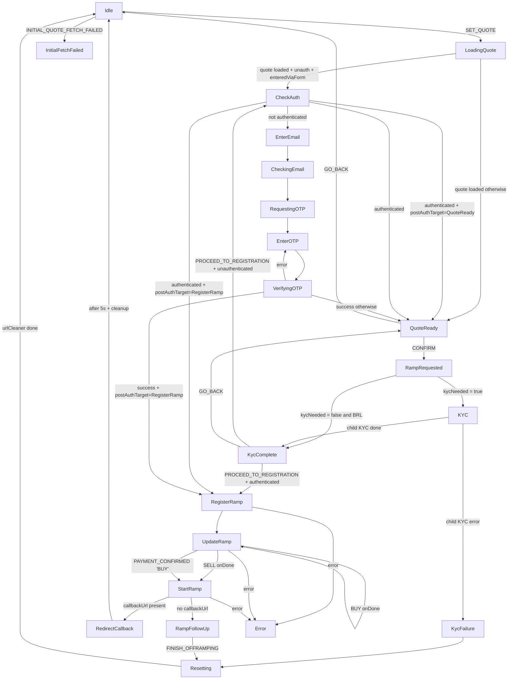
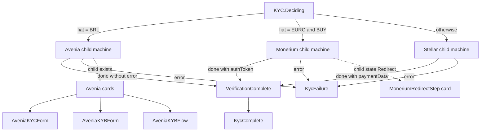

# Ramp Machine + Widget Card Flow

This document maps how the top-level XState machine (`ramp.machine.ts`) drives what the widget renders, and which UI actions send events back into the machine.

## Source of truth
- Machine: `apps/frontend/src/machines/ramp.machine.ts`
- KYC node: `apps/frontend/src/machines/kyc.states.ts`
- Widget rendering switch: `apps/frontend/src/pages/widget/index.tsx`
- URL/bootstrap events: `apps/frontend/src/hooks/useRampUrlParams.ts`
- Main CTA behavior: `apps/frontend/src/components/RampSubmitButton/RampSubmitButton.tsx`

## High-level flow (machine)

## Widget card resolution order (important)
`WidgetContent` picks the first matching branch in this order:

1. `ErrorStep` if machine matches `Error`
2. `RampFollowUpRedirectStep` if machine matches `RedirectCallback`
3. `AuthEmailStep` for `CheckAuth | EnterEmail | CheckingEmail | RequestingOTP`
4. `AuthOTPStep` for `EnterOTP | VerifyingOTP`
5. `MoneriumRedirectStep` if Monerium child actor exists and child state is `Redirect`
6. `SummaryStep` for `KycComplete | RegisterRamp | UpdateRamp | StartRamp`
7. Avenia branch if Avenia child actor exists:
   - `AveniaKYBFlow` when CNPJ + `kybUrls` present
   - else `AveniaKYBForm` (CNPJ)
   - else `AveniaKYCForm` (CPF)
8. `InitialQuoteFailedStep` for `InitialFetchFailed`
9. fallback: `DetailsStep`

## KYC subflow and cards

## State-to-card map
| Machine state / condition | Card shown |
|---|---|
| `Error` | `ErrorStep` |
| `RedirectCallback` | `RampFollowUpRedirectStep` |
| `CheckAuth`, `EnterEmail`, `CheckingEmail`, `RequestingOTP` | `AuthEmailStep` |
| `EnterOTP`, `VerifyingOTP` | `AuthOTPStep` |
| Monerium child actor state `Redirect` | `MoneriumRedirectStep` |
| `KycComplete`, `RegisterRamp`, `UpdateRamp`, `StartRamp` | `SummaryStep` |
| Avenia actor exists + CNPJ + `kybUrls` | `AveniaKYBFlow` |
| Avenia actor exists + CNPJ (no `kybUrls`) | `AveniaKYBForm` |
| Avenia actor exists + CPF | `AveniaKYCForm` |
| `InitialFetchFailed` | `InitialQuoteFailedStep` |
| everything else | `DetailsStep` |

## Key UI -> machine events
- `DetailsStep` submit -> `CONFIRM` (via `useRampSubmission`) and `SET_ADDRESS`
- `RampSubmitButton`:
  - in `QuoteReady` -> `CONFIRM`
  - in `KycComplete` -> `PROCEED_TO_REGISTRATION`
  - default -> `SummaryConfirm`
  - in `UpdateRamp` on onramp -> `PAYMENT_CONFIRMED`
  - if quote expired -> `RESET_RAMP`
- `AuthEmailStep` -> `ENTER_EMAIL`
- `AuthOTPStep` -> `VERIFY_OTP`
- Error/initial-failure/retry actions -> `RESET_RAMP`
- Back button (`StepBackButton`) primarily sends `GO_BACK` (with Avenia-specific child events in document/liveness/KYB sub-steps)

## URL/bootstrap interactions
`useSetRampUrlParams` seeds machine state at widget load:
- `SET_QUOTE_PARAMS`
- `SET_EXTERNAL_ID` (if provided)
- `SET_QUOTE` (provided quoteId or fetched quote)
- `INITIAL_QUOTE_FETCH_FAILED` on quote fetch failure

This is why many sessions start in `LoadingQuote`/`QuoteReady` rather than plain `Idle`.

## Auth gating change
- The initial `Idle -> CheckAuth` auto-transition was removed.
- For `/widget` entry coming from Quote form (`enteredViaForm`), auth can happen directly after `LoadingQuote` and before `QuoteReady`.
- Auth is also deferred to `KycComplete -> PROCEED_TO_REGISTRATION` when needed.
- `postAuthTarget` tracks whether post-auth continuation should be `QuoteReady` or `RegisterRamp`.
- `GO_BACK` behavior in auth states:
  - `CheckAuth`, `EnterEmail`, `CheckingEmail`, `RequestingOTP`: back to `KycComplete` when `postAuthTarget=RegisterRamp`, otherwise reset to `Idle` (Quote form path).
  - `EnterOTP`, `VerifyingOTP`: back to `EnterEmail`.

## Practical reading model
When debugging what card should show, check in this order:
1. Top-level ramp state (`rampActor.getSnapshot().value`)
2. Whether Monerium child is in `Redirect`
3. Whether Avenia child exists and its context (`taxId`, `kybUrls`, `kybStep`)
4. Whether auth gating states (`CheckAuth`...`VerifyingOTP`) currently match

The render priority order can override expectations from raw machine state (for example, a Monerium `Redirect` child card can appear before generic details/some other fallback views).
