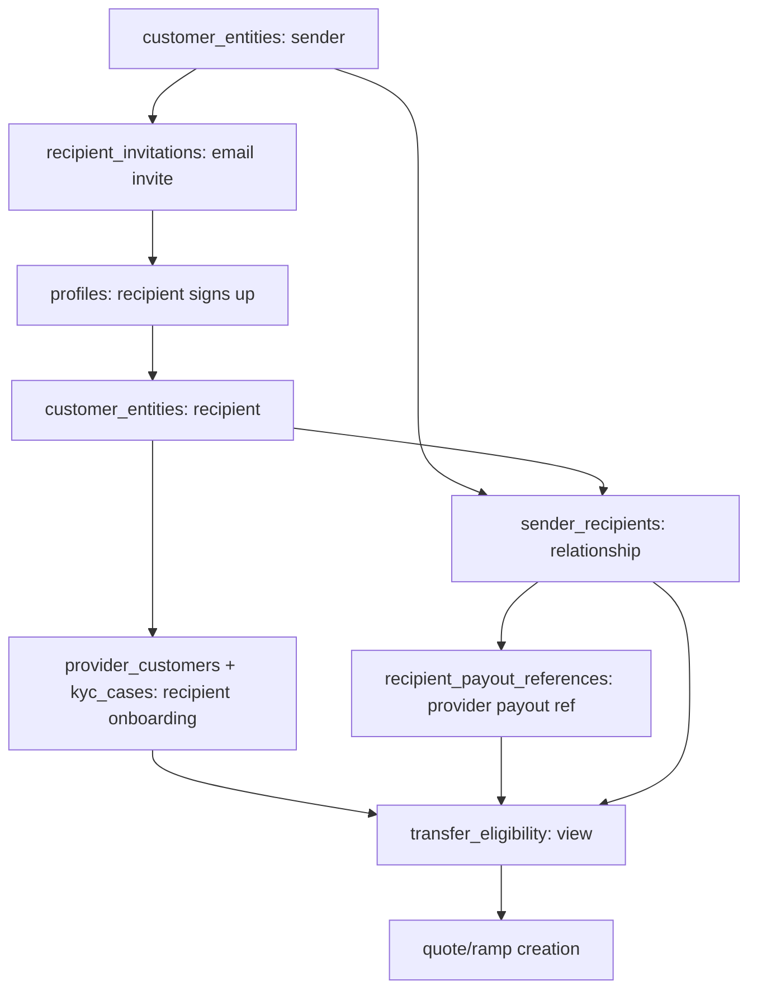

# Recipient Transfers Schema (Dashboard)

**Date:** 2026-06-25  
**Status:** Proposed / discussion draft

## Summary

The dashboard lets a signed-in **sender** invite a **recipient** by email to receive a payout for a specific country/rail. The recipient accepts, creates a Vortex profile, onboards, and only then can the sender transfer to them.

This is net-new product scope. It **builds on** the core identity model in [unified-user-management-schema.md](unified-user-management-schema.md) — senders and recipients are both `customer_entities`, their onboarding is `provider_customers` + `kyc_cases`. This doc adds only the relationship/invite/payout tables on top.

Principles carried over:

- **Recipients are normal customers** — an accepted recipient gets a `profile` + `customer_entity`, not a separate identity model.
- **The sender owns the relationship, not the recipient's identity** — one recipient can be linked to many senders.
- **Provider-host payout instruments** — store provider references + masked metadata, never reusable PIX/IBAN/ACH/CLABE/CBU PII locally.

Tables list only decision-bearing columns; assume `id` (UUID PK) + standard `created_at`/`updated_at`.

## Flow



## Schema

### `recipient_invitations`

Email invite created by a sender before the recipient has a profile.

| Column | Notes |
| :-- | :-- |
| `sender_customer_entity_id` | FK to sender `customer_entities.id`. |
| `created_by_profile_id` | Sender profile that created the invite. |
| `invitee_email` / `invitee_email_canonical` | Display value + normalized value used for uniqueness and acceptance. |
| `invitee_type` | `individual` or `business`. |
| `country`, `rail`, `payout_currency` | Requested corridor. |
| `amount` | Sender-requested payout amount (decimal string). |
| `status` | `pending`, `accepted`, `expired`, `revoked`. |
| `token_hash` | Hash of the invite token — never store the raw token. |
| `expires_at`, `accepted_at`, `revoked_at` | Lifecycle. |
| `accepted_by_profile_id` | Nullable FK, set after the recipient signs up. |

```sql
UNIQUE (token_hash)
-- optional: one active invite per sender/email/corridor
-- UNIQUE (sender_customer_entity_id, invitee_email_canonical, country, rail) WHERE status = 'pending'
```

Redemption is email-bound: if the accepting profile's email differs from `invitee_email_canonical`, require re-verification or reject.

### `sender_recipients`

The relationship after an invite is accepted (or a recipient is otherwise attached).

| Column | Notes |
| :-- | :-- |
| `sender_customer_entity_id` | FK to sender `customer_entities.id`. |
| `recipient_customer_entity_id` | FK to recipient `customer_entities.id`. |
| `invitation_id` | Nullable FK to `recipient_invitations.id`. |
| `relationship_status` | `invited`, `active`, `blocked`, `archived`. |
| `nickname` | Sender-local label. |
| `disabled_at` | Optional. |

```sql
UNIQUE (sender_customer_entity_id, recipient_customer_entity_id)
```

The sender owns this row; the recipient owns their own profile/customer/compliance identity, reusable across senders.

### `recipient_payout_references`

Provider payout-instrument reference for a relationship. No reusable payout PII stored locally.

| Column | Notes |
| :-- | :-- |
| `sender_recipient_id` | FK to `sender_recipients.id`. |
| `recipient_customer_entity_id` | FK to recipient `customer_entities.id`. |
| `provider`, `country`, `rail`, `currency` | Payout target. |
| `instrument_type` | Non-sensitive category: `pix`, `iban`, `clabe`, `ach`, `cbu_cvu`, `account_number`. |
| `provider_instrument_id` | Provider-side instrument/account/recipient ID (the source of truth). |
| `masked_display_label` | Provider-masked label only. |
| `status` | `pending`, `verified`, `rejected`, `disabled`. |
| `last_provider_sync_at` | Last provider fetch/sync. |

Full payout details are fetched from the provider just in time. The dashboard mock's `{ method, value }` becomes provider-side creation input, not a local record.

### `transfer_eligibility` (view, not a table)

"Can this sender transfer to this recipient for this country/rail?" computed from the rows above — a database **view or function**, not a stored table (avoids staleness). Promote to materialized only if perf demands it.

Returns: `sender_recipient_id`, parties, `country`, `rail`, `can_create_transfer` (bool), `blocking_reason_code` (`invite_not_accepted`, `recipient_onboarding_pending`, `provider_payout_reference_unverified`, `provider_restricted`).

A transfer is creatable only when **all** hold:

```text
invite accepted
AND relationship active
AND recipient onboarding approved for country/rail
AND provider payout reference verified
AND provider/customer status allows payouts
```

The API enforces this at quote/ramp creation — not just in the UI.

## Open questions

1. Can one recipient have multiple active payout references for the same sender/country/rail?
2. Are sender-entered payout details editable before approval, after, or only via re-invite/re-verify?
3. Is recipient onboarding reusable across senders for the same country/rail, or does each relationship need its own approval?

## Security-spec impact

New/updated specs required for: invite token generation/hashing/expiry/revocation/redemption; sender↔recipient authorization boundaries; recipient onboarding reuse; provider-held payout references and PII fetch/redaction policy; transfer gating.
