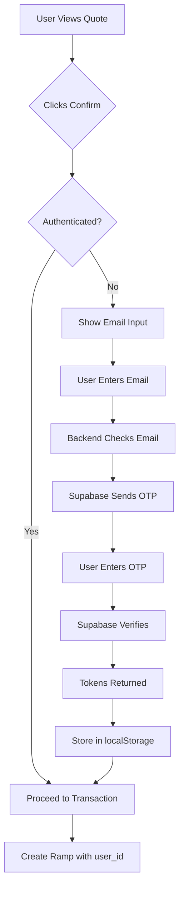
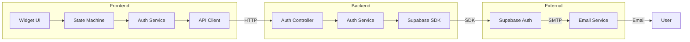
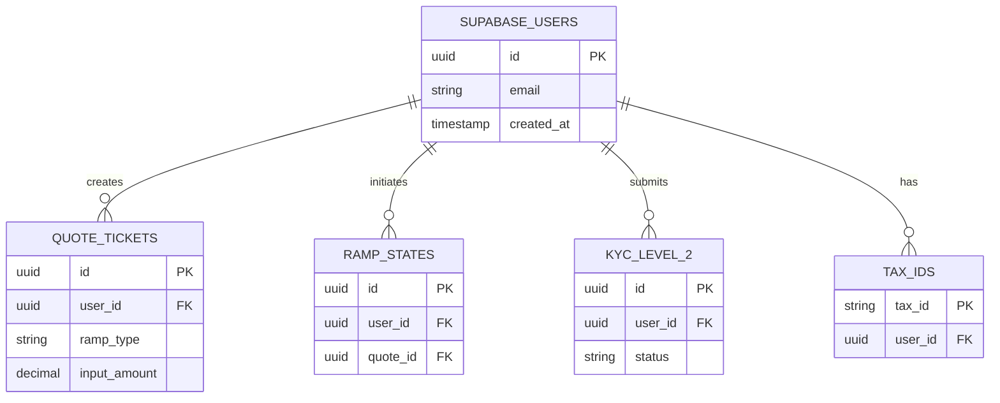

# Supabase Auth Integration - Architecture Overview

## Introduction

This document provides a high-level overview of the Supabase Auth integration architecture for Pendulum Pay (Vortex). For detailed implementation instructions, refer to the specific documents listed below.

## Quick Links

- **[Backend Implementation](./supabase-auth-backend.md)** - Database, API, services, and migrations
- **[Frontend Implementation](./supabase-auth-frontend.md)** - UI components, state machine, and token management
- **[Implementation Guide](./supabase-auth-implementation-guide.md)** - Step-by-step guide with testing and deployment

---

## Project Goals

1. ✅ Enable email-based authentication (OTP only, no passwords)
2. ✅ Use Supabase Auth's Implicit flow (access_token + refresh_token)
3. ✅ Link entities (KYC_LEVEL_2, QUOTE_TICKETS, RAMP_STATES, TAX_IDS) to users
4. ✅ Integrate auth into widget flow (after quote confirmation)
5. ✅ Implement auto-refresh token management
6. ✅ Maintain backward compatibility during migration

---

## Architecture Decisions

### User Authentication

| Decision | Choice | Rationale |
|----------|--------|-----------|
| **Auth Method** | Email OTP only | Passwordless reduces security risks, improves UX |
| **Session Type** | Implicit flow | Suitable for SPA, uses access + refresh tokens |
| **Token Storage** | localStorage | Standard for implicit flow, auto-refresh handles expiry |
| **Auth Timing** | After quote confirmation | Users can browse without account, convert when ready |

### User Data Management

| Decision | Choice | Rationale |
|----------|--------|-----------|
| **User Storage** | Supabase Auth only | Single source of truth, no data duplication |
| **Local References** | user_id (UUID) only | Lightweight, maintain referential integrity |
| **Migration Strategy** | Dummy user for existing data | Preserves data, allows gradual user linking |
| **API Protection** | Not enforced initially | Phased rollout, endpoints ready for future auth |

---

## System Architecture

### High-Level Flow



### Component Architecture



### Database Schema



---

## Implementation Overview

### Backend Components

### 1. Supabase Client SDK Setup

#### Installation
```bash
# In apps/api
bun add @supabase/supabase-js
```

#### Configuration

**File**: `apps/api/src/config/supabase.ts`
```typescript
import { createClient } from '@supabase/supabase-js';
import { env } from './vars';

export const supabaseAdmin = createClient(
  env.SUPABASE_URL,
  env.SUPABASE_SERVICE_ROLE_KEY,
  {
    auth: {
      autoRefreshToken: false,
      persistSession: false
    }
  }
);

export const supabase = createClient(
  env.SUPABASE_URL,
  env.SUPABASE_ANON_KEY
);
```

**Environment Variables** (add to `apps/api/src/config/vars.ts`):
```typescript
SUPABASE_URL: process.env.SUPABASE_URL || '',
SUPABASE_ANON_KEY: process.env.SUPABASE_ANON_KEY || '',
SUPABASE_SERVICE_ROLE_KEY: process.env.SUPABASE_SERVICE_ROLE_KEY || '',
```

**Add to `.env.example`**:
```
SUPABASE_URL=https://your-project.supabase.co
SUPABASE_ANON_KEY=your-anon-key
SUPABASE_SERVICE_ROLE_KEY=your-service-role-key
```

### 2. Database Schema Changes

#### Migration: Add user_id to Entities

**File**: `apps/api/src/database/migrations/019-add-user-id-to-entities.ts`

```typescript
import { DataTypes, QueryInterface } from "sequelize";
import { v4 as uuidv4 } from 'uuid';

export async function up(queryInterface: QueryInterface): Promise<void> {
  // Generate a dummy user ID for migration
  const DUMMY_USER_ID = uuidv4();
  
  console.log(`Using dummy user ID for migration: ${DUMMY_USER_ID}`);

  // Add user_id to kyc_level_2
  await queryInterface.addColumn('kyc_level_2', 'user_id', {
    type: DataTypes.UUID,
    allowNull: true, // Temporarily allow null
  });

  // Set dummy user ID for existing records
  await queryInterface.sequelize.query(
    `UPDATE kyc_level_2 SET user_id = '${DUMMY_USER_ID}' WHERE user_id IS NULL`
  );

  // Make it not null
  await queryInterface.changeColumn('kyc_level_2', 'user_id', {
    type: DataTypes.UUID,
    allowNull: false,
  });

  // Add index
  await queryInterface.addIndex('kyc_level_2', ['user_id'], {
    name: 'idx_kyc_level_2_user_id'
  });

  // Add user_id to quote_tickets
  await queryInterface.addColumn('quote_tickets', 'user_id', {
    type: DataTypes.UUID,
    allowNull: true,
  });

  await queryInterface.sequelize.query(
    `UPDATE quote_tickets SET user_id = '${DUMMY_USER_ID}' WHERE user_id IS NULL`
  );

  await queryInterface.changeColumn('quote_tickets', 'user_id', {
    type: DataTypes.UUID,
    allowNull: false,
  });

  await queryInterface.addIndex('quote_tickets', ['user_id'], {
    name: 'idx_quote_tickets_user_id'
  });

  // Add user_id to ramp_states
  await queryInterface.addColumn('ramp_states', 'user_id', {
    type: DataTypes.UUID,
    allowNull: true,
  });

  await queryInterface.sequelize.query(
    `UPDATE ramp_states SET user_id = '${DUMMY_USER_ID}' WHERE user_id IS NULL`
  );

  await queryInterface.changeColumn('ramp_states', 'user_id', {
    type: DataTypes.UUID,
    allowNull: false,
  });

  await queryInterface.addIndex('ramp_states', ['user_id'], {
    name: 'idx_ramp_states_user_id'
  });

  // Add user_id to tax_ids
  await queryInterface.addColumn('tax_ids', 'user_id', {
    type: DataTypes.UUID,
    allowNull: true,
  });

  await queryInterface.sequelize.query(
    `UPDATE tax_ids SET user_id = '${DUMMY_USER_ID}' WHERE user_id IS NULL`
  );

  await queryInterface.changeColumn('tax_ids', 'user_id', {
    type: DataTypes.UUID,
    allowNull: false,
  });

  await queryInterface.addIndex('tax_ids', ['user_id'], {
    name: 'idx_tax_ids_user_id'
  });
}

export async function down(queryInterface: QueryInterface): Promise<void> {
  // Remove indexes
  await queryInterface.removeIndex('kyc_level_2', 'idx_kyc_level_2_user_id');
  await queryInterface.removeIndex('quote_tickets', 'idx_quote_tickets_user_id');
  await queryInterface.removeIndex('ramp_states', 'idx_ramp_states_user_id');
  await queryInterface.removeIndex('tax_ids', 'idx_tax_ids_user_id');

  // Remove columns
  await queryInterface.removeColumn('kyc_level_2', 'user_id');
  await queryInterface.removeColumn('quote_tickets', 'user_id');
  await queryInterface.removeColumn('ramp_states', 'user_id');
  await queryInterface.removeColumn('tax_ids', 'user_id');
}
```

#### Update Models

**Update**: `apps/api/src/models/quoteTicket.model.ts`
```typescript
// Add to interface
export interface QuoteTicketAttributes {
  // ... existing fields
  userId: string; // UUID reference to Supabase Auth user
  // ... rest
}

// Add to model class
declare userId: string;

// Add to init()
userId: {
  allowNull: false,
  field: 'user_id',
  type: DataTypes.UUID
}
```

**Update**: `apps/api/src/models/rampState.model.ts`
```typescript
// Add to interface
export interface RampStateAttributes {
  // ... existing fields
  userId: string;
  // ... rest
}

// Add to model class
declare userId: string;

// Add to init()
userId: {
  allowNull: false,
  field: 'user_id',
  type: DataTypes.UUID
}
```

**Update**: `apps/api/src/models/taxId.model.ts`
```typescript
// Add to interface
export interface TaxIdAttributes {
  // ... existing fields
  userId: string;
  // ... rest
}

// Add to model class
declare userId: string;

// Add to init()
userId: {
  allowNull: false,
  field: 'user_id',
  type: DataTypes.UUID
}
```

**Create**: `apps/api/src/models/kycLevel2.model.ts` (if not exists)
```typescript
import { DataTypes, Model, Optional } from "sequelize";
import sequelize from "../config/database";

export interface KycLevel2Attributes {
  id: string;
  userId: string;
  subaccountId: string;
  documentType: 'RG' | 'CNH';
  uploadData: any;
  status: 'Requested' | 'DataCollected' | 'BrlaValidating' | 'Rejected' | 'Accepted' | 'Cancelled';
  errorLogs: any[];
  createdAt: Date;
  updatedAt: Date;
}

type KycLevel2CreationAttributes = Optional<KycLevel2Attributes, 'id' | 'createdAt' | 'updatedAt' | 'errorLogs'>;

class KycLevel2 extends Model<KycLevel2Attributes, KycLevel2CreationAttributes> implements KycLevel2Attributes {
  declare id: string;
  declare userId: string;
  declare subaccountId: string;
  declare documentType: 'RG' | 'CNH';
  declare uploadData: any;
  declare status: 'Requested' | 'DataCollected' | 'BrlaValidating' | 'Rejected' | 'Accepted' | 'Cancelled';
  declare errorLogs: any[];
  declare createdAt: Date;
  declare updatedAt: Date;
}

KycLevel2.init(
  {
    id: {
      type: DataTypes.UUID,
      defaultValue: DataTypes.UUIDV4,
      primaryKey: true,
    },
    userId: {
      type: DataTypes.UUID,
      allowNull: false,
      field: 'user_id',
    },
    subaccountId: {
      type: DataTypes.STRING,
      allowNull: false,
      field: 'subaccount_id',
    },
    documentType: {
      type: DataTypes.ENUM('RG', 'CNH'),
      allowNull: false,
      field: 'document_type',
    },
    uploadData: {
      type: DataTypes.JSONB,
      allowNull: false,
      field: 'upload_data',
    },
    status: {
      type: DataTypes.ENUM('Requested', 'DataCollected', 'BrlaValidating', 'Rejected', 'Accepted', 'Cancelled'),
      allowNull: false,
      defaultValue: 'Requested',
      field: 'status',
    },
    errorLogs: {
      type: DataTypes.JSONB,
      allowNull: false,
      defaultValue: [],
      field: 'error_logs',
    },
    createdAt: {
      type: DataTypes.DATE,
      allowNull: false,
      defaultValue: DataTypes.NOW,
      field: 'created_at',
    },
    updatedAt: {
      type: DataTypes.DATE,
      allowNull: false,
      defaultValue: DataTypes.NOW,
      field: 'updated_at',
    },
  },
  {
    sequelize,
    tableName: 'kyc_level_2',
    modelName: 'KycLevel2',
    timestamps: true,
    indexes: [
      {
        name: 'idx_kyc_level_2_subaccount',
        fields: ['subaccount_id'],
      },
      {
        name: 'idx_kyc_level_2_status',
        fields: ['status'],
      },
      {
        name: 'idx_kyc_level_2_user_id',
        fields: ['user_id'],
      },
    ],
  }
);

export default KycLevel2;
```

**Update**: `apps/api/src/models/index.ts`
```typescript
import KycLevel2 from './kycLevel2.model';

// Add to exports
const models = {
  // ... existing
  KycLevel2,
  // ... rest
};
```

### 3. Auth Service Layer

**File**: `apps/api/src/api/services/auth/supabase.service.ts`

```typescript
import { supabase, supabaseAdmin } from '../../../config/supabase';

export class SupabaseAuthService {
  /**
   * Check if user exists by email
   */
  static async checkUserExists(email: string): Promise<boolean> {
    try {
      const { data, error } = await supabaseAdmin.auth.admin.listUsers();
      
      if (error) {
        throw error;
      }

      const userExists = data.users.some(user => user.email === email);
      return userExists;
    } catch (error) {
      console.error('Error checking user existence:', error);
      throw error;
    }
  }

  /**
   * Send OTP to email
   */
  static async sendOTP(email: string): Promise<void> {
    const { error } = await supabase.auth.signInWithOtp({
      email,
      options: {
        shouldCreateUser: true,
      },
    });

    if (error) {
      throw error;
    }
  }

  /**
   * Verify OTP
   */
  static async verifyOTP(email: string, token: string): Promise<{
    access_token: string;
    refresh_token: string;
    user_id: string;
  }> {
    const { data, error } = await supabase.auth.verifyOtp({
      email,
      token,
      type: 'email',
    });

    if (error) {
      throw error;
    }

    if (!data.session) {
      throw new Error('No session returned after OTP verification');
    }

    return {
      access_token: data.session.access_token,
      refresh_token: data.session.refresh_token,
      user_id: data.user.id,
    };
  }

  /**
   * Verify access token
   */
  static async verifyToken(accessToken: string): Promise<{
    valid: boolean;
    user_id?: string;
  }> {
    const { data, error } = await supabase.auth.getUser(accessToken);

    if (error || !data.user) {
      return { valid: false };
    }

    return {
      valid: true,
      user_id: data.user.id,
    };
  }

  /**
   * Refresh access token
   */
  static async refreshToken(refreshToken: string): Promise<{
    access_token: string;
    refresh_token: string;
  }> {
    const { data, error } = await supabase.auth.refreshSession({
      refresh_token: refreshToken,
    });

    if (error || !data.session) {
      throw new Error('Failed to refresh token');
    }

    return {
      access_token: data.session.access_token,
      refresh_token: data.session.refresh_token,
    };
  }

  /**
   * Get user profile from Supabase
   */
  static async getUserProfile(userId: string): Promise<any> {
    const { data, error } = await supabaseAdmin.auth.admin.getUserById(userId);

    if (error) {
      throw error;
    }

    return data.user;
  }
}
```

**File**: `apps/api/src/api/services/auth/index.ts`

```typescript
export { SupabaseAuthService } from './supabase.service';
```

### 4. API Controllers

**File**: `apps/api/src/api/controllers/auth.controller.ts`

```typescript
import { Request, Response } from 'express';
import { SupabaseAuthService } from '../services/auth';

export class AuthController {
  /**
   * Check if email is registered
   * GET /api/v1/auth/check-email?email=user@example.com
   */
  static async checkEmail(req: Request, res: Response) {
    try {
      const { email } = req.query;

      if (!email || typeof email !== 'string') {
        return res.status(400).json({
          error: 'Email is required',
        });
      }

      const exists = await SupabaseAuthService.checkUserExists(email);

      return res.json({
        exists,
        action: exists ? 'signin' : 'signup',
      });
    } catch (error) {
      console.error('Error in checkEmail:', error);
      return res.status(500).json({
        error: 'Failed to check email',
      });
    }
  }

  /**
   * Request OTP
   * POST /api/v1/auth/request-otp
   * Body: { email: string }
   */
  static async requestOTP(req: Request, res: Response) {
    try {
      const { email } = req.body;

      if (!email) {
        return res.status(400).json({
          error: 'Email is required',
        });
      }

      await SupabaseAuthService.sendOTP(email);

      return res.json({
        success: true,
        message: 'OTP sent to email',
      });
    } catch (error) {
      console.error('Error in requestOTP:', error);
      return res.status(500).json({
        error: 'Failed to send OTP',
      });
    }
  }

  /**
   * Verify OTP
   * POST /api/v1/auth/verify-otp
   * Body: { email: string, token: string }
   */
  static async verifyOTP(req: Request, res: Response) {
    try {
      const { email, token } = req.body;

      if (!email || !token) {
        return res.status(400).json({
          error: 'Email and token are required',
        });
      }

      const result = await SupabaseAuthService.verifyOTP(email, token);

      return res.json({
        success: true,
        access_token: result.access_token,
        refresh_token: result.refresh_token,
        user_id: result.user_id,
      });
    } catch (error) {
      console.error('Error in verifyOTP:', error);
      return res.status(400).json({
        error: 'Invalid OTP or OTP expired',
      });
    }
  }

  /**
   * Refresh token
   * POST /api/v1/auth/refresh
   * Body: { refresh_token: string }
   */
  static async refreshToken(req: Request, res: Response) {
    try {
      const { refresh_token } = req.body;

      if (!refresh_token) {
        return res.status(400).json({
          error: 'Refresh token is required',
        });
      }

      const result = await SupabaseAuthService.refreshToken(refresh_token);

      return res.json({
        success: true,
        access_token: result.access_token,
        refresh_token: result.refresh_token,
      });
    } catch (error) {
      console.error('Error in refreshToken:', error);
      return res.status(401).json({
        error: 'Invalid refresh token',
      });
    }
  }

  /**
   * Verify token (for client-side validation)
   * POST /api/v1/auth/verify
   * Body: { access_token: string }
   */
  static async verifyToken(req: Request, res: Response) {
    try {
      const { access_token } = req.body;

      if (!access_token) {
        return res.status(400).json({
          error: 'Access token is required',
        });
      }

      const result = await SupabaseAuthService.verifyToken(access_token);

      if (!result.valid) {
        return res.status(401).json({
          valid: false,
          error: 'Invalid token',
        });
      }

      return res.json({
        valid: true,
        user_id: result.user_id,
      });
    } catch (error) {
      console.error('Error in verifyToken:', error);
      return res.status(401).json({
        valid: false,
        error: 'Token verification failed',
      });
    }
  }
}
```

### 5. API Routes

**File**: `apps/api/src/api/routes/v1/auth.route.ts`

```typescript
import { Router } from 'express';
import { AuthController } from '../../controllers/auth.controller';

const router = Router();

router.get('/check-email', AuthController.checkEmail);
router.post('/request-otp', AuthController.requestOTP);
router.post('/verify-otp', AuthController.verifyOTP);
router.post('/refresh', AuthController.refreshToken);
router.post('/verify', AuthController.verifyToken);

export default router;
```

**Update**: `apps/api/src/api/routes/v1/index.ts`

```typescript
import authRoutes from './auth.route';

// Add to router
router.use('/auth', authRoutes);
```

### 6. Auth Middleware (Future Use)

**File**: `apps/api/src/api/middlewares/supabaseAuth.ts`

```typescript
import { NextFunction, Request, Response } from 'express';
import { SupabaseAuthService } from '../services/auth';

// Extend Express Request type
declare global {
  namespace Express {
    interface Request {
      userId?: string;
    }
  }
}

/**
 * Middleware to verify Supabase auth token
 * Not enforced initially, but ready for future use
 */
export async function requireAuth(
  req: Request,
  res: Response,
  next: NextFunction
) {
  try {
    const authHeader = req.headers.authorization;

    if (!authHeader?.startsWith('Bearer ')) {
      return res.status(401).json({
        error: 'Missing or invalid authorization header',
      });
    }

    const token = authHeader.substring(7);
    const result = await SupabaseAuthService.verifyToken(token);

    if (!result.valid) {
      return res.status(401).json({
        error: 'Invalid or expired token',
      });
    }

    req.userId = result.user_id;
    next();
  } catch (error) {
    console.error('Auth middleware error:', error);
    return res.status(401).json({
      error: 'Authentication failed',
    });
  }
}

/**
 * Optional auth - attaches userId if token is present but doesn't require it
 */
export async function optionalAuth(
  req: Request,
  res: Response,
  next: NextFunction
) {
  try {
    const authHeader = req.headers.authorization;

    if (authHeader?.startsWith('Bearer ')) {
      const token = authHeader.substring(7);
      const result = await SupabaseAuthService.verifyToken(token);

      if (result.valid) {
        req.userId = result.user_id;
      }
    }

    next();
  } catch (error) {
    // Silently fail for optional auth
    next();
  }
}
```

---

## Frontend Architecture

### 1. Supabase Client Setup

#### Installation
```bash
# In apps/frontend
bun add @supabase/supabase-js
```

#### Configuration

**File**: `apps/frontend/src/config/supabase.ts`

```typescript
import { createClient } from '@supabase/supabase-js';

const supabaseUrl = import.meta.env.VITE_SUPABASE_URL;
const supabaseAnonKey = import.meta.env.VITE_SUPABASE_ANON_KEY;

if (!supabaseUrl || !supabaseAnonKey) {
  throw new Error('Missing Supabase environment variables');
}

export const supabase = createClient(supabaseUrl, supabaseAnonKey, {
  auth: {
    autoRefreshToken: true,
    persistSession: true,
    detectSessionInUrl: true,
  },
});
```

**Add to `.env.example`**:
```
VITE_SUPABASE_URL=https://your-project.supabase.co
VITE_SUPABASE_ANON_KEY=your-anon-key
```

### 2. Auth Service

**File**: `apps/frontend/src/services/auth.ts`

```typescript
import { supabase } from '../config/supabase';

export interface AuthTokens {
  access_token: string;
  refresh_token: string;
  user_id: string;
}

export class AuthService {
  private static readonly ACCESS_TOKEN_KEY = 'vortex_access_token';
  private static readonly REFRESH_TOKEN_KEY = 'vortex_refresh_token';
  private static readonly USER_ID_KEY = 'vortex_user_id';

  /**
   * Store tokens in localStorage
   */
  static storeTokens(tokens: AuthTokens): void {
    localStorage.setItem(this.ACCESS_TOKEN_KEY, tokens.access_token);
    localStorage.setItem(this.REFRESH_TOKEN_KEY, tokens.refresh_token);
    localStorage.setItem(this.USER_ID_KEY, tokens.user_id);
  }

  /**
   * Get tokens from localStorage
   */
  static getTokens(): AuthTokens | null {
    const access_token = localStorage.getItem(this.ACCESS_TOKEN_KEY);
    const refresh_token = localStorage.getItem(this.REFRESH_TOKEN_KEY);
    const user_id = localStorage.getItem(this.USER_ID_KEY);

    if (!access_token || !refresh_token || !user_id) {
      return null;
    }

    return { access_token, refresh_token, user_id };
  }

  /**
   * Clear tokens from localStorage
   */
  static clearTokens(): void {
    localStorage.removeItem(this.ACCESS_TOKEN_KEY);
    localStorage.removeItem(this.REFRESH_TOKEN_KEY);
    localStorage.removeItem(this.USER_ID_KEY);
  }

  /**
   * Check if user is authenticated
   */
  static isAuthenticated(): boolean {
    return this.getTokens() !== null;
  }

  /**
   * Get user ID
   */
  static getUserId(): string | null {
    return localStorage.getItem(this.USER_ID_KEY);
  }

  /**
   * Handle tokens from URL (for magic link callback)
   */
  static handleUrlTokens(): AuthTokens | null {
    const params = new URLSearchParams(window.location.hash.substring(1));
    const access_token = params.get('access_token');
    const refresh_token = params.get('refresh_token');

    if (access_token && refresh_token) {
      // We need to get the user_id from the token
      // This will be handled by the Supabase session
      return { access_token, refresh_token, user_id: '' };
    }

    return null;
  }

  /**
   * Refresh access token
   */
  static async refreshAccessToken(): Promise<AuthTokens | null> {
    const tokens = this.getTokens();
    if (!tokens) {
      return null;
    }

    try {
      const { data, error } = await supabase.auth.refreshSession({
        refresh_token: tokens.refresh_token,
      });

      if (error || !data.session) {
        this.clearTokens();
        return null;
      }

      const newTokens: AuthTokens = {
        access_token: data.session.access_token,
        refresh_token: data.session.refresh_token,
        user_id: data.user.id,
      };

      this.storeTokens(newTokens);
      return newTokens;
    } catch (error) {
      console.error('Token refresh failed:', error);
      this.clearTokens();
      return null;
    }
  }

  /**
   * Setup auto-refresh
   */
  static setupAutoRefresh(): () => void {
    // Refresh token 5 minutes before expiry
    const REFRESH_INTERVAL = 55 * 60 * 1000; // 55 minutes

    const intervalId = setInterval(async () => {
      if (this.isAuthenticated()) {
        await this.refreshAccessToken();
      }
    }, REFRESH_INTERVAL);

    return () => clearInterval(intervalId);
  }

  /**
   * Sign out
   */
  static async signOut(): Promise<void> {
    await supabase.auth.signOut();
    this.clearTokens();
  }
}
```

### 3. API Service Updates

**File**: `apps/frontend/src/services/api/auth.api.ts`

```typescript
import axios from 'axios';

const API_BASE_URL = import.meta.env.VITE_API_URL || 'http://localhost:3000/api/v1';

export interface CheckEmailResponse {
  exists: boolean;
  action: 'signin' | 'signup';
}

export interface VerifyOTPResponse {
  success: boolean;
  access_token: string;
  refresh_token: string;
  user_id: string;
}

export class AuthAPI {
  /**
   * Check if email exists
   */
  static async checkEmail(email: string): Promise<CheckEmailResponse> {
    const response = await axios.get(`${API_BASE_URL}/auth/check-email`, {
      params: { email },
    });
    return response.data;
  }

  /**
   * Request OTP
   */
  static async requestOTP(email: string): Promise<void> {
    await axios.post(`${API_BASE_URL}/auth/request-otp`, {
      email,
    });
  }

  /**
   * Verify OTP
   */
  static async verifyOTP(email: string, token: string): Promise<VerifyOTPResponse> {
    const response = await axios.post(`${API_BASE_URL}/auth/verify-otp`, {
      email,
      token,
    });
    return response.data;
  }

  /**
   * Refresh token
   */
  static async refreshToken(refreshToken: string): Promise<VerifyOTPResponse> {
    const response = await axios.post(`${API_BASE_URL}/auth/refresh`, {
      refresh_token: refreshToken,
    });
    return response.data;
  }
}
```

---

## Conclusion

This architecture provides a complete, production-ready implementation for integrating Supabase Auth into Pendulum Pay. The design follows best practices for:

- **Security**: Passwordless authentication, token management, future-ready authorization
- **User Experience**: Simple email/OTP flow, auto-submit, error handling
- **Maintainability**: Clean separation of concerns, type-safe implementation
- **Scalability**: Ready for future enhancements (protected endpoints, user profiles)

The phased implementation approach ensures each component can be built, tested, and verified independently before integration, reducing risk and enabling iterative development.

**Next Steps**: Review this architecture document, clarify any uncertainties, then switch to Code mode to begin implementation following Phase 1.
