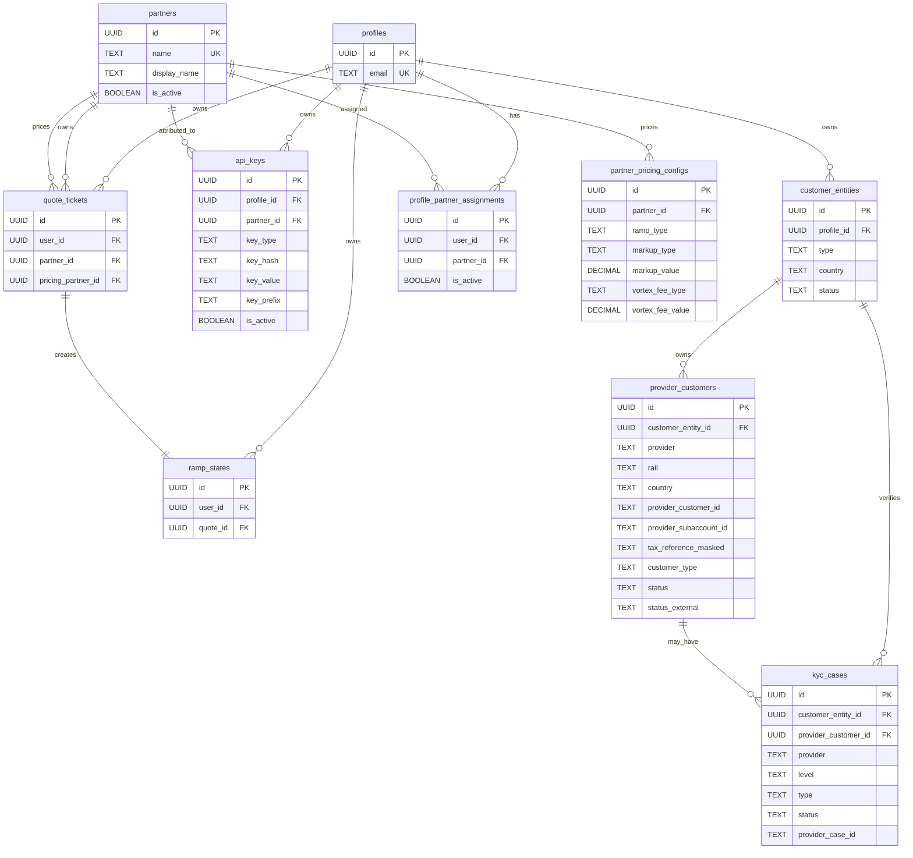

# Unified User Management Schema

**Date:** 2026-06-25  
**Status:** Proposed / discussion draft

## Summary

Our user-management tables grew table-by-table as auth, partners, and new rails were added. The model now mixes concepts that should be separate. This doc proposes a cleaner core identity model and lists the migration to get there.

Three concrete problems it fixes:

1. **A "partner" is not one row.** `partners` is keyed on `(name, ramp_type)` with a non-unique name, so a logical partner is 1–2 rows. That's why `api_keys` links by `partner_name` and assignments carry both `buy_partner_id`/`sell_partner_id`.
2. **A provider customer is three bespoke tables.** `mykobo_customers`, `alfredpay_customers`, and the Avenia half of `tax_ids` model the same idea three different ways.
3. **A KYC'd subaccount has no enforced owner.** `tax_ids.user_id` is nullable and adopted by the first caller; SDK/API callers can use any subaccount. (See [ownership enforcement](#tax-id--subaccount-ownership-enforcement).)

**Scope:** this doc covers the *existing identity model* only. The dashboard recipient/invitation/payout flow builds on this and lives in [recipient-transfers-schema.md](recipient-transfers-schema.md).

## Current → Proposed mapping

| Current table | What happens | Why |
| :-- | :-- | :-- |
| `profiles` | **Keep**, unchanged. Login identity only. | A profile is a sign-in, not a customer. |
| `partners` | **Split** into `partners` (unique `name`) + `partner_pricing_configs` (per `ramp_type`). | Separate commercial identity from per-direction pricing; gives a stable `partner_id`. |
| `profile_partner_assignments` | **Keep**, collapse `buy_partner_id`/`sell_partner_id` → one `partner_id`. | The buy/sell split only exists because `partners` is split by direction; one `partner_id` replaces it. |
| `api_keys` | **Refactor**: drop `partner_name`; add `partner_id` FK + `profile_id`; keep `key_type`/`key_value`. | Resolve by FK, and bind each key to one customer (enables SDK ownership checks). |
| `mykobo_customers` | **Fold into** `provider_customers` (`provider = mykobo`). | One provider-account model. |
| `alfredpay_customers` | **Fold into** `provider_customers` (`provider = alfredpay`). | Same; also drops the phantom `email` index bug. |
| `tax_ids` | **Split**: Avenia subaccount → `provider_customers` (`provider = avenia`, owner required); KYC workflow → `kyc_cases`; quote provenance dropped (or migrated if still read). | Untangle identity, provider account, and workflow; remove raw-tax-ID primary key. |
| `kyc_level_2` | **Replace** with `kyc_cases`. | Generalize beyond BRLA. |
| `quote_tickets` | **Keep**. `partner_id`/`pricing_partner_id` now point at the new `partners`. | Ownership/pricing split is correct; preserve it. |
| `ramp_states` | **Keep**, unchanged. | — |
| — | **New** `customer_entities` | Legal/compliance customer; the owner anchor for provider accounts and KYC. |
| — | **New** `provider_customers` | Unified provider/rail account (Mykobo, AlfredPay, Avenia, future). |
| — | **New** `kyc_cases` | Unified KYC/KYB verification attempts. |
| — | **New** `partner_pricing_configs` | Per-direction pricing split out of `partners`. |

Tables below list only decision-bearing columns; assume every table also has `id` (UUID PK) and standard `created_at`/`updated_at` unless noted.

## Proposed schema

### `customer_entities` (new)

The legal/compliance customer — the owner of provider accounts and KYC. Sits between `profiles` (login) and the provider/KYC tables.

| Column | Notes |
| :-- | :-- |
| `profile_id` | FK to `profiles.id`. Nullable only so compliance records can outlive a deleted profile; created eagerly (one `individual` entity per new profile). |
| `type` | `individual` or `business`. |
| `country` | Optional default/legal country. |
| `status` | `active`, `archived`, `blocked`. |

One profile may own many customer entities (e.g. individual + business); the product can start with one.

### `partners` + `partner_pricing_configs` (split)

`partners` — commercial identity:

| Column | Notes |
| :-- | :-- |
| `name` | **Unique.** The stable handle API keys and assignments reference. |
| `display_name`, `logo_url`, `is_active` | As today. |

`partner_pricing_configs` — per-direction pricing:

| Column | Notes |
| :-- | :-- |
| `partner_id` | FK to `partners.id`. |
| `ramp_type` | `BUY` or `SELL`. |
| markup / vortex-fee / discount / dynamic-difference fields | Moved verbatim from today's `partners`. |
| `payout_address_evm`, `payout_address_substrate` | Moved from today's `partners`. |

```sql
UNIQUE (name)                  -- partners
UNIQUE (partner_id, ramp_type) -- partner_pricing_configs
```

Pricing then resolves via `(partner_id, ramp_type)`; `api_keys`, `quote_tickets`, and `profile_partner_assignments` all reference a single `partner_id`.

### `provider_customers` (new)

One anchor for every provider/rail account, including the durable provider reference and tax reference.

| Column | Notes |
| :-- | :-- |
| `customer_entity_id` | FK to `customer_entities.id`. **NOT NULL** — every provider account has exactly one owner. |
| `provider` | `mykobo`, `alfredpay`, `avenia`. (Avenia *is* the BRLA integration — the code is mid-rename, service dir `brla/` + `BrlaApiService` but `Avenia*` types. Use one provider value, not two.) |
| `rail` | `eur`, `mxn`, `cop`, `ars`, `brl`. |
| `country` | Provider/customer country. |
| `provider_customer_id` | External provider customer ID, if any. |
| `provider_subaccount_id` | External subaccount ID. For Avenia/BRLA this is the durable key (`subAccountId`) used to fetch profile/tax data on demand. |
| `tax_reference_masked` | Provider-masked tax display value only — never the raw tax ID. |
| `customer_type` | `individual` or `business`. |
| `status`, `status_external` | Internal + provider-native status. |
| `last_failure_reasons` | Structured (JSONB), PII-restricted. |

```sql
UNIQUE (provider, provider_customer_id)
UNIQUE (provider, provider_subaccount_id)        -- where subaccount is the durable key
UNIQUE (provider, customer_entity_id, rail, country)
```

> Per-provider detail tables (e.g. `provider_customer_avenia_details`) and a `sandbox`/`production` column are **not** added now — only if a concrete field or a shared-DB environment requires them.

### `kyc_cases` (new, replaces `kyc_level_2`)

Verification attempts/outcomes, independent of the provider account row.

| Column | Notes |
| :-- | :-- |
| `customer_entity_id` | FK to `customer_entities.id`. |
| `provider_customer_id` | Nullable FK to `provider_customers.id`. |
| `provider` | Provider handling verification. |
| `level` | `level_1`, `level_2`, or mapped provider level. |
| `type` | `kyc` or `kyb`. |
| `status`, `status_external` | Internal + provider-native status. |
| `provider_case_id` | External case ID, if any. |
| `failure_reasons` | Structured (JSONB), PII-restricted. |
| `submitted_at`, `approved_at`, `rejected_at` | Lifecycle timestamps. |

> The dashboard's per-country KYC status view is just a query over `provider_customers` + `kyc_cases`. Add a database view if/when the dashboard needs it; no extra table required.

### `api_keys` (refactor)

Each key is bound to one customer (via profile) and references a stable partner row.

| Column | Notes |
| :-- | :-- |
| `profile_id` | FK to `profiles.id`. The principal the key acts as → resolves to a `customer_entity`. Required for customer/SDK keys. |
| `partner_id` | Nullable FK to `partners.id` for commercial attribution. |
| `key_type` | `public` or `secret`. Kept — the two kinds are stored/matched differently. |
| `key_hash` | Bcrypt hash for **secret** keys. Raw secret never stored. |
| `key_value` | Plaintext for **public** keys only (public by design, matched by equality). Null for secret keys. |
| `key_prefix`, `name`, `scopes`, `is_active`, `expires_at`, `last_used_at`, `revoked_at` | As today / standard. |

Removed: `partner_name`. Authorization resolves through `partner_id`.

## Tax-ID / subaccount ownership enforcement

The security-relevant outcome of this redesign. Invariant:

> An Avenia subaccount (`provider_customers` row, `provider = avenia`) is owned by exactly one `customer_entity`, and can only be used to ramp by a principal that owns that customer entity.

Principal resolution:

- **UI (Supabase):** token → `profile` → `customer_entity`.
- **SDK/API:** secret key → `api_keys.profile_id` → `customer_entity`. A key binds to one customer, so the same check applies uniformly.

Enforcement:

- Reject quote/ramp creation targeting a `provider_customer` the authenticated customer doesn't own.
- Apply on **all** Avenia/BRLA ramp + read/limit endpoints (today only `getAveniaUser` checks, and only for Supabase users; `getAveniaUserRemainingLimit` does a bare lookup).
- No lazy null-owner adoption — a subaccount is created with its owner.

## Entity relationship diagram



## Migration (additive, phased)

1. **Split `partners` first.** Create `partners` (unique name) + `partner_pricing_configs`; collapse the per-direction rows; point `partner-resolution.ts`, assignments, and api-key resolution at `(partner_id, ramp_type)`.
2. **Add `customer_entities`, `provider_customers`, `kyc_cases`.** Backfill `customer_entities` from `profiles`; convert `mykobo_customers`/`alfredpay_customers` and the Avenia half of `tax_ids` into `provider_customers` with the correct owner; convert `kyc_level_2` → `kyc_cases`.
3. **Refactor `api_keys`.** Add `partner_id` (backfill from `partner_name`) + `profile_id`, dual-write, then drop `partner_name`. Note: `profile_id` **cannot** be backfilled for existing partner-wide keys — they stay partner-only until re-keyed per customer, so `profile_id` is nullable in practice and the SDK ownership check only applies to keys that have one.
4. **Enforce subaccount ownership** on all Avenia/BRLA paths; quarantine any migrated subaccount whose owner is unclear (don't auto-assign).
5. **Switch reads, then deprecate** legacy columns/tables after parity checks and security-spec updates.

Each step is additive (add → backfill → dual-write → cut over reads → drop) so it can ship independently.

## Open questions

1. Can one profile own multiple customer entities (individual + business) on day one, or later?
2. Was `tax_ids`' "one tax ID globally" (raw tax ID as PK) an intentional dedup/fraud guard to reproduce on `provider_customers`, or can it relax?
3. What parts of `kyc_level_2.upload_data` / provider failure payloads may be retained locally?
4. Retention policy when a profile is deleted but compliance records must remain?

> Resolved in review: a secret key binds to exactly one customer (enables uniform ownership checks); per-provider detail tables and an `environment` column are deferred until needed; the dashboard onboarding-status projection is a view, not a table.

## Non-goals (first implementation)

- Don't remove legacy tables before parity is proven.
- Don't collapse `partner_id` and `pricing_partner_id`.
- Don't let a profile partner assignment grant partner *ownership* (pricing only).
- Don't store raw API secrets or raw tax IDs.
- Don't auto-assign an owner to a subaccount with no clear owner during migration.

## Security-spec impact

Security-relevant; update specs in the same change set — especially `01-auth/api-keys.md`, `05-integrations/brla.md` (subaccount ownership), `05-integrations/mykobo.md`, `05-integrations/alfredpay.md`, and `03-ramp-engine/profile-partner-pricing.md`.
