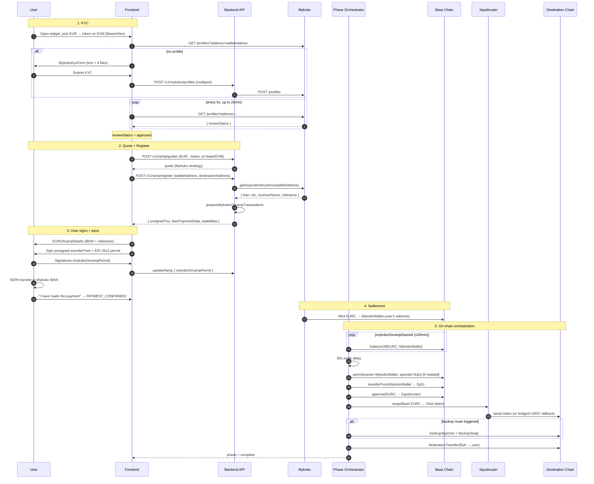
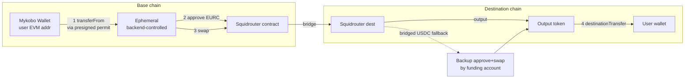
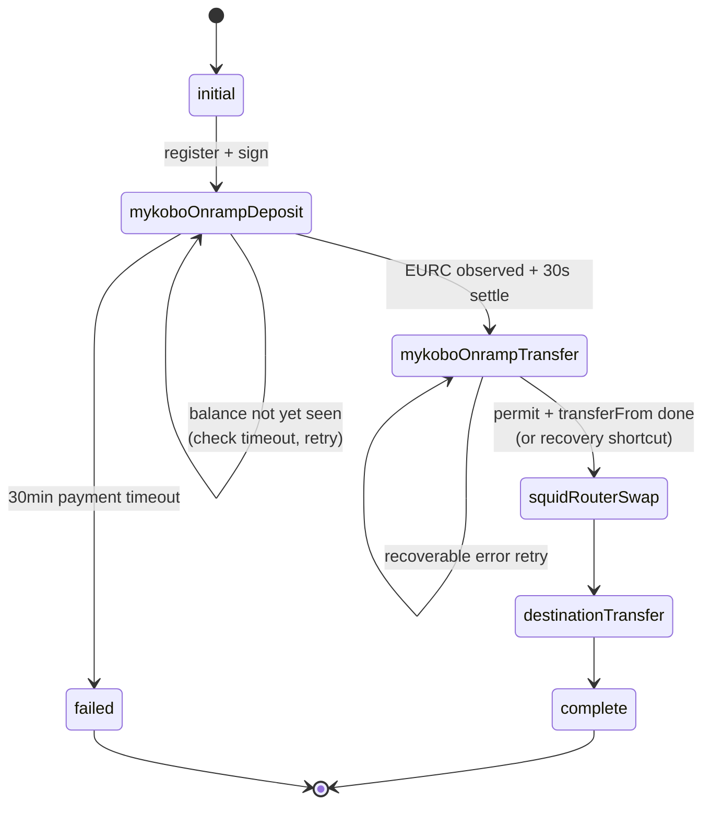
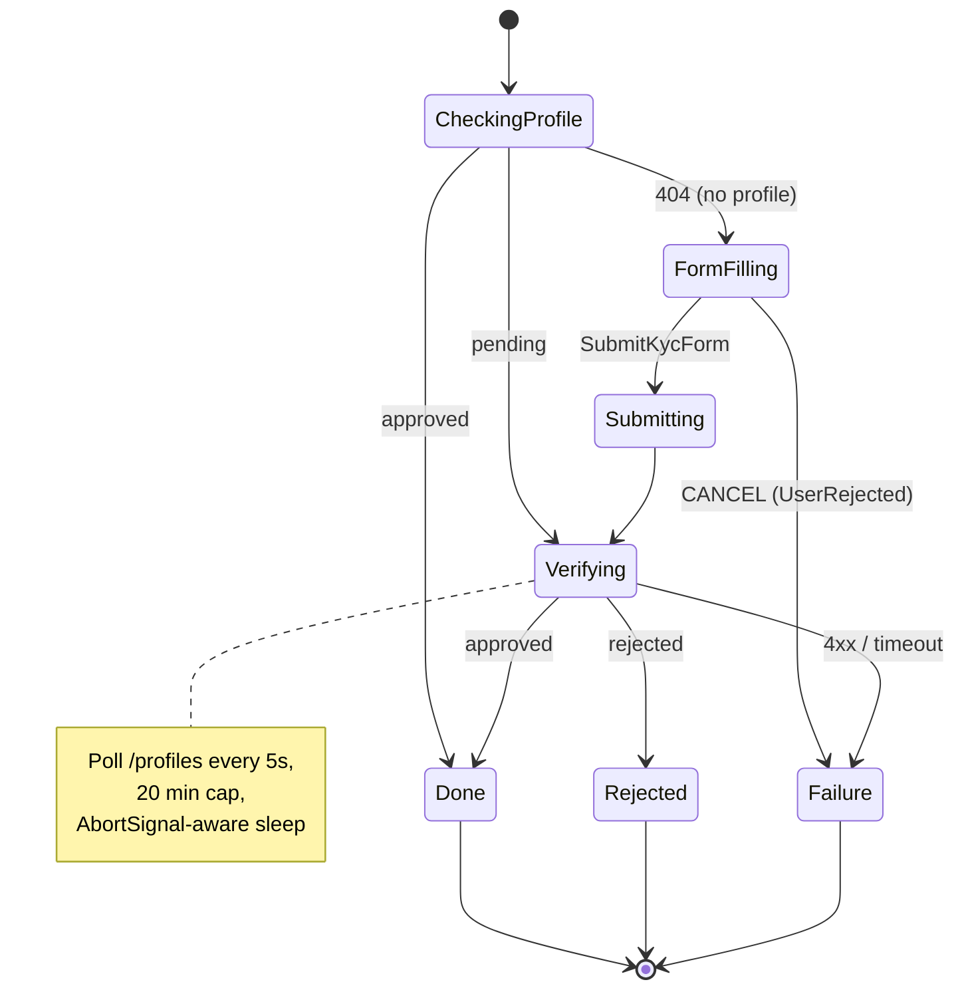
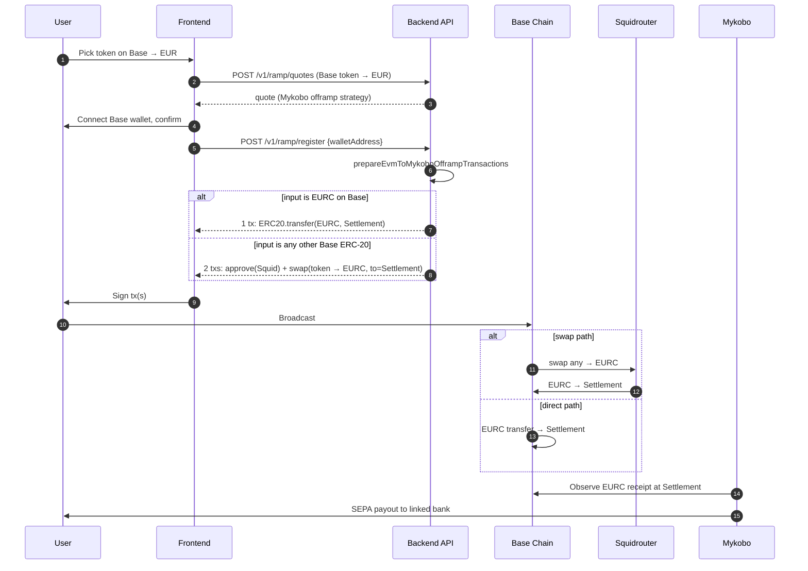
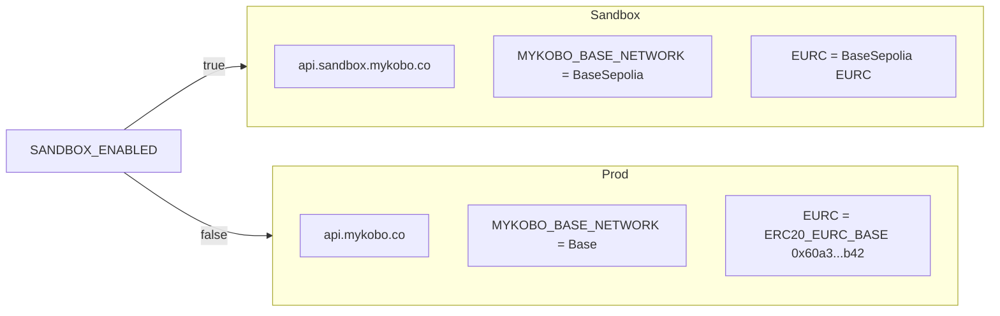

# Mykobo + EURC-on-Base — Flow Charts

Companion to `mykobo-base-flow.md`. Diagrams render via Mermaid.

---

## Legend

| Symbol | Meaning |
|---|---|
| `User` | End user (browser + bank account + EVM wallet on Base) |
| `FE` | Frontend (`apps/frontend`) — React + XState |
| `API` | Backend (`apps/api`) — Express + Sequelize |
| `Phases` | Phase orchestrator + handlers (`apps/api/.../phases`) |
| `Mykobo` | Mykobo API (`api.mykobo.co` / sandbox) — KYC + EURC settlement |
| `Base` | Base / BaseSepolia EVM chain |
| `Squid` | Squidrouter (cross-chain swap aggregator) |
| `Dest` | Destination EVM chain (e.g. Arbitrum, Polygon) |
| `Eph` | Backend-controlled EVM ephemeral (transient wallet for this ramp) |
| `MykoboWallet` | User's EVM wallet on Base where Mykobo mints EURC |
| `Settlement` | `MYKOBO_SETTLEMENT_ADDRESS` (Mykobo's collector on Base) |

---

## 1. BUY (Onramp) — Fiat → EURC on Base → destination token

### 1.1 High-level sequence



### 1.2 Transaction graph on Base ephemeral



### 1.3 Phase state machine (backend)



### 1.4 KYC machine (frontend — `mykoboKyc.machine.ts`)



---

## 2. SELL (Offramp) — token on Base → EURC on Base → SEPA payout



---

## 3. Routing decision (BUY vs SELL, Mykobo vs Monerium)

```mermaid
flowchart TD
    Q[Incoming quote] --> D{direction?}
    D -->|BUY| B{inputCurrency = EURC<br/>AND isBaseEvmNetwork(quote.to)?}
    D -->|SELL| S{outputCurrency = EURC<br/>AND isBaseEvmNetwork(quote.from)?}
    B -->|yes| BM[Mykobo onramp strategy]
    B -->|no| BO[Monerium / other]
    S -->|yes| SM[Mykobo offramp strategy]
    S -->|no| SO[Monerium / other<br/>requires moneriumAuthToken]
```

---

## 4. SANDBOX_ENABLED switching

