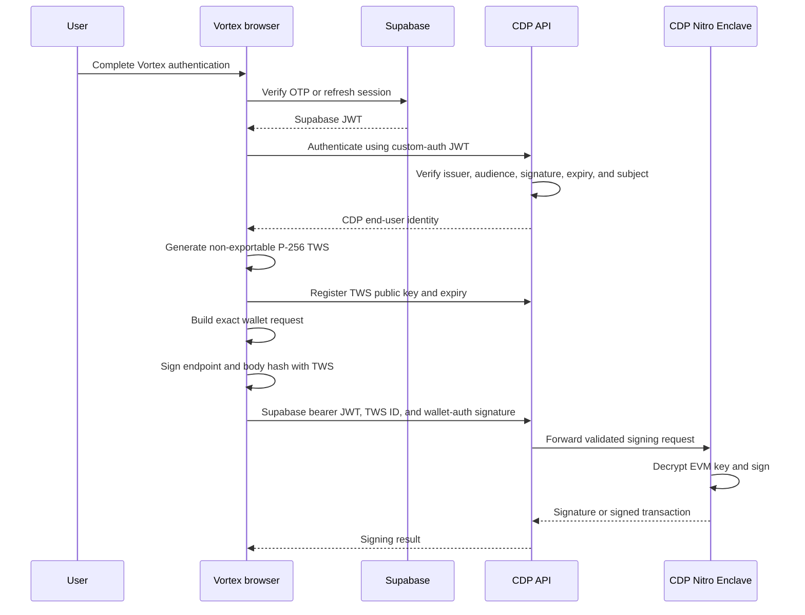
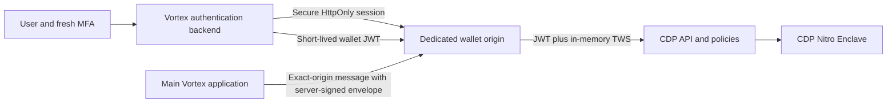

# CDP Embedded Wallet Security Assessment and Hardening Plan

## Status

- Date: 2026-07-29
- Owner: Vortex
- Scope: Coinbase Developer Platform (CDP) end-user EVM wallets authenticated with Supabase custom auth
- Status: Research and spike findings; not yet the implemented Vortex security specification
- SDK inspected: `@coinbase/cdp-core`, `@coinbase/cdp-hooks`, and `@coinbase/cdp-react` `0.0.119`

This document records the security model established during the CDP spike, the current risks, and the controls required
before enabling CDP embedded wallets in production. It deliberately separates:

1. behavior documented by Coinbase;
2. implementation details observed in the pinned SDK version;
3. Vortex design requirements and recommendations.

Implementation must eventually produce or replace the corresponding file in `docs/security-spec/01-auth/` and update
the security-spec module index. This plan must not be treated as proof that the controls below already exist.

## Executive Summary

The user's EVM private key is not stored in Vortex, Supabase, browser `localStorage`, or ordinary CDP application
servers in plaintext. Coinbase documents that:

- plaintext private-key operations occur only inside an AWS Nitro Enclave;
- the private key is generated, decrypted, and used for signing inside that enclave;
- end-user requests are authorized with a device-specific Temporary Wallet Secret (TWS).

Because the enclave has no persistent storage, CDP must persist encrypted wallet material outside the enclave. CDP's
server-wallet documentation identifies that location as its database, but the public end-user-wallet documentation
does not describe the exact ciphertext storage or key-wrapping construction. That detail must be confirmed with
Coinbase rather than inferred to be identical across wallet products.

The TWS is not the EVM private key. It is a P-256 request-authorization key that allows the browser to prove that a
wallet request came from a registered user device. Signing requires both:

1. a valid end-user access token, which in Vortex custom auth is the Supabase JWT; and
2. a valid registered TWS signature over the specific CDP request.

This is stronger than protecting the wallet with a bearer token alone, but it does not make a stolen Supabase session
safe. A valid identity JWT can authenticate the attacker as the same CDP user and may let the attacker register a new
TWS. An XSS running inside Vortex is more dangerous still: it can invoke the existing CDP signing methods without
extracting either the TWS or the EVM private key.

The Vortex backend's CDP API key or Wallet Secret does not gate normal end-user signing. It becomes signing authority
only for server-controlled wallets or after an end user explicitly enables delegated signing. Vortex should keep
delegated signing disabled.

## Confirmed CDP Custody Model

### Actual blockchain private key

Coinbase documents the following lifecycle, with one noted inference:

1. A wallet private key is generated inside a Trusted Execution Environment (TEE).
2. The key is encrypted/decrypted only inside the enclave. Because the enclave has no persistent storage, an encrypted
   representation must persist elsewhere in CDP infrastructure. CDP explicitly identifies its database for server
   wallets; the exact end-user-wallet storage and wrapping design is not public.
3. An authenticated signing request is forwarded to an AWS Nitro Enclave over VSOCK.
4. The enclave verifies the wallet authorization, decrypts the private key, and signs.
5. The plaintext key does not leave the enclave during ordinary signing.
6. Only the signature or signed transaction is returned.

The enclave has no persistent storage, interactive access, or external networking. Coinbase states that CDP, AWS, and
infrastructure administrators cannot inspect the plaintext private-key operation.

This architecture makes CDP a critical availability and security dependency even though Coinbase describes the wallet
as non-custodial. In practical terms:

- CDP infrastructure holds or can retrieve the encrypted private-key material.
- The enclave temporarily holds and uses the plaintext private key.
- The end user's authenticated browser controls when signing is authorized.
- Vortex does not hold the EVM private key or ordinary signing authority.
- The user can obtain the EVM private key through the explicit export flow.

The term "non-custodial" is Coinbase's product classification. Vortex should obtain legal advice before relying on that
classification for regulatory or contractual purposes.

### Temporary Wallet Secret

Coinbase describes the TWS as device-specific P-256 key material generated and stored locally. It plays the same
request-authentication role for an end user that a backend Wallet Secret plays for an API-key wallet.

Signing-related End User Account endpoints require a registered TWS. A TWS:

- is generated on the browser or device;
- must be registered with CDP before use;
- has an explicit `validUntil`;
- is one of at most five registered TWS credentials per end user;
- authenticates signing requests but is not the blockchain private key.

### Request authorization

The inspected web SDK registers the TWS public key with CDP. For each protected request, it signs an ES256 wallet-auth
JWT containing:

- the intended HTTP method, host, and path;
- a hash of the request body when a body is present;
- issue time, not-before time, and a random JWT ID.

This binding prevents a wallet-auth signature created for one request body or endpoint from being reused for a
different request. It does not validate whether the transaction is sensible for Vortex; CDP policies and Vortex's own
payload validation must do that.

## Storage in the Current Spike

The following table describes the observed behavior of the pinned SDK and the current Vortex spike. SDK internals are
not a stable API and must be re-audited whenever the CDP packages change.

| Material | Current location | JavaScript-readable? | Persistence |
| --- | --- | --- | --- |
| EVM private key | Encrypted in CDP storage; plaintext only inside the enclave during normal operations | No | Persistent at CDP |
| TWS private key | Non-exportable browser `CryptoKey` in the CDP SDK's in-memory auth manager | It cannot be exported, but same-origin code can ask the SDK to use it | Lost on reload; recreated as needed |
| TWS public key and ID | Registered with CDP | Public metadata | Until its CDP expiry/removal |
| Supabase access token | Vortex `localStorage` | Yes | Across reloads |
| Supabase refresh token | Vortex `localStorage` | Yes | Across reloads |
| CDP custom-auth access token | The Supabase JWT returned by Vortex's `getJwt` callback | Yes | Determined by Vortex's Supabase storage |
| CDP project ID | Frontend configuration | Yes; it is not a secret | In the built application |
| Backend CDP API key or Wallet Secret | Not required for the current end-user signing path | Must remain server-only if later introduced | Secret manager only |
| Exported EVM private key | Displayed to the user in CDP's isolated export flow | Vortex code must not receive it | User-controlled after export |

The spike stores the complete Supabase access/refresh session in
[`apps/cdp-spike/src/auth.ts`](../../apps/cdp-spike/src/auth.ts). The existing frontend also stores the access and
refresh tokens in [`apps/frontend/src/services/auth.ts`](../../apps/frontend/src/services/auth.ts). This is a Vortex
choice, not a requirement imposed by the CDP wallet architecture.

### Pinned SDK implementation observation

In `@coinbase/cdp-core@0.0.119`:

- the web TWS is generated with `window.crypto.subtle.generateKey`;
- the curve is P-256;
- the private key is created with `extractable: false`;
- the only permitted private-key operation is signing;
- the TWS object is stored on the in-memory authentication manager;
- the TWS is cleared when the authentication state is cleared;
- a page reload causes a new TWS to be generated and registered when signing is next needed;
- custom auth asks the configured `getJwt` callback for the current external JWT on requests.

The package contains a general web storage adapter backed by `localStorage` for CDP-managed refresh tokens. The
custom-auth manager used by this spike does not use CDP's refresh-token lifecycle; it obtains the Supabase JWT through
Vortex's callback. The security-critical persistent browser values in the spike are therefore the Supabase access and
refresh tokens stored by Vortex.

Non-exportability prevents JavaScript from serializing the TWS private key. It does not stop same-origin malicious
JavaScript from calling the public CDP signing methods while the legitimate SDK session is active.

### Export caveat to resolve

The spike uses CDP's `ExportWalletModal`, and Coinbase documents this user-wallet export as a secure isolated iframe
whose raw key is not visible to application code.

The inspected `@coinbase/cdp-core@0.0.119` bundle also exports a lower-level `exportEvmAccount` function whose
implementation appears to return the decrypted private key to its JavaScript caller. Before production, Vortex must:

1. use only `ExportWalletModal` or the documented isolated-iframe hook;
2. prohibit imports of direct/programmatic user-key export functions;
3. confirm with Coinbase whether `exportEvmAccount` is supported for browser end-user wallets and how its behavior is
   reconciled with the documented iframe-only guarantee;
4. re-audit this behavior after every CDP SDK upgrade.

## Authentication and Signing Flow

This flow does not include a Vortex backend secret. Normal end-user signing is deliberately possible while the user is
present in the browser. A backend CDP Wallet Secret is used only for API-key wallets or active delegated signing.

## Threat Model

### Assets

- User wallet funds and token allowances
- EVM wallet private key and exported recovery material
- Supabase access and refresh sessions
- Browser TWS credentials
- Server-issued ramp transactions and typed-data payloads
- CDP project configuration, policies, origins, and delegation settings
- Any future CDP backend API keys and Wallet Secrets

### Compromise impact

| Compromise | Expected impact |
| --- | --- |
| Supabase access JWT | Attacker can call Vortex APIs as the user and may authenticate/register a CDP device while the JWT is accepted |
| Supabase refresh token | Attacker may maintain access by rotating the session until it is detected or revoked |
| XSS on an allowlisted Vortex origin | Attacker can call CDP signing methods through the live session without extracting keys |
| Malicious frontend deployment or dependency | Equivalent to origin-wide XSS, potentially affecting every active wallet user |
| TWS alone | Can authorize CDP requests only while registered and when combined with valid end-user authentication |
| CDP backend Wallet Secret with delegation disabled | Does not authorize ordinary end-user wallet signing |
| CDP backend Wallet Secret with active delegation | Allows backend signing within the delegation's scope and lifetime |
| CDP project administration | Attacker may weaken policies, origins, MFA, or delegation configuration |
| User-exported EVM key | Full permanent wallet control independent of CDP, Supabase, and Vortex |

### Important attack paths

#### Stolen Supabase bearer token

CDP custom auth treats the configured JWT subject as the wallet identity. A valid stolen JWT is therefore part of the
wallet security boundary, even though it is not the EVM private key.

A short JWT lifetime reduces the authentication window, but any signature created during that window may have
permanent onchain effect. Logging out does not necessarily invalidate an already-issued JWT before its expiry.

#### Stolen refresh token

The current Vortex and spike implementations expose the renewable Supabase session to all same-origin JavaScript.
Refresh-token rotation and replay detection limit some reuse scenarios, but an attacker that performs the first valid
exchange can still take over the session.

Encrypting a refresh token before placing it in `localStorage` is not an effective XSS defense if the same JavaScript
origin can access the decryption path or invoke the wallet directly.

#### Same-origin XSS

This is the highest browser risk. Malicious JavaScript does not need to export the non-extractable TWS. It can invoke
the SDK's signing functions, reuse the current Supabase session, fake Vortex's confirmation UI, or request wallet
export.

Domain allowlisting does not stop this attack because the code runs on an already-allowed origin.

#### Arbitrary onchain action outside Vortex

Vortex's API-side signer, ownership, ramp, transaction-hash, and receipt checks protect the ramp workflow. They do not
prevent an attacker with wallet authority from bypassing Vortex and signing:

- a direct asset transfer;
- an ERC-20 approval;
- an EIP-2612 or Permit2 authorization;
- an arbitrary contract call;
- a message or hash accepted by another protocol.

Lack of gas is not a security boundary. An attacker can pay gas or relay a gasless permit.

#### Delegated signing

Delegated signing intentionally lets the Vortex backend act without the user being online. Enabling it would turn the
backend Wallet Secret into wallet signing authority and substantially increase the impact of a backend compromise.
It is not required for the intended Vortex flow.

## Required Security Invariants

1. The Vortex API, database, logs, Sentry, and analytics MUST never receive the user's EVM private key or TWS private
   key.
2. CDP delegated signing MUST remain disabled unless separately designed, reviewed, approved, and documented.
3. A CDP project ID MUST be treated as public configuration, never as authorization.
4. Every CDP signing request MUST require a valid user session and a registered TWS.
5. Vortex MUST use fail-closed CDP policies for every enabled signing operation.
6. Vortex MUST reject arbitrary message, raw-hash, typed-data, and transaction signing that is not needed by a
   documented ramp flow.
7. Both direct CDP send operations and raw-transaction signing operations MUST be covered by policy and tests.
8. Every server-issued payload MUST bind the Supabase profile, CDP user, checksummed signer, chain, contract, ramp,
   amount, destination or spender, expiry, and one-time nonce.
9. The frontend MUST sign the exact frozen server-issued payload. Any mutation MUST invalidate confirmation and require
   a new server payload.
10. Token approvals and permits MUST use the exact required amount and a short deadline. Unlimited approvals are
    prohibited.
11. The user MUST see and explicitly confirm a human-readable summary before each signing batch.
12. Wallet creation, device enrollment, export, and high-risk signing MUST require step-up authentication.
13. Production CDP origins MUST be exact HTTPS origins. Development origins MUST not exist in the production project.
14. Vortex MUST use only the secure isolated-iframe export UI and MUST prevent programmatic raw-key export.
15. Upgrading a CDP SDK package MUST trigger a review of token storage, TWS creation/persistence, export, MFA, and
    policy behavior.

## Recommended Target Architecture

### Session and wallet-token broker

Move the renewable Supabase session out of general frontend JavaScript:

- keep the refresh session in a `Secure; HttpOnly; SameSite` cookie;
- validate the current Supabase session and `session_id` on the backend;
- require a fresh `aal2` or WebAuthn assertion for device enrollment, export, and high-risk actions;
- issue a short-lived ES256 Vortex wallet JWT with the stable Supabase user ID in `sub`;
- configure CDP custom auth to trust the Vortex wallet issuer and JWKS;
- keep the short-lived wallet JWT in memory and never place a refresh token in the wallet origin.

An HttpOnly cookie does not by itself stop same-origin XSS from making authenticated requests. It primarily prevents
portable token exfiltration and must be combined with origin isolation, CSP, confirmation, MFA, and CDP policies.

### Dedicated signing origin

Host the CDP SDK in a small, dedicated origin such as `wallet.vortexfinance.co`:

- allowlist only this origin in the production CDP project;
- do not load analytics, tag managers, chat widgets, or unrelated application code;
- apply a strict CSP;
- do not share the main application's JavaScript-readable storage;
- accept messages only from exact approved Vortex origins;
- accept only a backend-signed, expiring payload envelope;
- independently validate and render the payload;
- require an explicit user action before signing;
- return only the signature or transaction hash to the main application.

This makes compromise of the main Vortex UI less likely to become silent wallet authority. The wallet origin still
requires its own careful XSS and supply-chain controls.

### Server-signed payload envelope

The API should issue a canonical envelope containing at least:

- profile ID;
- CDP user ID;
- wallet address;
- ramp and quote IDs;
- chain ID;
- operation type;
- exact transaction or typed-data payload hash;
- human-readable amount, token, recipient, spender, and contract;
- issued-at and short expiry;
- one-time nonce;
- API signature and key ID.

The signing origin must verify the API signature, expiry, one-time status, signer, and payload hash before presenting
confirmation. The API must consume the nonce atomically when accepting the resulting signature or transaction.

## Hardening Work

### P0: Required before any production funds

- Create separate CDP staging and production projects.
- Keep delegated signing disabled.
- Configure exact production HTTPS origins and remove all development origins.
- Install fail-closed CDP policies for both `sign` and `send` paths.
- Allow only supported networks, contracts, transaction value, methods, and arguments.
- Reject raw-hash and general message signing.
- Restrict typed-data verification contracts and validate every permit field in Vortex.
- Enable CDP MFA for protected wallet operations.
- Require explicit transaction review and confirmation.
- Add a strict frontend Content Security Policy; deploy report-only first, then enforce.
- Remove unnecessary third-party scripts from wallet-capable pages.
- Prohibit direct/programmatic private-key export.
- Add alerts and a kill switch for wallet creation, signing, sending, export, and policy changes.
- Add regression tests for signer binding, payload mutation, replay, wrong chain, wrong contract, excessive approval,
  and typed-data spender substitution.

### P1: Recommended production architecture

- Replace JavaScript-readable Supabase refresh tokens with a backend-managed HttpOnly session.
- Introduce the short-lived Vortex wallet-token broker.
- Isolate CDP and TWS handling on a dedicated wallet origin.
- Add backend-signed, expiring, one-time signing envelopes.
- Require fresh WebAuthn, passkey, or TOTP step-up for new device enrollment, exports, and value thresholds.
- Provide "log out all devices" and security-event notifications.
- Verify live Supabase session state for sensitive backend operations instead of trusting JWT expiry alone.

### P2: Higher-assurance controls

- Consider smart-account onchain spending policies if they support every required Vortex chain and flow.
- Add per-user and per-period transaction limits with manual review above thresholds.
- Add anomaly detection for new devices, rapid signing, unusual chains, contracts, destinations, or export attempts.
- Conduct an independent penetration test focused on stored XSS, dependency compromise, iframe messaging, CSP bypass,
  token theft, and signing-envelope substitution.

## CDP Policy Requirements

Policies must cover every CDP method that the final integration enables, including:

- EVM transaction signing;
- EVM transaction sending;
- EVM typed-data signing;
- EVM message signing, if any use is explicitly approved;
- EVM hash signing, which should be denied;
- wallet export, MFA, and delegation configuration where CDP supports controls.

For transactions, policy should restrict:

- network;
- recipient contract;
- native value;
- function selector;
- primitive function arguments when supported;
- rate or value limits.

For typed data, CDP's documented policy support may not validate all nested permit fields. Vortex must independently
validate:

- domain chain ID;
- verifying contract;
- token owner;
- spender;
- amount;
- nonce;
- deadline;
- Permit2 witness or other nested data.

CDP policy behavior must be tested against the exact Vortex EIP-712 fixtures before rollout.

## Browser Hardening Requirements

At minimum:

- `default-src 'none'`;
- explicit self-hosted `script-src` without `unsafe-eval`;
- remove `unsafe-inline` or replace it with nonces or hashes;
- exact `connect-src` for Vortex, Supabase, CDP, and approved RPC endpoints;
- exact `frame-src` for CDP's secure export origin;
- restrictive `frame-ancestors`;
- `object-src 'none'`;
- `base-uri 'none'`;
- `form-action 'self'`;
- CSP reporting and alerting;
- dependency lockfile enforcement and automated vulnerability review;
- no rendering of untrusted HTML;
- Trusted Types where feasible.

The final policy must be derived from observed production requests. Broad wildcards should not be introduced merely
to silence CSP errors.

## Monitoring and Incident Response

Record security events without tokens, signatures, raw transactions, private keys, TWS IDs, or complete wallet
addresses:

- wallet creation or restoration;
- new TWS/device registration, if exposed by CDP telemetry;
- MFA enrollment and verification failures;
- signing and sending by operation, chain, and result;
- policy denials;
- export initiation and completion;
- delegation creation attempts;
- CDP origin, MFA, or policy configuration changes;
- session refresh replay or invalid-session events.

For a suspected wallet-origin or session compromise:

1. Disable new CDP wallet provisioning and Vortex wallet signing.
2. Apply or verify a deny-all CDP policy for affected operations.
3. Remove compromised origins from the CDP project.
4. Revoke affected Supabase sessions and require fresh MFA.
5. Disable or revoke any active delegations.
6. Rotate CDP backend keys only if those credentials may be affected.
7. Preserve audit evidence without logging sensitive payloads.
8. Notify affected users and provide asset-migration guidance when wallet authority may be compromised.

Deleting Vortex wallet metadata is not a security response and may hinder recovery.

## Open Questions for Coinbase

These questions should be resolved before production approval:

1. Can a valid custom-auth JWT always register a new TWS, and what controls can require MFA specifically for new TWS
   registration?
2. Can users or developers list and revoke individual TWS/device registrations?
3. What is the exact TWS lifetime for custom auth, and is it bounded by the external JWT's `exp`?
4. How are stale TWS credentials removed after the five-device limit is reached?
5. Does the Web SDK guarantee that the browser TWS remains memory-only and non-exportable, or is that merely the
   current `0.0.119` implementation?
6. Why does the installed core SDK expose a direct `exportEvmAccount` path if user exports are documented as always
   occurring in an isolated iframe?
7. Which policy criteria are enforced for EIP-712 nested fields, including Permit2 spender, amount, deadline, and
   witness data?
8. Are policy updates, origin changes, MFA changes, and delegation changes available through immutable audit logs and
   webhooks?
9. What incident controls can immediately disable all signing for one user without disabling the whole project?
10. Does the end-user wallet use the same encrypted database storage described for server wallets, and what keys or
    authorization material gate decryption inside the enclave?
11. Which penetration-test, SOC, key-management, enclave-attestation, and disaster-recovery reports can Coinbase share
    under NDA?

## Verification Checklist

- [ ] The CDP package version is pinned and its storage/TWS/export behavior has been re-audited.
- [ ] Supabase access and refresh tokens are absent from `localStorage` and `sessionStorage`.
- [ ] No CDP or Vortex secret exists in built frontend assets.
- [ ] Delegated signing is disabled and tested.
- [ ] Staging and production have separate CDP projects and policies.
- [ ] Production contains only exact HTTPS origins.
- [ ] CDP policy tests deny unsupported networks, contracts, functions, values, and signing methods.
- [ ] Typed-data tests reject substituted signer, spender, token, amount, nonce, deadline, domain, and chain.
- [ ] Raw-transaction tests reject substituted destination, calldata, value, nonce, gas, and chain.
- [ ] Signing requires an unexpired one-time API envelope.
- [ ] The user sees and confirms the exact signing summary.
- [ ] MFA and fresh step-up are required for device enrollment, export, and high-risk signing.
- [ ] Strict CSP is enforced and monitored.
- [ ] Only the secure isolated-iframe export path is reachable.
- [ ] Logging and Sentry contain no wallet secrets or raw signing payloads.
- [ ] Session-revocation, policy-denial, origin-removal, and feature-kill-switch drills have passed.
- [ ] The matching security specification and module index are updated before implementation merges.

## References

### Coinbase

- [CDP wallet security and TEE architecture](https://docs.cdp.coinbase.com/wallets/security-and-policies/security-overview)
- [CDP server-wallet security architecture](https://docs.cdp.coinbase.com/wallet-api-v2/docs/security)
- [End User Accounts and Temporary Wallet Secrets](https://docs.cdp.coinbase.com/api-reference/v2/rest-api/end-user-accounts/end-user-accounts)
- [Custom authentication](https://docs.cdp.coinbase.com/wallets/authentication/custom-authentication)
- [Authentication methods](https://docs.cdp.coinbase.com/wallets/authentication/overview)
- [Non-custodial wallet overview](https://docs.cdp.coinbase.com/wallets/non-custodial-wallets/overview)
- [Import and export](https://docs.cdp.coinbase.com/wallets/using-wallets/import-and-export)
- [Domain allowlisting](https://docs.cdp.coinbase.com/wallets/security-and-policies/domain-allowlisting)
- [Policy Engine](https://docs.cdp.coinbase.com/wallets/security-and-policies/policy-engine/overview)
- [EVM policy criteria](https://docs.cdp.coinbase.com/wallets/security-and-policies/policy-engine/evm-policies)
- [MFA](https://docs.cdp.coinbase.com/wallets/authentication/mfa/overview)
- [Delegated signing](https://docs.cdp.coinbase.com/wallets/using-wallets/delegated-signing)

### Supabase

- [User sessions](https://supabase.com/docs/guides/auth/sessions)
- [JWT claims](https://supabase.com/docs/guides/auth/jwt-fields)
- [Multi-factor authentication](https://supabase.com/docs/guides/auth/auth-mfa)
- [Server-side authentication guidance](https://supabase.com/docs/guides/auth/server-side/advanced-guide)

### Vortex evidence

- [CDP spike package versions](../../apps/cdp-spike/package.json)
- [CDP spike Supabase session storage](../../apps/cdp-spike/src/auth.ts)
- [CDP spike wallet and export flow](../../apps/cdp-spike/src/WalletSpike.tsx)
- [Current frontend authentication storage](../../apps/frontend/src/services/auth.ts)
- [Embedded-wallet security specification](../security-spec/01-auth/cdp-embedded-wallets.md)
