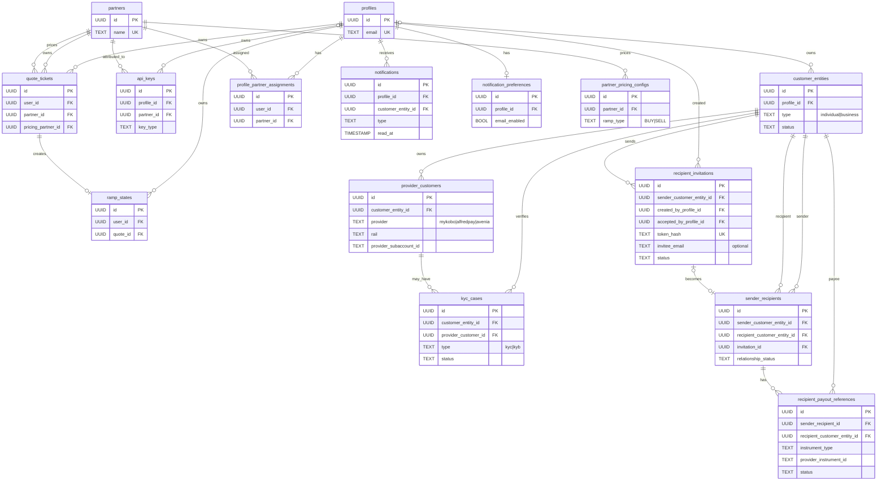

# Plan — Connect `apps/dashboard` to the live backend, realizing the full unified schema

**Status:** Approved plan, not yet implemented.
**Goal:** Turn `apps/dashboard` into a real consumer of the same API + shared package the
frontend uses, **and** realize the complete target data model from the two architecture docs:
- `docs/architecture/unified-user-management-schema.md`
- `docs/architecture/recipient-transfers-schema.md`

Those two documents are the **schema source of truth** (column-level detail lives there). This
plan is *how we realize them* — the phasing, the code that must change in lockstep, the
dashboard wiring, and the product decisions layered on top.

---

## 0. Table of contents
1. Guiding properties
2. Decisions & refinements (what we settled)
3. Compatibility — why the frontend & SDK survive
4. The full target schema (both docs)
5. Phased migration plan (Phase 0 connects the core; Phase 1 recipient product; 2–6 identity cleanup)
6. Onboarding = hand off to the frontend widget (`kybLocked`)
7. Recipient routes + transfer eligibility
8. Notifications & email (beyond the docs)
9. `packages/shared` + `apps/dashboard` workstreams
10. Security-spec sync
11. Sequencing
12. Risks & still-open decisions

---

## 1. Guiding properties

- **Additive, migrate-once, cut over.** Every phase adds the new tables, backfills them with a
  **one-time data migration**, then points production reads at them (`add → backfill → cut over
  reads`). **No dual-write and no parity-gated drop:** legacy tables are left in place as a
  read-only **backup** (not kept in sync, not dropped), so a bad cut-over can be re-migrated
  rather than rolled forward.
- **Frontend & SDK safe throughout.** Responses are hand-built field-by-field in
  `apps/api/src/api/services/quote/engines/finalize/index.ts` (`buildQuoteResponse`) and
  `apps/api/src/api/services/ramp/ramp.service.ts` (`GetRampStatusResponse`); they emit computed
  values, never the raw columns we change. `partnerId`/`apiKey`/`taxId` are **outbound** request
  fields, never read from a response. So even the identity refactor is invisible to consumer
  apps. The **internal** code (resolution, provider services, admin endpoints) changes in
  lockstep — that is the real risk, not consumer breakage.
- **Migration mechanics.** Umzug v3 + Sequelize v6 (`apps/api/src/database/migrator.ts`),
  files `apps/api/src/database/migrations/NNN-kebab.ts` with `up`/`down`, camelCase attrs +
  `field:` snake_case. Migrations **034–037 landed since this plan was written** (api-key
  `user_id`, nullable `partner_name`, subsidy-token changes) — new files start at **038**. A
  proxy already makes `createTable`/`addColumn` idempotent. Every new table must
  `ENABLE ROW LEVEL SECURITY` — Supabase's `ALTER DEFAULT PRIVILEGES` grants
  anon/authenticated ALL on future public tables, and RLS-with-no-policies is what keeps
  PostgREST out.
- **Dashboard ships first — and fast.** Phase 0 connects the dashboard's core flow to the
  existing backend with **no migrations**; Phase 1 adds the recipient product (additive); the
  identity cleanup (Phases 2–6) follows without holding the dashboard back.

---

## 2. Decisions & refinements (what we settled)

These refine or resolve open questions in the two docs.

| # | Topic | Decision |
| :-- | :-- | :-- |
| D1 | **Invite model** | **Link-based, not email.** `token_hash` is the primary redemption key; `invitee_email` is optional metadata; acceptance is **token-bound** (match email only if one was recorded). Refines `recipient-transfers-schema.md` (which was email-first) to match the shipped dashboard (`apps/dashboard/src/domain/recipient.ts`). |
| D2 | **Recipient onboarding** | A recipient is a full `customer_entity` and onboards through the **frontend widget** via `?kybLocked=<region>` — same KYC/KYB as senders, no dashboard KYC UI. Resolves recipient-doc open-Q "onboarding reusable across senders" → **yes** (recipient owns their own entity/onboarding). |
| D3 | **Payout instrument** | `recipient_payout_references` is a **thin pointer** — `provider_instrument_id` + masked label to a provider-side instrument (AlfredPay `fiatAccounts`, BRLA PIX key). No reusable payout PII stored. Resolves recipient-doc open-Q "multiple refs per corridor" → single verified reference per corridor for v1. |
| D4 | **Multi-account** | **Not in v1.** One `customer_entity` per profile (individual *or* business). Switching accounts = logout/login. Resolves unified-doc open-Q "multiple customer_entities per profile" → **no, for v1** (schema stays capable via a non-unique `profile_id`). |
| D5 | **Per-corridor status** | A single read surface (`GET /v1/onboarding/status`) that returns `[{country, rail, status}]`. Pre-Phase-3 it fans out over the existing provider tables; post-Phase-3 it's a clean query over `provider_customers` + `kyc_cases`. |
| D6 | **Status column type** | New status columns use **`VARCHAR` + `CHECK`**, not Postgres `ENUM` — these product states will gain values and `CHECK` is far easier to evolve. (Deliberate, documented deviation from the older ENUM tables.) |
| D7 | **Email** | **Supabase**, matching the frontend. Note: Supabase's mailer is auth-template-oriented, so transactional/status emails go via its SMTP config or an edge function — not a one-liner. |
| D8 | **Subaccount ownership** | The unified doc's ownership invariant is **in scope** (Phase 5), not a separate side-fix. |

**Still open (need a human — flagged in §12):** tax-ID global-uniqueness semantics; KYC/failure-payload retention; retention when a profile is deleted but compliance records must remain; whether payout details are editable pre-approval.

---

## 3. Compatibility — why the frontend & SDK survive

| Consumer | Reaches the API via | Verdict | Evidence |
| :-- | :-- | :-- | :-- |
| **apps/dashboard** | replacing its own mocks | Safe by construction | owns the changed code |
| **apps/frontend** | HTTP; `partnerId`/`apiKey`/`taxId` outbound only | **Safe** | responses DTO-mapped; never exposes `partner_name`/`buy_partner_id`/`tax_id`/provider columns |
| **packages/sdk** | same shared DTOs | **Safe** | no provider/partner/tax columns anywhere in `packages/sdk/src` |
| **/v1/admin/\*** | serializes raw columns (`partnerName`, `buyPartnerId`…) | **Changes in lockstep** | Phase 2/4 update these; not called by either app |

The only consumer-visible change is the **new** `@vortexfi/shared/types` export (additive; `"."`
untouched) and **new** routes. Every existing endpoint keeps its response shape.

---

## 4. The full target schema (both docs)

Column-level definitions are in the two architecture docs; this is the inventory with our
refinements. Legend: **KEEP · SPLIT · FOLD · REFACTOR · NEW**.

### From `unified-user-management-schema.md`
| Table | Action | Notes / refinement |
| :-- | :-- | :-- |
| `profiles` | KEEP | login identity only |
| `customer_entities` | **NEW** | owner anchor; one per profile in v1 (D4) |
| `partners` | **SPLIT** | → `partners` (unique `name`) + `partner_pricing_configs` |
| `partner_pricing_configs` | **NEW** | per `ramp_type`; `UNIQUE(partner_id, ramp_type)` |
| `profile_partner_assignments` | REFACTOR | collapse `buy/sell_partner_id` → one `partner_id` |
| `api_keys` | REFACTOR | drop `partner_name`; add `partner_id` FK + `profile_id` |
| `mykobo_customers` | **FOLD** | → `provider_customers` (`provider=mykobo`) |
| `alfredpay_customers` | **FOLD** | → `provider_customers` (`provider=alfredpay`) |
| `tax_ids` | **SPLIT** | Avenia subaccount → `provider_customers`; KYC workflow → `kyc_cases` |
| `kyc_level_2` | **REPLACE** | → `kyc_cases` (note: `kyc_level_2` is dead in `apps/api` — replace, don't migrate data unless a read is found) |
| `provider_customers` | **NEW** | unified rail account; `customer_entity_id` NOT NULL; uniques per doc |
| `kyc_cases` | **NEW** | unified KYC/KYB attempts; `type` ∈ {kyc, kyb} |
| `quote_tickets` | KEEP | `partner_id`/`pricing_partner_id` now point at new `partners` |
| `ramp_states` | KEEP | — |

Apply **D6** (`VARCHAR`+`CHECK`) to the new status columns on `customer_entities`,
`provider_customers`, `kyc_cases`.

### From `recipient-transfers-schema.md`
| Table | Action | Notes / refinement |
| :-- | :-- | :-- |
| `recipient_invitations` | **NEW** | **link-based** (D1): `token_hash` primary, email optional |
| `sender_recipients` | **NEW** | `UNIQUE(sender, recipient)` |
| `recipient_payout_references` | **NEW** | thin pointer (D3) |
| `transfer_eligibility` | **NEW** | view/function *or* service — see §7 |

### Beyond the docs (dashboard need)
| Table | Action | Notes |
| :-- | :-- | :-- |
| `notifications` | **NEW** | in-app feed (§8) |
| `notification_preferences` | **NEW** | per-profile prefs (§8) |

### 4.1 Invariants, principles & non-goals carried from the docs

**Ownership invariant (unified doc):** an Avenia subaccount (`provider_customers`,
`provider=avenia`) is owned by exactly one `customer_entity` and usable only by a principal that
owns it. **Principal resolution** — UI: Supabase token → `profile` → `customer_entity`; SDK/API:
secret key → `api_keys.profile_id` → `customer_entity` (a key binds to one customer). Enforced in
Phase 5, which therefore **depends on Phase 4's `profile_id`** for SDK principals.

**Recipient principles (recipient doc):**
- Recipients are normal customers (`profile` + `customer_entity`), not a separate identity model.
- The sender owns the *relationship*, not the recipient's identity — **one recipient can be
  linked to many senders** (`sender_recipients`, `UNIQUE(sender, recipient)`).
- Provider-host payout instruments — provider references + masked metadata only, never reusable
  PIX/IBAN/ACH/CLABE/CBU PII locally.

**Non-goals for the first implementation (unified doc) — carried verbatim:**
- Don't remove legacy tables — keep them as a read-only **backup** after cut-over (amends the
  doc's expand/contract: migrate once and cut over, no dual-write, no parity-gated drop).
- **Don't collapse `partner_id` and `pricing_partner_id`** — Phase 2 keeps both on `quote_tickets`.
- A profile↔partner assignment grants **pricing only, not ownership**.
- Don't store raw API secrets or raw tax IDs.
- Don't auto-assign an owner to an unclear subaccount during migration.

**Deferrals (unified doc "resolved in review"):** a secret key binds to exactly one customer;
per-provider detail tables and an `environment`/sandbox column are **not** added now; the
dashboard onboarding-status projection is a **view** (D5), not a stored table. From the folds:
`tax_ids` quote-provenance columns are dropped (unless a live read is found), and the phantom
`alfredpay_customers.email` index is dropped.

### 4.2 Consolidated relationship graph

Both docs' models joined into one picture, with `customer_entities` as the shared anchor between
the identity model and the recipient graph (neither source doc shows this join). This is the
**target end-state** — see "Current structure (today)" below for how the live DB differs before
the phases run. Relationship-level only — **full columns live in the two architecture docs**.

`customer_entities.profile_id` and `api_keys.profile_id` are nullable by design (compliance
records outlive a deleted profile; partner-wide keys have no profile) — hence `|o` on the owner
side. Other owner FKs are drawn `||` for readability.

**By phase** (mermaid can't colour nodes, so read it here):
- **Phase 1 (new):** `customer_entities`, `recipient_invitations`, `sender_recipients`,
  `recipient_payout_references`, `notifications`, `notification_preferences`.
- **Phase 2:** `partners` (→ unique `name`) + new `partner_pricing_configs`.
- **Phase 3 (new):** `provider_customers`, `kyc_cases` (fold mykobo/alfredpay/tax_ids/kyc_level_2).
- **Phase 4:** `api_keys` gains `profile_id` + `partner_id`, drops `partner_name`.
- **Unchanged:** `profiles`, `quote_tickets`, `ramp_states`, `profile_partner_assignments`.

**Current structure (today, before the refactor).** The ERD above is the target; verified against
the live models, today's DB differs — and **Phase 0/1 run against this current structure**:
- `partners` is keyed `(name, ramp_type)` (**non-unique**) and holds pricing **inline** (markup,
  vortex-fee, discounts, payout addresses). `partner_pricing_configs` doesn't exist yet (Phase 2).
- `api_keys` links to a partner by a `partner_name` **string** (no FK) and has **no**
  `profile_id`/`partner_id` (added Phase 4).
- `profile_partner_assignments` uses `buy_partner_id` + `sell_partner_id` (two FKs), not a single
  `partner_id` (collapsed Phase 2).
- Provider identity lives in **`mykobo_customers`** (`user_id` unique), **`alfredpay_customers`**
  (`user_id`+`country`+`type`), **`tax_ids`** (`tax_id` PK, `user_id` **nullable**,
  `sub_account_id`) and **`kyc_level_2`** — all keyed by profile/`user_id`, **not**
  `customer_entity`. `provider_customers`/`kyc_cases` don't exist until Phase 3, and the legacy
  tables aren't dropped until Phase 6.
- **So Phase 1's eligibility service + status aggregator read these legacy provider tables**, not
  `provider_customers`.

---

## 5. Phased migration plan

Phase 0 connects the dashboard's core flow with **no migrations**. Phase 1 adds the recipient
product (additive). Phases 2–6 realize the unified-doc identity model in the exact order its own
"Migration (additive, phased)" section prescribes. Each phase: migrations → backfill → code in
lockstep → verify.

### Phase 0 — Connect the core flow (no new tables, ship in days)
The fastest path to a live dashboard: the endpoints it needs already exist. **Zero migrations.**
- **`packages/shared` S1** — add the `./types` export (§9).
- **CORS** — add `:5174` (dev) to `config/express.ts` (prod is same-origin under `/dashboard/`).
- **`apps/dashboard` D** — real `api-client` (mirror `apiFetch`); real Supabase OTP auth →
  `/v1/auth/*`; `.env.example`; swap the quote/ramp/history mocks for the existing
  `/v1/quotes`, `/v1/ramp/*` endpoints; onboarding → widget redirect (§6).

**Result:** login, quote, ramp, status, history, and onboarding all run against the real backend.
No recipient/transfer features yet — but the dashboard is genuinely connected.

**Verify:** `bun --cwd apps/dashboard typecheck` / `build`; manual walkthrough — login → quote →
ramp → status → history; a widget onboarding round-trip.

### Phase 1 — Recipient product (additive migrations) — **landed (2026-07)**
Adds the net-new invite/transfer surface. All additive; nothing existing is altered.
Shipped as migrations `038`/`042`/`043` plus `/v1/recipients`, `/v1/notifications` and
`GET /v1/onboarding/status` (reading `provider_customers`+`kyc_cases` directly, since Phase 3
landed first). Still open from this phase: the §7.1 payout-instrument mechanism (A vs B) and
email dispatch (D7 transport).

**Migrations** (`034`–`036`):
- `034-create-customer-entities.ts` — `customer_entities`; backfill one `individual`/`active`
  entity per existing profile (idempotent `LEFT JOIN … IS NULL`, UUIDs via `gen_random_uuid()`).
  New profiles get one via a `findOrCreate` in the `/v1/auth/verify-otp` handler
  (`auth.controller.ts`).
- `035-create-recipient-tables.ts` — `recipient_invitations` (D1), `sender_recipients`,
  `recipient_payout_references` (D3). One file, atomic revert; all FK to `customer_entities`.
- `036-create-notifications.ts` — `notifications` + `notification_preferences` (§8). Independent
  of the recipient tables; can land in any order within this phase.

**Code:** recipient routes + eligibility service (§7); notifications routes + dispatch (§8);
`GET /v1/onboarding/status` aggregator (D5, initially fanning out over existing provider tables).

**Why it's safe without the identity refactor:** recipients onboard via the widget into the
**existing** `mykobo_customers`/`alfredpay_customers`/`tax_ids` tables keyed by profile; the
eligibility service and status aggregator read those. `provider_customers` is not required to
ship the dashboard.

**Verify:** `bun migrate` clean; backfill count == `profiles`; end-to-end invite → widget
onboarding → verified payout → transfer allowed.

### Phase 2 — Split `partners` (unified-doc step 1)
- Migration: create `partners` (unique `name`) + `partner_pricing_configs`; dedup the current
  1–2-rows-per-name into a canonical partner; move pricing columns into configs keyed by
  `(partner_id, ramp_type)`.
- Repoint FKs: `quote_tickets.partner_id`/`pricing_partner_id`,
  `profile_partner_assignments` (`buy/sell_partner_id` → `partner_id`), api-key resolution.
- **Code in lockstep:** `partner-resolution.ts`, `profilePartnerAssignments.controller.ts`,
  `ramp.service.ts`, `feeDistribution.ts`, and the admin controllers
  (`admin/profilePartnerAssignments.controller.ts`, `admin/partnerApiKeys.controller.ts`).
- Verify: pricing resolves identically before/after for a fixed quote set; `bun test`.

### Phase 3 — `customer_entities` provider/KYC unification (unified-doc step 2)
- Migration: create `provider_customers` + `kyc_cases` (uniques per doc). Backfill from
  `mykobo_customers`, `alfredpay_customers`, the Avenia half of `tax_ids`; attach each to its
  owning `customer_entity`. `kyc_level_2` is dead (§4), so `kyc_cases` supersedes it with **no
  data conversion** — `kyc_level_2` is left in place as a dead backup, not dropped.
- **Code in lockstep:** `mykobo/mykobo-customer.service.ts`, `alfredpay.controller.ts` (~20
  sites), `brla.controller.ts` (many), the BRLA phase handlers, `ramp.service.ts` taxId reads.
- **Payoff:** the D5 aggregator and the eligibility check swap their internals to a single clean
  query over `provider_customers` + `kyc_cases`; `transfer_eligibility` can become a real view.
- Verify: every provider read returns the same result via the new table; ownership backfill
  quarantines any unclear owner (no auto-assign).

### Phase 4 — Refactor `api_keys` (unified-doc step 3) — **half already landed**
- **Already shipped** (migrations 034/035 + user-scoped-key work): the doc's `profile_id`
  exists as `api_keys.user_id`; `partner_name` is nullable; user-scoped keys (NULL
  `partner_name`, `user_id` set) authenticate purely as the linked user via
  `getEffectiveUserId`. Do NOT add a duplicate `profile_id` column or rename.
- Remaining migration: add `partner_id` FK (backfill from `partner_name`) + `scopes` +
  `revoked_at`; cut authorization over to `partner_id`, leaving `partner_name` in place as a
  backup column (no dual-write, not dropped). Existing partner-wide keys keep a null
  `user_id` until re-keyed (SDK ownership check applies only to keys that have one).
- **Code:** `apiKeyAuth.helpers.ts` (`validateSecretApiKey`/`validatePublicApiKey`),
  `dualAuth.ts`, `enforcePartnerAuth`, `validatePartnerMatch`, admin `partnerApiKeys.controller`.
- Verify: name-equality authorization is preserved through the FK; key auth integration tests.

### Phase 5 — Enforce subaccount ownership (unified-doc step 4) — **mostly landed; 3 gaps remain**
- **Already shipped** (dualAuth/effectiveUser/ownershipAuth work): `getAveniaUser` AND
  `getAveniaUserRemainingLimit` both require an effective user and 403 on non-owned taxIds;
  `createSubaccount` conflict-checks and claims; every alfredpay customer/fiat-account query
  filters by the effective user. (The unified doc's claims here are stale.)
- **Remaining gaps** to close during the provider cutover: `fetchSubaccountKycStatus`
  (`GET /v1/brla/getKycStatus` — no ownership check, and it *writes* status transitions),
  `getSelfieLivenessUrl`, and `getKybAttemptStatus` (attemptId passed upstream with no
  tenancy check). Reject quote/ramp creation targeting a `provider_customer` the
  authenticated principal doesn't own.
- **Principal resolution** per §4.1 — SDK-key principals resolve via `api_keys.profile_id`, so
  this phase depends on Phase 4. No lazy null-owner adoption.
- Verify: a principal cannot use a `provider_customer` it doesn't own (both UI and SDK-key
  principals); regression tests.

### Phase 6 — Finalize cut-over; keep legacy as backup (unified-doc step 5)
- Confirm no code still reads the legacy tables/columns and **retain them as a read-only backup —
  do not drop** (a manual drop can happen later, out of band, once the backup is no longer
  wanted). Security-spec updated in the same change set (§10).

---

## 6. Onboarding = hand off to the frontend widget (`kybLocked`)

Verified real: `apps/frontend/src/types/searchParams.ts:26`, `?kybLocked=BR` pins the KYB region
and skips the selector (also `?kyb=` for the non-locked case), driving the widget's existing
KYC/KYB flow — which already calls the AlfredPay/BRLA/Mykobo endpoints and handles external
provider redirects internally.

**Therefore the dashboard implements no KYC/KYB UI and needs no new onboarding backend.** Sender
and recipient onboarding both become: open `vortexfinance.co/widget?kybLocked=<region>` (or the
individual variant), let the widget run KYC/KYB, then read status back via the D5 aggregator. The
dashboard's mocked `HeadlessFlow`/`ExternalFlow` wizards are replaced by this redirect. Account
type (individual vs business) simply selects which widget flow to open.

---

## 7. Recipient routes + transfer eligibility

Mounted under `/v1/recipients`, guarded by `requireAuth` (sender). Redemption is **token-bound**
(D1): the recipient presents the link token; if the invite recorded an email, additionally match
it.

| Method & path | Purpose |
| :-- | :-- |
| `POST /v1/recipients/invite` | create invite (`country`, `rail`, `payout_currency`, `amount`; `invitee_email` optional); returns the link, stores only `token_hash` |
| `POST /v1/recipients/invite/:token/accept` | recipient accepts → resolves/creates their `customer_entity`, creates `sender_recipients`, marks accepted |
| `GET /v1/recipients` | sender lists recipients + relationship/onboarding status |
| `PATCH /v1/recipients/:id` | nickname / block / archive (updates `sender_recipients`) |
| `GET /v1/recipients/:id/eligibility` | `{ canCreateTransfer, blockingReasonCode }` |

**Eligibility** (`transfer-eligibility.service.ts`) returns `canCreateTransfer` only when: invite
accepted **and** relationship active **and** recipient onboarding approved for country/rail
**and** a `recipient_payout_references` row is `verified` **and** provider status allows payouts;
else a `blockingReasonCode` (`invite_not_accepted`, `recipient_onboarding_pending`,
`provider_payout_reference_unverified`, `provider_restricted`). Enforced at quote/ramp creation
**only when the request carries a recipient context** — existing frontend ramps bypass it. Pre-
Phase-3 it reads existing provider tables; post-Phase-3 it (or a `transfer_eligibility` view)
reads `provider_customers` + `kyc_cases`.

### 7.1 Recipient payout instrument — **TBD** (blocks the "payout verified" gate)

**Status: to be decided.** This is the one open mechanism in Phase 1. It does not block Phase 0
(the core connection), but the eligibility gate above cannot flip to `verified` until it's
resolved.

**The problem.** A recipient "receiving" needs KYC/KYB **plus a payout account** (PIX key /
CLABE / IBAN / bank account) — the thing `recipient_payout_references.provider_instrument_id`
points at. The widget already captures payout accounts for a self-offramp, so the machinery
exists; the open question is *where we run it* for a recipient (who has no wallet/quote/ramp).

Provider endpoints that already create/validate payout instruments: AlfredPay
`POST /v1/alfredpay/fiatAccounts` (driven by `GET /fiatAccountRequirements`) → durable
fiat-account id; BRLA `GET /v1/brla/validatePixKey` → validated PIX key; Mykobo IBAN in the
profile flow.

**Options.**
- **(A) — recommended — Widget "receive" mode.** Extend the existing `?kybLocked=` hand-off so
  the same widget session also runs the provider's payout-account step (skipping wallet/quote/
  ramp), pinned to the invite's corridor. On provider confirmation, a webhook/poll writes a thin
  `recipient_payout_references` (id + masked label, `pending → verified`). Keeps all payout
  capture in one place (the widget); no recipient PII in the sender's hands. **Cost:** a bounded
  widget change (decouple payout-account setup from a ramp).
- **(B) — fallback — Dashboard payout form.** The dashboard renders a thin payout form driven by
  the existing `fiatAccountRequirements` / `validatePixKey` endpoints, calls them directly, then
  the API records the reference. No widget change, but the dashboard re-implements a
  provider-specific payout form (the fragmentation we're otherwise avoiding). Timeline hedge only.
- **(C) — rejected** — capture payout details at transfer time from the sender: conflicts with
  the invite model (puts recipient bank PII in the sender's hands).

**Per-provider wrinkle to resolve with the choice.** Some providers give a durable payout-
instrument object (AlfredPay `fiatAccounts`), others take payout details per-ramp (BRLA PIX). So
`recipient_payout_references` stores a durable id where one exists, else a masked reference +
validation status re-validated at transfer time — **never** raw PIX/IBAN/CLABE PII locally.

**Decision needed:** (A) vs (B) for v1 — i.e. whether the widget gains a receive mode, or the
dashboard owns a thin payout form as a stopgap. Recommendation: (A).

---

## 8. Notifications & email (beyond the architecture docs)

The one dashboard need not covered by either doc. No notifications table or transactional email
exists today (only Supabase OTP, a Slack ops alert, and a Google-Sheet lead capture).

- **Migration `036`:** `notifications` (`profile_id` FK CASCADE, `customer_entity_id` nullable,
  `type`, `title`, `body`, `metadata` JSONB, `read_at`, `created_at`; index `(profile_id,
  created_at)`); `notification_preferences` (`profile_id` UNIQUE, `email_enabled`, `prefs`
  JSONB). Status/type columns use `VARCHAR`+`CHECK` (D6).
- **Routes** (`/v1/notifications`, `requireAuth`): feed, mark-read, read-all, get/put preferences.
- **Dispatch:** `NotificationService.emit(profileId, event)` writes an in-app row and, if prefs
  allow, sends email via **Supabase** (D7 — SMTP/edge function). Triggers: onboarding status
  change, invite created (email the link when present), ramp completion.

---

## 9. `packages/shared` + `apps/dashboard` workstreams

**`packages/shared` — S1: OBSOLETE (2026-07).** The transfer flow was ported from the widget's
ramp machine, so the dashboard needs shared's *runtime* signing helpers
(`signUnsignedTransactions`, ephemeral creation, `ApiManager`) — it now depends on the full
`"."` export like the frontend does, and a types-only entry no longer buys anything. The
hand-copied wire `types.ts` stays for UI-facing DTO shapes (accurate string-date wire types);
route-level code splitting keeps the blockchain graph out of non-transfer pages.

**`apps/dashboard` — D (partially landed 2026-07):** ✅ real `api-client` + Supabase OTP auth →
`/v1/auth/*` + `.env.example`; ✅ quote/ramp mocks swapped (payout-driven quote inversion;
`transfer.machine.ts` = ported widget ramp core: register → ephemeral presign → user wallet
sign → start → poll). Still mocked: recipients page → `/v1/recipients/*`, notifications →
`/v1/notifications`, onboarding wizards → widget redirect (§6) + `/v1/onboarding/status`,
transactions history. Original scope: real `api-client` (mirror the frontend's `apiFetch`); real
Supabase OTP auth → `/v1/auth/*`; `.env.example`; swap **all** mocks — quote/ramp → existing endpoints,
recipients/transfers → `/v1/recipients/*`, onboarding → widget redirect (§6), notifications →
`/v1/notifications`; adopt `@vortexfi/shared/types`. No backend logic — replaces the app's mocks.

---

## 10. Security-spec sync

Update in the same change set as the relevant phase (per both docs' "Security-spec impact"):
`01-auth/api-keys.md` (Phase 4), `05-integrations/brla.md` (Phase 5 ownership), `mykobo.md`,
`alfredpay.md` (Phase 3), `03-ramp-engine/profile-partner-pricing.md` (Phase 2), plus a new
`03-ramp-engine/recipient-transfers.md` (invite token generation/hashing/expiry/revocation,
token-bound redemption, sender↔recipient authorization, transfer gating) and
`07-operations/notifications.md` (PII redaction, server-side-triggered email).

---

## 11. Sequencing

1. **Phase 0** — connect the core flow (S1 shared types + CORS + dashboard wiring, **no
   migrations**). Verify: login → quote → ramp → status → history walkthrough; widget onboarding.
2. **Phase 1** — recipient product (migrations `034`–`036` + routes + eligibility + notifications).
   Verify: invite → widget onboarding → verified payout → transfer allowed; `bun migrate` clean.
3. **Phase 2** (partners split). Verify: pricing parity, `bun test`.
4. **Phase 3** (provider_customers + kyc_cases). Verify: provider-read parity; swap aggregator +
   eligibility internals.
5. **Phase 4** (api_keys). Verify: key-auth parity.
6. **Phase 5** (ownership enforcement). Verify: ownership regression tests.
7. **Phase 6** (finalize cut-over; keep legacy as backup, no drop) + security-spec finalization.

Phase 0 makes the dashboard live on its own. Phases 2–6 don't block it (Phase 1 already shipped
the product surface) and are individually additive.

---

## 12. Risks & still-open decisions

1. **Phase 2/3 data migrations are the real risk** — dedup partners by name and fold three
   heterogeneous provider tables (keyed by `user_id` / `user_id+country+type` / normalized
   `taxId`) into `provider_customers`. Consumer apps are safe (DTO-mapped), but internal
   resolution/provider code and admin endpoints change in lockstep; cover with parity tests. With
   no dual-write safety net, those tests are the gate — and the retained legacy tables are the
   fallback: if a parity test fails after cut-over, re-run the migration from the backup.
2. **Unified-doc open questions need product/compliance sign-off before Phase 3:** tax-ID
   global-uniqueness semantics; KYC/failure-payload retention; retention on profile deletion.
3. **Supabase transactional email** — confirm the SMTP/edge-function path for non-auth emails
   (D7).
4. **Payout-reference entry flow — TBD (see §7.1)** — how the recipient's payout instrument is
   created provider-side: widget "receive" mode (A, recommended) vs. a dashboard payout form (B).
   Blocks the eligibility "payout verified" gate, not Phase 0. Also open (recipient-doc): whether
   details are editable pre-approval; default single verified reference per corridor, changes via
   re-verify.
5. **Production dashboard origin** — assumes same-origin under `app.vortexfinance.co/dashboard/`;
   a dedicated subdomain later needs a new CORS entry + security-spec update (no wildcards).
6. **Shared split shape** — `./types` subpath vs. a separate package (S1 fallback); resolve with
   a dependency audit before building.
7. **PRESSING — recipient-context ramp registration (to be defined, 2026-07).** Verified against
   the code: registration is structurally a *self-offramp* — payout destinations are already
   sender-bound on mykobo (anchor-side IBAN via the sender's profile) and alfredpay
   (`fiatAccountId` provider-scoped to the server-derived customer); only BRL accepts a
   third-party destination (`pixDestination` + `receiverTaxId`, consistency-checked against the
   pix key owner, defaulting to self). So sender→recipient transfers need a **second principal**
   in registration, not an added check: request carries the `sender_recipients` id; server
   verifies relationship ownership + `getTransferEligibility`, then resolves the payout side
   from the *recipient's* provider identity / verified payout reference per corridor (BRL:
   inject recipient pix key + tax id and narrow the free destination; alfredpay: order against
   the recipient's customer + fiat account — provider design question; mykobo: withdraw intent
   under the recipient's profile). Couples to §7.1; BRL is the cheapest first corridor. See
   `docs/security-spec/03-ramp-engine/recipient-transfers.md`.

---

*Sources: `docs/architecture/unified-user-management-schema.md` and
`docs/architecture/recipient-transfers-schema.md` (schema source of truth, verified against
commit `4df3ed03`); prior plan `docs/plans/api-shared-dual-app.md`; and direct code investigation
of `apps/api`, `apps/frontend`, `apps/dashboard`, `packages/{shared,sdk}`.*
