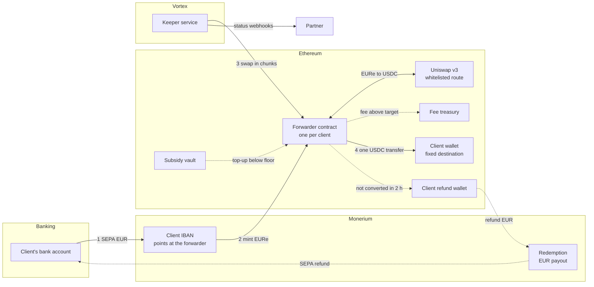
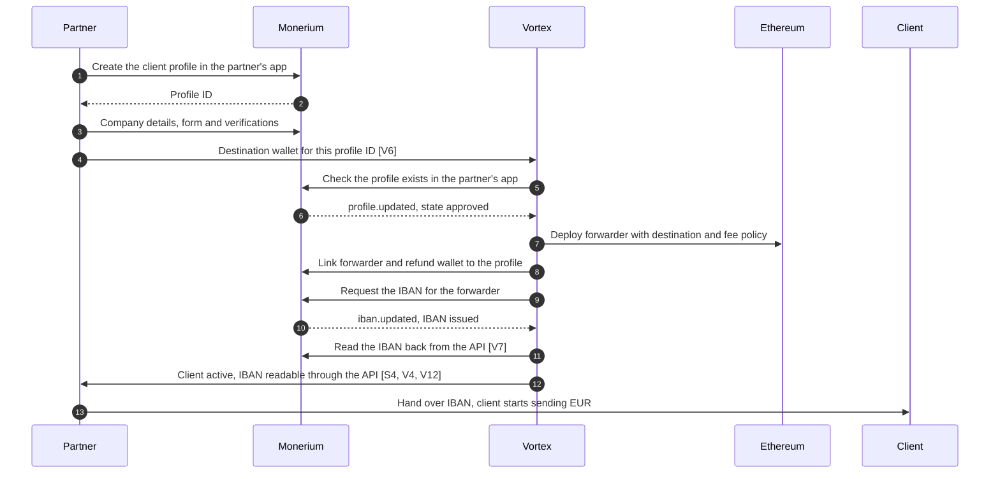
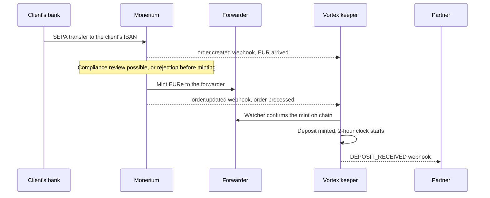
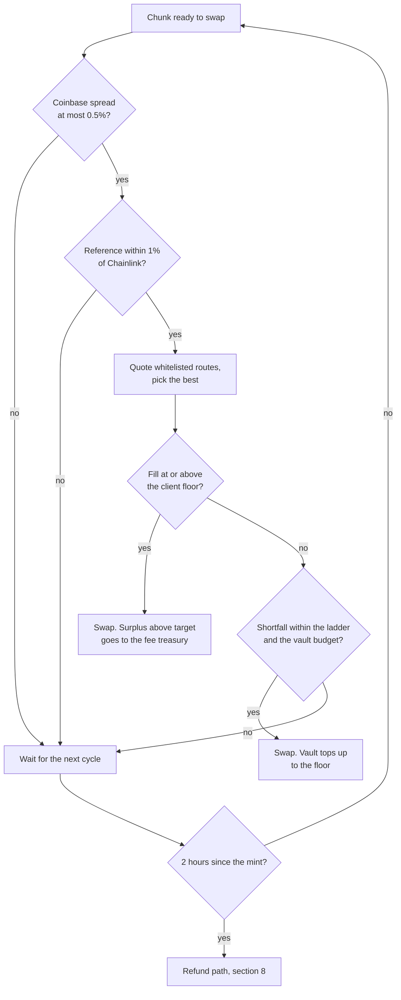
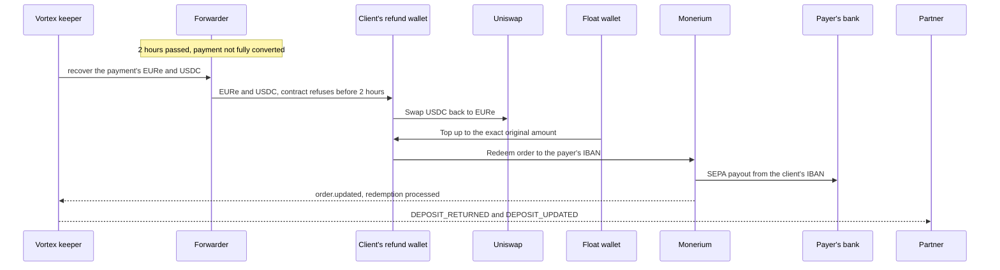
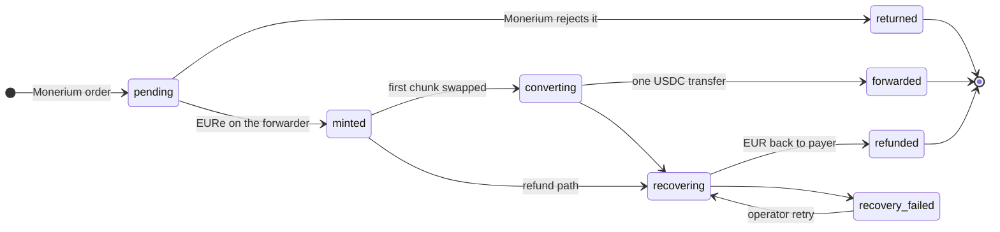

# Monerium B2B Onramp: End-to-End Flow

> **Status:** living overview, draft for alignment. Last updated 2026-10-06 with the
> destination endpoint, after Monerium's written answers and the call of 2026-09-30, and
> the KYB and sandbox decisions sent to the partner and Monerium on 2026-10-01.
> **Audience:** Vortex/SatoshiPay internally, the partner, and Monerium.
> **Scope:** the EUR to USDC onramp for the partner's business clients, as built for the
> pilot on the branch of PR #1375. It is not merged or deployed yet. Open questions carry
> an ID such as **[M2]** (Monerium), **[S1]** (partner) or **[V1]** (Vortex internal)
> and are collected in [section 12](#12-open-questions), with space for the answers.
> Changes proposed but not built yet are marked **Proposed**. Facts from Monerium's
> public API spec (version 2.0.0) and guides are marked as such where Monerium has not
> confirmed them in writing.

## Contents

1. [In one paragraph](#1-in-one-paragraph)
2. [Who is involved](#2-who-is-involved)
3. [The flow at a glance](#3-the-flow-at-a-glance)
4. [Client onboarding](#4-client-onboarding)
5. [Payment in: SEPA to EURe](#5-payment-in-sepa-to-eure)
6. [Conversion: EURe to USDC](#6-conversion-eure-to-usdc)
7. [Delivery: one USDC transfer per payment](#7-delivery-one-usdc-transfer-per-payment)
8. [Unhappy path: full EUR refund](#8-unhappy-path-full-eur-refund)
9. [Status, reporting and support](#9-status-reporting-and-support)
10. [What Vortex can and cannot do](#10-what-vortex-can-and-cannot-do)
11. [Key parameters](#11-key-parameters)
12. [Open questions](#12-open-questions)
13. [Related documents](#13-related-documents)

## 1. In one paragraph

A partner's business client sends EUR by SEPA to its own dedicated IBAN. Monerium
mints the same amount of EURe to a smart contract that Vortex deployed for that client,
the **forwarder**. Vortex converts the EURe to USDC on chain at a price tied to a public
market reference, and sends the whole payment to the client's wallet as **one USDC
transfer**. If a payment cannot be converted within **two hours**, Vortex refunds the
**full EUR amount** to the bank account it came from. The forwarder can only ever pay
three places: the client's fixed wallet, Vortex's fee treasury, and, for a refund after
the two-hour window, the client's own refund wallet, which Vortex holds.

## 2. Who is involved

| Party or component | Role |
|---|---|
| **Partner** | Partner. Brings the business clients, owns the white-label app at Monerium in which their profiles live, performs and submits their KYB under its reliance agreement with Monerium, receives status webhooks, and hands each client its IBAN. |
| **Client** | The business that sends EUR and receives USDC in its own wallet, the **destination**. |
| **Monerium** | Licensed EURe issuer. Hosts each client's profile and IBAN in the partner's white-label app, mints EURe for incoming SEPA payments, and pays out EUR on redemption. |
| **Vortex / SatoshiPay** | Operator. Deploys the contracts, runs the **keeper** service that converts and forwards, runs refunds, and reports status. Uses the partner's white-label app credentials for everything after KYB. |
| **Forwarder contract** | One per client on Ethereum. Receives the minted EURe, swaps it, holds the USDC until the payment is complete, then forwards it. |
| **Subsidy vault** | A Vortex-funded USDC pool that tops up a swap when the market delivers less than the client's guaranteed floor. |
| **Fee treasury** | Vortex multisig that receives the conversion fee. |
| **Refund wallet** | One Vortex-held wallet per client, fixed in the client's forwarder at deployment and linked to the client's Monerium profile. A payment whose window was missed moves there, and the refund is paid out from it through the client's own IBAN. |
| **Float wallet** | A Vortex wallet that covers round-trip losses so a refund is always the exact amount, and pays the refund wallets' gas. |
| **Price sources** | Coinbase Exchange EURC-USDC market for the reference rate, Chainlink EUR/USD as the on-chain safety bound, Uniswap v3 where the swaps execute. |

## 3. The flow at a glance

Solid arrows are the happy path. Dotted arrows only happen when needed: a fee or
subsidy on a swap, or the refund path.

## 4. Client onboarding

### 4.1 What has to be true when onboarding ends

- The client has a **KYB-approved corporate profile** in the partner's white-label app at
  Monerium, submitted by the partner under its reliance agreement.
- A **forwarder contract** exists with the client's destination wallet written into it.
  The destination cannot be changed later. A new wallet means a new forwarder and moving
  the IBAN, on the partner's written instruction.
- The forwarder is **linked** to the client's Monerium profile, and the client's **IBAN
  points at the forwarder**. Monerium mints to whatever address the IBAN points at, so
  this is what routes every payment through the conversion. An IBAN pointing at the
  client's own wallet would deliver EURe, not USDC.
- The client's **refund wallet** is linked to the client's profile as well, so a refund
  leaves from the client's own IBAN (section 8.3).
- Vortex has mapped the client under **the partner's account**, so webhooks and
  API reads reach the partner.

### 4.2 Onboarding flow

The partner owns the white-label app at Monerium and submits each client's KYB there.
Monerium returns the new profile's ID, and the partner passes it to Vortex together with
the client's destination wallet. Vortex does everything after KYB with the same app's
credentials.

Notes on the flow:

- **The partner's app, shared credentials.** Monerium's reliance agreement is with
  the partner, so the client profiles live in a white-label app in the partner's Monerium
  account. Only the app that onboarded a profile can read it or act on it, so Vortex
  uses the same app's client ID and secret. Monerium's guides describe one credential
  pair per app **[M2]**. Each partner gets its own white-label app, so a new partner
  means a new app and a new credential pair for Vortex **[V8]**.
- **Division of work.** The partner creates profiles and submits KYB. Vortex links
  addresses, requests the IBAN, places refunds, and registers its own webhook
  subscription. The partner must never link addresses, request or move IBANs, place
  orders, or change Vortex's webhook subscription. Closing a profile also closes its
  IBAN, so the partner coordinates closures with Vortex **[S2]**.
- **KYB.** Companies must use Monerium's reliance route: the partner delivers company
  details, form, verifications and files to Monerium directly. The partner calls
  Monerium's KYB and profile endpoints itself; SatoshiPay does not proxy them (decided
  2026-10-01). Approval takes seconds when the data follows
  Monerium's corporate KYB guide. Vortex never handles KYB data, which matches the
  security spec. Reading a profile returns only the company name, so KYB details stay
  with the partner.
- **Destination handover by profile ID.** Creating a profile returns its ID.
  The partner then calls `POST /v1/monerium-b2b/accounts` with that ID, the destination,
  its own client reference and a contact email **[V6]**. Vortex checks the profile exists
  in the partner's app, stores the destination, and deploys the forwarder once the profile
  is approved. The destination is create-only, because it is fixed in the contract; a
  change means a new account on the partner's written instruction. Vortex rejects
  malformed and zero addresses, and the forwarder refuses token addresses, which marks
  the registration rejected. Exchange deposit addresses are accepted like any wallet;
  the agreement covers the risk that they rotate. Only the partner's manager key can
  register. A registration that is only waiting (Monerium has not approved the profile,
  a transient failure on Vortex's side) shows why, and one that cannot proceed is marked
  rejected with the reason; the partner may register a rejected profile again, with the
  same or corrected data.
- **Why the destination does not go through Monerium.** Monerium's profile API has no
  field for it, linking an address needs a signature from its owner, which exchange
  deposit addresses cannot give, and only the forwarder contract uses the destination.
- **IBAN order.** Monerium issues an IBAN only for an address already linked to the
  profile, so the forwarder is linked first. A profile has one IBAN, which can be moved
  to another linked address.
- **Webhooks.** Vortex registers its own subscription on the partner's app; Monerium
  lists an app's subscriptions together. Monerium's guide says that list includes each
  subscription's secret, while the response schema has no secret field. Either way,
  Vortex reads the IBAN and the payer's IBAN back from Monerium's API instead of relying
  on webhook payloads alone **[V7]**.
- **Fee.** Monerium charges €10 per corporate account under its agreement **[M3, S10]**.

### 4.3 What is built today

- The partner registers the client's destination by Monerium profile ID **[V6]**. Once
  Monerium approves the profile, the keeper deploys the forwarder, maps the client,
  links the forwarder and the refund wallet, and requests the IBAN **[V1]**. The IBAN is
  recorded when Monerium confirms it.
- An operator then activates the account after checking the destination; only in the
  sandbox does it activate once the IBAN is recorded. Payments convert only once the
  account is active: one that arrives earlier waits, `DEPOSIT_UPDATED` shows it as
  `account_not_active`, and it is refunded after two hours, so the partner hands a
  client its IBAN once the account is active. The operator path (deploy, then
  one admin call) remains for corrections.
- The partner can read the account and its IBAN through the Vortex API with its manager
  key. There is no dashboard view **[V3]**.
- The backend that runs the B2B module uses the partner's app credentials and is bound to
  the partner's manager key by configuration; separate credentials per partner app follow
  with the second partner **[V8]**. Reading the IBAN and the payer's IBAN back from
  Monerium's API is still open **[V7]**.
- The keeper already links the client's refund wallet next to the forwarder, built on
  2026-10-01.

### 4.4 Decisions behind onboarding

- **One forwarder per client.** Each client gets its own contract, created as a cheap
  clone of one shared, verified implementation. A published manifest lets anyone check
  every deployed forwarder against it.
- **Fixed destination.** The destination is set at deployment and has no setter, so no
  key, including Vortex's, can redirect a client's USDC.
- **Contract-signed link.** A contract cannot sign like a wallet. The forwarder
  therefore proves ownership to Monerium by accepting a signature from a Vortex attestor
  key, but only over Monerium's exact link message. That key has no power over the
  contract's funds.

### 4.5 Sandbox phase before production credentials

Monerium releases the production credentials for the partner's white-label app once it
sees test data in the partner's sandbox app: approved test client profiles onboarded
through the partner's KYB integration, IBANs issued, and test payments processed (agreed
on the call of 2026-09-30). Monerium's sandbox runs on Ethereum Sepolia.

The partner's steps **[S11]**:

1. Create a white-label app in its Monerium sandbox account at sandbox.monerium.dev,
   share the app's client ID and secret with Vortex, and onboard one or two test client
   profiles through its KYB integration.
2. Get a test API key from dashboard-sandbox.vortexfinance.co, for the API at
   api-sandbox.vortexfinance.co, once Vortex has set the partner's profile up as the
   manager of its clients. Register the webhook endpoint with that key through
   `POST /v1/webhook`, subscribing to `DEPOSIT_UPDATED` and `ACCOUNT_UPDATED`; the
   dashboard has no webhook screen.
3. For each test profile, register the Monerium profile ID and a Sepolia destination
   wallet that the partner controls with `POST /v1/monerium-b2b/accounts`.

Vortex then deploys the forwarder, links it and the client's refund wallet, and requests
the IBAN; in the sandbox the account activates once the IBAN is issued. In a joint session the parties run three test payments: a normal one, a large
one that converts in several chunks, and one that is refunded.

## 5. Payment in: SEPA to EURe

- Vortex listens on **two channels**. Monerium's webhooks carry the order details:
  amount, order ID, and the payer's IBAN and name. Vortex's own chain
  watcher proves the EURe actually arrived on the forwarder. A deposit becomes eligible
  for conversion only when both agree.
- Monerium confirmed that `order.created` arrives when the payment hits the IBAN and
  `order.updated` when the order changes state. While an order is **pending**, it is
  either minting or under compliance review, and Monerium does not tell the two apart.
  Reviews happen during business hours and add time before the two-hour window starts.
- The payer's **IBAN and name are stored** from the order. They are the target of any
  refund.
- The **two-hour window starts at the mint**, not at the SEPA transfer, because Vortex
  cannot act before the EURe exists.
- Monerium's monitoring may **hold** a payment for review during office hours. If it
  needs documents, Monerium contacts the payer directly. If it cannot mint the payment,
  it returns the funds to the payer, with a reason on the order. None of this reaches
  the forwarder.
- **Third-party payers** are allowed. Monerium watches transaction patterns to make
  sure accounts are not misused.
- **Memo routing.** A payer can write a chain and address into the SEPA memo. If that
  address is linked to the client's profile, Monerium mints there instead of to the
  forwarder. Monerium's guide describes only that case, which implies an unlinked
  address is ignored and the payment mints to the forwarder as usual. The only other
  address linked to a client profile is the client's refund wallet, which Vortex
  controls. Clients are unlikely to use this, so it stays enabled, and a mint to a
  refund wallet is handled by operations **[V9]**.

## 6. Conversion: EURe to USDC

### 6.1 Chunks

A payment larger than the per-swap cap of **€10,000** is converted in several chunks, a
few minutes apart. The chunks' USDC waits on the forwarder until the whole payment is
converted. Two payments are never mixed in one swap. A single client's payments are
converted one after the other, while different clients' payments convert in parallel.

### 6.2 Price

- **Reference rate:** the midpoint between the best bid and the best ask on the Coinbase
  Exchange EURC-USDC market, read immediately before each chunk and recorded with it. A
  chunk waits while that market's spread is wider than 0.5%.
- **Client target:** the reference minus 0.125%. Whatever the market delivers above the
  target is Vortex's fee, capped at 1% on chain.
- **Client floor:** the reference minus 0.15%. If the market delivers less, Vortex tops
  the chunk up from the subsidy vault, within limits.
- **Safety bound:** no chunk ever delivers less than the Chainlink EUR/USD rate minus
  0.6%, or it does not execute. If the Coinbase reference sits below that bound, the
  client gets the bound, and Vortex pays the difference within its subsidy limits.
- The reference must also be within 1% of Chainlink, so a bad price feed cannot push a
  swap far off market.

### 6.3 Subsidy ladder

How much Vortex is willing to top up grows with how long a chunk has waited for the
market. Waiting time counts per chunk, from when it became ready to swap.

| Waiting time | Maximum top-up |
|---|---|
| 0 to 6 min | none |
| 6 to 8 min | 0.10% |
| 8 to 10 min | 0.20% |
| 10 to 12 min | 0.30% |
| 12 to 14 min | 0.40% |
| 14 to 16 min | 0.50% |
| from 16 min | 1.00% |

The ladder is a keeper setting that Vortex can retune without touching the contracts.
The contract enforces the cap the keeper passes with each swap, and the vault enforces a
per-swap cap and a daily budget on top.

### 6.4 Per-chunk decision

## 7. Delivery: one USDC transfer per payment

- Once every chunk of a payment is converted, the keeper sends the whole USDC amount to
  the client's destination in **one transfer**.
- After the transfer is 32 blocks deep, the partner receives **DEPOSIT_CONVERTED**. It
  carries each chunk's reference rate, fee and subsidy, and the transaction hash of the
  final transfer.
- **Without Vortex:** if the keeper stops for 24 hours, anyone can convert at the
  Chainlink price without subsidy and forward the forwarder's USDC to the destination. A
  client's funds never depend on Vortex staying online.
- **Dormancy:** after 60 days without a conversion, forwarding pauses until the
  destination is re-confirmed in writing.

## 8. Unhappy path: full EUR refund

### 8.1 When a payment is refunded

- It was **not converted within two hours** of the mint. Typical causes are a market
  move beyond the bounds, thin liquidity, an exhausted subsidy budget, or an operational
  fault.
- An operator triggers it after a **compliance decision or an incident**.

A payment is never partly delivered. If any part cannot be converted in time, the whole
payment is refunded, including chunks that were already converted.

### 8.2 How a refund runs

- The payer gets back the **exact EUR amount**. Losses from the round trip and fees
  already taken on converted chunks are Vortex's cost, paid from the float wallet.
- The contract **enforces the two-hour window**. The forwarder cannot move funds to the
  refund wallet any earlier, and it can only move them to that one wallet.
- The refund leaves from the **client's own IBAN**, in the client's name, with a
  reference to the original payment.
- SEPA Instant is used when the payer's bank supports it, otherwise next business day.
- Monerium requires a **supporting document** on redemptions above €15,000 and accepts
  the same agreement every time, so one standing document per client can be uploaded
  once and reused. Until the refund automation attaches it, refunds of €15,000 or more
  stay manual **[V10]**.
- Monerium sets **no limits and charges no fees** on refunds. A refund may be reviewed
  by Monerium during business hours before it is sent **[M4]**.
- Refunds run one at a time and survive a crash of the keeper midway. A refund that
  fails its retries goes to **recovery failed** and is handed to Vortex operations.
- Rollout: the automation first runs in **alert mode**, where Vortex operators confirm
  each refund. It switches to **automatic** after the first refund has been observed end
  to end.

### 8.3 Refund from the client's own IBAN

A Monerium profile can have several linked addresses, any linked address can use the
profile's IBAN for outgoing payments, and an address belongs to exactly one profile. The
refund path builds on that, built on 2026-10-01:

- Each client gets its own **refund wallet**: a plain Vortex-held wallet whose key is
  derived from one Vortex secret and the client's Monerium profile ID. One secret covers
  every client, and the wallet is known before the forwarder is deployed.
- The wallet is fixed in the client's forwarder at deployment as the only address a
  recovery can pay, with no way to change it. Vortex refuses to map a forwarder whose
  refund wallet is not the client's derived one.
- Onboarding links the wallet to the client's Monerium profile next to the forwarder.
- On a refund the forwarder sends the stuck EURe and USDC straight to that wallet, which
  swaps back, receives the float's top-up, and places the redeem order. Monerium pays it
  out of the client's own IBAN.
- The wallet pays gas for its own transactions; the float tops its ETH up before it
  sends.
- No Vortex company profile at Monerium is needed, and different clients' refunds never
  share a wallet.
- The client authorizes Vortex to send these refunds in the partner terms.

Status: agreed with Monerium on 2026-09-30 for the pilot. Later, each client may instead
name a fixed refund IBAN at onboarding, so every refund follows the same path **[V13]**.
A refund contract that only pays that fixed IBAN would then replace the plain wallet,
which means a new forwarder for existing clients.

Alternatives considered:

- **One Vortex recovery wallet on a Vortex/SatoshiPay company profile.** The previous
  design. The payer would see SatoshiPay as the sender, and one company profile would
  pay many unrelated payers.
- **Redeem signed by the forwarder contract.** The refund would also leave from the
  client's IBAN, but it needs an allowlist of payer IBANs per client and a larger
  contract change.

## 9. Status, reporting and support

### 9.1 Deposit status

Statuses only move forward. A late or repeated webhook can never move a deposit back.
Monerium does not report a separate compliance-review state, so a payment under review
shows as pending. The `held` status in the API is therefore never set and will be
removed **[V11]**.

### 9.2 What the partner receives

| Event | When | Key content |
|---|---|---|
| `DEPOSIT_UPDATED` | Any change of a deposit | The full deposit snapshot: IDs, amounts, timestamps, waiting and refund reasons, every conversion chunk |
| `ACCOUNT_UPDATED` | Any change of an account, including the IBAN being issued | The account snapshot: IBAN, status, IDs, destination, fee policy |
| `DEPOSIT_RECEIVED` | EURe minted to the client's forwarder | Milestone: deposit ID, account, amount, mint transaction |
| `DEPOSIT_CONVERTED` | The USDC transfer is 32 blocks deep | Milestone: per chunk reference rate, fee and subsidy, and the forward transaction |
| `DEPOSIT_RETURNED` | The refund was processed by Monerium | Milestone: refunded amount, masked payer IBAN, redemption ID, recovery transaction |

| API call | Returns |
|---|---|
| Accounts, all clients of the manager | Each client's account with IBAN and status, filterable by Monerium profile ID |
| Registrations, all of the manager | Each destination registration: waiting with what it waits for, mapped to its account, or rejected with the reason |
| Account, per client | IBAN, status, IDs, destination, forwarder address, fee policy |
| Deposits, per client | Every deposit as its full snapshot, the same shape as `DEPOSIT_UPDATED` |

- The accounts call uses the partner's manager API key alone. The per-client calls add a
  header naming the client's Vortex profile ID, or use a key issued to the client.
- Webhooks are signed. The partner verifies each one against Vortex's published public
  key and deduplicates on the event ID.
- **Fallback:** the deposits call returns the current snapshot of every deposit, for
  polling if a webhook is missed.
- **Reference IDs** in every snapshot: deposit, account, Vortex profile, Monerium
  profile, Monerium order, the partner's client reference, and every transaction hash.
- Amounts come as a EUR decimal and in base units: 18 decimals for EUR and EURe, 6 for
  USDC.

### 9.3 What the partner asked for

The partner's requirements of 2026-09-30, built on 2026-10-01:

- The API and webhooks expose the **full lifecycle**, from deposit through conversion to
  delivery, including IDs, amounts, timestamps, and hold or failure status.
- **API-first:** the partner's frontend fetches each sub-account's IBAN from the Vortex
  backend.

How each stage is reported:

| Stage | Status | Reported through |
|---|---|---|
| Payment arrived at Monerium, not minted yet | pending | `DEPOSIT_UPDATED` with waiting reason `monerium_pending`. Monerium does not tell minting apart from a compliance review |
| Returned by Monerium before minting | returned | `DEPOSIT_UPDATED` with Monerium's rejection reason |
| EURe minted to the forwarder | minted | `DEPOSIT_UPDATED` with the mint time and transaction, plus `DEPOSIT_RECEIVED` |
| Conversion chunk sent and confirmed | converting | `DEPOSIT_UPDATED` with each chunk's pricing, transaction, and sent and confirmed times |
| Conversion held because the account cannot convert | minted or converting | `DEPOSIT_UPDATED` with waiting reason `account_not_active` and start time: the account is not activated yet, suspended or paused. Cleared once it can convert |
| Conversion waiting on the market | minted or converting | `DEPOSIT_UPDATED` with waiting reason and start time: `below_floor`, `reference_unavailable`, `reference_out_of_band`, `oracle_unavailable` or `no_route` |
| Delivered as one USDC transfer | forwarded | `DEPOSIT_UPDATED` with delivery time and transaction once 32 blocks deep, plus `DEPOSIT_CONVERTED` |
| Refund started | recovering | `DEPOSIT_UPDATED` with refund reason and start time: `window_missed`, `compliance`, `incident` or `operator` |
| Refunded | refunded | `DEPOSIT_UPDATED` with refund time, plus `DEPOSIT_RETURNED` |
| Refund needs an operator | recovery failed | `DEPOSIT_UPDATED` |
| Account set up, IBAN issued, status changed | | `ACCOUNT_UPDATED`, and the accounts call |

Not included yet: the incoming payment's SEPA reference and the payer's name. Add them
when the partner needs them.

### 9.4 Exceptions and escalation

- Vortex monitors stuck payments, refunds due, failed refunds, the subsidy budget, the
  float balance, IBAN changes at Monerium, and the Coinbase market status.
- Operators can pause conversion, force a refund, or correct a deposit's status through
  admin endpoints. The runbook covers each case.
- A joint Slack channel with Monerium is the agreed channel for payment questions.
  Named owners and the escalation path between Vortex, the partner and Monerium are
  still to be agreed **[V5]**.

## 10. What Vortex can and cannot do

**Vortex can:**

- Deploy forwarders, run conversions, and pause them.
- Choose the swap route from an on-chain whitelist.
- Change a client's fee policy within the 1% cap. Raising it takes effect only after a
  24-hour on-chain notice. Lowering it is immediate.
- Fund or limit its own subsidy budget.
- Move a payment to the client's refund wallet, only after the two-hour window, to
  refund it from the client's own IBAN.

**Vortex cannot:**

- Redirect funds. A forwarder pays only the client's fixed destination, the fee
  treasury, and, after two hours, the client's own refund wallet.
- Deliver a conversion below the Chainlink rate minus 0.6%.
- Stop a client's conversion permanently. After 24 hours anyone can complete it.
- Prevent incoming SEPA payments. Payments made during a pause wait safely as EURe and
  are converted or refunded later.

## 11. Key parameters

| Parameter | Value | Changeable |
|---|---|---|
| Refund window | 2 hours from the mint | Fixed in the contract |
| Permissionless fallback | 24 hours | Fixed in the contract |
| Client target and floor | Reference minus 0.125% and minus 0.15% | Per client, increases need 24 h notice |
| Fee cap | 1% | Fixed in the contract |
| Safety bound against Chainlink | 0.6% | Fixed in the contract |
| Reference band against Chainlink | 1% | Fixed in the contract |
| Maximum Coinbase spread | 0.5% | Keeper code |
| Subsidy ladder | none for 6 min, rising to 1% from 16 min | Keeper setting |
| Chunk size | up to €10,000 | Operational, ceiling €50,000 |
| Minimum swap | €1 | Operational, can be raised but never below €1 |
| Manual refunds | €15,000 and above | Until the refund automation attaches the standing agreement [V10] |
| Monerium account fee | €10 per corporate account | Monerium agreement |
| Dormancy pause | 60 days without a conversion | Keeper code |
| Pilot volume | 3 to 5 clients, €50,000 per client per day | Contractual |

## 12. Open questions

### 12.1 Assumptions (2026-09-30)

- Refunds run through per-client refund wallets. A fixed refund IBAN per client may
  replace the dynamic payer IBAN later **[V13]**.
- The partner delivers KYB directly to its own white-label app and calls Monerium's KYB
  endpoints itself; SatoshiPay does not proxy them. Vortex never handles KYB data.
- No partner client has an existing Monerium profile.
- Monerium does not need to know or screen the client's final wallet.
- Memo routing stays enabled, because clients are unlikely to use it.
- Testing runs in the partner's Monerium sandbox app on Sepolia before Monerium releases
  the production credentials (section 4.5).

### 12.2 Answered by Monerium (2026-09-30)

| Topic | Answer |
|---|---|
| Whose white-label app | A dedicated app in the partner's Monerium account, under the partner's reliance agreement. Vortex uses that app's client ID and secret. |
| Onboarding steps | Confirmed: create profile, submit details, form and verifications, wait for `profile.updated` approved, link the forwarder and the refund wallet, request the IBAN. |
| KYB route and speed | Corporates use the reliance endpoints. Approval takes seconds when the data follows Monerium's guidelines. |
| Profile visibility | Only the credentials of the app that onboarded a profile can read it. |
| Readable profile data | Only the bare minimum, such as the name. Full KYB details are not returned. |
| Payment notifications | `order.created` when the payment hits the IBAN, `order.updated` on state changes. Pending covers both minting and compliance review. |
| IBAN | Only for an address already linked to the profile. It can be moved to another linked address. |
| Batching | None. Each client is its own request. |
| Refund wallet | One address per profile, so one refund wallet per client. A redeem from it leaves from the profile's IBAN. |
| Supporting document above €15,000 | The same agreement can be reused every time. |
| Refund limits and fees | None. Some refunds are reviewed during business hours. |
| Account fee | €10 per corporate account, per the agreement. |
| Partner apps | Each partner gets its own white-label app. The partner delivers KYB data and files directly; Vortex could proxy those calls later as tech provider. Decided 2026-10-01: no proxy, the partner calls the KYB endpoints itself. |
| Production credentials | Released after Monerium sees test data in the partner's sandbox app: approved test profiles onboarded through the partner's KYB integration, IBANs issued, test payments processed (section 4.5). |
| Held and rejected payments | Monerium's monitoring holds payments for review during office hours, contacts the payer directly if it needs documents, and returns the funds if it cannot mint them. |
| Third-party payers | Allowed. Monerium watches transaction patterns so accounts are not misused. |
| Refund wallet approach | Agreed for the pilot. A fixed refund IBAN per client may replace it later. |
| Communication | A joint Slack channel with Monerium is to be set up. |
| The partner's onboarding at Monerium | Documents in review on 2026-09-30, onboarding starting 2026-10-01. |

### 12.3 Monerium

| ID | Question | Why it matters | Status | Answer |
|---|---|---|---|---|
| M2 | Can the partner's app have separate credentials for Vortex and the partner, or can linking addresses, requesting or moving IBANs, and managing webhooks be restricted to Vortex? If not, is there an audit log or notification for those actions? | Whoever holds the app credentials can redirect future mints | Partly answered 2026-09-30 | One app per partner. Separate credentials within one app not confirmed. |
| M3 | Is the €10 per corporate account billed to the partner or to Vortex, and is it one-off or recurring? | Commercial planning | Renegotiation ongoing | A discount for onboarding all partner clients is being negotiated. |
| M4 | What triggers a review on a refund, and can refunds to the original payer be cleared in advance? | Refund timing promise | Open | |
| M7 | Written confirmation of the items agreed verbally so far: the redemption-limitation disclosure, the issuer recovery backstop, SEPA recall and fraud loss allocation, per-IBAN suspension, and advance notice of changes to the link message. | Launch gate | Open | |

### 12.4 Partner

| ID | Question or item to agree | Why it matters | Status | Answer |
|---|---|---|---|---|
| S1 | How many clients, and when? | Planning, and when the destination endpoint is needed | Open | |
| S2 | Share the white-label app's production credentials with Vortex, and agree the usage rules in section 4.2: no address links, IBAN requests or moves, orders, or changes to Vortex's webhook subscription, and profile closures coordinated with Vortex. | Protects where client payments are minted | Production credentials follow the sandbox sign-off, section 4.5 | |
| S3 | Hand over each destination through the Vortex endpoint by Monerium profile ID. Who at the partner approves a destination? | The destination is fixed in the contract | Endpoint built 2026-10-06; approver at the partner open | |
| S4 | How does the partner get each client's IBAN? | API and dashboard scope | Answered 2026-09-30 | API-first: the partner's frontend fetches the IBAN from the Vortex API, section 9.3. |
| S5 | Do clients always pay from their own business bank accounts, or also from third parties? | Refund target. Monerium allows third-party payers | Open | |
| S6 | Are destinations self-custody wallets or exchange deposit addresses? | Exchange addresses need an attestation that they do not rotate and accept contract transfers | Open | |
| S7 | Does the event model in section 9.3 cover the lifecycle requirement? Webhook endpoint and support contacts. | Status reporting | Built 2026-10-01, to confirm with the partner | The partner wants the full lifecycle with IDs, amounts, timestamps, and hold and failure status. |
| S8 | Is a two-hour window before a full refund right? Will clients authorize Vortex to refund from their IBAN? A Monerium review can delay a refund within business hours. | Refund terms in the agreement | Open | |
| S9 | The agreement names a "Coinbase EURC oracle". The implementation uses the Coinbase Exchange EURC-USDC bid/ask midpoint. Is that what was meant? | Pricing terms | Open | |
| S10 | Who bears Monerium's €10 per corporate account? | Commercial | Open | |
| S11 | Sandbox phase, section 4.5: create a white-label app in the Monerium sandbox and share its client ID and secret, onboard one or two test profiles through the KYB integration, get a test API key from dashboard-sandbox.vortexfinance.co and register the webhook endpoint, and send the Monerium profile ID and a Sepolia destination wallet per test profile. | Monerium releases production credentials after seeing this test data | Requested 2026-10-01 | |

### 12.5 Vortex internal

| ID | Question or task | Depends on | Status |
|---|---|---|---|
| V1 | Start onboarding once the profile is approved and the destination is registered, whichever comes last. | V6, V8 | Built 2026-10-06 |
| V2 | Refunds through per-client refund wallets: derived from one seed, fixed in each forwarder as its recovery address, linked at onboarding. | None | Built 2026-10-01 |
| V3 | Dashboard view for the partner with clients, IBANs, deposits and refunds. Optional, since the partner integrates API-first. | S4 | Deprioritized |
| V4 | Full lifecycle deposit events, section 9.3: snapshot event on every change, IDs, amounts, timestamps, hold and failure reasons, an account event, and the docs fix. | S7 | Built 2026-10-01 |
| V5 | Named owners per alert, and the escalation path between Vortex, the partner and Monerium, including the joint Slack channel with Monerium. | Meeting | Open |
| V6 | Endpoint for the partner to register a destination by Monerium profile ID: checks the profile exists, create-only, validated, no KYB data. | S3 | Built 2026-10-06 |
| V7 | Read the IBAN and the payer's IBAN back from Monerium's API instead of trusting webhook payloads, and check in the sandbox whether listing subscriptions exposes their secrets. | None | Open |
| V8 | Separate Monerium credentials for the B2B module, apart from the retail onramp, with one app and credential pair per partner. | S2 | Partly: the B2B backend runs on the partner's app, bound to its manager key (2026-10-06); per-partner credentials with the second partner |
| V9 | Detect a mint to a refund wallet routed by payment memo, and handle it as a refund. | V2 | Open |
| V10 | Attach the standing agreement to refunds above €15,000 so they can run automatically. | V2 | Open |
| V11 | Remove the unused `held` status. | None | Open |
| V13 | Later: a fixed refund IBAN per client, given at onboarding, with a refund contract that only pays that IBAN. | V2 | Later |
| V12 | Partner account API: list all sub-accounts with IBAN and status, filterable by Monerium profile ID. | S4 | Built 2026-10-01 |

## 13. Related documents

For Vortex readers who need the detail behind this overview:

- [`architecture-monerium-b2b-onramp.md`](architecture-monerium-b2b-onramp.md): the
  complete technical architecture.
- [`adr-0005-monerium-b2b-onramp.md`](adr-0005-monerium-b2b-onramp.md): decisions, final
  parameters and accepted risks.
- [`operations-monerium-b2b-rollout.md`](operations-monerium-b2b-rollout.md): launch
  gates, deploy checklist and agreement inputs.
- [`operations-monerium-b2b-runbook.md`](operations-monerium-b2b-runbook.md): operator
  procedures for onboarding, refunds and incidents.
- [`security-spec/05-integrations/monerium-b2b.md`](security-spec/05-integrations/monerium-b2b.md):
  security invariants.
- [`api/pages/07-webhooks.md`](api/pages/07-webhooks.md): the partner webhook format and
  signature check.
