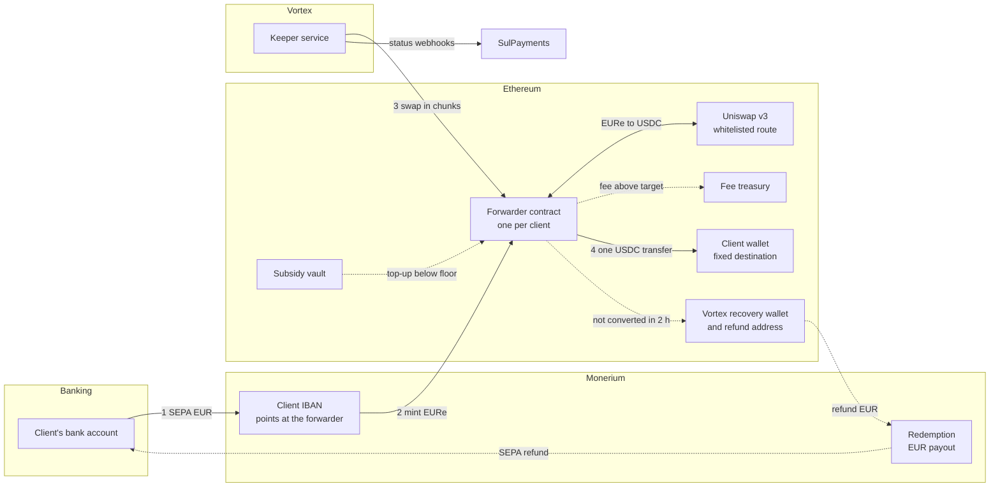
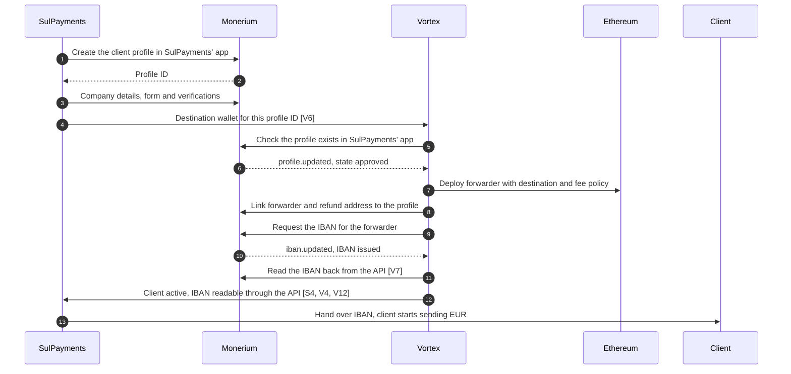
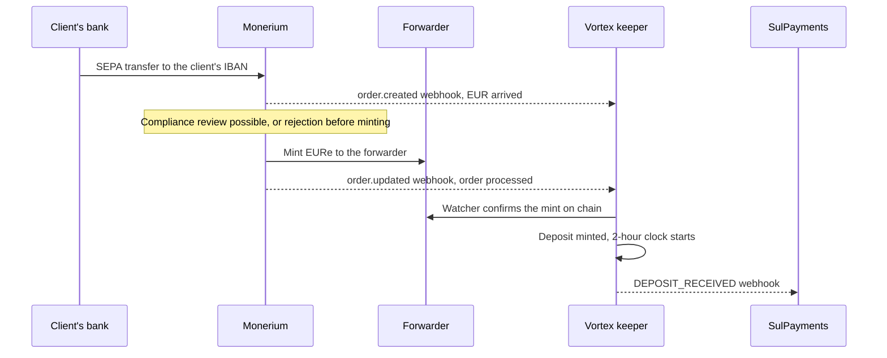
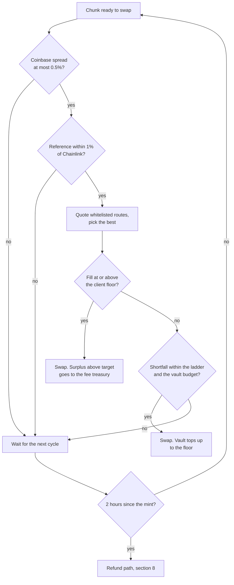
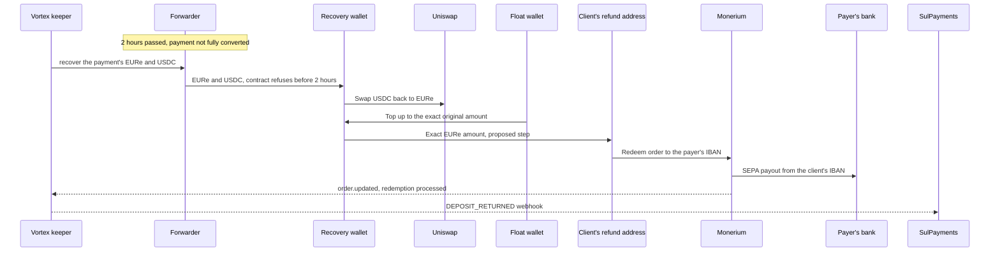
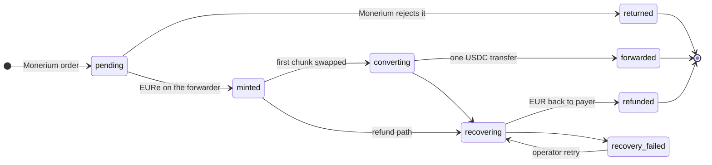

# Monerium B2B Onramp: End-to-End Flow

> **Status:** living overview, draft for alignment. Last updated 2026-10-01, including
> Monerium's written answers and the call of 2026-09-30.
> **Audience:** Vortex/SatoshiPay internally, SulPayments, and Monerium.
> **Scope:** the EUR to USDC onramp for SulPayments' business clients, as built for the
> pilot on the branch of PR #1375. It is not merged or deployed yet. Open questions carry
> an ID such as **[M2]** (Monerium), **[S1]** (SulPayments) or **[V1]** (Vortex internal)
> and are collected in [section 12](#12-open-questions), with space for the answers.
> Changes proposed but not built yet are marked **Proposed**. Facts from Monerium's
> public API spec (version 2.0.0) and guides are marked as such where Monerium has not
> confirmed them in writing.

## Contents

1. [In one paragraph](#1-in-one-paragraph)
2. [Who is involved](#2-who-is-involved)
3. [The flow at a glance](#3-the-flow-at-a-glance)
4. [Client onboarding](#4-client-onboarding)
5. [Payment in: SEPA to EURe](#5-payment-in-sepa-to-eure)
6. [Conversion: EURe to USDC](#6-conversion-eure-to-usdc)
7. [Delivery: one USDC transfer per payment](#7-delivery-one-usdc-transfer-per-payment)
8. [Unhappy path: full EUR refund](#8-unhappy-path-full-eur-refund)
9. [Status, reporting and support](#9-status-reporting-and-support)
10. [What Vortex can and cannot do](#10-what-vortex-can-and-cannot-do)
11. [Key parameters](#11-key-parameters)
12. [Open questions](#12-open-questions)
13. [Related documents](#13-related-documents)

## 1. In one paragraph

A SulPayments business client sends EUR by SEPA to its own dedicated IBAN. Monerium
mints the same amount of EURe to a smart contract that Vortex deployed for that client,
the **forwarder**. Vortex converts the EURe to USDC on chain at a price tied to a public
market reference, and sends the whole payment to the client's wallet as **one USDC
transfer**. If a payment cannot be converted within **two hours**, Vortex refunds the
**full EUR amount** to the bank account it came from. The forwarder can only ever pay
three places: the client's fixed wallet, Vortex's fee treasury, and, for a refund after
the two-hour window, Vortex's recovery wallet.

## 2. Who is involved

| Party or component | Role |
|---|---|
| **SulPayments** | Partner. Brings the business clients, owns the white-label app at Monerium in which their profiles live, performs and submits their KYB under its reliance agreement with Monerium, receives status webhooks, and hands each client its IBAN. |
| **Client** | The business that sends EUR and receives USDC in its own wallet, the **destination**. |
| **Monerium** | Licensed EURe issuer. Hosts each client's profile and IBAN in SulPayments' white-label app, mints EURe for incoming SEPA payments, and pays out EUR on redemption. |
| **Vortex / SatoshiPay** | Operator. Deploys the contracts, runs the **keeper** service that converts and forwards, runs refunds, and reports status. Uses SulPayments' white-label app credentials for everything after KYB. |
| **Forwarder contract** | One per client on Ethereum. Receives the minted EURe, swaps it, holds the USDC until the payment is complete, then forwards it. |
| **Subsidy vault** | A Vortex-funded USDC pool that tops up a swap when the market delivers less than the client's guaranteed floor. |
| **Fee treasury** | Vortex multisig that receives the conversion fee. |
| **Recovery wallet and float wallet** | Two Vortex wallets used only for refunds. The recovery wallet receives a payment whose window was missed, and the float covers round-trip losses. |
| **Refund address** | **Proposed.** One Vortex address per client, linked to the client's Monerium profile, from which a refund is paid out through the client's own IBAN. Confirmed as technically possible by Monerium. |
| **Price sources** | Coinbase Exchange EURC-USDC market for the reference rate, Chainlink EUR/USD as the on-chain safety bound, Uniswap v3 where the swaps execute. |

## 3. The flow at a glance

Solid arrows are the happy path. Dotted arrows only happen when needed: a fee or
subsidy on a swap, or the refund path.

## 4. Client onboarding

### 4.1 What has to be true when onboarding ends

- The client has a **KYB-approved corporate profile** in SulPayments' white-label app at
  Monerium, submitted by SulPayments under its reliance agreement.
- A **forwarder contract** exists with the client's destination wallet written into it.
  The destination cannot be changed later. A new wallet means a new forwarder and moving
  the IBAN, on SulPayments' written instruction.
- The forwarder is **linked** to the client's Monerium profile, and the client's **IBAN
  points at the forwarder**. Monerium mints to whatever address the IBAN points at, so
  this is what routes every payment through the conversion. An IBAN pointing at the
  client's own wallet would deliver EURe, not USDC.
- **Proposed:** a Vortex **refund address** is linked to the client's profile as well, so
  a refund can leave from the client's own IBAN (section 8.3).
- Vortex has mapped the client under **SulPayments' partner account**, so webhooks and
  API reads reach SulPayments.

### 4.2 Proposed onboarding flow

SulPayments owns the white-label app at Monerium and submits each client's KYB there.
Monerium returns the new profile's ID, and SulPayments passes it to Vortex together with
the client's destination wallet. Vortex does everything after KYB with the same app's
credentials.

Notes on the flow:

- **SulPayments' app, shared credentials.** Monerium's reliance agreement is with
  SulPayments, so the client profiles live in a white-label app in SulPayments' Monerium
  account. Only the app that onboarded a profile can read it or act on it, so Vortex
  uses the same app's client ID and secret. Monerium's guides describe one credential
  pair per app **[M2]**. Each partner gets its own white-label app, so a new partner
  means a new app and a new credential pair for Vortex **[V8]**.
- **Division of work.** SulPayments creates profiles and submits KYB. Vortex links
  addresses, requests the IBAN, places refunds, and registers its own webhook
  subscription. SulPayments must never link addresses, request or move IBANs, place
  orders, or change Vortex's webhook subscription. Closing a profile also closes its
  IBAN, so SulPayments coordinates closures with Vortex **[S2]**.
- **KYB.** Companies must use Monerium's reliance route: SulPayments delivers company
  details, form, verifications and files to Monerium directly. Vortex could later proxy
  those calls as SulPayments' tech provider. Approval takes seconds when the data follows
  Monerium's corporate KYB guide. Vortex never handles KYB data, which matches the
  security spec. Reading a profile returns only the company name, so KYB details stay
  with SulPayments.
- **Destination handover by profile ID (proposed).** Creating a profile returns its ID.
  SulPayments then calls a new Vortex endpoint with that ID, the destination, its own
  client reference and a contact email **[V6]**. Vortex checks the profile exists in
  SulPayments' app, stores the destination, and deploys the forwarder once the profile
  is approved. The destination is create-only, because it is fixed in the contract; a
  change means a new account on SulPayments' written instruction. Vortex rejects zero,
  token and contract addresses, and exchange addresses need SulPayments' confirmation
  that they do not rotate. Until the endpoint exists, the destination can come on the
  signed onboarding form.
- **Why the destination does not go through Monerium.** Monerium's profile API has no
  field for it, linking an address needs a signature from its owner, which exchange
  deposit addresses cannot give, and only the forwarder contract uses the destination.
- **IBAN order.** Monerium issues an IBAN only for an address already linked to the
  profile, so the forwarder is linked first. A profile has one IBAN, which can be moved
  to another linked address.
- **Webhooks.** Vortex registers its own subscription on SulPayments' app; Monerium
  lists an app's subscriptions together. Monerium's guide says that list includes each
  subscription's secret, while the response schema has no secret field. Either way,
  Vortex reads the IBAN and the payer's IBAN back from Monerium's API instead of relying
  on webhook payloads alone **[V7]**.
- **Fee.** Monerium charges €10 per corporate account under its agreement **[M3, S10]**.

### 4.3 What is built today

- A Vortex operator deploys the forwarder, then one admin call maps the client with its
  Monerium profile ID, SulPayments' client ID, the destination and the fee policy.
- The keeper then links the forwarder and requests the IBAN automatically. The IBAN is
  recorded when Monerium confirms it.
- The operator then activates the account.
- SulPayments can read the account and its IBAN through the Vortex API with its manager
  key. There is no dashboard view **[V3]**.
- The backend uses one Monerium credential pair, shared with Vortex's retail EUR onramp.
- Adopting the proposal changes five things. The B2B module gets its own credentials for
  SulPayments' app **[V8]**. SulPayments supplies the destination by profile ID through
  the new endpoint **[V6]**. Onboarding starts once the profile is approved and the
  destination is registered **[V1]**. The keeper links a refund address next to the
  forwarder **[V2]**. The IBAN and the payer's IBAN are read back from Monerium's API
  **[V7]**.

### 4.4 Decisions behind onboarding

- **One forwarder per client.** Each client gets its own contract, created as a cheap
  clone of one shared, verified implementation. A published manifest lets anyone check
  every deployed forwarder against it.
- **Fixed destination.** The destination is set at deployment and has no setter, so no
  key, including Vortex's, can redirect a client's USDC.
- **Contract-signed link.** A contract cannot sign like a wallet. The forwarder
  therefore proves ownership to Monerium by accepting a signature from a Vortex attestor
  key, but only over Monerium's exact link message. That key has no power over the
  contract's funds.

## 5. Payment in: SEPA to EURe

- Vortex listens on **two channels**. Monerium's webhooks carry the order details:
  amount, order ID, and the payer's IBAN and name. Vortex's own chain
  watcher proves the EURe actually arrived on the forwarder. A deposit becomes eligible
  for conversion only when both agree.
- Monerium confirmed that `order.created` arrives when the payment hits the IBAN and
  `order.updated` when the order changes state. While an order is **pending**, it is
  either minting or under compliance review, and Monerium does not tell the two apart.
  Reviews happen during business hours and add time before the two-hour window starts.
- The payer's **IBAN and name are stored** from the order. They are the target of any
  refund.
- The **two-hour window starts at the mint**, not at the SEPA transfer, because Vortex
  cannot act before the EURe exists.
- Monerium's monitoring may **hold** a payment for review during office hours. If it
  needs documents, Monerium contacts the payer directly. If it cannot mint the payment,
  it returns the funds to the payer, with a reason on the order. None of this reaches
  the forwarder.
- **Third-party payers** are allowed. Monerium watches transaction patterns to make
  sure accounts are not misused.
- **Memo routing.** A payer can write a chain and address into the SEPA memo. If that
  address is linked to the client's profile, Monerium mints there instead of to the
  forwarder. Monerium's guide describes only that case, which implies an unlinked
  address is ignored and the payment mints to the forwarder as usual. The only other
  address linked to a client profile is the proposed refund address, which Vortex
  controls. Clients are unlikely to use this, so it stays enabled, and a mint to a
  refund address is handled by operations **[V9]**.

## 6. Conversion: EURe to USDC

### 6.1 Chunks

A payment larger than the per-swap cap of **€10,000** is converted in several chunks, a
few minutes apart. The chunks' USDC waits on the forwarder until the whole payment is
converted. Two payments are never mixed in one swap. A single client's payments are
converted one after the other, while different clients' payments convert in parallel.

### 6.2 Price

- **Reference rate:** the midpoint between the best bid and the best ask on the Coinbase
  Exchange EURC-USDC market, read immediately before each chunk and recorded with it. A
  chunk waits while that market's spread is wider than 0.5%.
- **Client target:** the reference minus 0.125%. Whatever the market delivers above the
  target is Vortex's fee, capped at 1% on chain.
- **Client floor:** the reference minus 0.15%. If the market delivers less, Vortex tops
  the chunk up from the subsidy vault, within limits.
- **Safety bound:** no chunk ever delivers less than the Chainlink EUR/USD rate minus
  0.6%, or it does not execute. If the Coinbase reference sits below that bound, the
  client gets the bound, and Vortex pays the difference within its subsidy limits.
- The reference must also be within 1% of Chainlink, so a bad price feed cannot push a
  swap far off market.

### 6.3 Subsidy ladder

How much Vortex is willing to top up grows with how long a chunk has waited for the
market. Waiting time counts per chunk, from when it became ready to swap.

| Waiting time | Maximum top-up |
|---|---|
| 0 to 6 min | none |
| 6 to 8 min | 0.10% |
| 8 to 10 min | 0.20% |
| 10 to 12 min | 0.30% |
| 12 to 14 min | 0.40% |
| 14 to 16 min | 0.50% |
| from 16 min | 1.00% |

The ladder is a keeper setting that Vortex can retune without touching the contracts.
The contract enforces the cap the keeper passes with each swap, and the vault enforces a
per-swap cap and a daily budget on top.

### 6.4 Per-chunk decision

## 7. Delivery: one USDC transfer per payment

- Once every chunk of a payment is converted, the keeper sends the whole USDC amount to
  the client's destination in **one transfer**.
- After the transfer is 32 blocks deep, SulPayments receives **DEPOSIT_CONVERTED**. It
  carries each chunk's reference rate, fee and subsidy, and the transaction hash of the
  final transfer.
- **Without Vortex:** if the keeper stops for 24 hours, anyone can convert at the
  Chainlink price without subsidy and forward the forwarder's USDC to the destination. A
  client's funds never depend on Vortex staying online.
- **Dormancy:** after 60 days without a conversion, forwarding pauses until the
  destination is re-confirmed in writing.

## 8. Unhappy path: full EUR refund

### 8.1 When a payment is refunded

- It was **not converted within two hours** of the mint. Typical causes are a market
  move beyond the bounds, thin liquidity, an exhausted subsidy budget, or an operational
  fault.
- It is **below the €1 minimum swap**.
- An operator triggers it after a **compliance decision or an incident**.

A payment is never partly delivered. If any part cannot be converted in time, the whole
payment is refunded, including chunks that were already converted.

### 8.2 How a refund runs

Everything up to the top-up is built. The hop through the client's refund address is the
proposal in section 8.3. As built today, the recovery wallet places the redeem itself,
from the Vortex/SatoshiPay company profile.

- The payer gets back the **exact EUR amount**. Losses from the round trip and fees
  already taken on converted chunks are Vortex's cost, paid from the float wallet.
- The contract **enforces the two-hour window**. The forwarder cannot move funds to the
  recovery wallet any earlier.
- With the proposal, the refund leaves from the **client's own IBAN**, in the client's
  name, with a reference to the original payment.
- SEPA Instant is used when the payer's bank supports it, otherwise next business day.
- Monerium requires a **supporting document** on redemptions above €15,000 and accepts
  the same agreement every time, so one standing document per client can be uploaded
  once and reused. Until the refund automation attaches it, refunds of €15,000 or more
  stay manual **[V10]**.
- Monerium sets **no limits and charges no fees** on refunds. A refund may be reviewed
  by Monerium during business hours before it is sent **[M4]**.
- Refunds run one at a time and survive a crash of the keeper midway. A refund that
  fails its retries goes to **recovery failed** and is handed to Vortex operations.
- Rollout: the automation first runs in **alert mode**, where Vortex operators confirm
  each refund. It switches to **automatic** after the first refund has been observed end
  to end.

### 8.3 Proposed: refund from the client's own IBAN

A Monerium profile can have several linked addresses, and per Monerium's spec any linked
address can use the profile's IBAN for outgoing payments. An address belongs to exactly
one profile. The proposal builds on that:

- At onboarding, Vortex links a second address to each client profile next to the
  forwarder: a Vortex-controlled **refund address**, one per client.
- For a refund, the recovery wallet sends the exact EURe amount to that client's refund
  address, which places the redeem order. The payer receives the refund from the
  client's own IBAN, in the client's name.
- The client authorizes Vortex to send these refunds in the SulPayments terms.

What it changes:

- **No contract change.** The backend derives one refund key per client from a single
  seed, links it at onboarding, and adds one transfer to the refund steps **[V2]**.
- **No company profile needed for refunds.** The recovery and float wallets no longer
  need to be linked at Monerium, so the Vortex/SatoshiPay company profile stops being a
  prerequisite for deploying the contracts.
- **Short holding time.** A refund address only ever holds the payment being refunded,
  between the missed window and the payout.

Status: agreed with Monerium on 2026-09-30 for the pilot. An address belongs to exactly
one profile, so one refund address per client is needed, and a redeem from it leaves
from the profile's IBAN. Not built yet **[V2]**. Later, each client may instead name a
fixed refund IBAN at onboarding, so every refund follows the same path **[V13]**.

Alternatives considered:

- **Built today:** the redeem is placed from the Vortex/SatoshiPay company profile. It
  works without further changes, but the payer sees SatoshiPay as the sender, and one
  company profile pays many unrelated payers.
- **Redeem signed by the forwarder contract.** The refund would also leave from the
  client's IBAN, but it needs contract changes, an allowlist of payer IBANs per client,
  and a new audit.

## 9. Status, reporting and support

### 9.1 Deposit status

Statuses only move forward. A late or repeated webhook can never move a deposit back.
Monerium does not report a separate compliance-review state, so a payment under review
shows as pending. The `held` status in the API is therefore never set and will be
removed **[V11]**.

### 9.2 What SulPayments receives today

| Event | When | Key content |
|---|---|---|
| `DEPOSIT_RECEIVED` | EURe minted to the client's forwarder | Deposit ID, account, amount, mint transaction |
| `DEPOSIT_CONVERTED` | The USDC transfer is 32 blocks deep | Per chunk: reference rate, fee, subsidy. The forward transaction hash |
| `DEPOSIT_RETURNED` | The refund was processed by Monerium | Refunded amount, masked payer IBAN, Monerium redemption ID, recovery transaction |

| API call | Returns |
|---|---|
| Account, per client | IBAN, account status, destination, forwarder address, fee policy |
| Deposits, per client | Every deposit with status, amount and mint transaction, each conversion chunk with its pricing and transaction, the forward transaction, and the refund once started |

- SulPayments calls both with its manager API key plus a header naming the client's
  Vortex profile ID, or with a key issued to the client itself.
- Webhooks are signed. SulPayments verifies each one against Vortex's published public
  key and deduplicates on the event ID.
- **Fallback:** the deposits call returns the current status of every deposit, for
  polling if a webhook is missed.
- **Reference IDs** in every event today: the deposit ID, the account ID, the client's
  Vortex profile ID, the relevant transaction hash and, on a refund, Monerium's
  redemption ID. Vortex stores Monerium's order ID and SulPayments' client reference per
  deposit but does not send them yet **[V4]**.
- Amounts are in base units: 18 decimals for EUR and EURe, 6 for USDC.

### 9.3 What SulPayments asked for

SulPayments' requirements of 2026-09-30:

- The API and webhooks expose the **full lifecycle**, from deposit through conversion to
  delivery, including IDs, amounts, timestamps, and hold or failure status.
- **API-first:** SulPayments' frontend fetches each sub-account's IBAN from the Vortex
  backend.

Gaps against what is built:

| Stage | Webhook today | API today | Gap |
|---|---|---|---|
| Payment arrived at Monerium, not minted yet | None | Status pending | No event. Monerium cannot say whether it is minting or under review |
| Rejected by Monerium before minting | None | Status returned | No event, no reason |
| EURe minted to the forwarder | `DEPOSIT_RECEIVED` | Status minted | No mint timestamp, Monerium order ID, payer or payment reference |
| Conversion chunk executed | None | Chunk with pricing and transaction | No event, no timestamp per chunk |
| Conversion waiting on the market | None | None | No waiting status or reason |
| Delivered as one USDC transfer | `DEPOSIT_CONVERTED` | Status forwarded | No delivery timestamp |
| Refund started | None | Status recovering | No event, no reason |
| Refunded | `DEPOSIT_RETURNED` | Status refunded | No reason, no timestamp |
| Refund needs an operator | None | Status recovery failed | No event |
| Account active with its IBAN | None | Account call | No event. Lookup only by Vortex profile ID, no list of all sub-accounts |

**Proposed** to close the gaps **[V4, V12]**:

- **One snapshot event.** Every deposit status change and every confirmed chunk sends a
  `DEPOSIT_UPDATED` event carrying the full deposit, in the same shape as the deposits
  call. SulPayments upserts one object and cannot miss a stage. The three milestone
  events can stay or be dropped, since nothing is live yet.
- **IDs:** deposit, account, Vortex profile, Monerium profile, Monerium order,
  SulPayments' client reference, each conversion, and every transaction hash: mint,
  swap, forward, recovery, and the refund's redemption order.
- **Amounts:** the EUR amount as a decimal and in base units; per chunk the EURe in, USDC
  gross, fee, subsidy, net and reference rate; the USDC delivered; the refund amount.
- **Timestamps:** received at Monerium, minted, each chunk executed, delivered, refund
  started, refunded.
- **Hold status.** A waiting block with a start time and a reason while a payment waits:
  pending at Monerium, market below the floor beyond the subsidy, spread too wide,
  reference out of band, or Coinbase unavailable. Monerium does not tell review apart
  from minting, so "pending at Monerium" is the only hold Vortex can report before the
  mint.
- **Failure status.** A reason code on every refund: window missed, below minimum,
  compliance or incident. Monerium's own reason when it rejects a payment. An event when
  a refund needs an operator.
- **Account event.** `ACCOUNT_UPDATED` when the IBAN is issued and when the account
  becomes active, suspended or closed.
- **IBAN through the API.** The account call stays the source of the IBAN. The
  destination endpoint returns the Vortex profile ID, or the account call accepts the
  Monerium profile ID, and a list call returns all sub-accounts with IBAN and status.
  SulPayments could also read the IBAN from Monerium with its app credentials, but only
  Vortex knows when the account is ready.
- **Docs fix.** Some partner-facing field descriptions still describe the older design:
  the subsidy now goes to the forwarder, not the destination, and each conversion
  belongs to exactly one deposit.

### 9.4 Exceptions and escalation

- Vortex monitors stuck payments, refunds due, failed refunds, the subsidy budget, the
  float balance, IBAN changes at Monerium, and the Coinbase market status.
- Operators can pause conversion, force a refund, or correct a deposit's status through
  admin endpoints. The runbook covers each case.
- A joint Slack channel with Monerium is the agreed channel for payment questions.
  Named owners and the escalation path between Vortex, SulPayments and Monerium are
  still to be agreed **[V5]**.

## 10. What Vortex can and cannot do

**Vortex can:**

- Deploy forwarders, run conversions, and pause them.
- Choose the swap route from an on-chain whitelist.
- Change a client's fee policy within the 1% cap. Raising it takes effect only after a
  24-hour on-chain notice. Lowering it is immediate.
- Fund or limit its own subsidy budget.
- Move a payment to its recovery wallet, only after the two-hour window, to refund it.
  As proposed, the refund is then paid out from the refund address Vortex holds on the
  client's profile.

**Vortex cannot:**

- Redirect funds. A forwarder pays only the client's fixed destination, the fee
  treasury, and, after two hours, the recovery wallet.
- Deliver a conversion below the Chainlink rate minus 0.6%.
- Stop a client's conversion permanently. After 24 hours anyone can complete it.
- Prevent incoming SEPA payments. Payments made during a pause wait safely as EURe and
  are converted or refunded later.

## 11. Key parameters

| Parameter | Value | Changeable |
|---|---|---|
| Refund window | 2 hours from the mint | Fixed in the contract |
| Permissionless fallback | 24 hours | Fixed in the contract |
| Client target and floor | Reference minus 0.125% and minus 0.15% | Per client, increases need 24 h notice |
| Fee cap | 1% | Fixed in the contract |
| Safety bound against Chainlink | 0.6% | Fixed in the contract |
| Reference band against Chainlink | 1% | Fixed in the contract |
| Maximum Coinbase spread | 0.5% | Keeper code |
| Subsidy ladder | none for 6 min, rising to 1% from 16 min | Keeper setting |
| Chunk size | up to €10,000 | Operational, ceiling €50,000 |
| Minimum swap | €1 | Operational, can be raised but never below €1 |
| Manual refunds | €15,000 and above | Until the refund automation attaches the standing agreement [V10] |
| Monerium account fee | €10 per corporate account | Monerium agreement |
| Dormancy pause | 60 days without a conversion | Keeper code |
| Pilot volume | 3 to 5 clients, €50,000 per client per day | Contractual |

## 12. Open questions

### 12.1 Assumptions (2026-09-30)

- Refunds start with per-client refund addresses. A fixed refund IBAN per client may
  replace them later **[V13]**.
- SulPayments delivers KYB directly to its own white-label app. Vortex never handles
  KYB data.
- No SulPayments client has an existing Monerium profile.
- Monerium does not need to know or screen the client's final wallet.
- Memo routing stays enabled, because clients are unlikely to use it.
- Testing runs in Vortex's own Monerium sandbox.

### 12.2 Answered by Monerium (2026-09-30)

| Topic | Answer |
|---|---|
| Whose white-label app | A dedicated app in SulPayments' Monerium account, under SulPayments' reliance agreement. Vortex uses that app's client ID and secret. |
| Onboarding steps | Confirmed: create profile, submit details, form and verifications, wait for `profile.updated` approved, link the forwarder and the refund address, request the IBAN. |
| KYB route and speed | Corporates use the reliance endpoints. Approval takes seconds when the data follows Monerium's guidelines. |
| Profile visibility | Only the credentials of the app that onboarded a profile can read it. |
| Readable profile data | Only the bare minimum, such as the name. Full KYB details are not returned. |
| Payment notifications | `order.created` when the payment hits the IBAN, `order.updated` on state changes. Pending covers both minting and compliance review. |
| IBAN | Only for an address already linked to the profile. It can be moved to another linked address. |
| Batching | None. Each client is its own request. |
| Refund address | One address per profile, so one refund address per client. A redeem from it leaves from the profile's IBAN. |
| Supporting document above €15,000 | The same agreement can be reused every time. |
| Refund limits and fees | None. Some refunds are reviewed during business hours. |
| Account fee | €10 per corporate account, per the agreement. |
| Partner apps | Each partner gets its own white-label app. SulPayments delivers KYB data and files directly; Vortex could proxy those calls later as tech provider. |
| Held and rejected payments | Monerium's monitoring holds payments for review during office hours, contacts the payer directly if it needs documents, and returns the funds if it cannot mint them. |
| Third-party payers | Allowed. Monerium watches transaction patterns so accounts are not misused. |
| Refund address approach | Agreed for the pilot. A fixed refund IBAN per client may replace it later. |
| Communication | A joint Slack channel with Monerium is to be set up. |
| SulPayments' onboarding at Monerium | Documents in review on 2026-09-30, onboarding starting 2026-10-01. |

### 12.3 Monerium

| ID | Question | Why it matters | Status | Answer |
|---|---|---|---|---|
| M2 | Can SulPayments' app have separate credentials for Vortex and SulPayments, or can linking addresses, requesting or moving IBANs, and managing webhooks be restricted to Vortex? If not, is there an audit log or notification for those actions? | Whoever holds the app credentials can redirect future mints | Partly answered 2026-09-30 | One app per partner. Separate credentials within one app not confirmed. |
| M3 | Is the €10 per corporate account billed to SulPayments or to Vortex, and is it one-off or recurring? | Commercial planning | Renegotiation ongoing | A discount for onboarding all SulPayments clients is being negotiated. |
| M4 | What triggers a review on a refund, and can refunds to the original payer be cleared in advance? | Refund timing promise | Open | |
| M7 | Written confirmation of the items agreed verbally so far: the redemption-limitation disclosure, the issuer recovery backstop, SEPA recall and fraud loss allocation, per-IBAN suspension, and advance notice of changes to the link message. | Launch gate | Open | |

### 12.4 SulPayments

| ID | Question or item to agree | Why it matters | Status | Answer |
|---|---|---|---|---|
| S1 | How many clients, and when? | Planning, and when the destination endpoint is needed | Open | |
| S2 | Share the white-label app's production credentials with Vortex, and agree the usage rules in section 4.2: no address links, IBAN requests or moves, orders, or changes to Vortex's webhook subscription, and profile closures coordinated with Vortex. | Protects where client payments are minted | Waiting on SulPayments' Monerium onboarding, starting 2026-10-01 | |
| S3 | Hand over each destination through the new Vortex endpoint by Monerium profile ID. Who at SulPayments approves a destination? | The destination is fixed in the contract | Proposal to confirm | |
| S4 | How does SulPayments get each client's IBAN? | API and dashboard scope | Answered 2026-09-30 | API-first: SulPayments' frontend fetches the IBAN from the Vortex API, section 9.3. |
| S5 | Do clients always pay from their own business bank accounts, or also from third parties? | Refund target. Monerium allows third-party payers | Open | |
| S6 | Are destinations self-custody wallets or exchange deposit addresses? | Exchange addresses need an attestation that they do not rotate and accept contract transfers | Open | |
| S7 | Does the proposed event model in section 9.3 cover the lifecycle requirement? Webhook endpoint and support contacts. | Status reporting | Requirement received 2026-09-30, proposal to confirm | SulPayments wants the full lifecycle with IDs, amounts, timestamps, and hold and failure status. |
| S8 | Is a two-hour window before a full refund right? Will clients authorize Vortex to refund from their IBAN? A Monerium review can delay a refund within business hours. | Refund terms in the agreement | Open | |
| S9 | The agreement names a "Coinbase EURC oracle". The implementation uses the Coinbase Exchange EURC-USDC bid/ask midpoint. Is that what was meant? | Pricing terms | Open | |
| S10 | Who bears Monerium's €10 per corporate account? | Commercial | Open | |

### 12.5 Vortex internal

| ID | Question or task | Depends on | Status |
|---|---|---|---|
| V1 | Start onboarding once the profile is approved and the destination is registered, whichever comes last. | V6, V8 | Open |
| V2 | Refunds through per-client refund addresses: one refund key per client derived from one seed, linked at onboarding, one extra transfer per refund. No contract change. | M1 | Agreed for the pilot, not built |
| V3 | Dashboard view for SulPayments with clients, IBANs, deposits and refunds. Optional, since SulPayments integrates API-first. | S4 | Deprioritized |
| V4 | Full lifecycle deposit events, section 9.3: snapshot event on every change, IDs, amounts, timestamps, hold and failure reasons, an account event, and the docs fix. | S7 | Proposed |
| V5 | Named owners per alert, and the escalation path between Vortex, SulPayments and Monerium, including the joint Slack channel with Monerium. | Meeting | Open |
| V6 | Endpoint for SulPayments to register a destination by Monerium profile ID: checks the profile exists, create-only, validated, no KYB data. | S3 | Proposed |
| V7 | Read the IBAN and the payer's IBAN back from Monerium's API instead of trusting webhook payloads, and check in the sandbox whether listing subscriptions exposes their secrets. | None | Open |
| V8 | Separate Monerium credentials for the B2B module, apart from the retail onramp, with one app and credential pair per partner. | S2 | Open |
| V9 | Detect a mint to a refund address routed by payment memo, and handle it as a refund. | V2 | Open |
| V10 | Attach the standing agreement to refunds above €15,000 so they can run automatically. | V2 | Open |
| V11 | Remove the unused `held` status. | None | Open |
| V13 | Later: a fixed refund IBAN per client, given at onboarding, replacing the per-client refund addresses. | V2 | Later |
| V12 | Partner account API: return the Vortex profile ID from the destination endpoint or accept the Monerium profile ID, and list all sub-accounts with IBAN and status. | S4, V6 | Proposed |

## 13. Related documents

For Vortex readers who need the detail behind this overview:

- [`architecture-monerium-b2b-onramp.md`](architecture-monerium-b2b-onramp.md): the
  complete technical architecture.
- [`adr-0005-monerium-b2b-onramp.md`](adr-0005-monerium-b2b-onramp.md): decisions, final
  parameters and accepted risks.
- [`operations-monerium-b2b-rollout.md`](operations-monerium-b2b-rollout.md): launch
  gates, deploy checklist and agreement inputs.
- [`operations-monerium-b2b-runbook.md`](operations-monerium-b2b-runbook.md): operator
  procedures for onboarding, refunds and incidents.
- [`security-spec/05-integrations/monerium-b2b.md`](security-spec/05-integrations/monerium-b2b.md):
  security invariants.
- [`api/pages/07-webhooks.md`](api/pages/07-webhooks.md): the partner webhook format and
  signature check.
