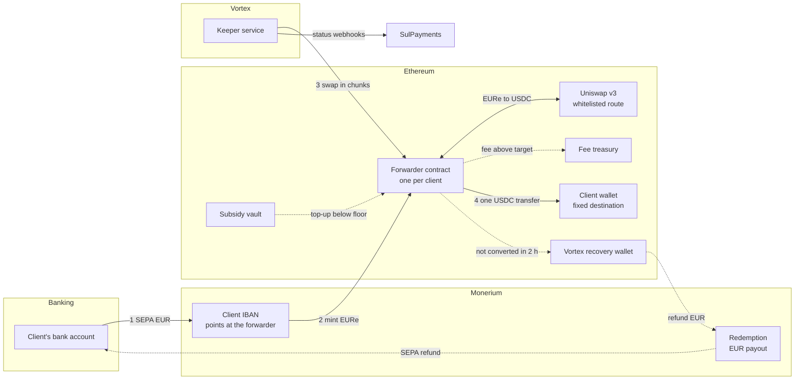
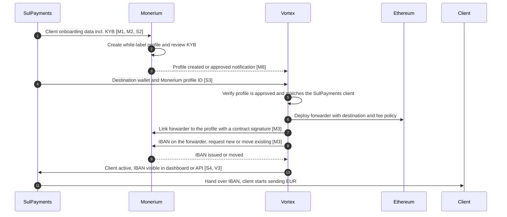
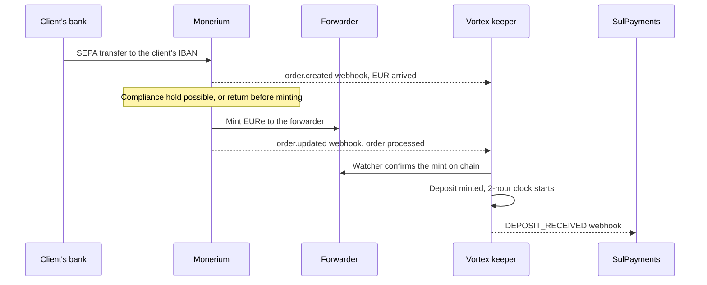
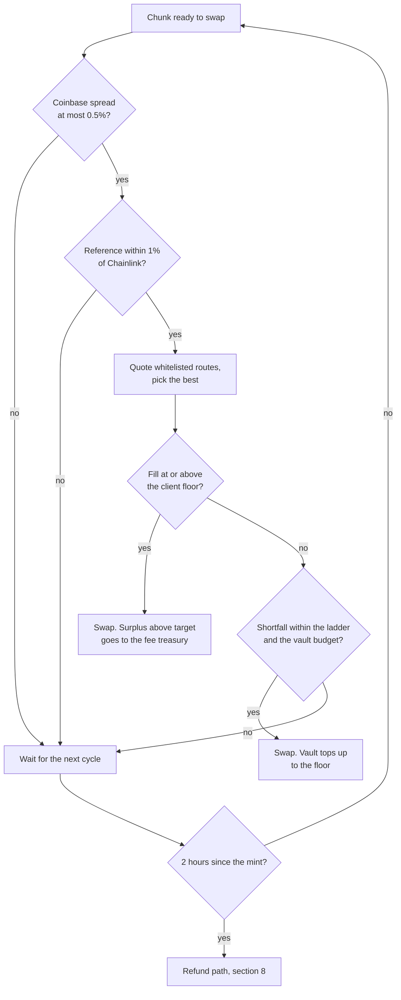
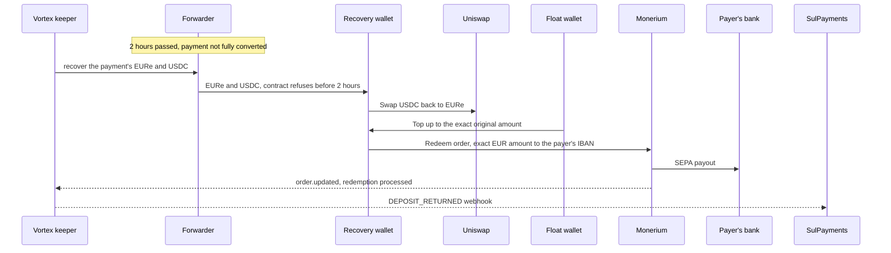
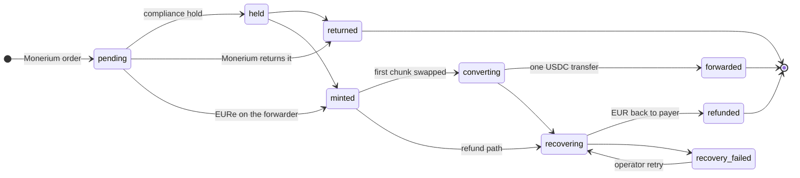

# Monerium B2B Onramp: End-to-End Flow

> **Status:** living overview, draft for alignment. Last updated 2026-09-29.
> **Audience:** Vortex/SatoshiPay internally, SulPayments, and Monerium.
> **Scope:** the EUR to USDC onramp for SulPayments' business clients, as built for the
> pilot on the branch of PR #1375. It is not merged or deployed yet. Open questions carry
> an ID such as **[M1]** (Monerium), **[S1]** (SulPayments) or **[V1]** (Vortex internal)
> and are collected in [section 12](#12-open-questions), with space for the answers.

## Contents

1. [In one paragraph](#1-in-one-paragraph)
2. [Who is involved](#2-who-is-involved)
3. [The flow at a glance](#3-the-flow-at-a-glance)
4. [Client onboarding](#4-client-onboarding)
5. [Payment in: SEPA to EURe](#5-payment-in-sepa-to-eure)
6. [Conversion: EURe to USDC](#6-conversion-eure-to-usdc)
7. [Delivery: one USDC transfer per payment](#7-delivery-one-usdc-transfer-per-payment)
8. [Unhappy path: full EUR refund](#8-unhappy-path-full-eur-refund)
9. [Status, reporting and support](#9-status-reporting-and-support)
10. [What Vortex can and cannot do](#10-what-vortex-can-and-cannot-do)
11. [Key parameters](#11-key-parameters)
12. [Open questions](#12-open-questions)
13. [Related documents](#13-related-documents)

## 1. In one paragraph

A SulPayments business client sends EUR by SEPA to its own dedicated IBAN. Monerium
mints the same amount of EURe to a smart contract that Vortex deployed for that client,
the **forwarder**. Vortex converts the EURe to USDC on chain at a price tied to a public
market reference, and sends the whole payment to the client's wallet as **one USDC
transfer**. If a payment cannot be converted within **two hours**, Vortex refunds the
**full EUR amount** to the bank account it came from. The forwarder can only ever pay
three places: the client's fixed wallet, Vortex's fee treasury, and, for a refund after
the two-hour window, Vortex's recovery wallet.

## 2. Who is involved

| Party or component | Role |
|---|---|
| **SulPayments** | Partner. Brings the business clients, performs their KYB (Monerium relies on it), receives status webhooks, and hands each client its IBAN. |
| **Client** | The business that sends EUR and receives USDC in its own wallet, the **destination**. |
| **Monerium** | Licensed EURe issuer. Hosts each client's profile and IBAN in Vortex's white-label app, mints EURe for incoming SEPA payments, and pays out EUR on redemption. |
| **Vortex / SatoshiPay** | Operator. Deploys the contracts, runs the **keeper** service that converts and forwards, runs refunds, and reports status. |
| **Forwarder contract** | One per client on Ethereum. Receives the minted EURe, swaps it, holds the USDC until the payment is complete, then forwards it. |
| **Subsidy vault** | A Vortex-funded USDC pool that tops up a swap when the market delivers less than the client's guaranteed floor. |
| **Fee treasury** | Vortex multisig that receives the conversion fee. |
| **Recovery wallet and float wallet** | Two Vortex addresses on a Vortex/SatoshiPay company profile at Monerium, used only for refunds. |
| **Price sources** | Coinbase Exchange EURC-USDC market for the reference rate, Chainlink EUR/USD as the on-chain safety bound, Uniswap v3 where the swaps execute. |

## 3. The flow at a glance

Solid arrows are the happy path. Dotted arrows only happen when needed: a fee or
subsidy on a swap, or the refund path.

## 4. Client onboarding

### 4.1 What has to be true when onboarding ends

- The client has a **KYB-approved corporate profile** in Vortex's white-label app at
  Monerium, based on SulPayments' KYB under a reliance arrangement.
- A **forwarder contract** exists with the client's destination wallet written into it.
  The destination cannot be changed later. A new wallet means a new forwarder and moving
  the IBAN, on SulPayments' written instruction.
- The forwarder is **linked** to the client's Monerium profile, and the client's **IBAN
  points at the forwarder**. Monerium mints to whatever address the IBAN points at, so
  this is what routes every payment through the conversion. An IBAN pointing at the
  client's own wallet would deliver EURe, not USDC.
- Vortex has mapped the client under **SulPayments' partner account**, so webhooks and
  API reads reach SulPayments.

### 4.2 Proposed onboarding flow

This is the flow SatoshiPay proposed for the pilot. Steps marked with an ID still need
an answer.

Notes on the proposal:

- **Destination on the Monerium profile.** The original proposal has Monerium add the
  destination address to the profile, and Vortex swap it for the forwarder address
  later. Linking an address at Monerium needs a signature from that address's owner,
  which exchange deposit addresses cannot give. Vortex also does not need the
  destination at Monerium, because it is stored in the forwarder contract. The simpler
  route is for SulPayments to send the destination to Vortex directly **[S3]**.
- **IBAN before the forwarder exists.** Monerium issues one IBAN per profile. If
  Monerium creates it before the forwarder is linked, it points at another address, and
  Vortex must move it to the forwarder before anyone pays into it. Until then, a payment
  would mint EURe somewhere other than the forwarder **[M3]**.
- **New-profile notification.** Monerium's white-label webhooks include
  `profile.updated`, with no separate creation event **[M6]**.

### 4.3 What is built today

- A Vortex operator deploys the forwarder, then one admin call maps the client with its
  Monerium profile ID, SulPayments' client ID, the destination and the fee policy.
- The keeper then links the forwarder and requests the IBAN automatically. The IBAN is
  recorded when Monerium confirms it.
- The operator then activates the account.
- SulPayments can read the account and its IBAN through the Vortex API. There is no
  dashboard view yet **[V3]**.
- Adopting the proposal changes two things: onboarding starts from Monerium's profile
  notification instead of an operator call, and the keeper moves an existing IBAN
  instead of requesting a new one **[V1]**.

### 4.4 Decisions behind onboarding

- **One forwarder per client.** Each client gets its own contract, created as a cheap
  clone of one shared, verified implementation. A published manifest lets anyone check
  every deployed forwarder against it.
- **Fixed destination.** The destination is set at deployment and has no setter, so no
  key, including Vortex's, can redirect a client's USDC.
- **Contract-signed link.** A contract cannot sign like a wallet. The forwarder
  therefore proves ownership to Monerium by accepting a signature from a Vortex attestor
  key, but only over Monerium's exact link message. That key has no power over the
  contract's funds.

## 5. Payment in: SEPA to EURe

- Vortex listens on **two channels**. Monerium's webhooks carry the order details:
  amount, order ID, compliance holds, and the payer's IBAN and name. Vortex's own chain
  watcher proves the EURe actually arrived on the forwarder. A deposit becomes eligible
  for conversion only when both agree **[M7]**.
- The payer's **IBAN and name are stored** from the order. They are the target of any
  refund.
- The **two-hour window starts at the mint**, not at the SEPA transfer, because Vortex
  cannot act before the EURe exists.
- Monerium may **hold** a payment for compliance or **return** it before minting. These
  are Monerium's decisions, and nothing reaches the forwarder.

## 6. Conversion: EURe to USDC

### 6.1 Chunks

A payment larger than the per-swap cap of **€10,000** is converted in several chunks, a
few minutes apart. The chunks' USDC waits on the forwarder until the whole payment is
converted. Two payments are never mixed in one swap. A single client's payments are
converted one after the other, while different clients' payments convert in parallel.

### 6.2 Price

- **Reference rate:** the midpoint between the best bid and the best ask on the Coinbase
  Exchange EURC-USDC market, read immediately before each chunk and recorded with it. A
  chunk waits while that market's spread is wider than 0.5%.
- **Client target:** the reference minus 0.125%. Whatever the market delivers above the
  target is Vortex's fee, capped at 1% on chain.
- **Client floor:** the reference minus 0.15%. If the market delivers less, Vortex tops
  the chunk up from the subsidy vault, within limits.
- **Safety bound:** no chunk ever delivers less than the Chainlink EUR/USD rate minus
  0.6%, or it does not execute. If the Coinbase reference sits below that bound, the
  client gets the bound, and Vortex pays the difference within its subsidy limits.
- The reference must also be within 1% of Chainlink, so a bad price feed cannot push a
  swap far off market.

### 6.3 Subsidy ladder

How much Vortex is willing to top up grows with how long a chunk has waited for the
market. Waiting time counts per chunk, from when it became ready to swap.

| Waiting time | Maximum top-up |
|---|---|
| 0 to 6 min | none |
| 6 to 8 min | 0.10% |
| 8 to 10 min | 0.20% |
| 10 to 12 min | 0.30% |
| 12 to 14 min | 0.40% |
| 14 to 16 min | 0.50% |
| from 16 min | 1.00% |

The ladder is a keeper setting that Vortex can retune without touching the contracts.
The contract enforces the cap the keeper passes with each swap, and the vault enforces a
per-swap cap and a daily budget on top.

### 6.4 Per-chunk decision

## 7. Delivery: one USDC transfer per payment

- Once every chunk of a payment is converted, the keeper sends the whole USDC amount to
  the client's destination in **one transfer**.
- After the transfer is 32 blocks deep, SulPayments receives **DEPOSIT_CONVERTED**. It
  carries each chunk's reference rate, fee and subsidy, and the transaction hash of the
  final transfer.
- **Without Vortex:** if the keeper stops for 24 hours, anyone can convert at the
  Chainlink price without subsidy and forward the forwarder's USDC to the destination. A
  client's funds never depend on Vortex staying online.
- **Dormancy:** after 60 days without a conversion, forwarding pauses until the
  destination is re-confirmed in writing.

## 8. Unhappy path: full EUR refund

### 8.1 When a payment is refunded

- It was **not converted within two hours** of the mint. Typical causes are a market
  move beyond the bounds, thin liquidity, an exhausted subsidy budget, or an operational
  fault.
- It is **below the €1 minimum swap**.
- An operator triggers it after a **compliance decision or an incident**.

A payment is never partly delivered. If any part cannot be converted in time, the whole
payment is refunded, including chunks that were already converted.

### 8.2 How a refund runs (as built)

- The payer gets back the **exact EUR amount**. Losses from the round trip and fees
  already taken on converted chunks are Vortex's cost, paid from the float wallet.
- The contract **enforces the two-hour window**. The forwarder cannot move funds to the
  recovery wallet any earlier.
- The refund is sent from the **Vortex/SatoshiPay company account** at Monerium. The
  payer's bank statement shows that sender, with a reference to the original payment.
- SEPA Instant is used when the payer's bank supports it, otherwise next business day.
- Refunds of **€15,000 or more stay manual** until Monerium confirms whether a supporting
  document is required **[M9]**.
- Refunds run one at a time and survive a crash of the keeper midway. A refund that
  fails its retries goes to **recovery failed** and is handed to Vortex operations.
- Rollout: the automation first runs in **alert mode**, where Vortex operators confirm
  each refund. It switches to **automatic** after the first refund has been observed end
  to end.

### 8.3 Refund mechanism options

The proposal raised whether the refund could come from the **client's own Monerium
IBAN**, and how to do that securely. The options:

| | A. Vortex recovery wallet (built) | B. Contract-signed redemption from the client's profile | C. Monerium return facility |
|---|---|---|---|
| **Refund sent from** | Vortex/SatoshiPay company profile | The client's own profile and IBAN | The client's profile, by Monerium |
| **Custody** | Vortex holds the funds during the refund only | Funds stay on the client's forwarder until burned | Monerium |
| **Main risk** | Payer must trust Vortex to complete the refund | The contract cannot know who the payer was. A stolen keeper key could redeem to any IBAN unless the contract only allows an agreed list of IBANs per client | Depends on Monerium's process |
| **What it needs** | Nothing more to build. Monerium sign-off for one profile refunding many payers **[M8]** | Contract changes: an IBAN allowlist per client with delayed changes, reverse swap and top-up on the forwarder, redemption signature checks. Re-audit. Monerium accepting contract-signed redemptions **[M8]** | A native Monerium feature, not documented today **[M8]** |
| **Bank statement shows** | SatoshiPay / Monerium | The client's Monerium account | To be confirmed |

Option B is only safe if clients pay from a small, known set of bank accounts, such as
their own business accounts **[S6]**. The decision is open **[V2]**.

## 9. Status, reporting and support

### 9.1 Deposit status

Statuses only move forward. A late or repeated webhook can never move a deposit back.

### 9.2 What SulPayments receives

| Event | When | Key content |
|---|---|---|
| `DEPOSIT_RECEIVED` | EURe minted to the client's forwarder | Deposit ID, account, amount, mint transaction |
| `DEPOSIT_CONVERTED` | The USDC transfer is 32 blocks deep | Per chunk: reference rate, fee, subsidy. The forward transaction hash |
| `DEPOSIT_RETURNED` | The refund was processed by Monerium | Refunded amount, masked payer IBAN, Monerium redemption ID, recovery transaction |

- Webhooks are signed. SulPayments verifies each one against Vortex's published public
  key and deduplicates on the event ID.
- **Fallback:** the deposits endpoint of the Vortex API returns the current status of
  every deposit, for polling if a webhook is missed.
- **Reference IDs** in every event: the deposit ID, the account ID and the client's
  profile ID, plus the mint, forward or recovery transaction hash and, on a refund,
  Monerium's redemption ID. Vortex also keeps Monerium's order ID and SulPayments' own
  client ID per deposit for support queries, and the refund memo carries the deposit ID.
- **Gaps:** there are no reason codes on a refund yet, and a payment Monerium returns
  before minting triggers no webhook, only a status visible by polling **[V4]**.

### 9.3 Exceptions and escalation

- Vortex monitors stuck payments, refunds due, failed refunds, the subsidy budget, the
  float balance, IBAN changes at Monerium, and the Coinbase market status.
- Operators can pause conversion, force a refund, or correct a deposit's status through
  admin endpoints. The runbook covers each case.
- Named owners and the escalation path between Vortex, SulPayments and Monerium are
  still to be agreed **[V5]**.

## 10. What Vortex can and cannot do

**Vortex can:**

- Deploy forwarders, run conversions, and pause them.
- Choose the swap route from an on-chain whitelist.
- Change a client's fee policy within the 1% cap. Raising it takes effect only after a
  24-hour on-chain notice. Lowering it is immediate.
- Fund or limit its own subsidy budget.
- Move a payment to its recovery wallet, only after the two-hour window, to refund it.

**Vortex cannot:**

- Redirect funds. A forwarder pays only the client's fixed destination, the fee
  treasury, and, after two hours, the recovery wallet.
- Deliver a conversion below the Chainlink rate minus 0.6%.
- Stop a client's conversion permanently. After 24 hours anyone can complete it.
- Prevent incoming SEPA payments. Payments made during a pause wait safely as EURe and
  are converted or refunded later.

## 11. Key parameters

| Parameter | Value | Changeable |
|---|---|---|
| Refund window | 2 hours from the mint | Fixed in the contract |
| Permissionless fallback | 24 hours | Fixed in the contract |
| Client target and floor | Reference minus 0.125% and minus 0.15% | Per client, increases need 24 h notice |
| Fee cap | 1% | Fixed in the contract |
| Safety bound against Chainlink | 0.6% | Fixed in the contract |
| Reference band against Chainlink | 1% | Fixed in the contract |
| Maximum Coinbase spread | 0.5% | Keeper code |
| Subsidy ladder | none for 6 min, rising to 1% from 16 min | Keeper setting |
| Chunk size | up to €10,000 | Operational, ceiling €50,000 |
| Minimum swap | €1 | Operational, can be raised but never below €1 |
| Manual refunds | €15,000 and above | Until [M9] is answered |
| Dormancy pause | 60 days without a conversion | Keeper code |
| Pilot volume | 3 to 5 clients, €50,000 per client per day | Contractual |

## 12. Open questions

### 12.1 Monerium

| ID | Question | Why it matters | Status | Answer |
|---|---|---|---|---|
| M1 | How should new clients be onboarded into our white-label app? | Defines the onboarding flow in section 4.2 | Asked 2026-09-29 on Telegram | |
| M2 | How are SulPayments' existing clients imported? How long does KYB take once SulPayments' data is in, and is that business hours? | Pilot timeline and client expectations | Open | |
| M3 | For a profile Monerium creates, can Vortex link the forwarder with its contract signature and put the IBAN on it? If the IBAN already exists on another address, may Vortex move it, and can Monerium promise not to move it back? | The IBAN must point at the forwarder before a client pays | Open | |
| M4 | Can our white-label app list all profiles Monerium creates for SulPayments' clients? The public spec lists the profiles an app "has access to", and in the sandbox profiles onboarded through another app were not visible. | Automated onboarding and reconciliation | Open | |
| M5 | Which profile data can we read? The public spec shows ID, name, kind, state, section states and a rejection or closure reason, plus each IBAN's BIC, linked address and chain, but not the submitted KYB details. | What the SulPayments dashboard view can show | Open | |
| M6 | Does `profile.updated` fire when Monerium creates and approves a profile in our app? | Trigger for automated onboarding | Open | |
| M7 | Do `order.created` and `order.updated` arrive as described in section 5, with the payer's IBAN and name on the order? To be confirmed with a sandbox SEPA simulation. | The payer IBAN is the refund target | Open, sandbox test pending | |
| M8 | Refund mechanism: do you accept option A, one Vortex company profile refunding many payers? Is there a native return-to-sender facility, option C? Would you accept contract-signed redemptions from the client's profile, option B? | Refund design, section 8.3 | Open | |
| M9 | Does a refund of €15,000 or more to the original payer need a supporting document? Could the original payment serve as one? | Whether large refunds can run automatically | Open | |
| M10 | Which outgoing limits, fees and cut-off times apply to redemptions from our company profile? | Refund timing promise | Open | |
| M11 | Onboarding of the Vortex/SatoshiPay company profile with a recovery address and a float address. | Needed before the contracts can be deployed, since the recovery address is fixed in them | Open | |
| M12 | Production white-label API credentials for the B2B app. | Needed before go-live | Open | |
| M13 | Written confirmation of the items agreed verbally so far: the attestor-signed link, the redemption-limitation disclosure, the issuer recovery backstop, what authorizes an IBAN move or new address link, SEPA recall and fraud loss allocation, per-IBAN suspension, and advance notice of changes to the link message. | Launch gate | Open | |

### 12.2 SulPayments

| ID | Question | Why it matters | Status | Answer |
|---|---|---|---|---|
| S1 | Onboarding volume: an initial batch of existing clients, then new clients one by one? How many, and when? | Operational planning, manual versus automated onboarding | Open | |
| S2 | Does SulPayments send client onboarding data, including KYB, directly to Monerium? Who are the contacts on each side? | Onboarding flow, section 4.2 | Open | |
| S3 | How is each client's destination wallet and Monerium profile ID given to Vortex: Vortex dashboard or Vortex API? Who at SulPayments approves it? | The destination is fixed in the contract, so it must be right the first time | Open | |
| S4 | Plan: each client's IBAN is shown in the Vortex dashboard and API. Is that how SulPayments hands IBANs to clients? | Dashboard scope | Open | |
| S5 | Confirm that the smart-contract address on each client's Monerium profile is managed by Vortex, and that clients never link or change it themselves. | Only the forwarder may receive the minted EURe | Open | |
| S6 | Do clients always pay from their own business bank accounts, or also from third parties? | Refund target, and whether option B is viable | Open | |
| S7 | Are destinations self-custody wallets or exchange deposit addresses? | Exchange addresses need an attestation that they do not rotate and accept contract transfers | Open | |
| S8 | Are the three webhooks plus polling enough? Are reason codes needed on refunds? Webhook endpoint and support contacts. | Status reporting, section 9 | Open | |
| S9 | Is a two-hour window before a full refund right for your clients? Is a refund sent from SatoshiPay's account acceptable? | Refund promise in the agreement | Open | |
| S10 | The agreement names a "Coinbase EURC oracle". The implementation uses the Coinbase Exchange EURC-USDC bid/ask midpoint. Is that what was meant? | Pricing terms | Open | |

### 12.3 Vortex internal

| ID | Question or task | Depends on | Status |
|---|---|---|---|
| V1 | Adapt onboarding to the proposal: start from Monerium's profile notification, and move an existing IBAN to the forwarder instead of requesting a new one. | M1 to M6 | Open |
| V2 | Final refund mechanism, option A as built or option B. | M8, S6 | Open |
| V3 | Dashboard view for SulPayments with clients, IBANs, deposits and refunds. Today this is API only. | S4, M5 | Open |
| V4 | Reason codes on refunds, and a webhook for payments Monerium returns before minting. | S8 | Open |
| V5 | Named owners per alert, and the escalation path between Vortex, SulPayments and Monerium. | Meeting | Open |

## 13. Related documents

For Vortex readers who need the detail behind this overview:

- [`architecture-monerium-b2b-onramp.md`](architecture-monerium-b2b-onramp.md): the
  complete technical architecture.
- [`adr-0005-monerium-b2b-onramp.md`](adr-0005-monerium-b2b-onramp.md): decisions, final
  parameters and accepted risks.
- [`operations-monerium-b2b-rollout.md`](operations-monerium-b2b-rollout.md): launch
  gates, deploy checklist and agreement inputs.
- [`operations-monerium-b2b-runbook.md`](operations-monerium-b2b-runbook.md): operator
  procedures for onboarding, refunds and incidents.
- [`security-spec/05-integrations/monerium-b2b.md`](security-spec/05-integrations/monerium-b2b.md):
  security invariants.
- [`api/pages/07-webhooks.md`](api/pages/07-webhooks.md): the partner webhook format and
  signature check.
