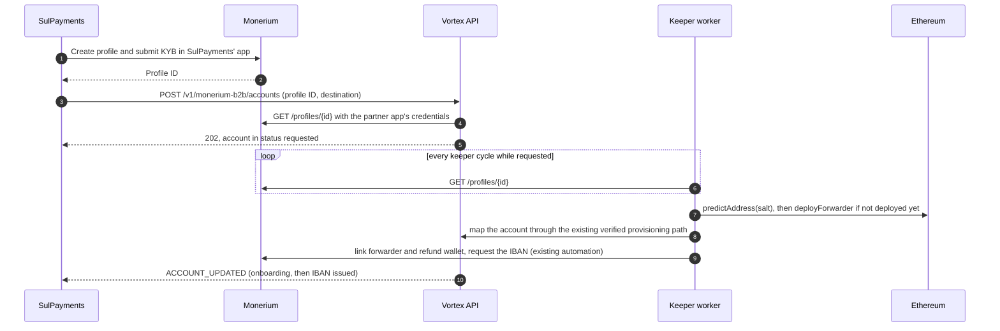

# Proposal: partner endpoint to register a client's destination (Monerium B2B)

> **Status:** draft for implementation, written 2026-10-01; target go-live the week of
> 2026-10-05. Builds on PR #1375 (branch `feat/monerium-forwarder-fee-subsidy`).
> Open-question IDs refer to
> [`product-monerium-b2b-flow.md`](product-monerium-b2b-flow.md) section 12 (V6, V1, V8,
> S3, S11). Decisions marked **D1** to **D7** need Marcel's confirmation before coding;
> each has a recommended default.

## 1. Goal

SulPayments onboards a client in its own Monerium white-label app, gets the Monerium
profile ID back, and calls one Vortex endpoint with that ID and the client's destination
wallet. Vortex does the rest without a manual step: it waits for Monerium to approve the
profile, deploys the client's forwarder with the destination and the client's refund
wallet, maps the account, links both addresses and requests the IBAN. SulPayments follows
progress through the account endpoints and the `ACCOUNT_UPDATED` webhook.

Today the same outcome needs a Vortex operator: deploy the clone with `cast`, then call
the admin mapping endpoint (runbook section 1). That path stays as the fallback.

## 2. API contract (share with SulPayments early)

`POST /v1/monerium-b2b/accounts`

- **Auth:** the manager's own secret `X-API-Key`. A `X-Managed-Profile-Id` header is
  rejected with 400 and a child's own credential with 403, as on
  `GET /v1/monerium-b2b/accounts`. The manager must be active and allowed the EU corridor
  and business customers, and must be the partner bound to the white-label app the
  profile lives in (D6).
- **Body:**

```json
{
  "moneriumProfileId": "0b8e7c2a-8f4e-4d43-9f2b-2f9f3c1d5a6e",
  "destination": "0x9965507D1a55bcC2695C58ba16FB37d819B0A4dc",
  "destinationType": "wallet",
  "externalSubjectId": "client-123",
  "contactEmail": "ops@client.example.com"
}
```

  `destinationType` is `wallet` or `exchange`. An exchange deposit address additionally
  needs `"exchangeConfirmed": true`: SulPayments confirms it does not rotate and credits
  USDC sent from a contract (D4).
- **Responses:**
  - `202` with the account snapshot in status `requested`: `accountId`,
    `forwarderAddress` and `iban` are `null` until the forwarder exists.
  - `200` for an identical replay, returning the current snapshot.
  - `409 MONERIUM_B2B_DESTINATION_CONFLICT` when the profile is already registered with
    a different destination or client reference. A destination is never overwritten; a
    change is a new account on SulPayments' written instruction (runbook section 5).
  - `400 MONERIUM_B2B_INVALID_INPUT` for a malformed ID, a bad checksum, or a zero,
    token, router or contract address as destination.
  - `422 MONERIUM_B2B_PROFILE_UNAVAILABLE` when the profile is not visible to the
    partner's white-label app, or is `rejected` or `closed`.
- **Lifecycle the partner sees:** `requested` (waiting for Monerium's approval or for
  the deployment), then `onboarding` (forwarder deployed and mapped, IBAN being issued),
  then `active`. `GET /v1/monerium-b2b/accounts?moneriumProfileId=` returns the account
  at every stage, and `ACCOUNT_UPDATED` fires from `onboarding` onwards (it already does).
- **No KYB data** is accepted or stored; security spec invariant 11 stays intact.

## 3. Flow



1. **Request.** The endpoint validates the input, reads the profile from the partner's
   white-label app, creates or reuses the managed child for `externalSubjectId`, and
   stores a registration row. Nothing is deployed yet.
2. **Wait for approval.** Each keeper cycle reads the profiles of `requested`
   registrations. `approved` moves on; `rejected` or `closed` marks the registration
   `rejected`; anything else waits. Polling is enough at pilot volume and avoids
   processing `profile.updated` webhooks, which the backend does not handle today (D5).
3. **Deploy, idempotently.** The salt is `keccak256(abi.encode(moneriumProfileId,
   destination))`. The keeper asks the factory for the predicted address; if
   `isForwarder(predicted)` is already true it adopts the clone, otherwise the guardian
   key sends `deployForwarder(destination, refundAccountFor(profile), targetPpm,
   floorPpm, salt)` and waits for the receipt. A crash anywhere repeats nothing: CREATE2
   makes the address deterministic and a second deploy is never sent for a registered
   clone.
4. **Map.** The keeper calls the existing `provisionMoneriumB2bAccount` with the
   predicted address. That path already verifies the clone on chain (trusted factory,
   destination, fee policy and the derived refund wallet) and commits the managed child,
   KYB mirror and account row in one transaction. The registration records the account.
5. **Link and IBAN.** Unchanged: the onboarding automation links the forwarder and the
   refund wallet and requests the IBAN. `ACCOUNT_UPDATED` reports each step.
6. **Activation.** An operator call in the pilot (D3).

## 4. Data model

New table `monerium_account_registrations` (migration 086):

| Column | Notes |
|---|---|
| `id` | UUID |
| `manager_profile_id` | The partner manager that registered it |
| `managed_profile_id` | The Vortex child created or reused for `external_subject_id` |
| `monerium_profile_id` | Unique: one registration per Monerium profile |
| `external_subject_id`, `contact_email` | As submitted |
| `destination`, `destination_type`, `exchange_confirmed` | Lowercased address, as submitted |
| `status` | `requested`, `deploying`, `mapped`, `rejected` |
| `forwarder_address`, `deploy_tx_hash` | Set once predicted and sent |
| `account_id` | Set once mapped |
| `rejected_reason`, `created_at`, `updated_at` | |

Why a separate table rather than a `requested` row in `monerium_accounts` (D1): every
account row today is a verified, deployed clone, the mapping invariant and the mint
watcher (which scans every non-closed account) rely on it, and the existing mapping code
can be reused unchanged. The account endpoints merge `requested` registrations into the
list so the partner still sees one resource.

## 5. Security

- **The destination is the most sensitive field a partner key can set.** It decides
  where a new client's USDC goes and cannot be changed later. Controls:
  - create-only per Monerium profile; first registration wins, conflicts return 409;
  - the profile must be visible to the partner's own white-label app, so a key cannot
    register destinations for another partner's clients;
  - validation rejects zero, token, router, factory and contract addresses, and exchange
    addresses need the explicit confirmation;
  - `ACCOUNT_UPDATED` echoes the destination to SulPayments' webhook, so a wrong one can
    be caught before activation;
  - activation stays an operator step in the pilot (D3).
- **Hot guardian key.** Automated deployment uses the guardian key, which the backend
  already holds for the dormancy pause. The ADR's GA goal of a hardware or multisig
  guardian would then need a separate deployer role on the factory, a small contract
  change that is cheapest before mainnet deployment (D7).
- **Gas.** The guardian pays one clone deployment per client and needs ETH on mainnet and
  Sepolia; a balance alert joins the existing monitors.
- **Spec changes:** invariant 12 (mapping is admin-only) becomes "admin call or partner
  registration, always through the same on-chain verification"; invariant 15 gains the
  registration endpoint and its manager-only scope.

## 6. Dependencies

1. **Per-partner Monerium credentials (V8), required.** The endpoint reads the profile
   with SulPayments' app credentials, and the keeper links and requests IBANs in that
   app. Today the B2B module shares `MONERIUM_WHITELABEL_CLIENT_ID/SECRET` with the retail
   onramp. Pilot shape (D6): dedicated `MONERIUM_B2B_CLIENT_ID/SECRET` for SulPayments'
   app and `MONERIUM_B2B_PARTNER_MANAGER_PROFILE_ID` binding that app to SulPayments'
   manager; a per-partner credential table can follow with the second partner.
2. **PR #1375** merged first, or this branch stays stacked on it.
3. **For the sandbox test (S11):** a Sepolia deployment of the implementation, factory
   and vault with a working EURe to USDC route and an EUR/USD oracle, and api-sandbox
   running this code with SulPayments' sandbox app credentials.

## 7. Decisions needed

| ID | Decision | Recommended default |
|---|---|---|
| D1 | Separate registration table, or a `requested` status inside `monerium_accounts` | Separate table, section 4 |
| D2 | Automated deployment by the keeper, or an operator deploys from a registration queue | Automated, idempotent through CREATE2 |
| D3 | Activation: operator call, or automatic once the IBAN is issued | Operator call for the production pilot, automatic in sandbox |
| D4 | Exchange destinations: explicit `destinationType` plus confirmation, or no distinction | Explicit type plus `exchangeConfirmed` |
| D5 | Detect approval by polling the profile, or by processing `profile.updated` webhooks | Polling each cycle while requested |
| D6 | Partner binding for the pilot: environment variables, or a credential table now | Environment variables, table with the second partner |
| D7 | Add a factory deployer role now so the guardian can go cold at GA | Yes, before the mainnet deployment |

The fee policy stays the existing default of 1250 / 1500 ppm for every registration;
per-partner fee defaults can follow when a second partner needs different terms.

## 8. Tests

- **Endpoint (integration):** manager-only auth and the header and child-credential
  refusals; identical replay returns 200; a different destination returns 409; invalid
  addresses and an exchange address without confirmation return 400; a profile outside
  the partner's app returns 422; the account list shows the `requested` entry.
- **Keeper (unit, fake chain and Monerium):** approved profile deploys once and maps;
  a crash after the deploy adopts the clone without a second send; a pending profile
  waits; a rejected profile marks the registration rejected; the mapped account carries
  the derived refund wallet.
- **Contract (if D7):** only the guardian manages deployers, and a deployer can deploy
  but nothing else.

## 9. Schedule for the week of 2026-10-05

| Day | Work |
|---|---|
| Monday | Confirm D1 to D7. Send the section 2 contract to SulPayments. Build the per-partner credentials (V8) and the partner binding |
| Tuesday | Migration 086, model, `POST /v1/monerium-b2b/accounts`, validation, list merge, endpoint tests |
| Wednesday | Keeper step: profile polling, deterministic deployment, mapping, keeper tests. Deployer role if D7 |
| Thursday | Docs (OpenAPI, partner pages, security spec, runbook, flow overview, ADR amendment). Deploy to api-sandbox with the Sepolia contracts |
| Friday | Dry run with one SulPayments sandbox profile, then the joint test session (S11) |

## 10. Docs to update when built

OpenAPI and `docs/api/pages/14-managed-profiles.md` (the endpoint and the `requested`
status), the security spec invariants 12 and 15, runbook section 1 (registration path
first, manual path as fallback), the flow overview (V6, V1, V8, S3), and an ADR-0005
amendment for partner-initiated onboarding.
