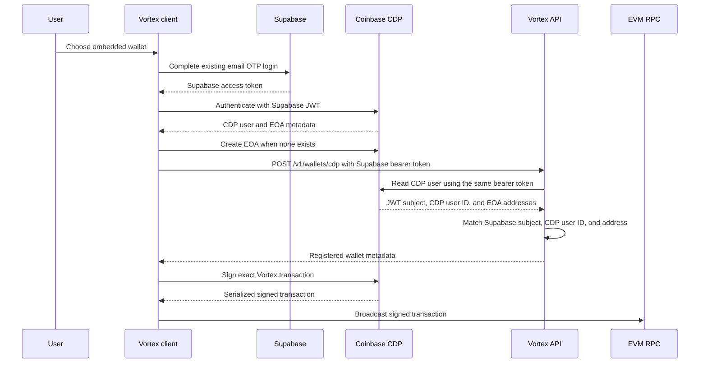

# Optional Coinbase CDP Embedded Wallets

## Scope

Vortex offers a Coinbase Developer Platform (CDP) EVM EOA as an optional alternative to a browser wallet. The
existing Reown/Wagmi and Polkadot wallet paths remain available and do not initialize CDP.

CDP does not replace Vortex authentication:

- Supabase email OTP remains the canonical Vortex login and API identity.
- CDP custom authentication consumes the current Supabase access token.
- Vortex API routes continue to accept only the Supabase bearer token.
- CDP is initialized only after an authenticated user explicitly chooses, or previously selected, embedded-wallet
  mode.
- EOA creation remains an explicit Vortex action; no CDP `createOnLogin` option is configured.

## Trust Boundaries

The API stores wallet metadata and has no CDP signing credential. Signing and secure export are requested from the
CDP browser SDK. Vortex never receives an exported private key.

## Security Invariants

1. **Embedded wallet creation MUST be opt-in.** Loading Vortex, authenticating, or connecting an external wallet must
   not create a CDP EOA.
2. **Supabase remains authoritative.** Every `/v1/wallets` route uses `requireAuth`; `req.userId` comes only from the
   verified Supabase token.
3. **Registration MUST verify provider ownership.** The API forwards the request's Supabase bearer token to CDP and
   requires the returned JWT authentication method's `sub`, CDP user ID, and checksummed EOA address to match the
   authenticated profile and submitted metadata.
4. **Wallet metadata MUST NOT authorize movement of funds.** A `profile_wallets` row only controls wallet UX. Every
   existing server-issued signer/address binding, phase order, transaction validation, and receipt check remains
   mandatory.
5. **Private-key operations MUST stay inside CDP's protected client flow.** Vortex must not log, transmit, persist, or
   request exported key material.
6. **There is at most one active CDP EVM wallet per profile.** Database constraints also prevent a CDP user ID or EVM
   address from being registered to multiple profiles.
7. **Mode changes MUST be blocked during a nonterminal ramp.**
8. **Unknown iframe ancestry MUST fail closed.** The widget initializes CDP only at top level or when
   `document.referrer` has an exact origin match in `VITE_CDP_WIDGET_PARENT_ORIGINS`.
9. **Signing behavior MUST be wallet-neutral.** External and CDP adapters feed the same ramp signing functions. CDP
   receives the server-issued nonce, gas, fee, chain, destination, value, and calldata. The signed EIP-1559
   transaction is broadcast through the configured Vortex RPC so all supported EVM networks remain usable.
10. **BSC tips MUST meet the chain minimum.** When a BSC transaction has a zero priority fee, the client uses the
    current BSC gas price for both fee caps before asking CDP to sign.
11. **Observability MUST exclude wallet identity and signing payloads.** Addresses, CDP user IDs, JWTs, signatures,
    exported keys, and raw transaction bodies are not attached to Sentry user context or error messages.

## Persistence and API Contract

`profiles.wallet_mode` is nullable and accepts `external` or `cdp_embedded`.

`profile_wallets` stores:

- the Vortex profile ID;
- provider `cdp`;
- the opaque CDP user ID in `provider_wallet_id`;
- the checksummed EVM address;
- chain type `ethereum`;
- status and timestamps.

Authenticated routes:

- `GET /v1/wallets` returns the selected mode and active wallet metadata.
- `PATCH /v1/wallets/mode` changes the preference unless a ramp is active.
- `POST /v1/wallets/cdp` verifies ownership, registers idempotently, and selects embedded mode atomically.

`CDP_WALLET_REGISTRATION_ENABLED` fails registration closed when disabled. An enabled API requires
`CDP_PROJECT_ID`. Provider timeouts and non-success responses do not persist metadata.

## Authentication and Current Residual Risk

The CDP React provider receives a callback that returns the current Supabase access token, refreshing it when it is
near expiry. The widget and dashboard remount the CDP provider when the Vortex user changes.

In the current iteration, Supabase tokens still use the existing Vortex browser storage model. A script that steals
an active bearer token may be able to authenticate to both Vortex and the configured CDP project for that user.
Token isolation, stronger browser controls, transaction-intent confirmation, CDP policy controls, and step-up
authentication are intentionally tracked for the next hardening iteration in
[`docs/plans/cdp-embedded-wallet-security-hardening.md`](../../plans/cdp-embedded-wallet-security-hardening.md).
They are not protections supplied by this implementation.

## User Recovery and Export

The dashboard opens CDP's controlled `ExportWalletModal` for the selected address. CDP's secure iframe performs the
disclosure; Vortex does not render or intercept the private key. Export keeps CDP's default MFA behavior.

Before production enablement, validate export and recovery on supported browsers and establish a support process for
account recovery and provider outages.

## Threats and Mitigations

| Threat | Current mitigation |
|---|---|
| A user submits another CDP identity or address | CDP lookup with the authenticated bearer token plus JWT subject, CDP user ID, and address matching |
| A CDP user ID or address is rebound to another profile | Unique database constraints and conflict responses |
| A malicious embed initializes wallet controls | Exact parent-origin allowlist; unknown or referrer-less iframe ancestry fails closed |
| A client flag creates wallets for every login | No automatic EOA creation plus a separate provisioning flag |
| A provider outage changes ownership state | Registration fails closed; external-wallet flow remains available |
| A user changes wallets during a ramp | API rejects mode changes while a nonterminal ramp exists |
| CDP convenience send omits a Vortex network | CDP raw-signs EIP-1559 transactions; Vortex broadcasts through its configured RPC |
| A BSC RPC reports a zero priority fee | Adapter replaces it with the current BSC gas price |
| Wallet data reaches monitoring | Wallet errors use the existing pseudonymous Supabase Sentry identity only |

## Audit Checklist

- [ ] Each environment uses the intended CDP project and Supabase issuer/JWKS configuration.
- [ ] Supabase issues ES256 or RS256 JWTs and CDP custom auth maps the `sub` claim.
- [ ] Dashboard, widget, and exact trusted parent origins are registered in CDP and Vortex configuration.
- [ ] Provisioning, dashboard onramp, and dashboard offramp flags are enabled independently.
- [ ] Ownership mismatch, duplicate binding, active-ramp switching, and provider outage tests pass.
- [ ] Base and BSC signing smoke tests pass with the production RPC configuration.
- [ ] Secure export and account recovery are tested and documented for support.
- [ ] AssetHub and Polkadot flows do not render or initialize CDP.
- [ ] Sentry and API logs contain no address, CDP user ID, token, signature, key, or transaction payload.
- [ ] The hardening backlog is resolved or explicitly risk-accepted before broad production rollout.
