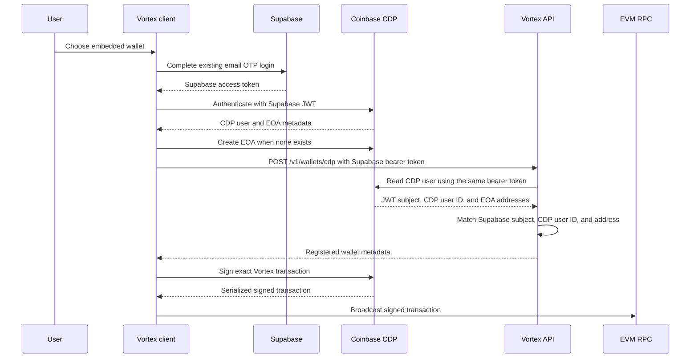

# Coinbase CDP embedded wallets

## Scope

Vortex offers a Coinbase Developer Platform (CDP) EVM EOA as an optional alternative to a browser wallet. The
existing Reown/Wagmi and Polkadot wallet paths remain available and do not initialize CDP.

CDP does not replace Vortex authentication:

- Supabase email OTP remains the canonical Vortex login and API identity.
- CDP custom authentication consumes the current Supabase access token.
- `/v1/wallets` routes continue to accept only the Supabase bearer token; CDP authentication does
  not authorize Vortex API requests.
- CDP is initialized only after an authenticated user explicitly chooses, or previously selected, embedded-wallet
  mode.
- EOA creation remains an explicit Vortex action; no CDP `createOnLogin` option is configured.

Production provisioning, signing, and export are currently **deferred** under
[`RISK-018`](../RISK-REGISTER.md#current-risks). Only test-environment CDP access and test networks
have been exercised. The production assumptions, evidence requirements, staged enablement, and
rollback procedure are maintained in
[`operations-cdp-embedded-wallet-rollout.md`](../../operations-cdp-embedded-wallet-rollout.md).

## Trust Boundaries

The API stores wallet metadata and has no CDP signing credential. Signing and secure export are requested from the
CDP browser SDK. Vortex never receives an exported private key.

CDP is nevertheless a wallet-security and availability boundary. Normal signing requires the
user's custom-auth token plus the device-specific CDP request credential (Temporary Wallet Secret,
or TWS). CDP stores/operates the
encrypted EOA key in its infrastructure, while same-origin Vortex JavaScript can ask the active
SDK session to sign. A CDP project ID is public configuration. A backend CDP Wallet Secret is not
part of this end-user flow and must not be granted delegated signing authority.

## Security Invariants

1. **Embedded wallet creation MUST be opt-in.** Loading Vortex, authenticating, or connecting an external wallet must
   not create a CDP EOA.
2. **Supabase remains authoritative.** Every `/v1/wallets` route uses `requireAuth`; `req.userId` comes only from the
   verified Supabase token.
3. **Registration MUST verify provider ownership.** The API forwards the request's Supabase bearer token to CDP and
   requires the returned JWT authentication method's `sub`, CDP user ID, and checksummed EOA address to match the
   authenticated profile and submitted metadata.
4. **Wallet metadata MUST NOT authorize movement of funds.** A `profile_wallets` row only controls wallet UX. Every
   existing server-issued signer/address binding, phase order, transaction validation, and receipt check remains
   mandatory.
5. **Private-key operations MUST stay inside CDP's protected client flow.** Vortex must not log, transmit, persist, or
   request exported key material.
6. **There is at most one active CDP EVM wallet per profile.** Database constraints also prevent a CDP user ID or EVM
   address from being registered to multiple profiles.
7. **Mode changes MUST be blocked during a nonterminal ramp.**
8. **Unknown iframe ancestry MUST fail closed.** The widget initializes CDP only at top level or when
   `document.referrer` has an exact origin match in `VITE_CDP_WIDGET_PARENT_ORIGINS`.
9. **Signing behavior MUST be wallet-neutral.** External and CDP adapters feed the same ramp signing functions. CDP
   preserves every server-issued nonce, gas, fee, chain, destination, value, and calldata field; it estimates only
   transport fields the server omitted. The signed EIP-1559 transaction is broadcast through the configured Vortex
   RPC so all supported EVM networks remain usable.
10. **BSC tips MUST meet the chain minimum.** When a BSC transaction has a zero priority fee, the client uses the
    current BSC gas price for both fee caps before asking CDP to sign.
11. **Observability MUST exclude wallet identity and signing payloads.** Addresses, CDP user IDs, JWTs, signatures,
    exported keys, and raw transaction bodies are not attached to Sentry user context or error messages.
12. **Production and test control planes MUST remain separated unless Coinbase documents an in-place promotion.**
    A production deployment must not reuse the current test project ID, origins, or policies by assumption. CDP
    users, device credentials, EOAs, and `profile_wallets` metadata must not be copied between projects without a
    supported, rehearsed migration that proves address equality and rollback.
13. **Delegated signing MUST remain disabled.** Enabling it would turn a backend Wallet Secret into end-user wallet
    authority and requires a separate design, security review, approval, and specification change.
14. **CDP policies MUST fail closed over every enabled operation.** They must restrict supported networks,
    contracts, transaction value, methods and available arguments; validate EIP-712 domains and permit fields; allow
    only the widget's required SIWE challenge for message signing; and deny raw-hash and unrelated message signing.
15. **High-risk wallet actions MUST receive explicit user protection.** Signing batches require a human-readable
    confirmation. Device enrollment and export require the approved CDP MFA/step-up configuration. Only CDP's
    isolated export UI may disclose key material.
16. **Production browser origins MUST be narrow.** CDP and iframe allowlists contain exact HTTPS origins only;
    wallet-capable pages enforce a reviewed CSP and do not load unnecessary third-party scripts.
17. **CDP SDK upgrades MUST trigger a security review.** Token storage, device-credential creation and persistence,
    export behavior, MFA, policies, and delegation defaults must be reverified before rollout.
18. **Signing and export MUST fail closed independently.** Base wallet restore and provisioning do not imply
    signing or private-key export authority. `VITE_CDP_SIGNING_ENABLED` and `VITE_CDP_EXPORT_ENABLED` are separate,
    disabled-by-default kill switches in both clients; dashboard offramp use additionally requires its own flow flag.
19. **Embedded raw-message signing MUST be SIWE-only.** Before invoking CDP, the widget requires the canonical
    Vortex sign-in format, active checksummed address, current widget origin, strong nonce, non-expired timestamps,
    and at most the server's seven-day login lifetime. Unrelated messages fail before reaching CDP.

## Persistence and API Contract

`profiles.wallet_mode` is nullable and accepts `external` or `cdp_embedded`.

`profile_wallets` stores:

- the Vortex profile ID;
- provider `cdp`;
- the opaque CDP user ID in `provider_wallet_id`;
- the checksummed EVM address;
- chain type `ethereum`;
- status and timestamps.

Authenticated routes:

- `GET /v1/wallets` returns the selected mode and active wallet metadata.
- `PATCH /v1/wallets/mode` changes the preference unless a ramp is active.
- `POST /v1/wallets/cdp` verifies ownership, registers idempotently, and selects embedded mode atomically.

`CDP_WALLET_REGISTRATION_ENABLED` fails registration closed when disabled. An enabled API requires
`CDP_PROJECT_ID`. Provider timeouts and non-success responses do not persist metadata.

The dashboard gates provisioning, onramp-destination use, offramp use, signing, and export
independently. The widget gates base support, provisioning, signing, and export, and permits
embedded-wallet UI in an iframe only for configured exact parent origins. All flags default to
disabled. Embedded transaction, EIP-712, SIWE, and export requests use a browser-native exact-field
confirmation and fail before the CDP call if confirmation is unavailable or rejected. Its
supported-browser/iframe usability remains the explicit CDP-A7 production assumption.

## Authentication and Current Residual Risk

The CDP React provider receives a callback that returns the current Supabase access token, refreshing it when it is
near expiry. The widget and dashboard remount the CDP provider when the Vortex user changes.

In the current iteration, Supabase tokens still use the existing Vortex browser storage model. A script that steals
an active bearer or renewable session may authenticate to Vortex and the configured CDP project as that user.
Same-origin XSS is stronger still: it can invoke the active SDK session without exporting the EOA key or device
credential. Domain allowlisting does not mitigate code already running on an allowed origin.

The source-level flags and ownership checks limit accidental exposure; they do not resolve that browser-security
boundary. Production approval must evidence the policy, confirmation, MFA, CSP, monitoring, and incident controls in
the rollout runbook. Any decision to enable the current JavaScript-readable session model without stronger session
isolation must be an explicit, scoped acceptance in `RISK-018`, not an undocumented deployment choice.

## User Recovery and Export

The dashboard opens CDP's controlled `ExportWalletModal` for the selected address. CDP's secure iframe performs the
disclosure; Vortex does not render or intercept the private key. The client does not override CDP's MFA behavior;
the required production MFA configuration remains a deployment gate.

Before production enablement, validate export and recovery on supported browsers and establish a support process for
account recovery and provider outages.

## Threats and Mitigations

| Threat | Current mitigation |
|---|---|
| A user submits another CDP identity or address | CDP lookup with the authenticated bearer token plus JWT subject, CDP user ID, and address matching |
| A CDP user ID or address is rebound to another profile | Unique database constraints and conflict responses |
| A malicious embed initializes wallet controls | Exact parent-origin allowlist; unknown or referrer-less iframe ancestry fails closed |
| A client flag creates wallets for every login | No automatic EOA creation plus a separate provisioning flag |
| Enabling wallet restore accidentally enables signatures or export | Independent signing and export kill switches default off; the runtime does not install a CDP signing adapter or render export while disabled |
| A provider outage changes ownership state | Registration fails closed; external-wallet flow remains available |
| A user changes wallets during a ramp | API rejects mode changes while a nonterminal ramp exists |
| CDP convenience send omits a Vortex network | CDP raw-signs EIP-1559 transactions; Vortex broadcasts through its configured RPC |
| A BSC RPC reports a zero priority fee | Adapter replaces it with the current BSC gas price |
| Wallet data reaches monitoring | Wallet errors use the existing pseudonymous Supabase Sentry identity only |
| A stolen browser session enrolls another CDP device | Production stays deferred until custom-auth, device/MFA controls, alerts, and session risk are verified or explicitly accepted |
| Same-origin XSS silently requests a signature or export | Reviewed CSP and dependency surface, human confirmation, MFA, fail-closed CDP policy, and kill switches are production gates |
| Compromised widget code requests an unrelated raw-message signature | Client accepts only the canonical Vortex SIWE challenge for the active address and origin; CDP policy must independently deny unrelated messages |
| A broad CDP policy authorizes an unrelated transfer or permit | Policies and Vortex validation bind the operation, signer, chain, contract, destination/spender, value/amount, nonce, and deadline; negative fixtures must fail |
| Test metadata points at an unavailable production wallet | No `profile_wallets` copy or user promise until Coinbase confirms project promotion/migration and Vortex proves address continuity |

## Audit Checklist

- [x] Wallet creation is opt-in, base/provisioning/use flags default off, and registration fails closed without an
  enabled API flag and project ID.
- [x] Wallet registration is Supabase-authenticated and checks the JWT subject, CDP user ID, and checksummed address
  before profile-scoped persistence.
- [x] Active-ramp mode changes, cross-profile CDP identity/address reuse, and a second different wallet for one
  profile are rejected by service logic and database constraints.
- [x] CDP and external adapters share the ramp signing contract; CDP raw-signs EIP-1559 transactions for broadcast
  through the configured Vortex RPC.
- [x] Independent signing/export kill switches default off; embedded actions require exact-payload confirmation;
  widget raw-message signing rejects non-canonical, wrong-address, wrong-origin, expired, future, or overlong SIWE.
- [ ] Production project separation and CDP-A1 through CDP-A7 are unresolved; production access or written Coinbase
  evidence is required.
- [ ] Production custom auth verifies the intended issuer, JWKS, audience, ES256/RS256 algorithm, expiry, and `sub`
  mapping, including negative tests.
- [ ] Dashboard, widget, and exact trusted parent origins are registered in CDP and Vortex production configuration.
- [ ] Delegated signing is disabled; fail-closed transaction, EIP-712, and SIWE policy fixtures pass.
- [ ] Ownership mismatch, duplicate binding, active-ramp switching, provider outage, payload mutation, replay,
  wrong-chain/contract, excessive-approval, and spender-substitution suites pass on the release commit.
- [ ] The native exact-payload confirmation passes supported-browser/iframe product and security review (or is
  replaced with an approved dedicated UI); reviewed CSP, MFA/device controls, and monitoring pass security review.
- [ ] Base and BSC low-value signing smoke tests pass with production RPC configuration and every supported offramp
  fixture.
- [ ] Secure isolated export and account recovery are tested on the supported browser matrix and documented for
  support.
- [ ] AssetHub and Polkadot flows do not render or initialize CDP, and external-wallet regression tests pass.
- [ ] Sentry, logs, analytics, and support tools contain no address, CDP user ID, bearer token, device credential,
  signature, key, or raw transaction payload.
- [ ] `RISK-018` is closed, or a named owner has approved an exact cohort/value/network/expiry exception before any
  production funds are exposed.
