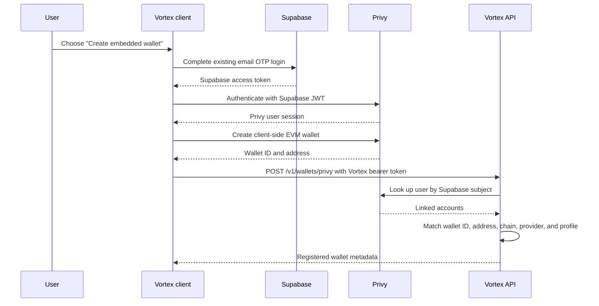

# Optional Privy Embedded Wallets

## Scope

Vortex offers a Privy-created EVM wallet as an optional alternative for users who do not have, or do not want to
connect, a browser wallet. Existing Reown/Wagmi wallet connections remain the default-compatible path and do not
create a Privy user or wallet.

This integration does not replace Vortex authentication:

- Supabase email OTP remains the canonical Vortex login and API identity.
- Privy consumes the existing Supabase JWT through JWT-based custom authentication.
- Vortex never accepts a Privy access token as authorization for Vortex API routes.
- Privy is used only to provision and operate an EVM wallet after an explicit user choice.
- Polkadot and AssetHub wallet flows are unchanged and never use Privy.

## Trust Boundaries

The browser asks Privy to sign. The Vortex API stores only wallet metadata and never receives the private key,
recovery material, or authority to sign. No delegated server signer is configured by this implementation.

## Security Invariants

1. **Embedded wallet creation MUST be opt-in.** `createOnLogin` is `off`. Loading Vortex, authenticating, or connecting
   an external wallet must not create a Privy wallet.
2. **Supabase remains authoritative.** All `/v1/wallets` routes use `requireAuth`; `req.userId` comes only from verified
   Supabase authentication.
3. **The Privy app secret MUST remain server-side.** Only the public app ID and optional client ID may use a `VITE_`
   prefix.
4. **Registration MUST verify provider ownership.** Before persisting metadata, the API looks up the Privy user whose
   custom auth ID equals the authenticated Supabase profile ID and matches the wallet ID and checksummed address.
5. **Wallet metadata MUST NOT authorize movement of funds.** A `profile_wallets` record may choose UX defaults, but
   ramp ownership checks and every existing server-issued signer/address binding remain mandatory.
6. **Private-key operations MUST stay in the client.** Vortex must not log, transmit, persist, or request a user's
   exported private key.
7. **There is at most one active Privy EVM wallet per profile.** The database also prevents a Privy wallet ID or EVM
   address from being registered to multiple profiles.
8. **Mode changes MUST be blocked during a nonterminal ramp.** This prevents the wallet selected for an in-flight ramp
   from silently changing.
9. **Unknown iframe ancestry MUST fail closed.** The widget initializes Privy only at top level or when
   `document.referrer` has an exact origin match in `VITE_PRIVY_WIDGET_PARENT_ORIGINS`. A missing referrer in an iframe
   is not trusted.
10. **Gas is user-paid by default.** Sponsorship is enabled only when `VITE_PRIVY_GAS_POLICY=sponsored` and the
    corresponding Privy policy and Vortex transaction allowlist have been reviewed.
11. **Signing behavior MUST be wallet-neutral.** External and embedded adapters feed the same existing ramp signing
    functions; this integration must not weaken transaction contents, chain checks, signature checks, or phase
    ordering.
12. **Observability MUST exclude wallet identity.** Wallet addresses, provider wallet IDs, JWTs, signatures, and
    transaction payloads are not attached to Sentry user context or error messages.

## Persistence and API Contract

`profiles.wallet_mode` is nullable and accepts `external` or `privy_embedded`. `null` preserves the legacy behavior.

`profile_wallets` stores:

- Vortex profile ID;
- provider (`privy`);
- opaque Privy wallet ID;
- checksummed EVM address;
- chain type (`ethereum`);
- status and timestamps.

Authenticated routes:

- `GET /v1/wallets` returns the selected mode and active wallet metadata.
- `PATCH /v1/wallets/mode` changes the preference unless a ramp is active.
- `POST /v1/wallets/privy` verifies Privy ownership, registers idempotently, and selects the embedded mode atomically.

The server verification request is bounded by a timeout. Disabled or unavailable provider verification returns a
service-unavailable response; missing or mismatched ownership fails registration.

## User Recovery and Export

The dashboard exposes Privy's client-side export flow for the selected address. Export is a sensitive operation: the
user must be authenticated and Privy's protected UI performs the disclosure. Vortex must not render or intercept the
key itself.

Before enabling the feature in production:

- verify export on every supported production browser;
- provide user-facing guidance for importing the exported EVM key;
- document that losing access to the Vortex/Supabase account can affect access until the key has been exported;
- decide whether MFA is required for wallet actions;
- establish a support escalation for account recovery and provider outages.

## Threats and Mitigations

| Threat | Mitigation |
|---|---|
| An attacker submits another user's wallet metadata | Server-side Privy lookup by authenticated custom auth ID, plus wallet ID/address matching |
| A wallet ID or address is rebound to another profile | Unique database constraints and conflict responses |
| A malicious embed tries to initialize wallet controls | Exact parent-origin allowlist and fail-closed behavior for unknown iframe ancestry |
| A client flag accidentally creates wallets for everyone | `createOnLogin: "off"` plus a separate provisioning feature flag |
| A provider outage changes wallet ownership | Registration fails closed; existing external-wallet flow remains available |
| A user changes wallets during a ramp | API rejects mode changes while a nonterminal ramp exists |
| Sponsored gas becomes an unbounded cost or transaction bypass | User-paid default; sponsorship needs an explicit flag and separately reviewed provider policies |
| Sensitive wallet data reaches monitoring | Wallet Sentry domain uses profile-level auth context only; no address/provider ID fields |
| Embedded signing diverges from external signing | Shared adapter contract tests exercise the existing phase calls and request shapes |

## Audit Checklist

- [ ] Production and staging use separate Privy app/client configuration.
- [ ] Supabase JWT verification is configured in Privy using the correct JWKS and `sub` claim.
- [ ] Only the required dashboard, widget, and exact trusted parent origins are allowlisted.
- [ ] `PRIVY_APP_SECRET` is available only to the API secret store and is absent from built client assets.
- [ ] Provisioning, onramp, offramp, and sponsorship flags were enabled independently and in that order.
- [ ] Wallet creation is absent from external-wallet login and connection tests.
- [ ] Ownership mismatch, duplicate binding, active-ramp switching, and provider outage tests pass.
- [ ] Client-side export and account recovery have been tested and documented for support.
- [ ] AssetHub and Polkadot flows do not render or initialize Privy.
- [ ] Sentry events contain no wallet address, provider wallet ID, token, signature, or transaction payload.

## References

- [Privy: using an existing JWT authentication provider](https://docs.privy.io/authentication/user-authentication/jwt-based-auth/usage)
- [Privy: configure JWT-based authentication](https://docs.privy.io/authentication/user-authentication/jwt-based-auth/setup)
- [Privy: automatic wallet creation](https://docs.privy.io/basics/react/advanced/automatic-wallet-creation)
- [Privy: configure allowed origins](https://docs.privy.io/recipes/dashboard/allowed-domains)
- [Privy: export a wallet](https://docs.privy.io/wallets/wallets/export)
- [Privy: configure gas sponsorship](https://docs.privy.io/wallets/gas-and-asset-management/gas/setup)
