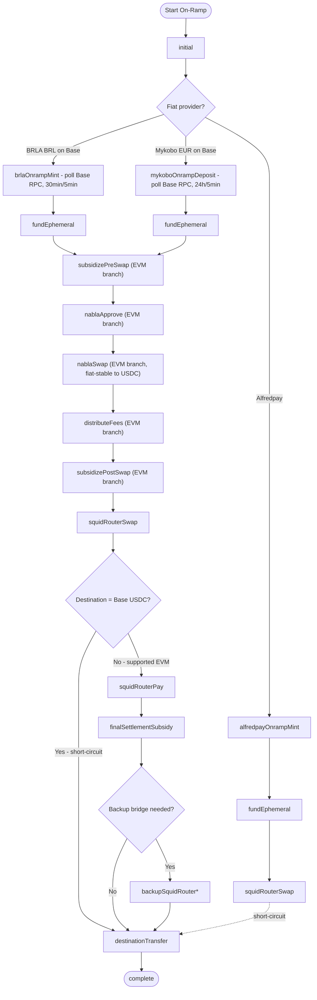
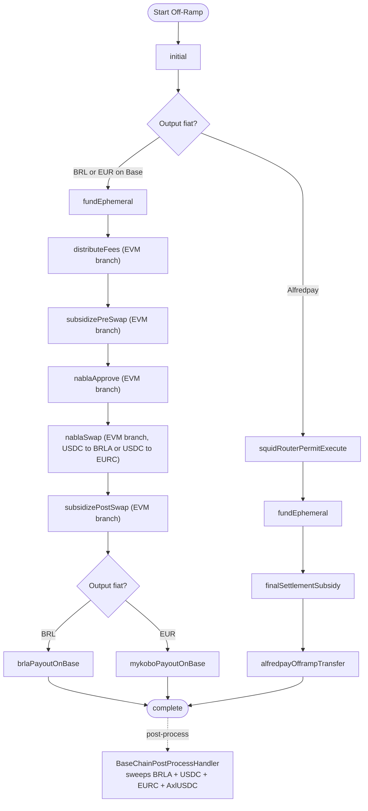

# Ramp Phase Flows — Token Movement Across Chains

## What This Does

Each ramp operation executes as a sequence of phases, where each phase performs one discrete action: a swap, a bridge transfer, an XCM message, a payment, or a subsidization top-up. The phase sequence determines the exact path tokens take from source to destination. Different ramp corridors (e.g., EUR→ARS, BRL→USDC, EUR→BRL) use different phase sequences because they traverse different chains and integrations.

Understanding the complete token flow for each corridor is critical for security because:
1. **Funds change custody at each phase** — tokens move between user ephemeral accounts, platform funding accounts, DEX contracts, bridge vaults, and integration provider wallets.
2. **Each phase handler submits presigned or server-signed transactions** — incorrect ordering or skipped phases can leave funds in intermediate accounts.
3. **Subsidy phases inject platform funds** — the platform tops up ephemeral accounts to cover gas, bridging fees, or amount shortfalls, creating a direct drain vector if amounts are unchecked.

There are 29+ phase handlers in `apps/api/src/api/services/phases/handlers/`. The phase processor in `state-machine.md` orchestrates their execution. The authoritative registry lives in `register-handlers.ts`.

### Major Ramp Corridors

**EUR Off-ramp (Mykobo on Base):** User's crypto on source EVM → Squid bridge to Base USDC (user-signed, client-side) → Nabla-on-Base swap (USDC→EURC) → Mykobo SEPA payout
- Runtime backend phases: `initial` → `fundEphemeral` → `distributeFees` (on Base, USDC) → `subsidizePreSwap` → `nablaApprove` → `nablaSwap` → `subsidizePostSwap` → `mykoboPayoutOnBase` → `complete`
- The Squid bridge from the source EVM chain to Base is executed by the user's wallet (presigned `squidRouterApprove` + `squidRouterSwap` are submitted client-side). Skip-Squid case: source = Base USDC.
- Note: `distributeFees` runs **before** `nablaSwap` on offramp because fees are denominated in USDC and must be deducted before swapping to EURC. Mirrors the BRL-on-Base off-ramp.
- **Removed:** the previous Stellar-based EUR off-ramp (Pendulum → Spacewalk → Stellar anchor) is no longer active. See `stellar-anchors.md`.

**EUR On-ramp (Mykobo SEPA on Base):** SEPA payment → Mykobo settles EURC on the Base ephemeral → Nabla-on-Base swap (EURC→USDC) → optional Squid → user destination
- Runtime backend phases: `initial` → `mykoboOnrampDeposit` (poll Base RPC, 24h outer / 5min inner) → `fundEphemeral` → `subsidizePreSwap` → `nablaApprove` → `nablaSwap` → `distributeFees` → `subsidizePostSwap` → `squidRouterSwap` → `destinationTransfer` → `complete`
- Note: like BRL on-ramp, `fundEphemeral` provides ETH gas to the Base ephemeral before swap/approve/squid txs. `mykoboOnrampDeposit` transitions to `fundEphemeral` (`mykobo-onramp-deposit-handler.ts`), which selects `subsidizePreSwap` next for the `BUY && inputCurrency === EURC` branch (`fund-ephemeral-handler.ts`).
- Skip-Squid case (destination = Base USDC): the `squidRouterSwap` handler short-circuits directly to `destinationTransfer`.
- Cross-chain case (destination ≠ Base USDC): `squidRouterSwap` → `squidRouterPay` → `finalSettlementSubsidy` → `destinationTransfer` for supported EVM destinations.
- **Degenerate EUR→EURC-on-Base case:** `isEurToEurcBaseDirect` short-circuits the entire pipeline to a single `destinationTransfer` (no Nabla, no Squid, no `finalSettlementSubsidy`, no cleanup), because Mykobo already settles EURC on the Base ephemeral and the generic path would otherwise swap EURC→USDC→EURC for itself. See `05-integrations/mykobo.md`.
- Base ephemeral cleanup (`baseCleanupUsdc`, `baseCleanupEurc`, `baseCleanupAxlUsdc`) is performed out-of-flow by `BaseChainPostProcessHandler` after `complete`.
- **Removed:** the previous Monerium EUR on-ramp (EURe on Polygon → Squid → Moonbeam → XCM → Pendulum) is no longer active. See `monerium.md`.

**BRL Off-ramp (Avenia/BRLA on Base):** User's crypto on source EVM → Squid bridge to Base USDC (user-signed, client-side) → Nabla-on-Base swap (USDC→BRLA) → Avenia PIX payout
- Runtime backend phases: `initial` → `fundEphemeral` → `distributeFees` (on Base, USDC) → `subsidizePreSwap` → `nablaApprove` → `nablaSwap` → `subsidizePostSwap` → `brlaPayoutOnBase` → `complete`
- The Squid bridge from the source EVM chain to Base is executed by the user's wallet (presigned `squidRouterApprove` + `squidRouterSwap` are submitted client-side); there is no runtime `squidRouterPay` phase in the BRL off-ramp.
- **Temporary disablement:** AssetHub→BRL quotes are currently not returned by the quote engine. The active BRL off-ramp corridor is source EVM → Base → PIX only; any legacy AssetHub→BRL route code should be treated as unreachable until the corridor is re-enabled.
- Note: `distributeFees` runs **before** `nablaSwap` on offramp because fees are denominated in USDC and must be deducted before swapping to BRLA.
- Naming: `nablaApprove`, `nablaSwap`, `distributeFees`, `subsidizePreSwap`, and `subsidizePostSwap` are polymorphic runtime phases that dispatch to the EVM (Base) branch when the ephemeral involved is on Base (BRL input or output corridor) and to the Substrate (Pendulum) branch otherwise.

**BRL On-ramp (Avenia/BRLA on Base):** PIX payment → Avenia mints BRLA on Base ephemeral → Nabla-on-Base swap (BRLA→USDC) → optional Squid → user destination
- Runtime backend phases: `initial` → `brlaOnrampMint` (poll Base RPC, 30min outer / 5min inner) → `fundEphemeral` → `subsidizePreSwap` → `nablaApprove` → `nablaSwap` → `distributeFees` → `subsidizePostSwap` → `squidRouterSwap` → `destinationTransfer` → `complete`
- Skip-Squid case (destination = Base USDC): the `squidRouterSwap` handler short-circuits directly to `destinationTransfer`.
- Cross-chain case (destination ≠ Base USDC): `squidRouterSwap` → `squidRouterPay` → `finalSettlementSubsidy` → `destinationTransfer` for supported EVM destinations. **BRL→AssetHub quotes are temporarily disabled** and should not enter this phase chain.
- **Degenerate BRL→BRLA-on-Base case:** `isBrlToBrlaBaseDirect` short-circuits the entire pipeline to a single `destinationTransfer` (no Nabla, no `distributeFees`, no Squid, no `finalSettlementSubsidy`, no cleanup), because Avenia already mints BRLA on the Base ephemeral and the generic path would otherwise swap BRLA→USDC→BRLA for itself. Mirrors the EUR→EURC-on-Base bypass. See `05-integrations/brla.md`.
- Base ephemeral cleanup (`baseCleanupUsdc`, `baseCleanupBrla`) is performed out-of-flow by a separate sweeper after `complete`; cleanup approvals are presigned but not part of the runtime nextPhase chain.

**Alfredpay corridors:** Similar structure with `alfredpayOfframpTransfer` / `alfredpayOnrampMint` replacing the fiat provider phases.
- **Degenerate Polygon same-token onramp case:** Alfredpay mints `ALFREDPAY_EVM_TOKEN` (USDT) on Polygon. When the user requests that same token on Polygon (`quote.metadata.request.to === Networks.Polygon` **and** `quote.outputCurrency === ALFREDPAY_EVM_TOKEN`), the `squidRouterSwap` handler short-circuits to `finalSettlementSubsidy` with no swap. Any **other** Polygon output (e.g. USDC) still runs the real USDT→output swap — `quote.metadata.request.to` is the destination network, not the output token, so the short-circuit MUST also check `outputCurrency`. See `05-integrations/alfredpay.md`.

**Cross-chain delivery (post-swap):** After the Nabla swap, tokens are routed to their final destination:
- ~~From Pendulum to Stellar (ARS-only since EUR was migrated to Mykobo): `spacewalkRedeem` → `stellarPayment`~~ — **REMOVED.** The Stellar/Spacewalk backend infrastructure was removed in commits `f89554d46` and `82761ba91`. `spacewalkRedeemHandler` and `stellarPaymentHandler` are no longer registered in `register-handlers.ts`. See `stellar-anchors.md`.
- From Pendulum to Moonbeam: `pendulumToMoonbeamXcm`
- From Pendulum to AssetHub: `pendulumToAssethubXcm`
- From Pendulum to Hydration: `pendulumToHydrationXcm` → `hydrationToAssethubXcm` (if needed)
- From Base to supported EVM destinations (BRL and EUR onramps): `squidRouterApprove` → `squidRouterSwap` → `squidRouterPay` → optional `backupSquidRouter*` on destination → `destinationTransfer`
- Trivial case (Base→Base USDC): direct `destinationTransfer` only (Squid skipped)

### Phase Transition Diagrams

The following diagrams show the phase transitions for all on-ramp and off-ramp corridors as registered in `register-handlers.ts` and assembled by the route builders in `apps/api/src/api/services/transactions/{on,off}ramp/routes/`. Diamond nodes denote conditional branches resolved at route-build time (not runtime phase transitions).

#### On-Ramp Phase Flow

The BRL (BRLA) and EUR (Mykobo) on-ramp corridors share the entire post-fiat phase chain on Base, including `fundEphemeral`. Only the initial fiat-watch phase differs (`brlaOnrampMint` vs `mykoboOnrampDeposit`).

> Notes:
> - **EUR onramp funds the ephemeral.** `mykoboOnrampDeposit` transitions to `fundEphemeral` (`mykobo-onramp-deposit-handler.ts`), which then transitions to `subsidizePreSwap` (`fund-ephemeral-handler.ts` `BUY && inputCurrency === EURC` branch). This matches BRL onramp behavior and ensures the Base ephemeral has ETH gas for `nablaApprove`/`nablaSwap`/squid txs.
> - **EUR/BRL onramps skip Pendulum funding.** `getRequiresPendulumEphemeralAddress` returns `false` for EURC and BRL inputs, so the registration flow never creates or funds a Pendulum ephemeral for these corridors. All movement is Base-EVM only. See `ephemeral-accounts.md`.
> - **SquidRouter RPC selection is sourced from `bridgeMeta.fromNetwork`, not the input currency.** `squid-router-phase-handler.ts` computes the source network from `bridgeMeta.fromNetwork` (set at registration time by the route builder) and passes it to `getClient(network)` for both approve and swap calls. The earlier heuristic that selected the RPC from `inputCurrency` was removed because EUR-onramp presigned transactions both carry `network: Networks.Base` (`mykobo-to-evm.ts`), which would have triggered a wrong-chain signer error on cross-chain destinations (e.g., `invalid chain id for signer: have 8453 want 137` for EUR → Polygon USDT).
> - **Alfredpay onramp short-circuits.** `squid-router-phase-handler.ts:72` detects `isAlfredpayOnramp` and transitions directly to `destinationTransfer`, skipping `squidRouterPay` and `finalSettlementSubsidy`.
> - The Pendulum-side on-ramp swap chain (`subsidizePreSwap` → `nablaApprove` → `nablaSwap` → `subsidizePostSwap` → `distributeFees` → `pendulumToAssethubXcm` / `pendulumToHydrationXcm` → `hydrationSwap` → `hydrationToAssethubXcm`) was used by the legacy Monerium-EUR-via-Pendulum corridor and by `avenia-to-assethub` BRL→AssetHub. Both corridors are **inactive**: Monerium was replaced by Mykobo-on-Base, and BRL↔AssetHub is temporarily disabled at quote eligibility. The Substrate-branch on-ramp handlers remain registered but are not reached by any active route.

#### Off-Ramp Phase Flow

The BRL (BRLA) and EUR (Mykobo) off-ramp corridors share the entire chain from `fundEphemeral` through `subsidizePostSwap`. Only the terminal payout phase differs (`brlaPayoutOnBase` vs `mykoboPayoutOnBase`).

> Notes:
> - The ARS-via-Stellar off-ramp is **REMOVED.** Backend infrastructure was removed in commits `f89554d46` and `82761ba91`. `spacewalkRedeemHandler` and `stellarPaymentHandler` are no longer registered. See `stellar-anchors.md`.
> - `BaseChainPostProcessHandler` sweeps **all four** Base tokens regardless of corridor (`base-chain-post-process-handler.ts:9`: `BASE_CLEANUP_PHASES = ["baseCleanupBrla", "baseCleanupUsdc", "baseCleanupEurc", "baseCleanupAxlUsdc"]`). Per-corridor route builders only presign the subset they need.
> - `pendulumCleanup` and other chain-specific post-process handlers (`PolygonPostProcessHandler`, `HydrationPostProcessHandler`) execute after `complete` via the post-process subsystem, not as in-flow phases. See `ephemeral-accounts.md`.

### Phase Handler Categories

| Category | Handlers | Funds Controlled By |
|---|---|---|
| **Subsidization (Substrate)** | `subsidize-pre-swap-handler` (Substrate branch), `subsidize-post-swap-handler` (Substrate branch), `final-settlement-subsidy`, `fund-ephemeral-handler` | Pendulum funding account → Pendulum ephemeral |
| **Subsidization (EVM)** | `subsidize-pre-swap-handler` (EVM branch), `subsidize-post-swap-handler` (EVM branch) | EVM funding account (`EVM_FUNDING_PRIVATE_KEY`, resolved per-network via `getEvmFundingAccount(network)` — currently the same key on Moonbeam and **Base**) → EVM ephemeral |
| **DEX Swap (Substrate)** | `nabla-approve-handler` (Substrate branch), `nabla-swap-handler` (Substrate branch), `hydration-swap-handler` | Ephemeral → DEX contract → ephemeral |
| **DEX Swap (EVM)** | `nabla-approve-handler` (EVM branch), `nabla-swap-handler` (EVM branch) | Base ephemeral → Nabla-on-Base contract → Base ephemeral |
| **Bridge / XCM** | `moonbeam-to-pendulum-handler`, `moonbeam-to-pendulum-xcm-handler`, `pendulum-to-moonbeam-xcm-handler`, `pendulum-to-assethub-phase-handler`, `pendulum-to-hydration-xcm-phase-handler`, `hydration-to-assethub-xcm-phase-handler`, `spacewalk-redeem-handler` | Source chain ephemeral → destination chain ephemeral |
| **Fiat provider** | `stellar-payment-handler`, `brla-payout-base-handler` (Base), `brla-onramp-mint-handler` (polls Base BRLA arrival), `mykobo-payout-handler` (Base EURC payout), `mykobo-onramp-deposit-handler` (polls Base EURC arrival), `alfredpay-offramp-transfer-handler`, `alfredpay-onramp-mint-handler` | Ephemeral ↔ provider |
| **SquidRouter** | `squid-router-phase-handler`, `squid-router-pay-phase-handler`, `squidrouter-permit-execution-handler` (incl. no-permit fallback) | Ephemeral/executor → SquidRouter → destination |
| **Fee distribution** | `distribute-fees-handler` (Substrate Pendulum + EVM Multicall3 on Base) | Ephemeral → platform fee collection address(es) |
| **Lifecycle** | `initial-phase-handler`, `destination-transfer-handler` | Setup and final delivery |

## Security Invariants

1. **Phase ordering MUST match the expected corridor flow** — Each corridor has a fixed phase sequence. The phase processor MUST NOT allow out-of-order transitions. The phase handler's return value determines the next phase, and it MUST match the expected sequence for the ramp's corridor.
2. **Subsidy amounts MUST be bounded** — Every subsidization handler (`subsidizePreSwap`, `subsidizePostSwap`, `fundEphemeral`, `finalSettlementSubsidy`) must enforce a maximum USD-equivalent cap to prevent draining the funding account on a single ramp.
3. **Presigned transactions MUST be used in the correct phase** — `getPresignedTransaction(state, phase)` retrieves the transaction for a specific phase. A phase handler MUST NOT access presigned transactions for a different phase.
4. **Token amounts at each phase MUST be traceable to the original quote** — The quote defines input/output amounts. Each phase should operate on amounts derived from the quote, not from untrusted runtime state.
5. **Cross-chain transfers MUST wait for finalization before advancing** — XCM and bridge transfers must confirm the source chain has finalized the send before the destination chain phase begins. Non-finalized transfers can be reverted by chain reorganization.
6. **Fee distribution MUST happen after all user-facing phases complete** — The `distributeFees` phase occurs near the end of the flow. Deducting fees before the user receives their funds risks the ramp failing after fees are taken.
7. **Each phase handler MUST be idempotent or have re-execution guards** — If the phase processor retries a phase (due to timeout or recoverable error), the handler must not double-execute (double-swap, double-transfer, double-fund). Nonce checks and balance pre-checks serve this purpose.
8. **SquidRouter RPC selection MUST be driven by `bridgeMeta.fromNetwork`** — `squid-router-phase-handler.ts` resolves the network via `bridgeMeta.fromNetwork` (set at registration by the route builder) and passes it to `getClient(network)` for both approve and swap calls. Selecting the RPC from `inputCurrency` would mis-route EUR onramps whose presigned txs carry `network: Networks.Base` to non-Base chains (causing `invalid chain id for signer: have X want Y` errors on cross-chain destinations).
9. **On same-chain destinations, `destinationTransfer` MUST be the first executable nonce after the broadcast SquidRouter txs — no nonce gap** — When the SquidRouter source chain equals the destination chain (e.g., EUR → Base EURC, BRL → Base USDC, Alfredpay Polygon-internal), the ephemeral shares ONE nonce sequence for `squidRouterApprove` → `squidRouterSwap` → `destinationTransfer`. The runtime broadcasts these in order, so `destinationTransfer` MUST carry the nonce immediately following `squidRouterSwap`. Two failure modes must both be avoided: (a) **collision** — reusing a nonce already consumed by an earlier tx; (b) **gap** — signing `destinationTransfer` with a nonce *above* the next live nonce, which the chain rejects as "nonce too high" so the tx never mines and user funds strand on the ephemeral (root cause of the EUR→Base 0-delivery incident: `destinationTransfer` was signed after the post-`complete` cleanup approvals — and, originally, after handler-less backup re-swap txs — leaving a 1–2 nonce gap). The route builders therefore place `destinationTransfer` directly after `squidRouterSwap`, then append the post-`complete` cleanup approvals, and OMIT the backup re-swap txs on the same-chain branch (those have no registered handler — F-054 — and on a shared sequence would only widen the gap). Enforced in `mykobo-to-evm.ts`, `alfredpay-to-evm.ts`, and `avenia-to-evm-base.ts`.
10. **`destinationTransfer` MUST fail fast on a detectable nonce gap rather than retry-and-strand** — `destination-transfer-handler.ts` reads the ephemeral's live nonce (`getTransactionCount`, `blockTag: "pending"`) and compares it to the presigned `destinationTransfer` nonce before broadcasting. If the presigned nonce is *ahead* of the live nonce the transfer can never mine, so the handler raises an `UnrecoverablePhaseError` for manual review instead of looping until the retry budget silently exhausts (which previously stranded funds with no terminal signal). Using `"pending"` rather than `"latest"` ensures the check accounts for mempool transactions — a prior ephemeral tx still in the mempool would otherwise lower the observed nonce and falsely flag a gap. The live-nonce read is best-effort: an RPC failure or a malformed presigned transaction logs a warning and falls through to the normal balance-poll path, so a transient RPC outage or an unparseable tx cannot wedge the happy path.

## Threat Vectors & Mitigations

| Threat | Attack Scenario | Mitigation |
|---|---|---|
| **Phase skip / injection** | Attacker with DB access modifies `currentPhase` to skip subsidization or jump to `complete`. | Phase transitions are controlled by handler return values, not external input. DB access is a prerequisite (see `state-machine.md`, Threat: "Phase skip attack"). No DB-level constraints on valid transitions exist. |
| **Subsidy drain** | A crafted ramp triggers multiple subsidization phases, each at the maximum allowed amount, draining the funding account. | Per-ramp subsidy caps (`MAX_FINAL_SETTLEMENT_SUBSIDY_USD`, balance pre-checks in pre/post-swap handlers). No aggregate cross-ramp cap exists — many concurrent ramps could still drain funds. |
| **Double-execution on retry** | Phase processor retries after timeout. Handler re-executes a swap or transfer that already completed. Funds are consumed twice. | Nonce guards in Spacewalk and Hydration handlers detect prior execution. Other handlers rely on transaction nonce uniqueness at the chain level. Not all handlers have explicit re-execution guards. |
| **Stale presigned transaction** | Client registers a ramp, waits for market movement, then starts the ramp with presigned transactions based on the old quote. | `RAMP_START_EXPIRATION_TIME_SECONDS` limits the window between registration and start. Quote expiry (10 minutes) limits how old the amounts can be. |
| **Cross-chain race condition** | XCM transfer submitted but not finalized. Next phase on destination chain reads a zero balance. | Most XCM handlers use `waitForFinalization=true`. Exception: Hydration skips finalization (F-009, deferred). |
| **Fee distribution failure** | `distributeFees` fails, but ramp is already marked `complete`. Platform loses fee revenue. | `distributeFees` is a phase — if it fails, the ramp enters retry, not `complete`. However, if the ramp fails after user delivery but before fee distribution, fees may be lost. |
| **Wrong-chain signer on SquidRouter** | RPC selected from `inputCurrency` heuristic instead of `bridgeMeta.fromNetwork`; EUR-onramp presigned txs (`network: Networks.Base`) submitted on Polygon RPC → `invalid chain id for signer` and the ramp stalls in `squidRouterSwap`. | `squid-router-phase-handler.ts` reads `bridgeMeta.fromNetwork` (set by the route builder) and routes both approve+swap to that chain's client. Heuristic removed. |
| **Same-chain destination nonce gap (0-delivery)** | SquidRouter source chain == destination chain (e.g. EUR → Base EURC). `destinationTransfer` is signed *after* the post-`complete` cleanup approvals (and handler-less backup re-swap txs), leaving its nonce above the live ephemeral nonce. The chain rejects it as "nonce too high"; it never mines, the ramp retries until the budget exhausts, and user funds strand on the ephemeral with no terminal signal. | Route builders (`mykobo-to-evm.ts`, `alfredpay-to-evm.ts`, `avenia-to-evm-base.ts`) place `destinationTransfer` at the first nonce after `squidRouterSwap`, append cleanups afterward, and omit the same-chain backup re-swap txs. `destination-transfer-handler.ts` additionally fails fast (`UnrecoverablePhaseError`) when the presigned nonce is detected ahead of the live nonce. |

## Audit Checklist

- [x] Phase processor calls handlers in sequence via `phaseRegistry` lookup — no parallel execution or phase skipping in code
- [x] `getPresignedTransaction(state, phase)` filters by phase name — handlers cannot accidentally access another phase's transaction
- [x] `subsidize-pre-swap-handler` and `subsidize-post-swap-handler` both query funding account balance before transfer (after F-032 fix)
- [x] `final-settlement-subsidy` has `MAX_FINAL_SETTLEMENT_SUBSIDY_USD` cap (after F-001 fix)
- [x] `final-settlement-subsidy` validates SquidRouter swap output amount (after F-030 fix)
- [x] `squidrouter-permit-execution-handler` validates `squidRouterPermitExecutionValue` cap (after F-027 fix)
- [x] `spacewalk-redeem-handler` has nonce-based re-execution guard — skips to waiting path if nonce indicates prior execution
- [x] Hydration XCM handler has nonce guard but only warns (F-028, fixed to skip like Spacewalk)
- [x] Moonbeam handler refreshes gas estimate per retry attempt (F-028, fixed)
- [x] `post-swap-handler` has explicit default rejection for unrecognized routing combinations (F-031, fixed)
- [x] `distributeFees` is a non-terminal phase — failure triggers retry, not silent skip
- [EXISTING FINDING] **F-053**: Five phase handlers lack idempotency guards — `stellar-payment-handler`, `pendulum-to-assethub-phase-handler`, `pendulum-to-hydration-xcm-phase-handler`, `hydration-swap-handler`, `nabla-swap-handler` can double-execute on retry.
- [EXISTING FINDING] **F-054**: Backup presigned transactions (`backupSquidRouterApprove`, `backupSquidRouterSwap`, `backupApprove`) have no registered phase handlers — dead code or missing implementation.
- [ ] No aggregate cross-ramp subsidy rate limiting — many concurrent ramps could drain funding account
- [x] Active BRL corridors are end-to-end on Base — no Moonbeam/Pendulum/XCM involvement. **PASS** — `register-handlers.ts` does not register any `brlaPayoutOnMoonbeam` phase; active BRL quotes are limited to the Base/EVM route builders (`evm-to-brl-base.ts` and `avenia-to-evm-base.ts`). BRL↔AssetHub is temporarily disabled at quote eligibility.
- [x] Active EUR corridors are end-to-end on Base — no Pendulum/Spacewalk/Stellar involvement for EUR. **PASS** — `register-handlers.ts` registers `mykoboOnrampDeposit` and `mykoboPayoutOnBase`. EUR off-ramp uses `evm-to-mykobo.ts`; EUR on-ramp uses `mykobo-to-evm.ts`. Stellar-EUR off-ramp and Monerium-EUR on-ramp are removed. See `05-integrations/mykobo.md`.
- [x] On the EUR/Base corridor, `distributeFees` is positioned **before** `nablaSwap` on offramp (USDC fees deducted pre-EUR-swap) and **after** `nablaSwap` on onramp (USDC fees deducted post-EUR→USDC swap). **PASS** — verified in `evm-to-mykobo.ts` and `mykobo-to-evm.ts`, mirroring the BRL/Base structure.
- [x] On the BRL/Base corridor, `distributeFees` is positioned **before** `nablaSwap` on offramp (USDC fees deducted pre-BRL-swap) and **after** `nablaSwap` on onramp (USDC fees deducted post-BRL→USDC swap). **PASS** — verified in `evm-to-brl-base.ts` and `avenia-to-evm-base.ts`.
- [x] EVM subsidy phases enforce a USD-equivalent cap. **PASS** — `MAX_EVM_SWAP_SUBSIDY_QUOTE_FRACTION="0.05"` clamps subsidy to ≤5% of the quote's input/output amount in the EVM branches of `subsidize-pre-swap-handler.ts` and `subsidize-post-swap-handler.ts` (F-NEW-02 resolved). Over-cap cases are intentionally recoverable retries: no transfer is submitted, and the ramp waits for operator intervention instead of moving to `failed`.
- [x] BRL on-ramp `backupApprove` allowance is bounded (no `maxUint256`). **PASS** — `avenia-to-evm-base.ts` `backupApprove` is set to `inputAmountRawFinalBridge × 1.05` (F-NEW-03 resolved).
- [x] EVM ephemeral cleanup coverage. **PASS** — **Polygon** (`PolygonPostProcessHandler`), **Hydration** (`HydrationPostProcessHandler`), and **Base** (`BaseChainPostProcessHandler`, sweeping both BRLA and USDC) are registered and active. **AssetHub** handler is registered but a no-op stub (`shouldProcess` always returns `false`). ETH gas dust on EVM ephemerals is not swept (intentional). F-NEW-05 resolved. See `ephemeral-accounts.md` for the full cleanup architecture.
- [x] Subsidy phase handlers extend the recoverable-retry budget. **PASS** — `subsidize-pre-swap-handler.ts` and `subsidize-post-swap-handler.ts` declare `getMaxRetries(): 200`, overriding the global `MAX_RETRIES = 8` in `phase-processor.ts`. Recoverable-exhausted ramps in subsidy phases wait (no `failed` transition) until a human tops up the funding account or cancels the ramp.
- [x] `squid-router-phase-handler.ts` resolves the source network from `bridgeMeta.fromNetwork` (not from `inputCurrency`); both `squidRouterApprove` and `squidRouterSwap` use the same `getClient(network)`.
- [x] On same-chain destinations (source == destination, e.g. EUR → Base EURC), `destinationTransfer` is placed at the first nonce **immediately after** `squidRouterSwap` (no gap), cleanups are appended after it, and the handler-less backup re-swap txs are omitted — verified in `mykobo-to-evm.ts`, `alfredpay-to-evm.ts`, `avenia-to-evm-base.ts`. Prevents the "nonce too high" 0-delivery strand.
- [x] `destination-transfer-handler.ts` fails fast on a nonce gap. **PASS** — before broadcasting it compares the presigned `destinationTransfer` nonce against the live ephemeral nonce (`getTransactionCount`, `blockTag: "pending"`) and throws `UnrecoverablePhaseError` if the presigned nonce is ahead, instead of retrying until the budget exhausts. The live-nonce read is best-effort (RPC failure warns and falls through), so a transient RPC outage cannot wedge the happy path.
- [x] EUR (Mykobo) and BRL (BRLA) onramps/offramps do NOT require a Pendulum ephemeral. `getRequiresPendulumEphemeralAddress` returns `false` for EURC and BRL inputs; registration skips Pendulum funding for these corridors.
