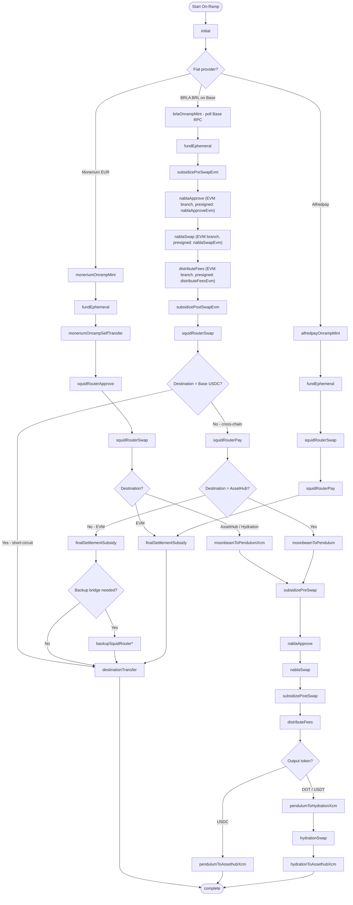
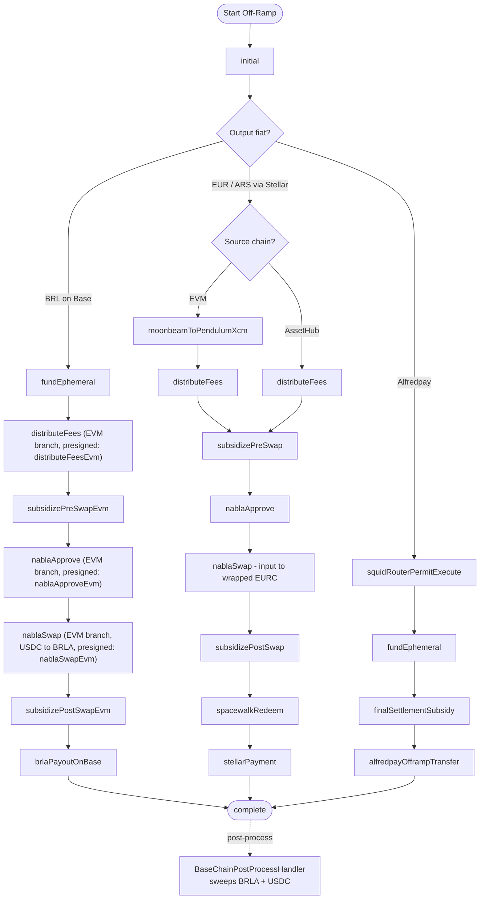

# Ramp Phase Flows — Token Movement Across Chains

## What This Does

Each ramp operation executes as a sequence of phases, where each phase performs one discrete action: a swap, a bridge transfer, an XCM message, a payment, or a subsidization top-up. The phase sequence determines the exact path tokens take from source to destination. Different ramp corridors (e.g., EUR→ARS, BRL→USDC, EUR→BRL) use different phase sequences because they traverse different chains and integrations.

Understanding the complete token flow for each corridor is critical for security because:
1. **Funds change custody at each phase** — tokens move between user ephemeral accounts, platform funding accounts, DEX contracts, bridge vaults, and integration provider wallets.
2. **Each phase handler submits presigned or server-signed transactions** — incorrect ordering or skipped phases can leave funds in intermediate accounts.
3. **Subsidy phases inject platform funds** — the platform tops up ephemeral accounts to cover gas, bridging fees, or amount shortfalls, creating a direct drain vector if amounts are unchecked.

There are 29+ phase handlers in `apps/api/src/api/services/phases/handlers/`. The phase processor in `state-machine.md` orchestrates their execution. The authoritative registry lives in `register-handlers.ts`.

### Major Ramp Corridors

**EUR Off-ramp (Stellar-based):** User's crypto → Pendulum (Nabla swap) → Stellar (Spacewalk bridge) → Stellar anchor (SEPA payout)
- Phases: `initial` → `subsidizePreSwap` → `nablaApprove` → `nablaSwap` → `subsidizePostSwap` → `spacewalkRedeem` → `stellarPayment` → `distributeFees` → `complete`

**EUR On-ramp (Monerium SEPA):** SEPA payment → Monerium mints EURe on Polygon → SquidRouter to Moonbeam → XCM to Pendulum → Nabla swap → destination chain
- Phases: `initial` → `moneriumOnrampMint` (poll) → `moneriumOnrampSelfTransfer` → `squidRouterApprove` → `squidRouterSwap` → `moonbeamToPendulumXcm` → `nablaApprove` → `nablaSwap` → ... → `complete`

**BRL Off-ramp (Avenia/BRLA on Base):** User's crypto on source EVM → Squid bridge to Base USDC (user-signed, client-side) → Nabla-on-Base swap (USDC→BRLA) → Avenia PIX payout
- Runtime backend phases: `initial` → `fundEphemeral` → `distributeFees` (on Base, USDC) → `subsidizePreSwapEvm` → `nablaApprove` → `nablaSwap` → `subsidizePostSwapEvm` → `brlaPayoutOnBase` → `complete`
- The Squid bridge from the source EVM chain to Base is executed by the user's wallet (presigned `squidRouterApprove` + `squidRouterSwap` are submitted client-side); there is no runtime `squidRouterPay` phase in the BRL off-ramp.
- Note: `distributeFees` runs **before** `nablaSwap` on offramp because fees are denominated in USDC and must be deducted before swapping to BRLA.
- Naming: `nablaApprove`/`nablaSwap`/`distributeFees` are polymorphic runtime phases that dispatch to the EVM (Base) branch when BRL is the input or output currency. The `*Evm` strings (e.g. `nablaApproveEvm`, `nablaSwapEvm`, `distributeFeesEvm`) are presigned-tx phase keys, not runtime phase names. `subsidizePreSwapEvm` and `subsidizePostSwapEvm` are distinct runtime phases.

**BRL On-ramp (Avenia/BRLA on Base):** PIX payment → Avenia mints BRLA on Base ephemeral → Nabla-on-Base swap (BRLA→USDC) → optional Squid → user destination
- Runtime backend phases: `initial` → `brlaOnrampMint` (poll Base RPC, 30min outer / 5min inner) → `fundEphemeral` → `subsidizePreSwapEvm` → `nablaApprove` → `nablaSwap` → `distributeFees` → `subsidizePostSwapEvm` → `squidRouterSwap` → `destinationTransfer` → `complete`
- Skip-Squid case (destination = Base USDC): the `squidRouterSwap` handler short-circuits directly to `destinationTransfer`.
- Cross-chain case (destination ≠ Base USDC): `squidRouterSwap` → `squidRouterPay` → `finalSettlementSubsidy` → `destinationTransfer`. For AssetHub destinations the chain instead goes `squidRouterPay` → `moonbeamToPendulum` → ... → `complete`. Optional `backupSquidRouter*` transactions on the destination chain are triggered by `finalSettlementSubsidy` when the primary bridged token underdelivers.
- Base ephemeral cleanup (`baseCleanupUsdc`, `baseCleanupBrla`) is performed out-of-flow by a separate sweeper after `complete`; cleanup approvals are presigned but not part of the runtime nextPhase chain.

**Alfredpay corridors:** Similar structure with `alfredpayOfframpTransfer` / `alfredpayOnrampMint` replacing the fiat provider phases.

**Cross-chain delivery (post-swap):** After the Nabla swap, tokens are routed to their final destination:
- From Pendulum to Stellar: `spacewalkRedeem` → `stellarPayment`
- From Pendulum to Moonbeam: `pendulumToMoonbeamXcm`
- From Pendulum to AssetHub: `pendulumToAssethubXcm`
- From Pendulum to Hydration: `pendulumToHydrationXcm` → `hydrationToAssethubXcm` (if needed)
- From Base to any EVM (BRL onramp): `squidRouterApprove` → `squidRouterSwap` → `squidRouterPay` → optional `backupSquidRouter*` on destination → `destinationTransfer`
- Trivial case (Base→Base USDC): direct `destinationTransfer` only (Squid skipped)

### Phase Transition Diagrams

The following diagrams show the phase transitions for all on-ramp and off-ramp corridors as registered in `register-handlers.ts` and assembled by the route builders in `apps/api/src/api/services/transactions/{on,off}ramp/routes/`. Diamond nodes denote conditional branches resolved at route-build time (not runtime phase transitions).

#### On-Ramp Phase Flow

#### Off-Ramp Phase Flow

> Note: `pendulumCleanup` and any chain-specific post-process handlers (`PolygonPostProcessHandler`, `HydrationPostProcessHandler`, `BaseChainPostProcessHandler`) execute after `complete` via the post-process subsystem, not as in-flow phases. See `ephemeral-accounts.md`.

### Phase Handler Categories

| Category | Handlers | Funds Controlled By |
|---|---|---|
| **Subsidization (Substrate)** | `subsidize-pre-swap-handler`, `subsidize-post-swap-handler`, `final-settlement-subsidy`, `fund-ephemeral-handler` | Pendulum funding account → Pendulum ephemeral |
| **Subsidization (EVM)** | `subsidize-pre-swap-evm-handler`, `subsidize-post-swap-evm-handler` | EVM funding account (`EVM_FUNDING_PRIVATE_KEY`, resolved per-network via `getEvmFundingAccount(network)` — currently the same key on Moonbeam and **Base**) → EVM ephemeral |
| **DEX Swap (Substrate)** | `nabla-approve-handler`, `nabla-swap-handler`, `hydration-swap-handler` | Ephemeral → DEX contract → ephemeral |
| **DEX Swap (EVM)** | `nabla-approve-evm-handler`, `nabla-swap-evm-handler` | Base ephemeral → Nabla-on-Base contract → Base ephemeral |
| **Bridge / XCM** | `moonbeam-to-pendulum-handler`, `moonbeam-to-pendulum-xcm-handler`, `pendulum-to-moonbeam-xcm-handler`, `pendulum-to-assethub-phase-handler`, `pendulum-to-hydration-xcm-phase-handler`, `hydration-to-assethub-xcm-phase-handler`, `spacewalk-redeem-handler` | Source chain ephemeral → destination chain ephemeral |
| **Fiat provider** | `stellar-payment-handler`, `brla-payout-base-handler` (Base), `brla-onramp-mint-handler` (polls Base BRLA arrival), `monerium-onramp-mint-handler`, `monerium-onramp-self-transfer-handler`, `alfredpay-offramp-transfer-handler`, `alfredpay-onramp-mint-handler` | Ephemeral ↔ provider |
| **SquidRouter** | `squid-router-phase-handler`, `squid-router-pay-phase-handler`, `squidrouter-permit-execution-handler` (incl. no-permit fallback) | Ephemeral/executor → SquidRouter → destination |
| **Fee distribution** | `distribute-fees-handler` (Substrate Pendulum + EVM Multicall3 on Base) | Ephemeral → platform fee collection address(es) |
| **Lifecycle** | `initial-phase-handler`, `destination-transfer-handler` | Setup and final delivery |

## Security Invariants

1. **Phase ordering MUST match the expected corridor flow** — Each corridor has a fixed phase sequence. The phase processor MUST NOT allow out-of-order transitions. The phase handler's return value determines the next phase, and it MUST match the expected sequence for the ramp's corridor.
2. **Subsidy amounts MUST be bounded** — Every subsidization handler (`subsidizePreSwap`, `subsidizePostSwap`, `fundEphemeral`, `finalSettlementSubsidy`) must enforce a maximum USD-equivalent cap to prevent draining the funding account on a single ramp.
3. **Presigned transactions MUST be used in the correct phase** — `getPresignedTransaction(state, phase)` retrieves the transaction for a specific phase. A phase handler MUST NOT access presigned transactions for a different phase.
4. **Token amounts at each phase MUST be traceable to the original quote** — The quote defines input/output amounts. Each phase should operate on amounts derived from the quote, not from untrusted runtime state.
5. **Cross-chain transfers MUST wait for finalization before advancing** — XCM and bridge transfers must confirm the source chain has finalized the send before the destination chain phase begins. Non-finalized transfers can be reverted by chain reorganization.
6. **Fee distribution MUST happen after all user-facing phases complete** — The `distributeFees` phase occurs near the end of the flow. Deducting fees before the user receives their funds risks the ramp failing after fees are taken.
7. **Each phase handler MUST be idempotent or have re-execution guards** — If the phase processor retries a phase (due to timeout or recoverable error), the handler must not double-execute (double-swap, double-transfer, double-fund). Nonce checks and balance pre-checks serve this purpose.

## Threat Vectors & Mitigations

| Threat | Attack Scenario | Mitigation |
|---|---|---|
| **Phase skip / injection** | Attacker with DB access modifies `currentPhase` to skip subsidization or jump to `complete`. | Phase transitions are controlled by handler return values, not external input. DB access is a prerequisite (see `state-machine.md`, Threat: "Phase skip attack"). No DB-level constraints on valid transitions exist. |
| **Subsidy drain** | A crafted ramp triggers multiple subsidization phases, each at the maximum allowed amount, draining the funding account. | Per-ramp subsidy caps (`MAX_FINAL_SETTLEMENT_SUBSIDY_USD`, balance pre-checks in pre/post-swap handlers). No aggregate cross-ramp cap exists — many concurrent ramps could still drain funds. |
| **Double-execution on retry** | Phase processor retries after timeout. Handler re-executes a swap or transfer that already completed. Funds are consumed twice. | Nonce guards in Spacewalk and Hydration handlers detect prior execution. Other handlers rely on transaction nonce uniqueness at the chain level. Not all handlers have explicit re-execution guards. |
| **Stale presigned transaction** | Client registers a ramp, waits for market movement, then starts the ramp with presigned transactions based on the old quote. | `RAMP_START_EXPIRATION_TIME_SECONDS` limits the window between registration and start. Quote expiry (10 minutes) limits how old the amounts can be. |
| **Cross-chain race condition** | XCM transfer submitted but not finalized. Next phase on destination chain reads a zero balance. | Most XCM handlers use `waitForFinalization=true`. Exception: Hydration skips finalization (F-009, deferred). |
| **Fee distribution failure** | `distributeFees` fails, but ramp is already marked `complete`. Platform loses fee revenue. | `distributeFees` is a phase — if it fails, the ramp enters retry, not `complete`. However, if the ramp fails after user delivery but before fee distribution, fees may be lost. |

## Audit Checklist

- [x] Phase processor calls handlers in sequence via `phaseRegistry` lookup — no parallel execution or phase skipping in code
- [x] `getPresignedTransaction(state, phase)` filters by phase name — handlers cannot accidentally access another phase's transaction
- [x] `subsidize-pre-swap-handler` and `subsidize-post-swap-handler` both query funding account balance before transfer (after F-032 fix)
- [x] `final-settlement-subsidy` has `MAX_FINAL_SETTLEMENT_SUBSIDY_USD` cap (after F-001 fix)
- [x] `final-settlement-subsidy` validates SquidRouter swap output amount (after F-030 fix)
- [x] `squidrouter-permit-execution-handler` validates `squidRouterPermitExecutionValue` cap (after F-027 fix)
- [x] `spacewalk-redeem-handler` has nonce-based re-execution guard — skips to waiting path if nonce indicates prior execution
- [x] Hydration XCM handler has nonce guard but only warns (F-028, fixed to skip like Spacewalk)
- [x] Moonbeam handler refreshes gas estimate per retry attempt (F-028, fixed)
- [x] `post-swap-handler` has explicit default rejection for unrecognized routing combinations (F-031, fixed)
- [x] `distributeFees` is a non-terminal phase — failure triggers retry, not silent skip
- [EXISTING FINDING] **F-053**: Five phase handlers lack idempotency guards — `stellar-payment-handler`, `pendulum-to-assethub-phase-handler`, `pendulum-to-hydration-xcm-phase-handler`, `hydration-swap-handler`, `nabla-swap-handler` can double-execute on retry.
- [EXISTING FINDING] **F-054**: Backup presigned transactions (`backupSquidRouterApprove`, `backupSquidRouterSwap`, `backupApprove`) have no registered phase handlers — dead code or missing implementation.
- [ ] No aggregate cross-ramp subsidy rate limiting — many concurrent ramps could drain funding account
- [x] BRL corridors are end-to-end on Base — no Moonbeam/Pendulum/XCM involvement. **PASS** — `register-handlers.ts` does not register any `brlaPayoutOnMoonbeam` phase; `evm-to-brl-base.ts` and `avenia-to-evm-base.ts` are the only BRL route builders.
- [x] `distributeFeesEvm` is positioned **before** `nablaSwapEvm` on offramp (USDC fees deducted pre-BRL-swap) and **after** `nablaSwapEvm` on onramp (USDC fees deducted post-BRL→USDC swap). **PASS** — verified in `evm-to-brl-base.ts` and `avenia-to-evm-base.ts`.
- [x] EVM subsidy handlers (`subsidize-pre/post-swap-evm-handler.ts`) enforce a USD-equivalent cap. **PASS** — `MAX_EVM_SWAP_SUBSIDY_QUOTE_FRACTION="0.05"` clamps subsidy to ≤5% of the quote's input/output amount in `subsidize-pre-swap-evm-handler.ts` and `subsidize-post-swap-evm-handler.ts` (F-NEW-02 resolved).
- [x] BRL on-ramp `backupApprove` allowance is bounded (no `maxUint256`). **PASS** — `avenia-to-evm-base.ts` `backupApprove` is set to `inputAmountRawFinalBridge × 1.05` (F-NEW-03 resolved).
- [x] EVM ephemeral cleanup coverage. **PASS** — **Polygon** (`PolygonPostProcessHandler`), **Hydration** (`HydrationPostProcessHandler`), and **Base** (`BaseChainPostProcessHandler`, sweeping both BRLA and USDC) are registered and active. **AssetHub** handler is registered but a no-op stub (`shouldProcess` always returns `false`). ETH gas dust on EVM ephemerals is not swept (intentional). F-NEW-05 resolved. See `ephemeral-accounts.md` for the full cleanup architecture.
- [x] Subsidy phase handlers extend the recoverable-retry budget. **PASS** — `subsidize-{pre,post}-swap-handler.ts` and `subsidize-{pre,post}-swap-evm-handler.ts` declare `getMaxRetries(): 200`, overriding the global `MAX_RETRIES = 8` in `phase-processor.ts`. Recoverable-exhausted ramps in subsidy phases wait (no `failed` transition) until a human tops up the funding account or cancels the ramp.
