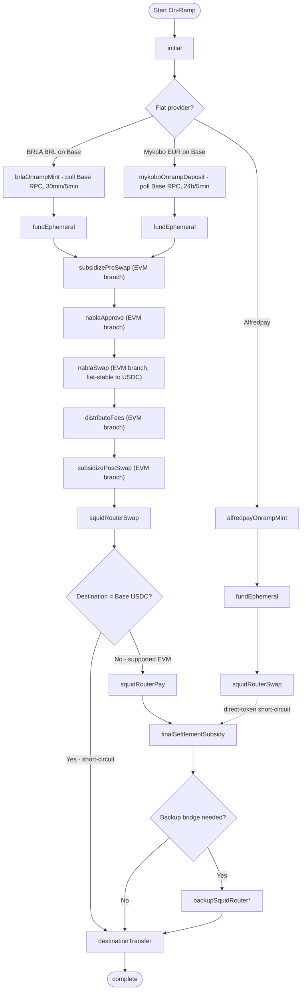
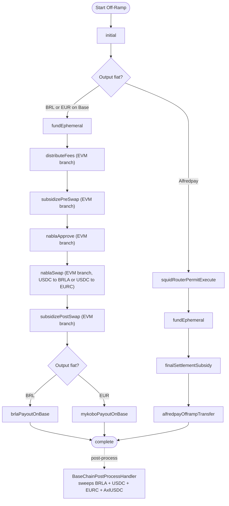

# Ramp Phase Flows — Token Movement Across Chains

## What This Does

Each ramp operation executes as a sequence of phases, where each phase performs one discrete action: a swap, a bridge transfer, an XCM message, a payment, or a subsidization top-up. The phase sequence determines the exact path tokens take from source to destination. Different ramp corridors (e.g., EUR→ARS, BRL→USDC, EUR→BRL) use different phase sequences because they traverse different chains and integrations.

Understanding the complete token flow for each corridor is critical for security because:
1. **Funds change custody at each phase** — tokens move between user ephemeral accounts, platform funding accounts, DEX contracts, bridge vaults, and integration provider wallets.
2. **Each phase handler submits presigned or server-signed transactions** — incorrect ordering or skipped phases can leave funds in intermediate accounts.
3. **Subsidy phases inject platform funds** — the platform tops up ephemeral accounts to cover gas, bridging fees, or amount shortfalls, creating a direct drain vector if amounts are unchecked.

The phase processor in `state-machine.md` orchestrates execution. The authoritative definitions live in `phases/blocks/flows/catalog.ts`: each mapped flow derives its `RampPhase[]`, transaction plan, registration hooks, and executors. Active mappings include BRL/Avenia onramps and `BrlOfframpBase`, EUR/Mykobo onramps and `EurOfframpBase`, and AlfredPay flows. `phases/blocks/register-handlers.ts` registers only catalog executors. Corridors absent from the catalog are unavailable at quote creation, not runtime fallbacks. The persisted identity, upgrade, runtime-schema, transition, and wiring contract is defined in `block-flow-architecture.md`.

`RampService` dispatches by the flow identity persisted with the quote, then invokes that version's `register` and `prepareTxs` in sequence. Registration metadata refreshes are persisted in the ramp-registration transaction. Phase facts and response artifacts are projected into the legacy top-level state/API fields required by active ramps only when duplicate destinations are absent or equal; conflicting projections fail registration. `blockState` remains the phase-owned source of truth. No corridor selector or transaction route builder participates in registration dispatch.

### Major Ramp Corridors

**EUR Off-ramp (Mykobo on Base):** User's crypto on source EVM → Squid bridge to Base USDC (user-signed, client-side) → Nabla-on-Base swap (USDC→EURC) → Mykobo SEPA payout
- Runtime backend phases: `initial` → `fundEphemeral` → `distributeFees` (on Base, USDC) → `subsidizePreSwap` → `nablaApprove` → `nablaSwap` → `subsidizePostSwap` → `mykoboPayoutOnBase` → `complete`
- `EurOfframpBase` statically resolves the source token/network. Base USDC emits one user-wallet transfer; another Base token emits same-chain user-wallet Squid approve/swap; another EVM source emits cross-chain user-wallet Squid approve/swap. `fundEphemeral` verifies reported hashes against the issued payloads before platform funds move, using the same validation applied to BRL EVM offramps.
- `MykoboOfframpPayout.register` derives the approved customer email from the authenticated user, treats the supplied email only as a consistency check, sends the effective IP to the withdrawal intent, and accepts the payout address only from validated provider instructions. Intent facts are phase-owned and feed payout preparation/execution.
- Note: `distributeFees` runs **before** `nablaSwap` on offramp because fees are denominated in USDC and must be deducted before swapping to EURC. Mirrors the BRL-on-Base off-ramp.
- **Removed:** the previous Stellar-based EUR off-ramp (Pendulum → Spacewalk → Stellar anchor) is no longer active. See `stellar-anchors.md`.

**EUR On-ramp (Mykobo SEPA on Base):** SEPA payment → Mykobo settles EURC on the Base ephemeral → optional Nabla-on-Base swap (EURC→USDC) → optional Squid → user destination
- Shared swapped prefix: `initial` → `mykoboOnrampDeposit` (poll Base RPC, 24h outer / 5min inner) → `fundEphemeral` → `subsidizePreSwap` → `nablaApprove` → `nablaSwap` → `distributeFees` → `subsidizePostSwap`.
- Note: like BRL on-ramp, `fundEphemeral` provides ETH gas to the Base ephemeral before swap/approve/squid txs. The sequence is composed explicitly in `phases/blocks/flows/eur-onramp-base-same-chain.ts` and `eur-onramp-base-cross-chain.ts`; executors do not select the next phase.
- Base USDC appends only `destinationTransfer` and uses `EUR_ONRAMP_BASE_SAME_CHAIN`; no Squid transaction or phase is present.
- Base USDT, ETH, AXLUSDC, and BRLA append one `squidRouterSwap` phase and then `destinationTransfer`, using `EUR_ONRAMP_BASE_SAME_CHAIN_SWAP`. The same-chain route uses the Base transaction builder and has no `squidRouterPay`, backup transactions, or `finalSettlementSubsidy`.
- Cross-chain case (destination ≠ Base USDC): `squidRouterSwap` → `squidRouterPay` → `finalSettlementSubsidy` → `destinationTransfer` for supported EVM destinations.
- The non-Base EVM case is catalog-backed by `EurOnrampBaseCrossChain`. `MykoboMint.register` derives the authenticated Mykobo customer, creates the deposit intent, and returns phase-owned facts and IBAN artifacts. Preparation receives only `mykoboMint` registration facts; those facts and the EURC cleanup approval remain owned by that phase.
- **Degenerate EUR→EURC-on-Base case:** the exact SEPA/EUR/EURC/Base catalog predicate selects `EurOnrampBaseDirect`: `initial` → `mykoboOnrampDeposit` → `fundEphemeral` → `destinationTransfer` → `complete`. It has no Nabla, fee-distribution, Squid, final-settlement, or cleanup transaction because Mykobo already settles EURC on the Base ephemeral. Its only presigned transaction is `destinationTransfer` at Base nonce `0`. See `05-integrations/mykobo.md`.
- The swapped block flows presign `baseCleanupEurc` and `baseCleanupUsdc` in the cleanup nonce lane; `BaseChainPostProcessHandler` broadcasts the applicable post-`complete` sweeps.
- **Removed:** the previous Monerium EUR on-ramp (EURe on Polygon → Squid → Moonbeam → XCM → Pendulum) is no longer active. See `monerium.md`.

**BRL Off-ramp (Avenia/BRLA on Base):** User's crypto on source EVM → Squid bridge to Base USDC (user-signed, client-side) → Nabla-on-Base swap (USDC→BRLA) → Avenia PIX payout
- A Base BRLA source requires no Squid source route or network fee. Quote simulation values the BRLA at the BRL/USD oracle rate before entering the common Base offramp pricing pipeline, preserving the fiat peg rather than treating one BRLA as one USD.
- Runtime backend phases: `initial` → `fundEphemeral` → `distributeFees` (on Base, USDC) → `subsidizePreSwap` → `nablaApprove` → `nablaSwap` → `subsidizePostSwap` → `brlaPayoutOnBase` → `complete`
- The Squid bridge from the source EVM chain to Base is executed by the user's wallet (presigned `squidRouterApprove` + `squidRouterSwap` are submitted client-side); there is no runtime `squidRouterPay` phase in the BRL off-ramp.
- `BrlOfframpBase` covers three source variants while preserving one runtime phase family: Base USDC emits one user-wallet `squidRouterNoPermitTransfer`; another Base token emits same-chain user-wallet Squid approve/swap; another EVM source emits cross-chain user-wallet Squid approve/swap into Base USDC. `fundEphemeral` verifies the reported hashes against those server-issued payloads before funding or executing Base phases.
- `AveniaOfframpPayout.register` derives the sender's Avenia identity from the authenticated user and calls `blocks/core/avenia-registration.ts` directly. That block-owned module validates the PIX key against the receiver's normalized tax ID (without stripping Avenia's mask), includes pending SELL volume in BRL/global limits, and returns the trusted Avenia EVM wallet. `AveniaMint.register` uses the same module for pending BUY limits and provider ticket creation. The payout transaction preparer cannot consume client-supplied payout-recipient facts, and `RampService` has no Avenia validation/ticket methods.
- **Temporary disablement:** AssetHub→BRL quotes are currently not returned by the quote engine. `BrlOfframpAssethubUsdc` is cataloged for persisted resolution, preparation, and recovery, but the explicit quote-eligibility gate rejects it before simulation. It preserves the inactive runtime sequence `fundEphemeral` → `distributeFees` → `subsidizePreSwap` → `nablaApprove` → `nablaSwap` → `subsidizePostSwap` → `pendulumToMoonbeamXcm` → `brlaPayoutOnBase`; `assethubToPendulum` remains a user-broadcast blueprint before runtime and `pendulumCleanup` remains post-completion.
- Note: `distributeFees` runs **before** `nablaSwap` on offramp because fees are denominated in USDC and must be deducted before swapping to BRLA.
- Naming: `nablaApprove`, `nablaSwap`, `distributeFees`, `subsidizePreSwap`, and `subsidizePostSwap` are polymorphic runtime phases that dispatch to the EVM (Base) branch when the ephemeral involved is on Base (BRL input or output corridor) and to the Substrate (Pendulum) branch otherwise.
- The EVM `subsidizePostSwap` branch may fund two bounded components in one transfer for both BUY and SELL flows: the actual-vs-quoted Nabla output discrepancy and the quote-time discount subsidy. The discrepancy component is capped at the greater of $1.00 and `MAX_EVM_SWAP_SUBSIDY_QUOTE_FRACTION` × quote output. Discount components below $1 bypass the runtime percentage safety cap; components of $1 or more use `MAX_EVM_POST_SWAP_DISCOUNT_SUBSIDY_QUOTE_FRACTION`. Partner `maxSubsidy` still bounds the quote-time component.

**BRL On-ramp (Avenia/BRLA on Base):** PIX payment → Avenia mints BRLA on Base ephemeral → Nabla-on-Base swap (BRLA→USDC) → optional Squid → user destination
- Base USDC phases: `initial` → `brlaOnrampMint` → `fundEphemeral` → `subsidizePreSwap` → `nablaApprove` → `nablaSwap` → `distributeFees` → `subsidizePostSwap` → `destinationTransfer` → `complete`. Squid is absent rather than handler-short-circuited.
- Other configured Base outputs (USDT, ETH, AXLUSDC, EURC): the same prefix continues through `squidRouterSwap` → `destinationTransfer` → `complete`. This is a same-chain swap only: no `squidRouterPay`, backup bridge transactions, or `finalSettlementSubsidy`.
- Cross-chain EVM case (destination ≠ Base USDC): `squidRouterSwap` → `squidRouterPay` → `finalSettlementSubsidy` → `destinationTransfer`. The distinct legacy BRL→AssetHub USDC topology is cataloged as `BrlOnrampAssethubUsdc` for deterministic preparation and recovery but remains rejected by quote eligibility, so no new ramp can enter it.
- Amount precision: the Squid quote output is stored as the final EVM destination amount. `evmToEvm.inputAmountRaw` remains Base USDC raw and drives the Squid source-chain swap, while `evmToEvm.outputAmountRaw` and `quote.outputAmount` must use the destination token's raw/decimal precision before `destinationTransfer` is built.
- **Degenerate BRL→BRLA-on-Base case:** the catalog selects `BrlOnrampBaseDirect`, whose flow contains only `brlaOnrampMint` → `fundEphemeral` → `destinationTransfer` (no Nabla, no `distributeFees`, no Squid, no `finalSettlementSubsidy`, no cleanup), because Avenia already mints BRLA on the Base ephemeral. Mirrors the intended EUR→EURC-on-Base bypass. See `05-integrations/brla.md`.
- Base ephemeral cleanup (`baseCleanupUsdc`, `baseCleanupBrla`) is performed out-of-flow by a separate sweeper after `complete`; cleanup approvals are presigned but not part of the runtime nextPhase chain.

**Alfredpay corridors:** Similar structure with `alfredpayOfframpTransfer` / `alfredpayOnrampMint` replacing the fiat provider phases.

Local manual flow testing may set `MOCK_ANCHOR_OPERATIONS=true`. In development, the BRLA and AlfredPay mint
executors replace partner polling with an on-chain ephemeral balance wait for the exact simulated mint amount. The
offramp block executors raise a recoverable, zero-retry pause at `brlaPayoutOnBase` or `alfredpayOfframpTransfer`
before reading partner state or broadcasting the anchor-bound transfer. The ramp remains in the payout phase and is
not cleanup-eligible, leaving the client-custodied ephemeral key available for fund recovery. The switch is active
only when `NODE_ENV=development`.
- **Catalog-backed Alfredpay offramp family:** USD/ACH, MXN/SPEI, COP/ACH, and ARS/CBU use `initial` → `squidRouterPermitExecute` → `fundEphemeral` → `finalSettlementSubsidy` → `alfredpayOfframpTransfer` → `complete`. The source preparer statically selects direct Polygon USDT, Polygon same-chain Squid, or cross-chain Squid. EIP-2612 sources emit permit/relayer typed data; unsupported tokens emit user-wallet transfer or approve/swap blueprints whose reported hashes are content-verified before funding. Final transfer and recovery fallback share Polygon nonce 0, and `polygonCleanupAxlUsdc` follows at nonce 1.
- **Degenerate Polygon same-token onramp case:** Alfredpay mints `ALFREDPAY_EVM_TOKEN` (USDT) on Polygon. `AlfredpayOnrampDirect` composes a Squid passthrough block when the requested output is that same token and a same-chain Squid block for every other Polygon output. Both continue through `finalSettlementSubsidy` and `destinationTransfer`. See `05-integrations/alfredpay.md`.
- **Amount precision on routed Alfredpay onramps:** when Alfredpay mints on Polygon and the user requests a different EVM output token, the routed Squid output is the final settlement amount. `evmToEvm.inputAmountRaw` remains the Polygon source-token raw amount, while `evmToEvm.outputAmountRaw` and `quote.outputAmount` MUST use the final destination token's raw/decimal precision. The direct Polygon same-token case remains at the minted token's precision.
- **Alfredpay offramp always runs `finalSettlementSubsidy`:** `phases/blocks/phases/alfredpay-offramp/index.ts` declares `fundEphemeral` → `finalSettlementSubsidy` → `alfredpayOfframpTransfer` for every source variant. No executor short-circuits this sequence.

**Cross-chain delivery (post-swap):** After the Nabla swap, tokens are routed to their final destination:
- ~~From Pendulum to Stellar (ARS-only since EUR was migrated to Mykobo): `spacewalkRedeem` → `stellarPayment`~~ — **REMOVED.** The Stellar/Spacewalk backend infrastructure was removed in commits `f89554d46` and `82761ba91`. `spacewalkRedeemHandler` and `stellarPaymentHandler` are no longer registered in `register-handlers.ts`. See `stellar-anchors.md`.
- From Pendulum to Moonbeam: `pendulumToMoonbeamXcm`
- From Pendulum to AssetHub: `pendulumToAssethubXcm`
- From Pendulum to Hydration: `pendulumToHydrationXcm` → `hydrationToAssethubXcm` (if needed)
- From Base to supported EVM destinations (BRL and EUR onramps): `squidRouterApprove` → `squidRouterSwap` → `squidRouterPay` → optional `backupSquidRouter*` on destination → `destinationTransfer`
- Trivial post-Nabla case (Base→Base USDC): direct `destinationTransfer` only (Squid skipped)
- Same-chain Base token conversion: `squidRouterApprove` → `squidRouterSwap` → immediately adjacent `destinationTransfer`; no bridge-pay, backup, or final-settlement phases

**History/status terminal transaction link:** The API's V2 final transaction hash/link must point to the terminal user-facing on-chain delivery phase, not to intermediate bridge/swap phases such as `squidRouterSwap`. For EVM onramps this is `destinationTransferTxHash`; for AssetHub onramps it is `pendulumToAssethubXcmHash` or `hydrationToAssethubXcmHash`; for active offramps it is the corridor terminal payout hash (`brlaPayoutTxHash`, `mykoboPayoutTxHash`, or `alfredpayOfframpTransferTxHash`). The cataloged AssetHub→BRL recovery flow has no separate Base payout transfer, so its terminal on-chain hash is `pendulumToMoonbeamXcmHash`. Post-complete cleanup sweeps are not user-facing delivery and must not be exposed as the final transaction.

### Phase Transition Diagrams

The following diagrams retain the intended phase transitions for corridors as they are ported. Only catalog-mapped flows are active; their transitions are assembled from block-owned `phases` rather than route-builder constants. Diamond nodes denote distinct flow selection, not runtime handler branching.

#### On-Ramp Phase Flow

The BRL (BRLA) and EUR (Mykobo) on-ramp corridors share the entire post-fiat phase chain on Base, including `fundEphemeral`. Only the initial fiat-watch phase differs (`brlaOnrampMint` vs `mykoboOnrampDeposit`).

```mermaid
graph TD
    Start([Start On-Ramp]) --> Init[initial]
    Init --> Provider{Fiat provider?}

    %% --- Per-corridor fiat-watch entry phases ---
    Provider -->|BRLA BRL on Base| BrlaMint[brlaOnrampMint - poll Base RPC, 30min/5min]
    Provider -->|Mykobo EUR on Base| MykMint[mykoboOnrampDeposit - poll Base RPC, 24h/5min]
    Provider -->|Alfredpay| AfMint[alfredpayOnrampMint]

    %% --- Both BRL and EUR fund the Base ephemeral with ETH gas before swap ---
    BrlaMint --> BrlaFund[fundEphemeral]
    MykMint --> MykFund[fundEphemeral]
    BrlaFund --> SubPreEvm
    MykFund --> SubPreEvm

    %% --- Shared Base-EVM swap chain (BRL + EUR) ---
    SubPreEvm["subsidizePreSwap (EVM branch)"] --> ApproveEvm["nablaApprove (EVM branch)"]
    ApproveEvm --> SwapEvm["nablaSwap (EVM branch, fiat-stable to USDC)"]
    SwapEvm --> DistEvm["distributeFees (EVM branch)"]
    DistEvm --> SubPostEvm["subsidizePostSwap (EVM branch)"]
    SubPostEvm --> SquidSwap[squidRouterSwap]

    %% --- Destination routing (shared) ---
    SquidSwap --> Dest{Destination = Base USDC?}
    Dest -->|Yes - short-circuit| DestTransfer[destinationTransfer]
    Dest -->|No - supported EVM| SquidPay[squidRouterPay]
    SquidPay --> FinalSubsidy[finalSettlementSubsidy]
    FinalSubsidy --> Backup{Backup bridge needed?}
    Backup -->|Yes| BackupSquid[backupSquidRouter*]
    Backup -->|No| DestTransfer
    BackupSquid --> DestTransfer

    %% --- Alfredpay branch: direct-token Polygon case short-circuits the swap, then final settlement subsidy runs before destinationTransfer ---
    AfMint --> AfFund[fundEphemeral]
    AfFund --> AfSquidSwap[squidRouterSwap]
    AfSquidSwap -.direct-token short-circuit.-> FinalSubsidy

    %% --- Terminal ---
    DestTransfer --> Complete([complete])
```

> Notes:
> - **EUR onramp funds the ephemeral.** The EUR flow definitions place `fundEphemeral` after `mykoboOnrampDeposit` and before `subsidizePreSwap`. This matches BRL onramp behavior and ensures the Base ephemeral has ETH gas for `nablaApprove`/`nablaSwap`/squid txs.
> - **EUR/BRL onramps skip Pendulum funding.** `getRequiresPendulumEphemeralAddress` returns `false` for EURC and BRL inputs, so the registration flow never creates or funds a Pendulum ephemeral for these corridors. All movement is Base-EVM only. See `ephemeral-accounts.md`.
> - **SquidRouter RPC selection is sourced from block metadata `fromNetwork`, not the input currency.** `blocks/phases/squid-router-swap/execution.ts` passes that network to `getClient(network)` for approve and swap. Transaction tests assert the source network on every intent.
> - **Alfredpay direct-token onramp uses an explicit passthrough block.** When Alfredpay mints `ALFREDPAY_EVM_TOKEN` on Polygon and the requested output is that same token, `flows/alfredpay-onramp-direct.ts` composes `SquidRouterPassthrough`, then `finalSettlementSubsidy` and `destinationTransfer`. Other Polygon outputs compose a same-chain swap; other EVM outputs use the bridge flow.
> - `BrlOnrampAssethubUsdc` preserves the inactive production topology: `brlaOnrampMint` → `fundEphemeral` → `moonbeamToPendulumXcm` → `subsidizePreSwap` → `nablaApprove` → `nablaSwap` → `distributeFees` → `subsidizePostSwap` → `pendulumToAssethubXcm`. It is cataloged so persisted quotes and recovery have one source of truth, but quote eligibility explicitly rejects BRL→AssetHub. The dormant non-USDC Hydration branches are not cataloged or ported.

#### Off-Ramp Phase Flow

The BRL (BRLA) and EUR (Mykobo) off-ramp corridors share the entire chain from `fundEphemeral` through `subsidizePostSwap`. Only the terminal payout phase differs (`brlaPayoutOnBase` vs `mykoboPayoutOnBase`).

```mermaid
graph TD
    Start([Start Off-Ramp]) --> Init[initial]
    Init --> Corridor{Output fiat?}

    %% --- Shared Base entry: BRL + EUR ---
    %% The user-signed Squid bridge (source EVM -> Base USDC) is submitted client-side
    %% before the backend runtime starts. AssetHub -> BRL is cataloged for recovery but disabled at quote eligibility.
    Corridor -->|BRL or EUR on Base| BaseFund[fundEphemeral]
    BaseFund --> BaseDistEvm["distributeFees (EVM branch)"]
    BaseDistEvm --> BaseSubPreEvm["subsidizePreSwap (EVM branch)"]
    BaseSubPreEvm --> BaseApproveEvm["nablaApprove (EVM branch)"]
    BaseApproveEvm --> BaseSwapEvm["nablaSwap (EVM branch, USDC to BRLA or USDC to EURC)"]
    BaseSwapEvm --> BaseSubPostEvm["subsidizePostSwap (EVM branch)"]
    BaseSubPostEvm --> Payout{Output fiat?}

    %% --- Per-corridor terminal payout phase ---
    Payout -->|BRL| BrlPayout[brlaPayoutOnBase]
    Payout -->|EUR| MykPayout[mykoboPayoutOnBase]
    BrlPayout --> Complete([complete])
    MykPayout --> Complete

    %% --- Base post-process cleanup (after complete, out-of-flow) ---
    Complete -.post-process.-> BaseCleanup[BaseChainPostProcessHandler<br/>sweeps BRLA + USDC + EURC + AxlUSDC]

    %% --- Alfredpay (Polygon, different chain) ---
    Corridor -->|Alfredpay| AfPermit[squidRouterPermitExecute]
    AfPermit --> AfFund[fundEphemeral]
    AfFund --> AfFinalSubsidy[finalSettlementSubsidy]
    AfFinalSubsidy --> AfTransfer[alfredpayOfframpTransfer]
    AfTransfer --> Complete
```

> Notes:
> - The ARS-via-Stellar off-ramp is **REMOVED.** Backend infrastructure was removed in commits `f89554d46` and `82761ba91`. `spacewalkRedeemHandler` and `stellarPaymentHandler` are no longer registered. See `stellar-anchors.md`.
> - `BaseChainPostProcessHandler` sweeps the Base cleanup transactions present in ramp state. Phase-owned transaction preparation emits only the cleanup intents required by the resolved flow.
> - `pendulumCleanup` and other chain-specific post-process handlers (`PolygonPostProcessHandler`, `HydrationPostProcessHandler`) execute after `complete` via the post-process subsystem, not as in-flow phases. See `ephemeral-accounts.md`.
> - `BrlOfframpAssethubUsdc` uses only a Substrate ephemeral. The user's AssetHub wallet broadcasts the server-issued `assethubToPendulum` XCM blueprint and reports its hash; registration/start validation requires that hash before platform-funded Pendulum phases run. Pendulum fee distribution, Nabla approve/swap, Pendulum-to-Moonbeam XCM, backup signatures, and cleanup share one contiguous Substrate nonce sequence.
> - Pendulum pre/post-swap subsidy phases wait until the transferred balance is visible before advancing. Transient Pendulum RPC/submission failures remain recoverable, while a confirmed insufficient funding-account balance remains unrecoverable. A persisted Pendulum fee-distribution hash is checked for successful execution before the phase advances.
> - A newly submitted Pendulum-to-Moonbeam Avenia XCM records the fixed GLMR subsidy only after the expected BRLA arrives on Moonbeam, matching the transfer's completed accounting boundary.
> - **Alfredpay offramp `finalSettlementSubsidy` is mandatory.** `AlfredpayOfframp` declares the subsidy between funding and provider transfer for every source variant; no direct-transfer selector exists.

### Phase Handler Categories

| Category | Handlers | Funds Controlled By |
|---|---|---|
| **Subsidization (Substrate)** | `phases/blocks/phases/pendulum-subsidize-pre/`, `pendulum-subsidize-post/`, `final-settlement-subsidy/`, `fund-ephemeral/` | Pendulum funding account → Pendulum ephemeral |
| **Subsidization (EVM)** | `blocks/phases/subsidize-pre/execution.ts`, `blocks/phases/subsidize-post/execution.ts` | EVM funding account (`EVM_FUNDING_PRIVATE_KEY`, resolved per-network via `getEvmFundingAccount(network)`) → EVM ephemeral |
| **DEX Swap (Substrate)** | `blocks/phases/pendulum-nabla-swap/`, `blocks/phases/pendulum-offramp-nabla-swap/` | Ephemeral → DEX contract → ephemeral |
| **DEX Swap (EVM)** | `blocks/phases/nabla-swap/execution.ts` | Base ephemeral → Nabla-on-Base contract → Base ephemeral |
| **Bridge / XCM** | `blocks/phases/moonbeam-to-pendulum-xcm/execution.ts`, `blocks/phases/pendulum-to-assethub-xcm/execution.ts`, `blocks/phases/avenia-pendulum-offramp/execution.ts` | Source chain ephemeral → destination chain ephemeral |
| **Fiat provider** | `blocks/phases/avenia-mint/execution.ts`, `blocks/phases/avenia-offramp-payout/execution.ts`, `blocks/phases/mykobo-mint/execution.ts`, `blocks/phases/mykobo-offramp-payout/execution.ts`, `blocks/phases/alfredpay-mint/execution.ts`, `blocks/phases/alfredpay-offramp/execution.ts` | Ephemeral ↔ provider |
| **SquidRouter** | `blocks/phases/squid-router-swap/execution.ts`, plus Alfredpay permit execution in `blocks/phases/alfredpay-offramp/execution.ts` | Ephemeral/executor → SquidRouter → destination |
| **Fee distribution** | `blocks/phases/distribute-fees/execution.ts` (Substrate Pendulum + EVM Multicall3 on Base) | Ephemeral → platform fee collection address(es) |
| **Lifecycle** | `blocks/core/initial-executor.ts`, `blocks/phases/destination-transfer/execution.ts` | Setup and final delivery |

## Security Invariants

1. **Phase ordering MUST match the expected corridor flow** — Each corridor has a fixed phase sequence. The phase processor MUST NOT allow out-of-order transitions. The phase handler's return value determines the next phase, and it MUST match the expected sequence for the ramp's corridor.
2. **Subsidy amounts MUST be bounded** — Every subsidization handler (`subsidizePreSwap`, `subsidizePostSwap`, `fundEphemeral`, `finalSettlementSubsidy`) must enforce a maximum USD-equivalent cap to prevent draining the funding account on a single ramp. EVM pre/post-swap cap fractions are loaded from environment configuration and default to `0.05`. EVM `subsidizePostSwap` must not treat the top-up as one undifferentiated bucket: the actual-vs-quoted swap-output discrepancy and the discount-derived subsidy must each pass their own configured cap before any transfer is submitted.
3. **Presigned transactions MUST be used in the correct phase** — `getPresignedTransaction(state, phase)` retrieves the transaction for a specific phase. A phase handler MUST NOT access presigned transactions for a different phase.
4. **Token amounts at each phase MUST be traceable to the original quote** — The quote defines input/output amounts. Each phase should operate on amounts derived from the quote, not from untrusted runtime state.
5. **Cross-chain advancement MUST use the strongest evidence available for that corridor** — Squid flows prefer terminal Squid/Axelar status and persist any route-scoped EVM balance fallback. Moonbeam→Pendulum waits for source finalization plus the planned destination amount. Quote-disabled BRL↔AssetHub recovery keeps narrowly documented XCM exceptions in `06-cross-chain/xcm-transfers.md` and `RISK-REGISTER.md`; those exceptions MUST NOT be generalized or used after the corridor is re-enabled.
6. **Fee distribution ordering is defined per corridor, not globally** — off-ramps run `distributeFees` **before** the swap (fees taken in USDC, the universal stablecoin, before the remainder swaps to the payout token); on-ramps run it **after** the swap (again in USDC). The corridor's phase sequence is the authority; see `fee-integrity.md` invariant 6. Distributed fees are final — a ramp that fails after `distributeFees` has no fee-refund path, which is accepted as RISK-010 and bounded by the recovery/retry design of the later phases.
7. **Each phase handler MUST be idempotent or have re-execution guards** — If the phase processor retries a phase (due to timeout or recoverable error), the handler must not double-execute (double-swap, double-transfer, double-fund). Nonce checks and balance pre-checks serve this purpose.
8. **SquidRouter RPC selection MUST be driven by block metadata `fromNetwork`** — `blocks/phases/squid-router-swap/execution.ts` resolves the network from `SquidRouterSwapContext` and passes it to `getClient(network)` for both approve and swap calls. Selecting the RPC from `inputCurrency` would mis-route EUR onramps whose presigned txs carry `network: Networks.Base` to non-Base chains (causing `invalid chain id for signer: have X want Y` errors on cross-chain destinations).
9. **On same-chain destinations, `destinationTransfer` MUST be the first executable nonce after the broadcast SquidRouter txs — no nonce gap** — The ephemeral shares one nonce sequence for `squidRouterSwap` → `destinationTransfer`. `Flow.prepareTxs` allocates main-lane intents before cleanup and backup lanes, while same-chain Squid preparation omits bridge-only backups. Flow transaction tests enforce the contiguous sequence for EUR, BRL, and Alfredpay.
10. **`destinationTransfer` MUST fail closed on transaction-validation uncertainty** — `blocks/phases/destination-transfer/execution.ts` parses the server-generated transaction, reads the ephemeral's live nonce (`getTransactionCount`, `blockTag: "pending"`), and compares it to the presigned `destinationTransfer` nonce before broadcasting. If the presigned nonce is *ahead* of the live nonce the transfer can never mine, so the executor raises an `UnrecoverablePhaseError` for manual review instead of looping until the retry budget silently exhausts. A malformed server-generated transaction is unrecoverable corruption. An unavailable required RPC preflight is recoverable. Neither condition may fall through to broadcast. Using `"pending"` rather than `"latest"` ensures the check accounts for mempool transactions.
11. **Base EVM `nablaSwap` MUST be dry-run before broadcast** — `blocks/phases/nabla-swap/execution.ts` must verify the raw transaction signer and simulate the exact presigned swap with `eth_call` from the Base ephemeral account before calling `sendRawTransaction`. The dry-run MUST use the decoded transaction's actual recipient, calldata, value, gas, and fee fields, and `blockTag: "pending"`. If simulation reverts, the executor MUST fail before broadcast. Regression coverage lives in `blocks/__tests__/nabla-swap.executor.test.ts`.
12. **Presigned payout transfers MUST be validated and balance-checked before broadcast** — `alfredpayOfframpTransfer`, `mykoboPayoutOnBase`, and `brlaPayoutOnBase` broadcast presigned ephemeral transfers for a fixed amount decided at registration time. A revert consumes the presigned nonce, after which the payload can never be re-broadcast and funds strand on the ephemeral. `ensurePresignedTransferFunded` (`blocks/core/destination-funding.ts`) recovers the sender from the signed raw transaction, decodes a positive token amount from `transfer` calldata (or positive native value), and polls (5s interval, 3-minute timeout) until the sender's balance covers the transfer. An unparseable, zero-value, or non-transfer server-generated payload is unrecoverable corruption. RPC/balance-read inability or a timeout is recoverable. Neither condition may fall through to broadcast.
13. **Pendulum subsidy settlement MUST be observed before advancing** — After a Pendulum pre/post-swap subsidy transfer, the handler polls until the ephemeral reaches the phase-owned target amount. Transient RPC, decode, submission, and settlement failures MUST remain recoverable; a confirmed insufficient funding-account balance MAY fail unrecoverably.
14. **Persisted Pendulum fee hashes MUST be verified** — `distributeFees` MUST verify that an existing Pendulum extrinsic completed successfully before advancing. Hash presence alone is not evidence that fees were distributed.

## Threat Vectors & Mitigations

| Threat | Attack Scenario | Mitigation |
|---|---|---|
| **Phase skip / injection** | Attacker with DB access modifies `currentPhase` to skip subsidization or jump to `complete`. | Phase transitions are controlled by handler return values, not external input. DB access is a prerequisite (see `state-machine.md`, Threat: "Phase skip attack"). No DB-level constraints on valid transitions exist. |
| **Subsidy drain** | A crafted ramp triggers multiple subsidization phases, each at the maximum allowed amount, draining the funding account. | Per-ramp subsidy caps (`MAX_FINAL_SETTLEMENT_SUBSIDY_USD`, balance pre-checks in pre/post-swap handlers). EVM pre/post-swap caps are env-configured quote-relative fractions, and EVM post-swap subsidy is split into discrepancy and discount components with independent caps. No aggregate cross-ramp cap exists — many concurrent ramps could still drain funds. |
| **Double-execution on retry** | Phase processor retries after timeout. Handler re-executes a swap or transfer that already completed. Funds are consumed twice. | Nonce guards in Spacewalk and Hydration handlers detect prior execution. Other handlers rely on transaction nonce uniqueness at the chain level. Not all handlers have explicit re-execution guards. |
| **Stale presigned transaction** | Client registers a ramp, waits for market movement, then starts the ramp with presigned transactions based on the old quote. | `RAMP_START_EXPIRATION_TIME_SECONDS` limits the window between registration and start. Quote expiry (10 minutes) limits how old the amounts can be. |
| **Direct API ramp mutation during planned downtime** | A partner bypasses the UI maintenance state and calls register/update/start while operators expect Vortex services to be paused. | Ramp mutation routes run the backend maintenance guard and return `503` with `Retry-After`, `maintenance_start`, and `maintenance_end` before registration, presigned transaction updates, or phase processing begins. |
| **Cross-chain race condition** | XCM transfer submitted but not finalized. Next phase on destination chain reads a zero balance. | Most XCM handlers use `waitForFinalization=true`. Exception: Hydration skips finalization (F-009, deferred). |
| **Fee distribution failure** | `distributeFees` fails, but ramp is already marked `complete`. Platform loses fee revenue. | `distributeFees` is a phase — if it fails, the ramp enters retry, not `complete`. However, if the ramp fails after user delivery but before fee distribution, fees may be lost. |
| **Wrong-chain signer on SquidRouter** | RPC selected from request currency instead of phase metadata; a Base transaction is submitted to another EVM RPC. | `blocks/phases/squid-router-swap/execution.ts` reads `fromNetwork` from its own metadata and routes approve/swap to that client. |
| **Same-chain destination nonce gap (0-delivery)** | `destinationTransfer` is signed after cleanup/backup transactions and cannot mine because its nonce is too high. | Flow-level nonce lanes place main transactions first; same-chain Squid omits bridge backups; `blocks/phases/destination-transfer/execution.ts` fails fast on a detectable nonce gap. |
| **Predictable EVM Nabla swap revert** | Base Nabla pool constraints make the presigned swap impossible before broadcast. | `blocks/phases/nabla-swap/execution.ts` runs `eth_call` on the exact decoded transaction with `blockTag: "pending"` before `sendRawTransaction`. |
| **Short-funded ephemeral burns a presigned payout nonce** | The provider settles slightly less than quoted, or a subsidy is capped/skipped, so the ephemeral holds less than the presigned payout amount. Broadcasting anyway reverts, consumes the fixed nonce, and the presigned transfer can never be re-broadcast — funds strand on the ephemeral with only manual recovery. | `alfredpayOfframpTransfer`, `mykoboPayoutOnBase`, and `brlaPayoutOnBase` call `ensurePresignedTransferFunded` before their first broadcast: sender/token/amount are decoded from the signed raw tx and the sender balance is polled (3-minute timeout) before `sendRawTransaction`; a shortfall raises a recoverable error so the nonce is never spent on a doomed transfer. |

## Audit Checklist

- [x] Phase processor calls handlers in sequence via `phaseRegistry` lookup — no parallel execution or phase skipping in code
- [x] `getPresignedTransaction(state, phase)` filters by phase name — handlers cannot accidentally access another phase's transaction
- [x] The block pre/post-subsidy executors query funding account balance before transfer (after F-032 fix)
- [x] `final-settlement-subsidy` has `MAX_FINAL_SETTLEMENT_SUBSIDY_USD` cap (after F-001 fix)
- [x] `final-settlement-subsidy` validates SquidRouter swap output amount (after F-030 fix)
- [x] `blocks/phases/alfredpay-offramp/execution.ts` validates `squidRouterPermitExecutionValue` (after F-027 fix)
- [x] `distributeFees` is a non-terminal phase — failure triggers retry, not silent skip
- [x] `alfredpayOfframpTransfer`, `mykoboPayoutOnBase`, and `brlaPayoutOnBase` run `ensurePresignedTransferFunded` before the first broadcast of their presigned single-use transfer — sender recovered from the signature, positive token/native amount decoded, balance polled with a 3-minute timeout, and all validation/preflight failures stop before broadcast. Malformed server-generated payloads are unrecoverable; transient RPC failure and shortfall timeout are recoverable.
- [ ] **F-053 (narrowed)**: `blocks/phases/pendulum-to-assethub-xcm/execution.ts` trusts a persisted finalized source hash without destination-arrival proof. **DEFERRED RISK RISK-009**.
- [x] Backup presigned intents (`backupSquidRouterApprove`, `backupSquidRouterSwap`, `backupApprove`) are contingency payloads owned by `SquidRouterSwap`, not executable phases; executor-bijection validation correctly excludes them. **PASS**
- [ ] No aggregate cross-ramp subsidy rate limiting — **ACCEPTED RISK RISK-001**; many concurrent ramps could drain the funding account.
- [x] Active BRL corridors are end-to-end on Base. **PASS** — BRL→AssetHub USDC is cataloged only for deterministic preparation/recovery and is explicitly rejected before quote simulation; therefore no new active ramp reaches its Moonbeam/Pendulum/XCM executors.
- [x] Active EUR corridors are end-to-end on Base — no Pendulum/Spacewalk/Stellar involvement for EUR. **PASS** — the catalog maps EVM→EUR to `EurOfframpBase` and EUR onramps to the Mykobo Base families; handlers are derived from those flows. Stellar-EUR off-ramp and Monerium-EUR on-ramp are removed. See `05-integrations/mykobo.md`.
- [x] On the EUR/Base corridor, `distributeFees` is positioned **before** `nablaSwap` on offramp (USDC fees deducted pre-EUR-swap) and **after** `nablaSwap` on onramp (USDC fees deducted post-EUR→USDC swap). **PASS** — derived by `EurOfframpBase` and the catalog-backed EUR onramp flows.
- [x] On the BRL/Base corridor, `distributeFees` is positioned **before** `nablaSwap` on offramp (USDC fees deducted pre-BRL-swap) and **after** `nablaSwap` on onramp (USDC fees deducted post-BRL→USDC swap). **PASS** — derived by `BrlOfframpBase` and the catalog-backed BRL onramp flows.
- [x] EVM subsidy phases enforce USD-equivalent caps. **PASS** — the pre-swap subsidy and the post-swap actual-vs-quoted swap-output discrepancy component are each clamped to the greater of $1.00 and `MAX_EVM_SWAP_SUBSIDY_QUOTE_FRACTION` (default `0.05`) × quote output; the $1.00 floor keeps small quotes from being stuck below a workable subsidy allowance. `MAX_EVM_POST_SWAP_DISCOUNT_SUBSIDY_QUOTE_FRACTION` defaults to `0.05` and separately clamps the post-swap discount-derived component (no floor). Both fractions are env-overridable. Over-cap cases are intentionally recoverable retries: no transfer is submitted, and the ramp waits for operator intervention instead of moving to `failed`.
- [x] BRL on-ramp `backupApprove` allowance is bounded (no `maxUint256`). **PASS** — `blocks/phases/squid-router-swap/transactions.ts` bounds it from the phase-owned bridge amount (F-NEW-03 resolved).
- [x] EVM ephemeral cleanup coverage. **PASS** — **Polygon** (`PolygonPostProcessHandler`), **Hydration** (`HydrationPostProcessHandler`), and **Base** (`BaseChainPostProcessHandler`, sweeping both BRLA and USDC) are registered and active. **AssetHub** handler is registered but a no-op stub (`shouldProcess` always returns `false`). ETH gas dust on EVM ephemerals is not swept (intentional). F-NEW-05 resolved. See `ephemeral-accounts.md` for the full cleanup architecture.
- [x] Subsidy block executors extend the recoverable-retry budget. **PASS** — EVM and Pendulum subsidy executors override the global phase retry budget where operator funding may need intervention.
- [x] `blocks/phases/squid-router-swap/execution.ts` resolves the source network from its own `fromNetwork` metadata; approve and swap use the same client.
- [x] Same-chain flow transaction tests place `destinationTransfer` immediately after `squidRouterSwap`, append cleanup later, and omit bridge-only backups.
- [x] `blocks/phases/destination-transfer/execution.ts` fails fast on a detectable nonce gap. **PASS** — it compares the presigned nonce against the pending live nonce and throws `UnrecoverablePhaseError` when ahead.
- [x] EUR (Mykobo) and BRL (BRLA) onramps/offramps do NOT require a Pendulum ephemeral. `getRequiresPendulumEphemeralAddress` returns `false` for EURC and BRL inputs; registration skips Pendulum funding for these corridors.
- [x] Active maintenance windows block `POST /v1/ramp/register`, `POST /v1/ramp/update`, and `POST /v1/ramp/start` before ramp state mutation or phase processing.
- [x] Base EVM `nablaSwap` dry-runs the exact presigned swap before broadcast. **PASS** — `blocks/phases/nabla-swap/execution.ts` decodes the transaction, calls Base `eth_call` with `blockTag: "pending"`, and broadcasts only after success.
