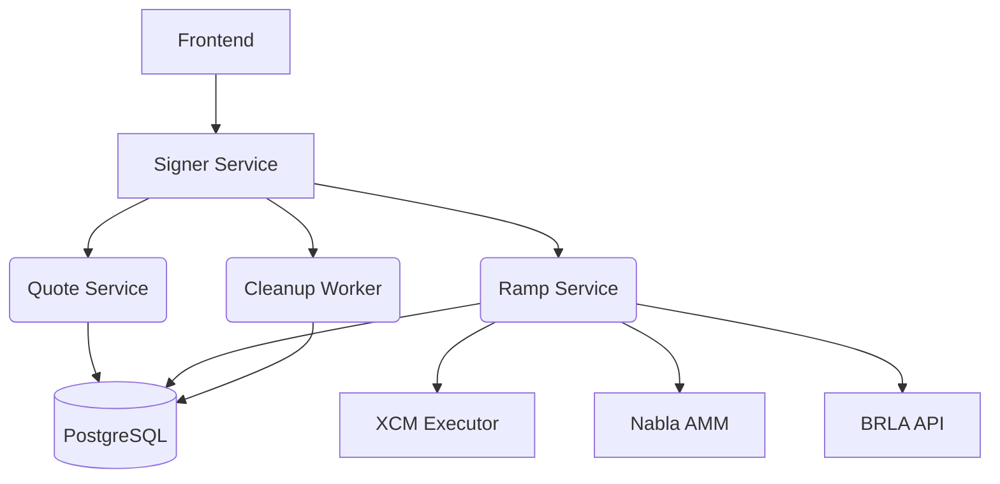
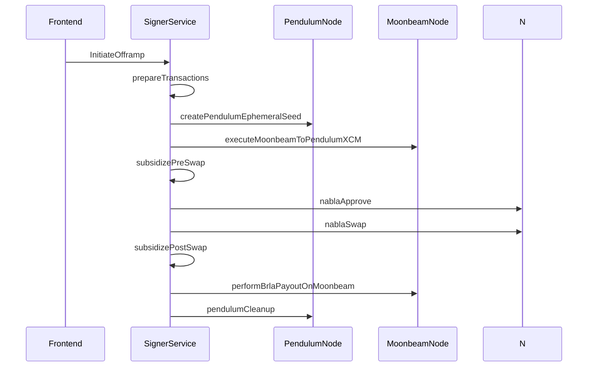
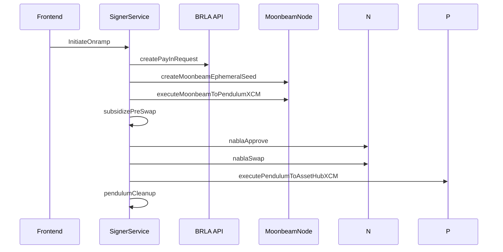

# Ramping Processes Technical Documentation

## 1. System Architecture

### 1.1 Component Diagram



## 2. Offramping Process

### 2.1 Phase Sequence



### 2.2 Phase Specifications

| Phase                 | Location                      | Key Functions                                       | Dependencies    |
| --------------------- | ----------------------------- | --------------------------------------------------- | --------------- |
| prepareTransactions   | src/phases/signedTransactions | - Generate ephemeral account<br>- Calculate subsidy | TokenConfig     |
| squidRouter           | src/phases/squidrouter        | - Create XCM payload<br>- Generate receiver hash    | Squid API       |
| pendulumFundEphemeral | src/phases/polkadot/ephemeral | - Fund ephemeral account<br>- XCM transfer          | Treasury Pallet |
| performBrlaPayout     | src/phases/brla               | - Validate KYC status<br>- Execute BRL.A transfer   | BRLA Contracts  |

## 3. Onramping Process

### 3.1 Phase Sequence



## 4. Data Model Implementation

### 4.1 RampState Schema

```typescript
// src/models/rampState.model.ts
interface RampState {
  id: string;
  phase: 'preSwap' | 'swapPending' | 'complete';
  network: Networks;
  inputToken: string;
  outputToken: string;
  amountIn: string;
  amountOut: string;
  subsidy: {
    hardLimit: string;
    softLimit: string;
    consumed: string;
  };
  ephemeral: {
    pendulumSeed: EncryptedString;
    moonbeamSeed?: EncryptedString;
  };
  transactions: {
    xcmHashes: string[];
    swapHashes: string[];
  };
  createdAt: Date;
  updatedAt: Date;
}
```

### 4.2 State Transitions

```typescript
// src/api/services/ramp/ramp.service.ts
async transitionState(state: RampState, nextPhase: RampPhase) {
  const validTransitions = {
    prepareTransactions: ['squidRouter', 'pendulumFundEphemeral'],
    subsidizePreSwap: ['nablaApprove'],
    nablaApprove: ['nablaSwap'],
    // ... other transitions
  };

  if (!validTransitions[state.phase].includes(nextPhase)) {
    throw new InvalidStateTransitionError();
  }

  return this.updateState(state.id, { phase: nextPhase });
}
```

## 5. Subsidy System

### 5.1 Calculation Algorithm

```javascript
// From constructBrlaOnrampInitialState
function calculateSubsidy(inputAmount, tokenConfig) {
  const HARD_MARGIN = 0.005; // 0.5%
  const SOFT_MARGIN = 0.003; // 0.3%

  return {
    hardMinimum: inputAmount * (1 - HARD_MARGIN),
    softMinimum: inputAmount * (1 - SOFT_MARGIN),
    subsidyAmount: inputAmount * SUBSIDY_RATE,
  };
}
```

### 5.2 Treasury Interaction

```typescript
// src/phases/polkadot/ephemeral.ts
async function subsidizePreSwap(state: RampState) {
  const api = await getApi();
  const batch = [api.tx.tokens.transfer(state.ephemeralAddress, SUBSIDY_AMOUNT), api.tx.xcm.send(/* XCM params */)];

  await api.tx.utility.batchAll(batch).signAndSend(treasuryKey);
}
```

## 6. Security Implementation

### 6.1 Ephemeral Account Lifecycle

1. Generated per transaction using `createPendulumEphemeralSeed()`
2. Secured with AES-256-GCM encryption
3. Storage duration limited to 10 minutes
4. Automatic cleanup via worker process

### 6.2 Nonce Management

```typescript
// From offrampingFlow.ts
const nonceSequence = {
  nablaApprove: state.nonceBase,
  nablaSwap: state.nonceBase + 1,
  xcm: state.nonceBase + 2,
};
```

## 7. Failure Recovery

### 7.1 Cleanup Process

```typescript
// src/api/workers/cleanup.worker.ts
async function recoverFailedStates() {
  const states = await RampState.findAll({
    where: {
      status: 'pending',
      updatedAt: {
        [Op.lt]: new Date(Date.now() - 600000),
      },
    },
  });

  await Promise.all(
    states.map(async (state) => {
      await refundSubsidy(state);
      await state.update({ status: 'failed' });
    }),
  );
}
```

## 8. Testing Requirements

### 8.1 Core Test Cases

1. XCM execution rollback on chain disconnection
2. Subsidy overflow protection
3. Ephemeral account cleanup validation
4. BRLA KYC integration tests
5. Cross-chain nonce collision tests

### 8.2 Performance Benchmarks

| Operation       | Target Latency | Success Criteria |
| --------------- | -------------- | ---------------- |
| XCM Transfer    | < 2.5s         | 95th percentile  |
| AMM Swap        | < 1.8s         | 99% success rate |
| Ephemeral Setup | < 400ms        | 100% reliability |
