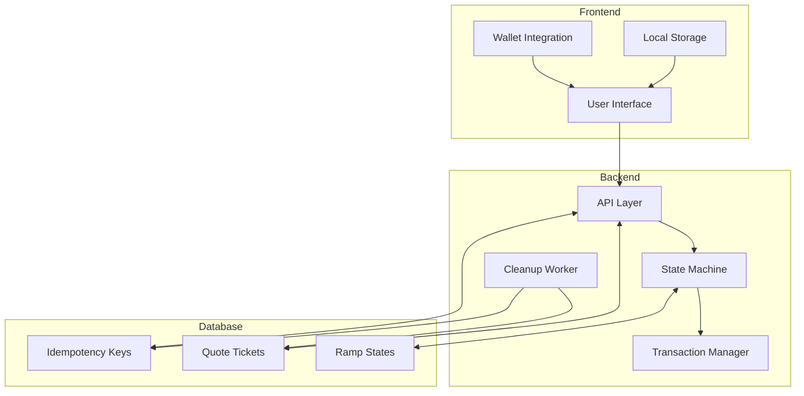

# System Patterns: Pendulum Pay Backend

## System Architecture

The Pendulum Pay system follows a client-server architecture with a clear separation between the frontend and backend
components:

1. **Frontend (React Application)**

   - User interface for initiating ramping flows
   - Wallet integration for transaction signing
   - Local storage for ephemeral accounts
   - Status polling and display

2. **Backend (Signer Service)**

   - API endpoints for quotes and ramping
   - State management for ramping flows
   - Transaction execution and monitoring
   - Database integration for persistence

3. **Database (PostgreSQL)**
   - Quote storage and management
   - Ramping state persistence
   - Idempotency key management

## Key Technical Decisions

### State Machine Pattern

The ramping flows are implemented as state machines with distinct phases:

1. **Validation Phase**: Verify inputs and prerequisites
2. **Quote Generation Phase**: Calculate conversion rates and fees
3. **Transaction Signing Phase**: Prepare and validate transactions
4. **Settlement Phase**: Execute transactions and confirm completion

This pattern allows for:

- Clear separation of concerns
- Resilience to crashes and restarts
- Predictable state transitions
- Easy monitoring and debugging

### Presigned Transaction Approach

For security reasons, the backend does not store private keys. Instead:

1. The frontend creates ephemeral accounts and stores them in local storage
2. The user pre-signs necessary transactions on the frontend
3. The backend stores and executes these presigned transactions at the appropriate phases
4. Each transaction includes metadata about which phase it belongs to

### Idempotency Pattern

To prevent duplicate operations during retries or crashes:

1. Clients can provide an idempotency key with requests
2. The backend stores the key along with the response
3. Subsequent requests with the same key return the cached response
4. Keys expire after 24 hours

## Component Relationships

## Design Patterns in Use

1. **Repository Pattern**: Database access is abstracted through model classes
2. **Service Layer Pattern**: Business logic is encapsulated in service classes
3. **Controller-Service Pattern**: API endpoints delegate to service methods
4. **Factory Pattern**: Objects like quotes and ramp states are created through factory methods
5. **Observer Pattern**: Background workers observe and clean up expired resources
6. **Strategy Pattern**: Different ramping types use different execution strategies
