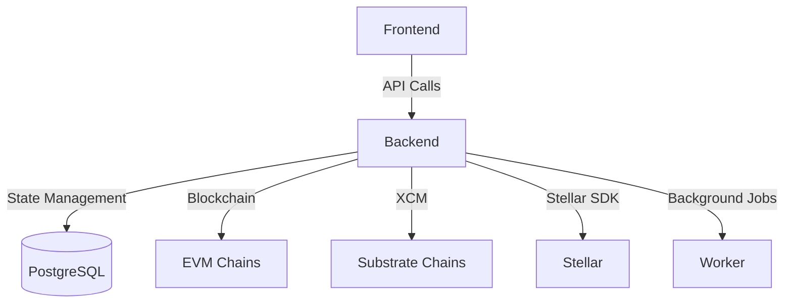
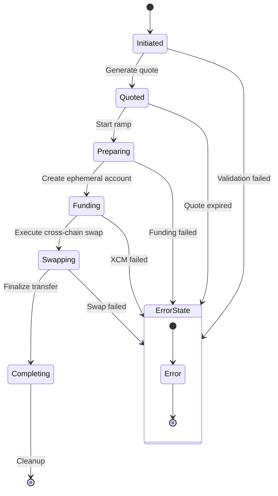
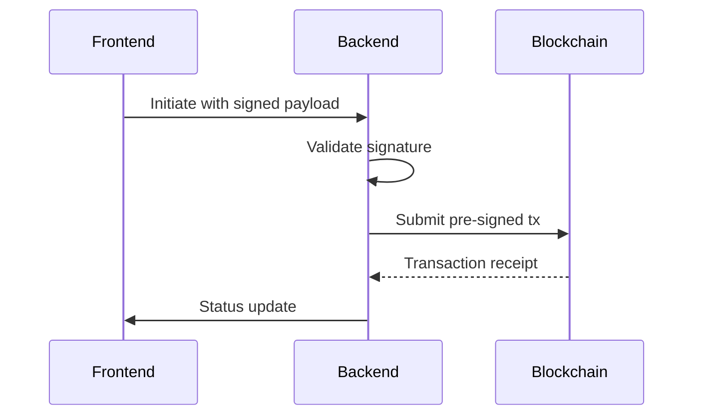
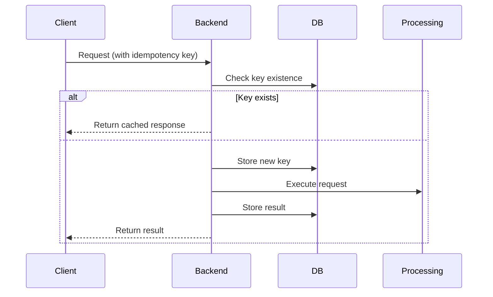

# System Patterns: Pendulum Pay Backend

## Core Architecture



## State Machine Implementation

### Ramp Process Flow


## Data Model

### RampState Schema
```typescript
interface RampState {
  id: string;
  type: 'onramp' | 'offramp';
  phase: 'init' | 'quoted' | 'executing' | 'completed';
  network: string;
  amountIn: string;
  amountOut: string;
  transactions: {
    fundingTx?: string;
    swapTx?: string;
    completionTx?: string;
  };
  createdAt: Date;
  updatedAt: Date;
}
```

## Security Patterns

1. **Pre-signed Transactions**:


2. **Idempotency Flow**:


## Cross-Chain Execution

```mermaid
sequenceDiagram
    Participant F as Frontend
    Participant B as Backend
    Participant P as Pendulum
    Participant M as Moonbeam
    
    F->>B: Initiate cross-chain swap
    B->>P: Create ephemeral account
    P-->>B: Account details
    B->>M: Lock source assets
    M-->>B: Lock confirmation
    B->>P: Execute XCM transfer
    P-->>B: Transfer proof
    B->>F: Completion status
