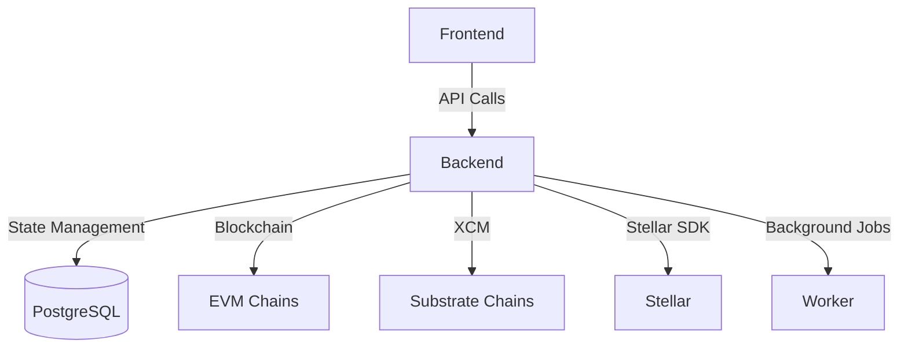
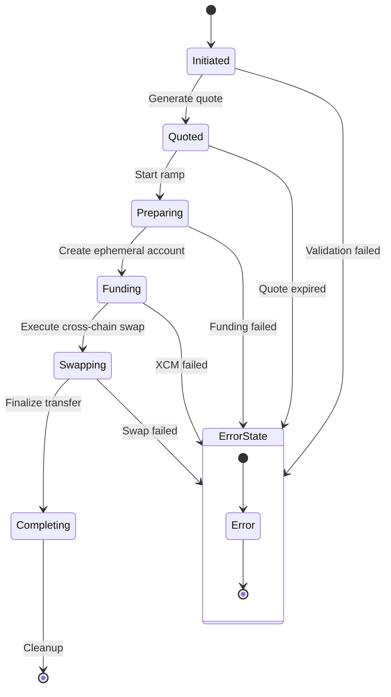
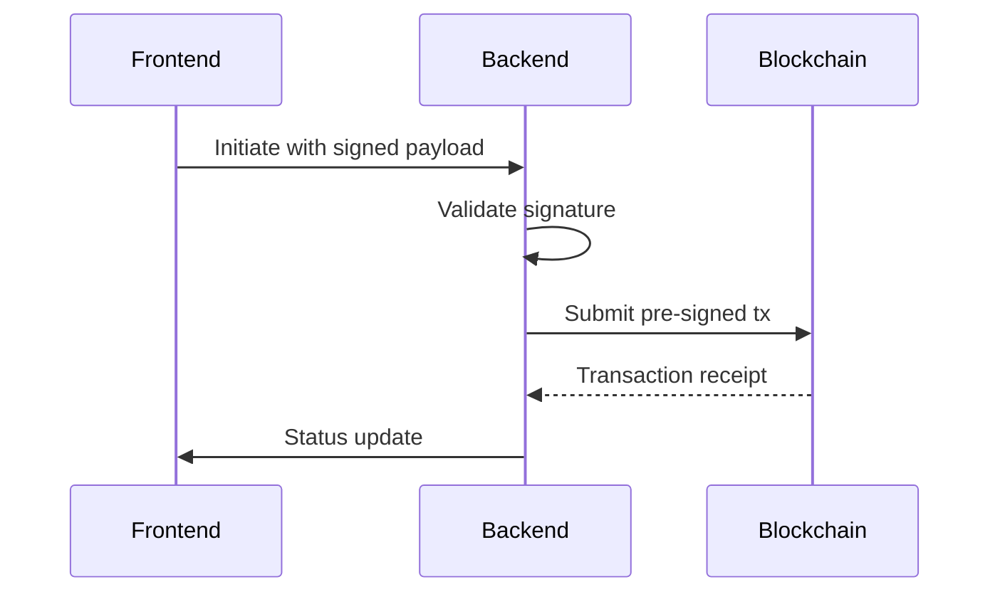
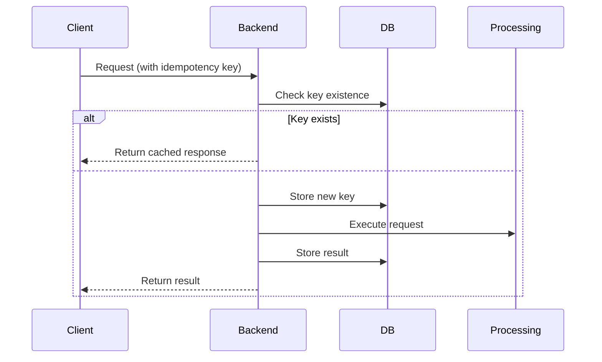

# System Patterns: Pendulum Pay Backend

## Core Architecture



## State Machine Implementation

### Ramp Process Flow


## Data Model

### RampState Schema
```typescript
interface RampState {
  id: string;
  type: 'onramp' | 'offramp';
  phase: 'init' | 'quoted' | 'executing' | 'completed';
  network: string;
  amountIn: string;
  amountOut: string;
  transactions: {
    fundingTx?: string;
    swapTx?: string;
    completionTx?: string;
  };
  createdAt: Date;
  updatedAt: Date;
}
```

## Security Patterns

1. **Pre-signed Transactions**:


2. **Idempotency Flow**:


## Cross-Chain Execution

```mermaid
sequenceDiagram
    Participant F as Frontend
    Participant B as Backend
    Participant P as Pendulum
    Participant M as Moonbeam

    F->>B: Initiate cross-chain swap
    B->>P: Create ephemeral account
    P-->>B: Account details
    B->>M: Lock source assets
    M-->>B: Lock confirmation
    B->>P: Execute XCM transfer
    P-->>B: Transfer proof
    B->>F: Completion status


## Frontend Architecture Patterns (Vortex)

```mermaid
graph TD
    App -->|Renders| SwapPage
    SwapPage -->|Uses| SwapComponent
    SwapPage -->|Uses| LandingSections[Landing Page Sections]
    SwapComponent -->|Uses| FormProvider[React Hook Form]
    SwapComponent -->|Uses| ZustandStores[Zustand Stores]
    SwapComponent -->|Uses| ContextProviders[Context Providers]
    ContextProviders -->|Provide| NetworkContext
    ContextProviders -->|Provide| WalletContext[Wallet Contexts]
    ContextProviders -->|Provide| EventsContext
    ContextProviders -->|Provide| SiweContext
    ContextProviders -->|Provide| PolkadotNodeContext
    WalletContext -->|Connects| EVMWallets[EVM Wallets (Wagmi/AppKit)]
    WalletContext -->|Connects| PolkadotWallets[Polkadot Wallets (Talisman)]
    SwapComponent -->|Interacts| BackendAPI[Backend API (via Services)]
    LandingSections -->|Display| StaticContent[Static Content & Marketing]
```

**Key Patterns:**

1.  **Component-Based UI:** React components organized into pages (`pages/`), sections (`sections/`), and reusable UI elements (`components/`).
2.  **Context API for Global State/Services:** Extensive use of React Context (`contexts/`) to provide access to network state, wallet connections, event tracking, SIWE signing, and Polkadot node connections throughout the application.
3.  **Zustand for Localized State:** Zustand stores (`stores/`) are used for managing specific feature states like the swap form (`formStore`), offramp process (`offrampStore`), SEP-24 flow (`sep24Store`), and Safe wallet signatures (`safeWalletSignaturesStore`).
4.  **Custom Hooks for Logic Abstraction:** Custom hooks (`hooks/`) encapsulate logic for interacting with wallets (`useVortexAccount`), fetching balances (`useOnchainTokenBalance`), signing challenges (`useSignChallenge`), managing network/asset icons (`useGetNetworkIcon`, `useGetAssetIcon`), and handling specific flows like BRLA KYC (`hooks/brla/`).
5.  **Service Layer for API Interaction:** Services (`services/`) abstract backend communication (e.g., `services/api/`, `services/backend.ts`, `services/signingService.tsx`).
6.  **Type Safety:** TypeScript is used throughout for strong typing.
7.  **Modular Styling:** Tailwind CSS and DaisyUI provide utility-based styling, supplemented by custom CSS (`App.css`).
8.  **Asynchronous Operations:** TanStack Query is used for managing data fetching and caching.

[2025-04-04 16:48:11] - Added frontend architecture patterns based on codebase analysis.
